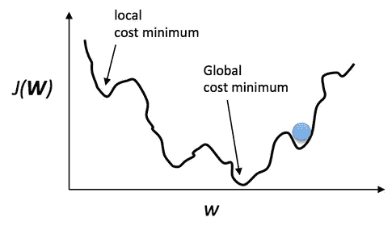
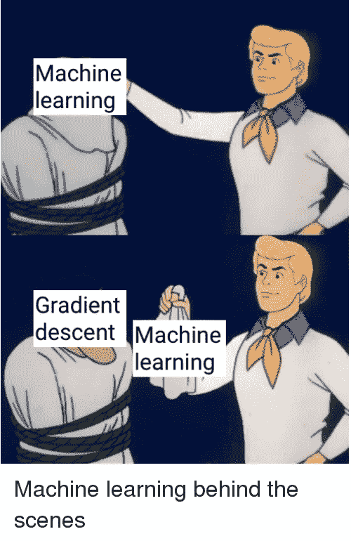
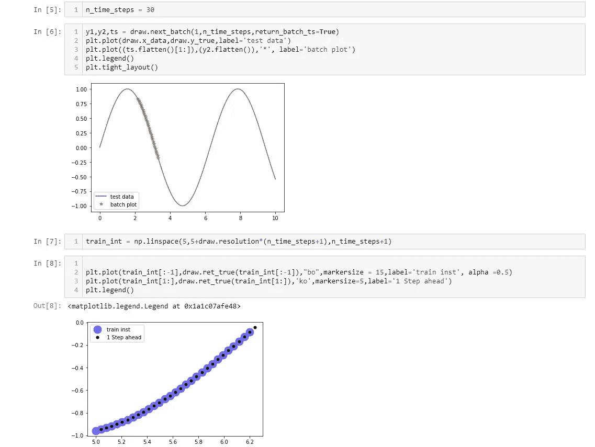
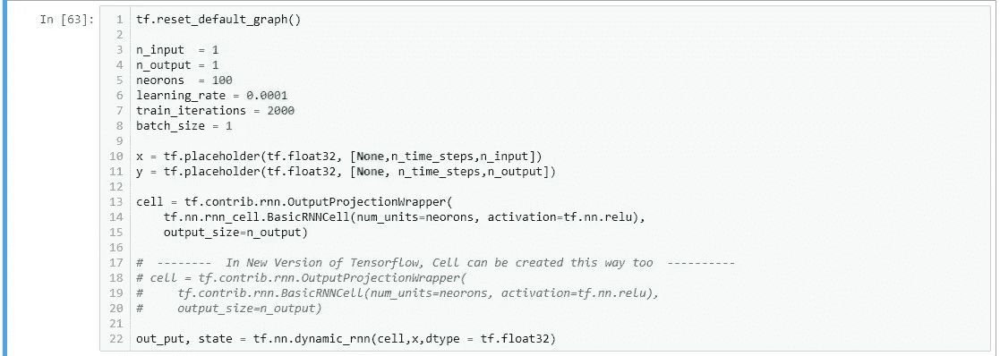
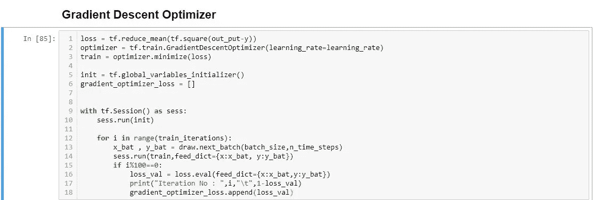
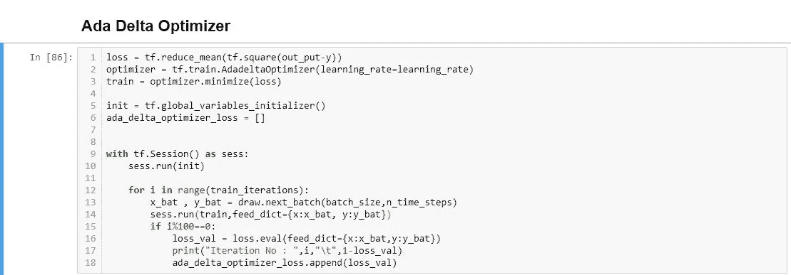
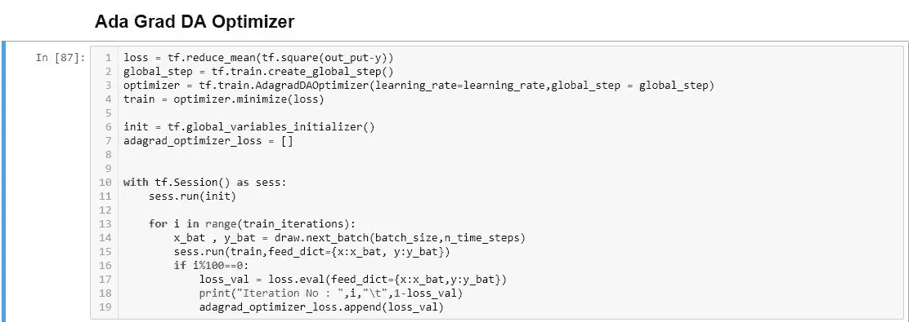
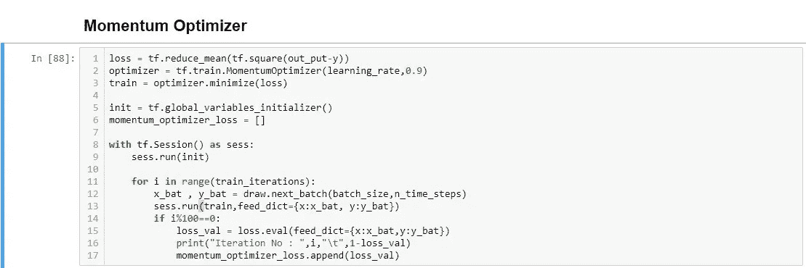
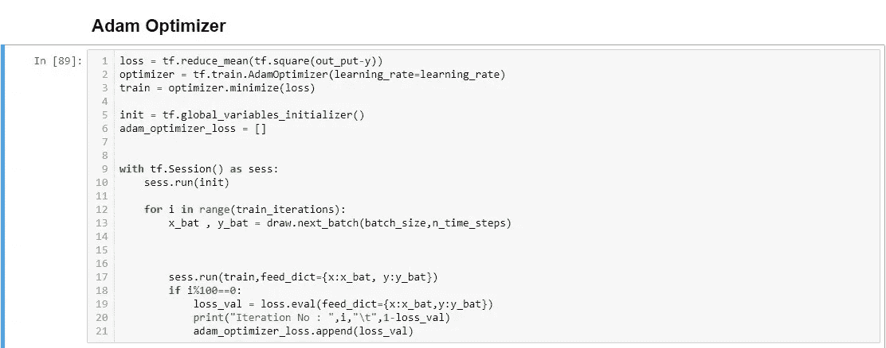
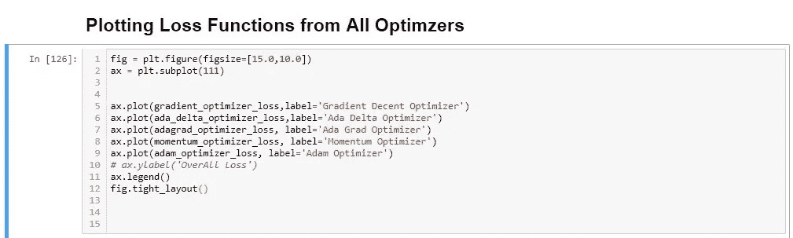

# 机器学习中最佳深度学习优化器列表。

> 原文：<https://medium.datadriveninvestor.com/in-the-battle-of-machine-learning-optimizers-e632c1710eec?source=collection_archive---------1----------------------->


> 注意:你将在下面看到的所有代码也可以在 Github 上找到。请在[https://github.com/neoronbug/optimizers-role-in-RNN](https://github.com/neoronbug/optimizers-role-in-RNN)退房

自从机器学习开始以来，无论我们到目前为止取得了什么成就，无论是医学科学、工程综合体、智能机器人还是专家系统。优化技术一直处于引领所有这些模型的最前沿。有大量的问题解决方案优化策略在拐角处被遵循，以使你的算法更快，反应更快。

计算机科学家和数学家一直致力于获得更好的优化技术，从而推动我们的机器学习或深度学习模型。在目前的阶段，我一直认为，如果没有这些算法牵着我们的手，我们在机器学习方面可能走不了这么远。让我们潜入更深的地方。

[](https://www.datadriveninvestor.com/2019/03/03/editors-pick-5-machine-learning-books/) [## DDI 编辑推荐:5 本让你从新手变成专家的机器学习书籍|数据驱动…

### 机器学习行业的蓬勃发展重新引起了人们对人工智能的兴趣

www.datadriveninvestor.com](https://www.datadriveninvestor.com/2019/03/03/editors-pick-5-machine-learning-books/) 

# 优化:

先举个例子，你此刻在纽约，想去波士顿。唯一可用的旅行方式是公路，你没有任何其他平行的方法。通常，你能做的是沿着任何一条通向波士顿的路走下去。为了让你的旅程高效，在尽可能短的时间内，你还有另一个选择，就是优化你的方式。怎么优化呢？在这整个场景中，你有两个点，纽约和波士顿。在这两个点之间，有许多路线可以把你从一个点带到另一个点。在这种情况下，你的目标是找到使你的路线最短的方法，这就是最优化。

在深度学习中，你随机选择你的权重和偏好，并通过多个深层传递它们，以获得一些输出。无论输出是什么，您都可以将其与真实值进行比较，并计算成本函数。(损失函数的别称)。计算损失后，我们使用反向传播来更新我们的权重和偏差。更新这些权重和偏差，我们再次向前传播这些值，并获得一些输出。这个循环一直持续下去，直到我们得到尽可能低的损失。在整个过程中，我们谈到了更新权重和偏差的值。我们如何更新它们？随机还是按顺序？不，我们不是随机地做，而是以特定的方式做。这些方式和规则由优化算法提供。我们用小值更新这些权重，并找出损失是增加还是减少。梯度下降是一种众所周知的算法，可以帮助我们将损失降至最低。



我们想要最小化上图中的 J(w)。如果图总是和上面一样，那么 J(w)的最小值叫做全局最小值。但是，如果有多个地形，那么所有的低点被称为局部最小值，所有这些点中的最低点被称为全局最小值。我们的主要目标是达到全球最低水平。这是真正的游戏开始发挥作用的地方。模型可达到的最大精度实际上取决于您在代码中使用的优化器的类型。这些优化器中的一些很容易收敛到全局最小值，另一些则需要大量的时间来收敛。因此，我们引入了另一个超参数，叫做学习率。有一个合适的学习率(不要太大，也不要太小)让你的模型在最少的时间内很容易收敛。

TensorFlow 提供了许多选项，让我们可以选择基于梯度的最佳优化算法。但与此同时，为了获得更好的准确性，使用哪一种是非常不清楚的。例如，用于优化的一些可用的基于梯度的算法包括 Adagrad Optimizer 的 GradientDescentOptimizer、AdadeltaOptimizer momentum Optimizer、AdamOptimizer。所有这些优化算法都有助于我们创建的神经网络从我们输入该网络的数据中学习。

因为我们了解这些学习算法的基础，所以选择一个适合我们神经网络的算法将变得非常容易。在现阶段，我们可以说，概括是我们在计算机算法和人类智能工作能力中看到的最重要的东西。举例来说，如果我们给出大量数据，这些数据并不那么抽象或概括。

我们的模型会过度拟合，无法正确预测任何偏离轨道的值。毫无疑问，梯度下降是机器学习中最重要的技术之一，它是训练任何智能系统的基础。我们不是随机猜测目标函数的值，而是简单地从初始值开始，然后朝着对我们的结果产生积极影响的方向前进。该算法不断迭代，直到找不到比现有方案更好的解决方案。为了决定我们在机器学习任务中应该遵循哪种优化技术或策略，让我们来谈谈我们可用的各种技术。



为了相互比较，我们来讨论 5 个优化器。在整个训练过程的最后，我们将计算损失函数以及准确度。我们的例子将围绕简单的递归神经网络。

# **沿线路段代码:**

首先，我们需要从导入我们将在整个代码中使用的所有必要的库开始。

> import tensor flow as TF
> import numpy as NP
> import matplotlib . py plot as PLT
> % matplotlib inline

其次，我们需要创建一个正弦波的训练数据。我们的任务是预测未来一步的图表。此时间序列类将根据您提供的点数创建数据和下一批数据。


sinusoidal Wave Prediction

让我们看看 TimeSeriesData 类为我们提供了什么，方法是创建该类的一个实例，并使用 Matplotlib 将其绘制出来。


time-series data class plot

在紫色球中，这些是我们的真实值，作为下一批。我们所要做的就是用 RNN 预测未来。



recurrent neural network optimization

因此，在这里我们最终创建了基本的 RNN 单元，并创建了一个单一输出的包装器。这就是**TF . contrib . rnn . outputprojectionwrapper**所做的。



basic-RNN-cell

这就是我们将发挥我们的损失函数，并尽量减少它使用不同的梯度体面算法。很明显，所有这些优化器算法都有它们高效工作的最佳用例。为了便于说明，我们以 0.001 的学习率对它们进行比较。

# 梯度下降优化器:

梯度下降计算为整个训练集提供的所有那些参数的损失函数的梯度。所有这些都是根据您为算法设置的迭代次数或时期数来完成的。因为在这种类型的梯度下降算法中，我们需要计算整个数据的梯度，即使是为了获得单个更新。这就是为什么它相对较慢，而且对于所有那些难以在内存中适应的变量都是可交互的。

J(w) = 1 / 2 ( y - f( w*x))2

使用 Tensorflow，我们正在计算损失函数，并使用 TF 提供的梯度下降将其最小化(感谢 Tensorflow)。使用这个优化器，我们达到了最终的精度。

```
Model Accuracy : 0.9931860789656639
```



# Ada Delta 优化器:

在我们的列表中，第二，我们在 Ada Delta 优化算法的帮助下最小化我们的损失函数，这似乎不如列表中的其他算法有效。使用此方法的最终模型精度为。

```
**Model Accuracy : 0.86990125477314**
```



# AdaGradDA 优化器:

AdaGradDa 优化器似乎完全不适合这类问题。正如我之前提到的，所有这些优化器在特定的问题范围内工作得更好。但是在我们的例子中，它根本没有收敛到全局最小值，而且波动更大。

```
**Model Accuracy : 0.23917388916015625**
```



# 动量优化器:

动量优化器完美地工作，因为它是应该的。我们在我们的例子中使用了 0.9 的动量，这完全没问题，甚至在所需的 2000 训练步骤之前就使它很容易收敛。

```
**Model Accuracy : 0.9979055358562618**
```



# Adam 优化器

目前为止我们找到的最完美的男人。它是最重要的优化器之一，几乎可以解决所有类型的问题。无论是线性或任何非线性的艰难地形。对于 Adam 优化器来说，用更少的步骤收敛到全局最小值是非常容易和简单的过程。

```
**Model Accuracy : 0.9998836797458353**
```



最后，我们使用 Matplotlib 绘制了所有的损失函数。所以为了更好地理解它们的样子，它们的聚合情况。先看一下，然后我们再讨论。

# 绘制所有损失函数:



浏览一下图表。其中两个优化器甚至不收敛，而另外三个称为动量优化器、梯度下降优化器和 Adam 优化器很容易收敛，并且容易达到最小可能损失。因此，我们得出的结论是，Adam optimizer 在这种情况下是最好的，因为它很容易遵循自己的方式来最小化损失或简单地达到全局最小值。相反，其他两个花费了相对更多的时间来达到全局最小值。

你对优化或 Adam 有什么看法，请在下面的评论区告诉我。

你也可以把你的疑问发给我，地址是 zeeshan.badar315@gmail.com。我很乐意讨论它们。