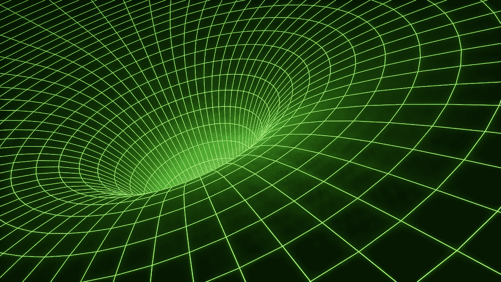

# 最终，我们会成为自己的神和创造者。

> 原文：<https://medium.datadriveninvestor.com/in-the-end-well-become-our-own-gods-and-creators-e47cc107dbf9?source=collection_archive---------14----------------------->

这是我关于人类未来的非常短的科幻愿景。

如果你可以选择，那么你愿意被永久地传送到 100 年后的未来还是 100 年后的过去？

我同意被永久传送到 100 年后的未来。

我为什么要这么做？

在我最疯狂的梦想中(受谷歌工程总监雷·库兹韦尔的影响，[他相信在不久的将来我们将能够把我们的整个大脑上传到计算机上](https://futurism.com/kurzweil-claims-that-the-singularity-will-happen-by-2045))，我确信人类将会以前所未有的方式进化。一切都将改变。

我真诚地相信，在 100 年后，如果我们不因为全球变暖而将彼此毁灭或变成亚特兰提斯沙漠，那么“人类”这个词就不再存在了，你可以从历史书上读到它，但这些书的形式和形状不会和我们今天知道的一样。相反，在未来，你可以通过将相关信息直接下载到你的**超级计算机意识中来培养专业知识和智慧。**

死亡将成为过去。目前，我们的身体是由数十亿缓慢死亡的细胞组成的生物机器，尽管一些细胞会再生，但最终，所有细胞都会死亡，我们会和它们一起死亡。但是在那个机器里面，有一个灵魂/精神。在未来，你可以**提取灵魂并上传到这台超级计算机**。你仍然会有自我意识，你也能够创造我们无法想象的世界，在星系中搭便车。

AR/VR/MR 技术仍然非常年轻，处于早期阶段，但现在我们已经可以体验即使在 20 年前也无法想象的事情(例如，你可以作为宇航员驾驶火箭飞船进入太空的 360 度第一人称视角体验)。**假设这么问，如果未来 100 年我们能以现在的速度开发新技术，甚至更快，会发生什么？我们会成为自己的神和创造者。**