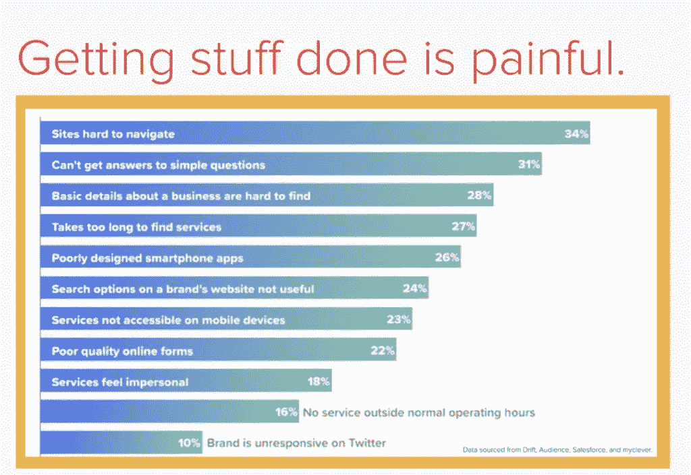
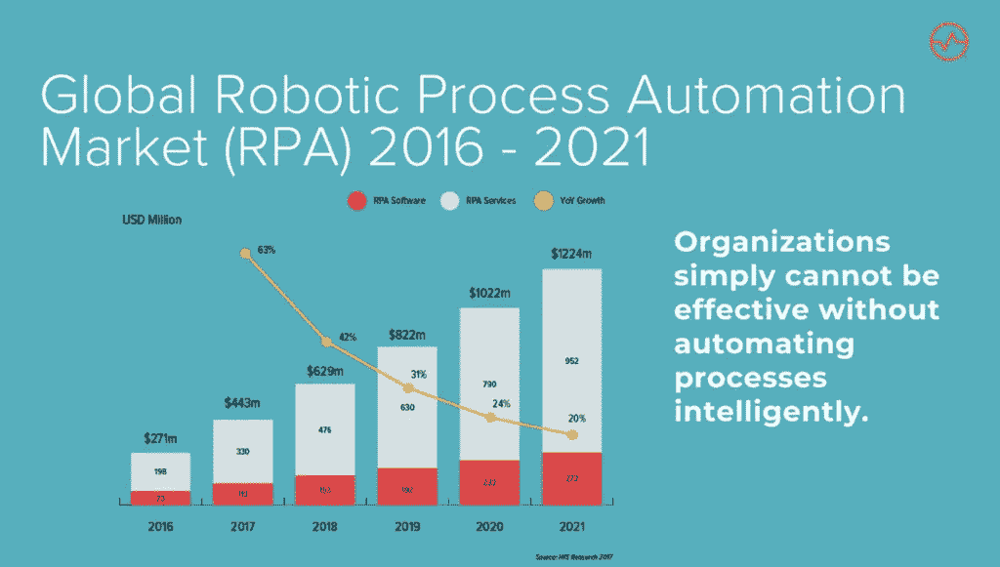
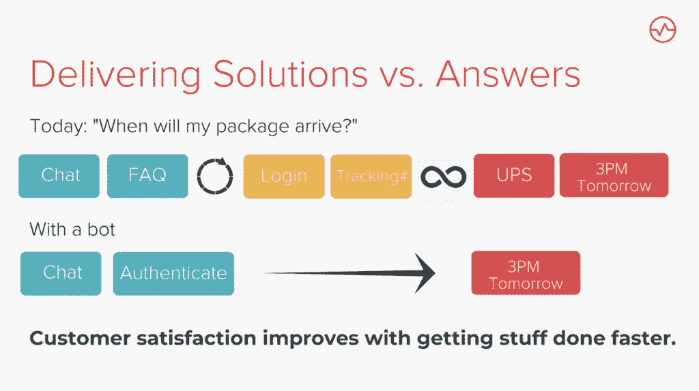

# 我们如何超越聊天机器人拥抱自动化

> 原文：<https://medium.datadriveninvestor.com/in-the-last-few-years-automation-has-given-rise-to-an-era-of-machines-in-various-forms-a1c94e5db6e4?source=collection_archive---------11----------------------->

在过去的几年里，自动化催生了一个“机器”时代——从虚拟助理到预测算法。各行各业各种规模的组织都在实现流程的自动化，他们的目标是一致的:**只有当人与人的交互比人机交互更有价值时，才需要人与人的交互。**

这并不意味着决策仅仅归结于效率；情绪可以是这些价值之一，甚至机器也可以对敏感话题表现出同理心，如[骚扰](https://twitter.com/talk2spot)。

但是机器人流程自动化(RPA)的作用与日常任务的一个常见痛点有关:**完成像浏览网站和填写表格以联系企业这样的事情是痛苦的**，对消费者和企业都是如此。

# 为什么是现在？

让自动化、人工智能和机器学习成为可能的基础和算法并没有随着时间的推移而发生太大变化。为什么是现在？为什么 RPA 市场正在蓬勃发展，并将在未来五年内暴涨？

因为今天我们有巨大的计算能力*，*通过像 AWS 云服务这样的服务。我们已经提高了互联网速度，降低了内存成本，并且因为处理能力的成本比 40 年前更易于管理。

# RPA 帮助组织完成更多任务

所以这不仅仅是自动化，而是战略性的自动化。 **RPA 使组织能够自动化流程，并使员工能够投入更多时间从事更高价值的工作。**任何按照定义的规则执行的大量普通流程都可以通过 RPA 进行简化。

*   **准确性:**在执行重复性任务时，无论训练有素，人类都容易出错。RPA 可以简化这些任务，旨在消除人为错误。
*   **合规性:**在合规性方面，无误地执行重复性任务的能力最为重要。
*   **劳动力的减少:** RPA 使您能够将您的劳动力转移到更复杂的任务上，这些任务需要知识、洞察力，有时还需要展示情感，如同理心。
*   **降低处理成本:**端到端 RPA 解决方案可以在几个月内实施，并且可以降低高达 80%的成本[。](https://www.uipath.com/rpa/robotic-process-automation)
*   **不中断现有流程:**可以说，RPA 最吸引人的特性是它可以与您的现有基础架构集成，并且无需拆除现有基础架构即可实施。
*   **高可扩展性:** RPA 可以按需实施，甚至可以轻松适应快速变化的业务环境，不受地理位置的限制。你也可以用最少的投资来扩展它。

RPA 对公司尤其有吸引力，因为在实施的第一年，它可以为[提供高达 200%的 ROI](https://www.mckinsey.com/~/media/McKinsey/Industries/Financial%20Services/Our%20Insights/The%20value%20of%20robotic%20process%20automation/The-value-of-robotic-process-automation.ashx) 。

# 提供解决方案，而不是答案

RPA 有无限的应用，但这里有几个例子。

**客户支持**

聊天机器人、虚拟助理或自动化在线助理帮助组织大幅改善客户(和员工)体验。这些技术可以提供全天候支持来解决客户纠纷、回答问题和防止问题升级。只有最复杂的问题和询问需要有人参与。

以 UPS 为例。如果我想追踪我的包裹，系统会提示我输入追踪编码。很有可能，我没有现成的跟踪号码。聊天机器人可以通过以下方式简化这一过程:

1)减少了我为得到答案而需要跳过的“圈”的数量 2)不需要我手头有太多的信息

**营销**

聊天机器人可以帮助品牌通过接触他们最常访问的社交媒体平台上的受众来增加他们的客户参与度。我们的[团队](https://www.klug.chat/)为[七人制橄榄球世界杯](https://www.wizeline.com/customers/usa-rugby-and-wizeline-launch-chatbot-for-rugby-world-cup-sevens/)和[2018 年澳大利亚网球公开赛](https://www.wizeline.com/customers/digital-arts-network-partners-wizeline-build-australian-open-chatbot/)开发了聊天机器人，与粉丝互动，提高品牌知名度，增加赞助机会。

**业务流程运营**

RPA 还可以在 CRM、ERP 和供应链管理的流程自动化中发挥关键作用。它可以在库存管理、计划、报价、发票和合同管理、工作订单管理和处理中发挥重要作用。

# 人工智能在哪里？

**RPA 不具备 AI 那样的随时间学习和成长的能力。如果没有数据，RPA 就无法自主学习，也无法根据时间和不断变化的需求来调整流程。**

AI 有能力从非结构化数据中提取相关数据。它可以浏览客户投诉，确定投诉的类型和内容，甚至可以提出解决方案。但是，RPA 仅限于高度结构化的数据或流程。

RPA 完全是为了自动化重复性任务。聊天机器人通过整合公司现有的知识库，提供了一种实用且经济高效的方式来回答客户的询问。这允许聊天机器人:

*   打开服务单并提供各种主题的故障排除信息。
*   寻找特定主题的信息(新闻、体育、有趣的事实、课程)。
*   对客户特定的信息提供即时响应，如产品可用性、运输状态和故障排除帮助。

**聊天机器人不是一个独立的解决方案**。它们是自动化重复性任务、降低成本和人力资源的令人信服的解决方案。

**RPA 是更高的生产率和质量、更低的成本和更高的投资回报率之间难以捉摸的桥梁。**虽然有些人担心 RPA 会导致失业，但如果通过深谋远虑和有计划地实施，RPA 可以让公司将员工重新投入到更有趣、更有意义的任务中。

*这部作品是由* [*拉斯蒂·冯·瓦尔德伯格*](https://medium.com/u/d6ab1b61b70a?source=post_page-----a1c94e5db6e4--------------------------------) *于* [*Klug 上改编的原作。聊天*](https://www.klug.chat/klug-blog/2018/10/23/how-rpa-can-benefit-your-organization)

# DDI 特色数据科学课程:

*   [**用于数据科学的 Python**](http://go.datadriveninvestor.com/intro-python/mb)
*   [**Scikit-Learn**](http://go.datadriveninvestor.com/scikitlearn/mb)
*   [**深度学习**](http://go.datadriveninvestor.com/deeplearningpython/mb)

**DDI 可能会从这些链接中收取会员佣金。我们感谢你一直以来的支持。*