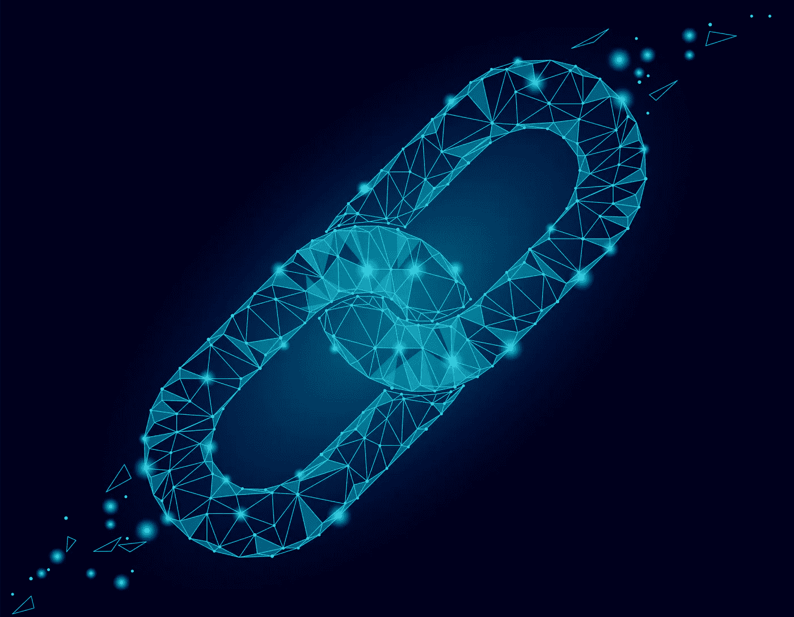
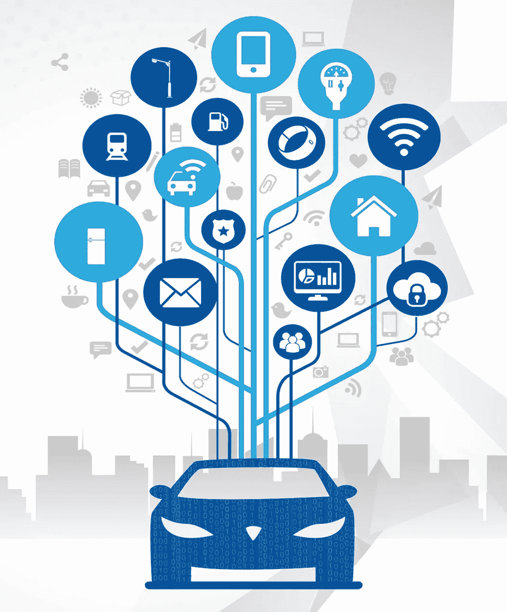
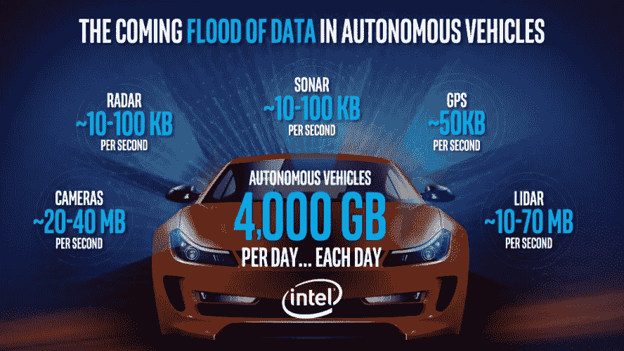
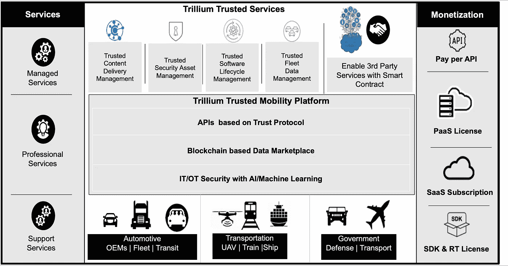

# 为什么值得信赖的移动平台和服务是汽车行业的必需品！

> 原文：<https://medium.datadriveninvestor.com/in-the-transformative-age-of-transportation-why-trusted-mobility-platform-and-services-are-a-must-f540286dacff?source=collection_archive---------13----------------------->

# 在交通运输的变革时代，值得信赖的移动平台和服务为何必不可少！

在当今的数字世界中，信任是我们最宝贵的资产。没有信任，就无法创造价值。为了让人们在彼此不了解的情况下相互信任，这种货币被设计成确保买卖双方都能平等地认可所有感知的价值。所以，没有信任的货币是没有用的。

> **物联网时代，数据是新的货币。**在处理联网车辆传输的数据时，对数据完整性的信任不仅仅是重要的。它可以拯救生命。

“Data is the New Currency for Automotive” — Mahbubul Alam

2018 年，高端汽车平均有超过 1 亿行代码。具体来说，这是 F22 战斗机所含能量的 50 多倍！显然，这意味着保护所有这些软件代码是至关重要的。据英特尔公司称，一辆自动驾驶汽车平均每天产生 4tb 的数据。根据麦肯锡的预测，到 2030 年，联网和自动驾驶汽车数据和服务的货币化预计将从 300 亿美元增长到 1.5 万亿美元。这代表着 zettabytes(数千 EB)的数据处于危险之中，这带来了巨大的机会

Autonomous Vehicle Generates 4 Terabytes of Data per Day — source: Intel Corp.

越来越多的联网汽车和每辆车的电子内容，以及监管机构对车辆数据保护的强化要求，正在推动汽车网络安全市场的发展。简而言之，数据必须得到保护，以确保那些将自己的生命托付给这些车辆的隐性安全的人的完全信心。这就是为什么在数据的所有方面，不仅要有最纯粹意义上的不受威胁的安全，还要有信任。

安全是建立信任的基础。“可信数据”，其核心定义为不可变的、透明的、可审计的、加密的和分布式的数据记录，这比仅仅数据安全重要得多。例如，如果在一张 100 美元的钞票上，放置的标识符包括特殊的安全措施，如水印、唯一的 ID、使用的特殊类型的纸张等。这使得复制变得更加困难，从而为安全货币奠定了基础。然而，要让它变得可信，需要更彻底的努力。它需要跟踪，以了解它去了哪里，给了谁，它是如何花费的，以及有人没有花费超过其实际价值。只有当人们相信所有这些保护措施都到位时，一种货币才有价值。

$100 Dollar Federal Reserve Note

同样，数字经济中的数据也必须受到保护，以确保其真实性。如果一百美元的伪钞变得很容易，这种信任就会立即消失。对于数据等数字货币来说，这变得更加重要。信息的接收者需要明确地相信其中包含的信息没有被篡改，并且其来源已经被唯一地识别。

> 信任价值链必须通过透明度、数据管理和交易持续记录的结合来建立。在数据经济中，为了让组织与供应商或合作伙伴开展业务，流程必须不仅仅是保证数据通信的安全。他们必须信任数据完整性，这可以通过结合架构、技术、协议和安全数据治理来实现。

Trillium’s Trusted Mobility Platform and Services

信任能让组织创造价值，让资本市场正常运转。有了信任，组织就有信心采取战略行动，抓住中断带来的好处。Trillium 在这方面发挥了关键作用，它对车辆内部的通信进行了加密。Trillium Secure 车载安全产品提供自适应防火墙和自我防御入侵检测和保护解决方案，可以在远程信息处理控制单元、网关和/或域控制器上运行，确保只允许应该通过的通信。车载安全产品辅以基于云的人工智能，可从外部来源和连接到平台的其他车辆进行自学。，以及通过区块链架构在车辆和云之间建立安全连接。

> 没有对数据完整性的信任，人工智能/机器学习就无法发挥其潜在价值。

虽然整个行业理所当然地认为这种极其强大的新技术将彻底改变整个世界，但如果它所学习的数据是有缺陷的，那么就不会有任何信心。这是一个非常重要的目标，每个人都应该理解！如果数据不可信，发生的机器学习将是错误的，因为它正在处理有缺陷的假设。这就是可信移动平台如此具有突破性的原因。Trillium Secure 已经认识到这一事实的必要性，并断言其技术首先要保证所有类型的数据传输之间的信任。

但它不仅仅是革命性的。Trillium 技术创造了无与伦比的数字信任水平。本质上，平台的 DNA 提供了信任、安全性和完整性，因此数据可以毫无保留地提供价值。它是以这样一种方式构建的，即所采取的每一项行动都是以确保这一要求为前提的。通过这样做，公司将真正做出根本性的贡献。

为了进一步检验这一点，Trillium 的平台在三个不同的层面上具有变革性:

# **对于个人:**

从本质上来说，联网车辆产生的数据是个人担心其合法使用以及黑帽非法使用的又一个地方，黑帽可能会从其销售或非法开采中获利。

> Trillium 平台的好处是能够保持数据的私密性，控制其传播，并在任何有权访问数据的实体可能利用数据获取金钱利益时通知每个人。

通过这种方式，可以毫不夸张地说，整篇文章所讨论的整个前提是对信任这一关键承诺的过度兑现。

# **为行业:**

在通用数据保护法规(GDPR)建立的新隐私世界秩序中，遵守全球所有隐私法规比以往任何时候都更有价值。在这一努力中没有灰色地带，期望从联网车辆中生成的所有个人可识别信息数据不仅必须可信，而且必须保密。

> Trillium Secure value 通过以下几个方面的独特组合来实现:a)它降低了运营费用，从而积极提高了利润；b)它提供了产生新收入流的方法；c)它简化了大规模复杂系统的操作和可用性。

总的来说，从顶线和底线的角度来看，这一投资回报立即变得合理。

# **对于社会:**

最后，或许也是最重要的一点，Trillium Secure 着眼于它能够为世界带来的影响。

> 如果要实现真正互联的移动世界的梦想，社会必须能够放下众所周知的方向盘，让人工智能/机器学习接管。

如上所述，一旦建立和验证了数据信任和载体网络安全，就会出现一系列新的积极范例。交通流量可能会显著减少，如果不是彻底根除的话，这将对帮助世界应对气候变化产生巨大影响。此外，许多通勤者每天在处理高速公路和侧街上令人疲惫的拥堵时所面临的压力可以成为过去，从而提高生活质量和实际寿命。

所有这些优势结合起来将提供一个清晰、积极的使用案例，为 Trillium Secure 被广泛采用的优势提供一个令人信服的论据。一旦完成，该平台和服务可以帮助加速信任，以实现真正互联的运输世界。