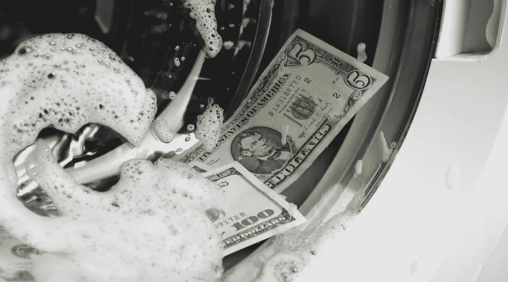
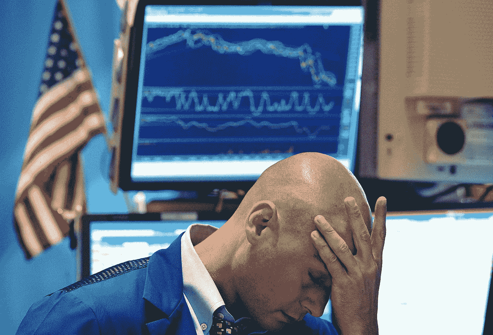
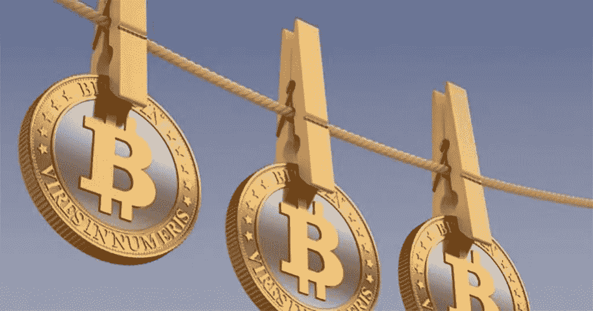

# 在洗钱的世界里，加密货币只是一个脚注

> 原文：<https://medium.datadriveninvestor.com/in-the-world-of-money-laundering-cryptocurrencies-are-a-footnote-35c3957a29fe?source=collection_archive---------1----------------------->

Tony was hoping that if he left his fives in the wash long enough they’d start turning to hundreds.

对于使用加密货币作为交易媒介，经常听到的批评之一是，这种新兴的数字资产为洗钱提供了便利。

黑暗网络数字市场 place the Silk Road 的创始人可怕的海盗 Roberts (Ross William Ulbright)被捕，该市场允许用户购买任何和所有形式的犯罪工具，从毒品到武器，以及所有介于两者之间的东西，这使全球关注比特币及其类似物被用于促进洗钱的潜力，加密货币很难成为洗钱世界的基石。

可以肯定的是，加密货币*可以*用于洗钱。但是他们在地中海俱乐部发行的 Rai 石头或者珠子也可以。

El Chapo was unimpressed by the native’s attempt to offer him banking services.

尽管自金融危机以来，数十次打击行动都以洗钱者为目标，但许多从事洗钱交易的银行、金融机构、空壳公司和离岸实体仍然存在。

监管机构对全球一些最大和最知名的金融机构的罚款，可能对阻止非法资金的流动没有起到什么作用。一家大型跨国银行的总法律顾问表示，

> “银行在考虑此类交易时，已经将监管机构罚款的风险计入了价格。”
> 
> "只要交易的利润超过罚款，多多少少还是好的。"

根据联合国毒品和犯罪问题办公室的数据，每年有问题的交易仍高达 2 万亿美元，相比之下，加密货币的总市值在好的时候仅为 1200 亿美元。

因此，虽然加密货币因洗钱而名声不佳，但也许是时候给全球洗钱活动中真正的推动者和震动者以适当的认可了。

排名不分先后，以下是过去二十年中一些最大洗钱丑闻的最著名的协助者和教唆者名单。

## 1.渣打银行(英国)

2012 年，该银行因违反美国对与伊朗做生意的制裁而支付了 6.67 亿美元的罚款。两年后，在创纪录的罚款之后，纽约州又以反洗钱控制不力为由对该银行追加了 3 亿美元的罚款。

Laundromat took on an unusually corporate look.

## 2.汇丰银行(英国)

根据 2012 年与美国当局达成的延期起诉协议，该银行因未能监控来自墨西哥的超过 6700 亿美元的电汇和超过 94 亿美元的美元购买而被罚款 19 亿美元。

一个复杂的存款和资金转移系统使得墨西哥和哥伦比亚的贩毒集团能够通过银行渠道清洗他们的毒资。人们认为这只是银行里的又一天。

## 3.荷兰国际银行

这家荷兰银行在 2018 年被荷兰监管机构罚款 9 亿美元，该行承认在未能阻止 VimpelCom 向一名乌兹别克政府官员所有的公司进行非法支付方面存在“严重缺陷”(这是一种说法)。

## 4.丹麦丹斯克银行

去年 9 月，这家丹麦银行承认，尽管举报者和监管者都发出了警告，但在 9 年时间里，约 2000 亿€潜在非法资金通过其爱沙尼亚子公司流动。爱沙尼亚、丹麦和美国正在进行调查。

Smiles are free but transaction oversight is extra.

## 5.德意志银行(德国)

这家德国银行在 2017 年被美国和英国当局罚款 6.7 亿美元，原因是通过其莫斯科办事处进行了一系列镜像交易。这些交易允许俄罗斯人通过在俄罗斯用卢布购买股票，并在伦敦以美元或欧元出售相同的股票，将数十亿美元转移到国外。

## 6.德国商业银行

另一家德国大银行因在 2002 年至 2008 年间代表伊朗和苏丹实体处理超过 2500 亿美元的交易而被罚款创纪录的 14.5 亿美元。

根据纽约金融服务局 2015 年的同意令，该银行无效的合规控制未能与当局分享受美国制裁的客户的相关信息。

## 7.摩根大通银行(美国)

根据美国法院 2014 年的一项和解协议，美国银行业巨头摩根大通(JP Morgan Chase)在大约 15 年的时间里，故意忽略了围绕华尔街金融家和庞氏骗局巫师伯尼·麦道夫(Bernie Madoff)交易的危险信号，麦道夫利用他在该银行的账户经营了有史以来最大的 650 亿美元的庞氏骗局。

## 8.花旗集团(美国)

该银行被罚款 2 . 37 亿美元，原因是在几乎没有监管的情况下处理了超过 88 亿美元的交易。

“How many times do I have to tell the intern to leave the pickles out?”

## 9.美联银行(美国)

总部位于弗吉尼亚州夏洛特的银行被罚款 1.6 亿美元，因为发现墨西哥贩毒集团利用该银行的账户为其业务融资和洗钱。

根据 2010 年与美国当局达成的延期起诉协议，从 2004 年到 2007 年，这家后来被富国银行收购的银行处理了不少于 3，370 亿美元的墨西哥货币银行电汇。

## 10.自由保护区(哥斯达黎加)

这个数字货币平台是一项 60 亿美元洗钱活动的核心，2016 年，美国当局判处其创始人亚瑟·布多夫斯基 20 年监禁，罪名是通过哥斯达黎加的平台经营洗钱企业。

## 有罪但不应该如此

虽然这些只是过去 20 年中较为引人注目的洗钱丑闻中的一部分，但这份名单远非详尽无遗。

Tim’s clothesline looked suspicious.

这些加密货币甚至可以被视为与金融服务业对洗钱的程度、普遍性和系统性故意视而不见相媲美，在许多方面都应被视为一种赞美。

只要存在并将继续存在犯罪活动，就将继续存在对金融服务的需求，以享受这些非法收集的资金的收益。

加密货币无疑可能是犯罪分子洗钱的一个选择，但它很难成为首选，也不是唯一的选择。

# DDI 特色数据科学课程:

*   [**用于数据科学的 Python**](http://go.datadriveninvestor.com/intro-python/mb)
*   [**Scikit-Learn**](http://go.datadriveninvestor.com/scikitlearn/mb)
*   [**深度学习**](http://go.datadriveninvestor.com/deeplearningpython/mb)

**DDI 可能会从这些链接中收取会员佣金。我们感谢你一直以来的支持。*