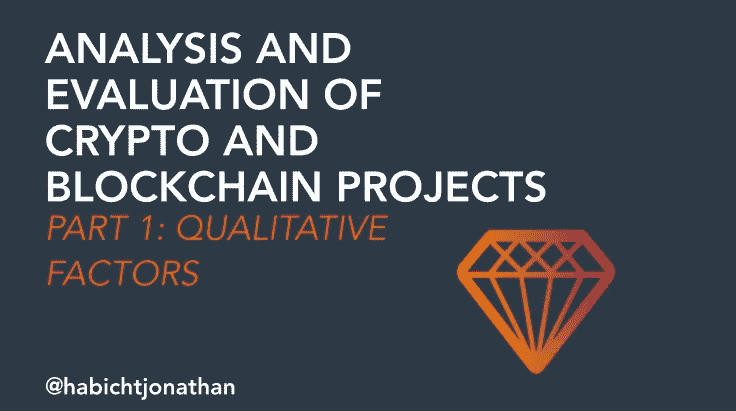

# 如何分析和评估加密和区块链项目第 1 部分:定性因素

> 原文：<https://medium.datadriveninvestor.com/in-this-blog-post-we-will-take-an-in-depth-look-at-the-main-aspects-of-my-qualitative-and-6bcd5ec6d761?source=collection_archive---------0----------------------->

在这篇博客文章中，我们将深入了解我分析加密货币和区块链项目的定性和定量方法的主要方面。我将向你介绍一个框架，它对我评估投资机会帮助很大。这个框架分为两部分。正如标题所示，第一部分是关于定性数据，在我的分析的这一部分，主要目标是了解某些方面，如团队背景、整体愿景、技术和项目的中长期潜力。这一步对于确保你没有投资一个骗局项目也很重要。

为了获得一个清晰的整体图景，并使你的潜在投资互相比较，我开发了这个分析的第二部分，我称之为定量方法。我还会让您访问我在这部分评估中使用的电子表格。

整个方法不仅适用于加密领域的既定项目，也适用于 ico。

第 1 部分:定性数据

首先，我们必须承认，分析加密货币的主观和数据驱动的技术从来都不是一成不变的。随着行业的变化和发展，评估项目的参数也必须改变，在观察市场时必须考虑新的经验和知识。

很少有投资者在预测新资产类别的发展方面有丰富的经验，特别是在加密方面，很难找到与之相比的东西，也很难找到使预测更有效的数据。在我看来，即使是非常流行的对互联网早期阶段的比较，也应该有所保留。

由于无法依赖我们在评估股票或债券等传统资产时会考虑的数据，新的方面在加密货币这一新的资产类别中占据主导地位。发展你自己的、个人的评估计划和方法是很重要的，并且确保你对它们感到舒适，并且它们给你的决策过程带来价值。让我们开始吧，让我给你一个我开发的过程的概念。

我主要关注六个因素:

*   视力
*   组
*   潜力(市场)
*   令牌组学
*   采用和战略
*   潜力(增长)和路线图

# 视力

缺乏远见显然不是这个领域大多数项目的问题。在大多数情况下，情况恰恰相反:许多项目承诺一项革命性的新技术，这项技术将彻底改变世界，或者至少颠覆整个行业。这些承诺可能听起来令人印象深刻，但你应该始终为自己着想，更重要的是，从技术角度和潜在用户的角度，为自己评估这一愿景的可行性以及有朝一日成为现实的可能性。

使用常识和你自己对现实的看法来确定项目所提供的是否是可能的，甚至是更关键的，就其解决实际问题的潜力而言是否真的需要。

您的重点应该是寻找具有明确价值主张和解决现实世界问题的新方法的项目。如果在你正在看的项目中看不到，请给自己留点时间，不要深究。价值创造和解决问题的能力使得一家公司值得你花费时间和金钱，因此也是一项好的投资。

在审视区块链项目的愿景时，你应该问自己以下几个问题:

*   是否有具体的用例，是否旨在解决某个问题？
*   提议的基于区块链的方法是否明显优于集中式的传统方法？
*   这个真的需要代币吗？
*   优势是否清晰且可衡量？

# 组

因为在我们的分析中我们不能依赖“确凿的事实”,我们必须依赖团队，这是项目未来成功的主要因素之一。尤其是团队成员的背景和历史，而且不同技能和知识的构成也起着重要作用。

你还应该仔细看看一个项目能够带来的顾问和合作伙伴。这是一个项目在行业中地位的极好的指示器。顾问也可能成为成功的关键因素，特别是对于那些在其领域内面临越来越多的竞争对手的项目，或者当他们的成功依赖于网络和进入特定行业的大玩家时(例如，供应链项目)。然而，顾问的额外技能和知识也可以将项目带到一个全新的水平(例如，等离子网络，OmiseGo)。

以下是你在考察区块链项目团队时应该问自己的一些问题:

*   哪些是团队成员过去工作过的项目，
*   这些项目表现如何？
*   有关于诈骗等的报道吗？涉及团队成员？
*   经理们(至少)足够胜任他们的工作吗？
*   顾问的经验如何？
*   顾问给项目带来了什么？

# 市场潜力

我们已经回答了一个项目是否以及如何为特定的用户群提供价值的问题，现在是时候找出这个潜在的用户群有多大了。关注动态易于理解的大市场。如果这是一个小的利基市场，看看这个领域的传统公司的规模，找出它的潜力。简而言之:为了获得可观的收益，你需要一个大市场，为一个项目的代币或硬币创造大量需求。

有两种方法可以确定区块链项目或加密货币的市场潜力:

深入了解目标市场/行业的结构、特征和规模，并创建不同的采用场景(悲观、现实、乐观)。

如果你正在处理一个以客户为中心(B2C)的项目，你应该看看这个项目的社会媒体渠道。注意用户群的规模，活跃度，整体基调，透明度。如果一个 ICO 在很短的时间内销售一空，并且有一个参与的开放社区，它可能会在一个社区中显示出一些超出通常炒作的真正热情。

在审视区块链项目的市场潜力时，你应该问自己以下几个问题:

*   有多少潜在用户？
*   会有足够的人来创造代币需求的需求吗？(与其他更成熟的项目相比)
*   是否有可能扰乱现有市场或行业？
*   目标市场是增长还是萎缩？
*   有多少竞争者？(传统企业和初创企业)
*   这个项目与竞争对手有何不同？
*   这个市场的总体趋势是什么？
*   项目所针对的问题会随着时间的推移而增加吗？
*   这个项目的价值主张是绑定到这个特定的市场，还是可以转移到不同的行业？

# 令牌组学

令牌组学描述了令牌的设计，以及令牌在项目生态系统中发挥作用的框架和数学。在第一层(设计)上，如果项目的所有可能的利益相关者(客户、用户、投资者等)都参与进来，就可以实现良好的令牌组学。)正在创造对它的需求。留意货币的实际用途，以维持网络的稳定性或作为网络中特定产品或服务的支付手段。

好的令牌设计应该:

*   为所有利益相关者提供价值
*   有真正的功能
*   奖励用户和投资者成为早期采用者
*   奖励用户为网络带来新用户
*   为持有代币提供长期激励

另一方面，你应该从投资者的角度来看待象征经济学:

**每代币价格**

**总流通供应量**(当前交易的所有硬币)在确定一枚硬币是否“便宜”或是否存在大量硬币时会考虑到这一点。

**市值**(价格乘以总供应量)决定了一种货币的增长潜力(低市值=高增长潜力)

**交易量** —在一定时期内，通常是 24 小时内，交易的加密货币数量。不同的交易所通常会给出特定时间的交易量，但如果你在观察单一货币并决定你是否应该投资，一定要看总交易量，而不仅仅是一个交易所。

**交易时间** —将代币或硬币从钱包 A 转移到钱包 b 所需的时间

当你审视区块链项目的令牌组学时，你应该问自己以下几个问题:

*   代币提供的是真正的价值还是仅仅是投机？
*   除了作为投机资产，令牌还有其他使用案例吗？
*   中介是被淘汰还是通过代币得到补偿？
*   价格、市值和供给之间的关系是什么样的？
*   你投资的是一枚潜力大(市值低)的硬币吗？

# 采用和路线图

光有愿景并不意味着什么，当然也不会成为一家好公司。如果这一愿景从未转化为现实，那么再好的想法也是毫无价值的。换句话说:这不是关于想法，而是关于团队如何执行这个想法。

适应是愿景和现实之间的桥梁。大多数区块链初创公司对他们将如何推动令牌的分发非常开放，并在项目的路线图中列出了他们的计划。路线图是评估区块链初创公司及其加密货币过程中的另一个重要方面。它向投资者和用户概述了计划的内容和项目的发展方向。在最好的情况下，路线图包含未来 24 个月的详细计划。永远不要想当然地认为项目路线图中概述的是什么，许多团队错过了他们的目标，要么是关于截止日期，要么是关于特性。如果对延迟的解释是合理的，持续的开发和与社区的持续沟通可以弥补这一点。

以下是您在查看区块链项目的采用和路线图时应该问自己的一些问题:

*   路线图是否包含明确的战略，是否现实？
*   营销方面的团队是如何组建的？(团队和战略)
*   到目前为止，团队如何实现他们的路线图？

# 增长潜力

许多这些年轻的项目还不能提供一个工作产品。他们依赖测试网、测试版或 MVP。一开始，投机和随之而来的金钱是他们的全部动力，让他们活得足够长，最终在未来的某个时候兑现他们的承诺。作为一名投资者，你必须决定你是否相信团队、愿景和工作产品的承诺，因此通过查看我们在本文中详细讨论的每个方面来识别整体潜力。不要被炒作和虚假承诺蒙蔽了双眼。

在审视区块链项目的整体潜力时，你应该问自己以下几个问题:

*   基于前面的步骤:硬币是否被低估？
*   交易指标如何？(成交量、市值等。)
*   以交易量低为例有哪些原因？(是硬币只在少数交易所交易还是对这个项目整体兴趣太低？)
*   过去价格对正面消息的反应如何？
*   是不是有某种炒作？

永远记住，短期内有很多钱可以赚。尤其是在牛市期间，你投资哪个项目其实并不重要。然而，如果你的目标是长期利润和非凡的投资回报，同时将风险保持在最低水平，你应该仔细看看我在本文中提供的观点，并得出自己的结论。

在本系列的[第二部分中，我们将看看加密项目分析中的合格数据，以了解在这种嘈杂的环境中识别伟大项目的全貌。](https://medium.com/@HabichtJonathan/how-to-analyze-and-evaluate-crypto-and-blockchain-projects-part-2-quantitative-factors-8eecd2741f7d)

> *“风险来自于不知道自己在做什么”——沃伦·巴菲特*

*   感谢阅读
*   如果你喜欢这篇文章，请跟我来
*   [LinkedIn](https://de.linkedin.com/in/jonathan-habicht-20aa6680)|[Twitter](https://twitter.com/HabichtJonathan)|[insta gram](https://www.instagram.com/habichtjonathan/)|[YouTube](https://www.youtube.com/channel/UCWY14JhnAqlhhUbkh8iD1gw)
*   不要忘记分享！
*   你也可以在这里注册[我的简讯](https://mailchi.mp/b4af26597d73/gdbdy0yokr)