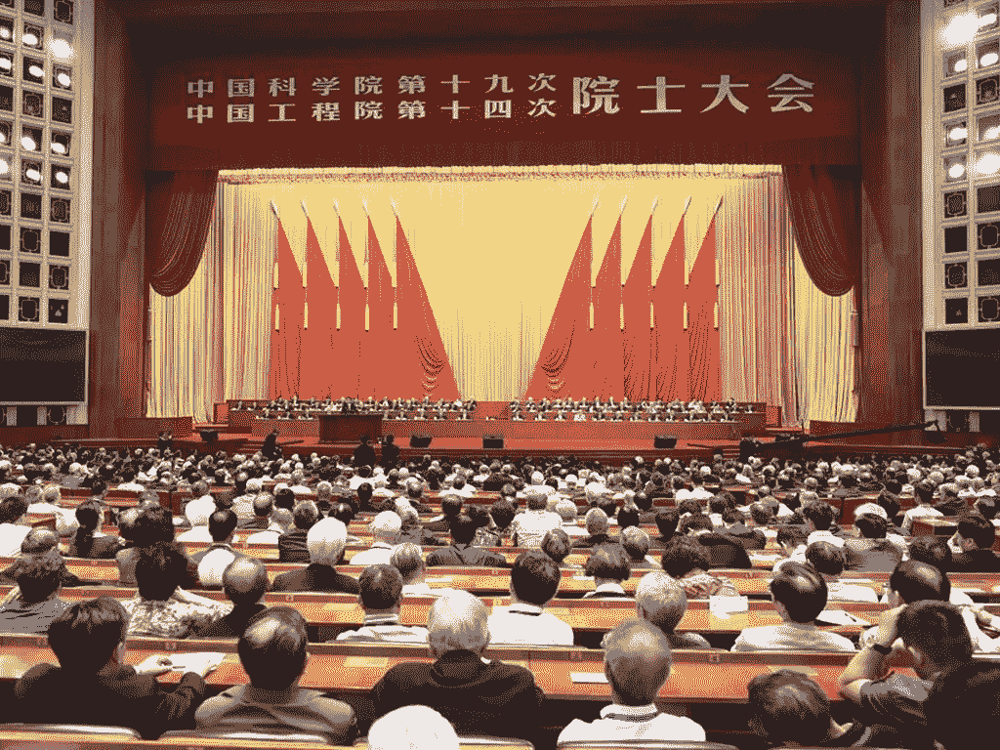

# 我们信任的信托，或者比特币，如果必须的话

> 原文：<https://medium.datadriveninvestor.com/in-trusts-we-trust-or-bitcoin-if-we-must-479ad5e8fea2?source=collection_archive---------19----------------------->

That face you make when your ICO moons and you managed to get an allocation.

这里没有什么比下午茶、凝结的奶油和烤饼更典型的英国食物了。尽管中国新富阶层已经接受了所有英国的东西，从经典的博柏利风衣到卡莱斯·蒂尔维特的商务衬衫，但直到最近，他们还没有接受最英国的任命——信任。英国信托基金是中世纪的产物，有着比贵族更为独特的血统。要理解信任的推力和阻力，你需要登上德罗宁号，回到十字军东征时期的 12 世纪英格兰。英国普通法(法官造法)认为财产是不可分割的，如果让拥有法定所有权的人持有被认为是“不公平的”(本质上不公平)，国王的代表，即建立衡平法院的大法官，有权宣布*真正的*所有者“衡平法上”(平心而论)是另一个人。如果这些法律术语还没有让你大吃一惊的话，用简单的英语来说，信托是一种法律文件，它将一批资产的所有权“所有权”交给其他人替你保管，而你保留该所有权的“利益”。该建筑在十字军东征期间是必要的，因为当英国人向南走向不确定的屠杀时，有人必须照看他们在国内的大量资产，并理解如果他以某种方式回到多佛的白色悬崖，财产将在返回时移交给他。但在中国法律中并不存在这样的法律概念，直到最近，这个概念对富裕的中国人来说还是相对陌生的。

在过去的一周，[发现](https://www.bloomberg.com/news/articles/2019-01-15/four-chinese-tycoons-just-transferred-17-billion-to-trusts)四名中国大亨将超过 170 亿美元的财富转移到家族信托中，以保护他们的财富免受中央王国新收紧的税收制度的影响。家族信托在欧洲已经存在了几个世纪，自英国普通法支持下的无数避税天堂建立以来，家族信托日益壮大。直到最近，大多数中国富人都很满足于通过各种方式(比特币只是众多工具中的一种)将他们的巨额财富转移到海外，以免中国政府突然喜欢上掠夺。

Great Hall of the red flags was always a huge tourist draw.

最新的转移发生在中国财富“离岸”至避税天堂的趋势日益增长的背景下。亿万富翁孙宏斌的财富来源于中国房地产的快速升值，他在 1 月 12 日的一份香港文件中披露，他已将他在融创中国控股有限公司的大部分股份转移到南达科他州信托公司。在 2018 年的最后一天，中国最富有的女性之一吴亚军也对她在龙湖集团控股有限公司的大量股份采取了类似的行动。这些中国企业巨头与食品经销商达利食品集团有限公司和周黑鸭国际控股有限公司背后的财富巨头在最近几周采取了类似的措施。据这些在香港上市的公司称，接班规划是这些转让的主要驱动力，所有四次转让都涉及英属维尔京群岛的实体。

随着中国政府加大支出以避免经济增长放缓，中国的富人正准备对富人征收更重的税，以减少大众的税收。2018 年，中国社会最上层的个人财富膨胀到惊人的 24 万亿美元，这使得富人成为即使是最克制的税务人员也难以抗拒的目标。随着中国工厂的工资停滞不前，订单开始枯竭，中国政府可能会越来越多地指望富人实施一系列社会福利计划，以安抚可能很快就会失业且必然焦躁不安的人口。在中国的许多工业中心，劳资纠纷已经变得越来越普遍。工人们被提前放回家(无薪)过新年，并被要求晚点回来。对美国即将爆发的贸易战的担忧虽然有可能避免，但仍导致生产经理削减工厂车间的劳动力增长。

Hall of mirrors made the factory floor look deceptively larger than it was.

但信托可能不会提供中国富人所寻求的灵丹妙药。中国的新税法没有明确规定离岸信托资产是否应纳税，根据资产管理服务提供商诺亚国际控股(香港)有限公司首席执行官奥斯卡刘的说法，

> “离岸信托可能不会完全避税，但它们可能在某种程度上为亿万富翁赢得更多的递延纳税空间。”

巴拿马文件(我极力推荐的同名书籍)的披露，也意味着离岸信托结构正受到越来越多的监管审查。但针对这些信任结构的执法受到了限制，全球许多政策制定者受益于他们被迫控制的这些结构。尽管巴拿马文件披露了大量证据，但在限制利用离岸信托(有时)模糊公司所有权方面，几乎没有采取任何措施。在列支敦士登(不是弗兰肯斯坦的精神家园，但也不远)等司法管辖区，无记名股票仍然是允许的，这使得资产受益所有权的不透明度更高。无记名股票实际上是实物股票凭证，通过出示股票凭证授予公司或其他实体的所有权，除此之外没有所有权登记。但自此以后，无记名股票受到了经合组织国家越来越大的压力，正是因为它们被用于资本外逃和逃税。随着挥霍无度的政府开始在沙发垫之间寻找为其过度行为融资的方法，法律专业人士和企业炼金术士将找到越来越多的创新方法，帮助他们的客户找到限制其税收敞口的方法。

## 比特币作为信托的替代品？

众所周知，比特币早在 21 世纪初就被用来帮助资本逃离中国。在一个公民每年只能向境外转移 5 万美元的国家，勇敢的中国人总是在寻找新的、更容易的方式将人民币兑换成其他货币和资产。随着中国对比特币施加压力，禁止首次公开募股(ico)和加密货币交易所，这种资本外逃在很大程度上被转移到了幕后，也就是它最初出现的地方。中国政府向中国富人施压，要求他们打开钱袋，为中国政府支出提供资金，这完全有可能导致人们对比特币及其同类产品的兴趣重新燃起。此外，由于离岸税收结构非常昂贵，它们实际上只适用于最富裕的中国人，而比特币适用于更广泛的人群。这一举措虽然不太可能导致比特币的美元价值立即上升，但在比特币区块链的交易量增加中可能会发现这一点。中国涉及比特币的大部分交易已经在场外完成，远离了加密货币交易所的窥探和日益监管的空间。

## 安全令牌该发光了吗？

安全代币曾被吹捧为复兴死气沉沉的加密货币市场的下一颗银弹。既然银弹没有击中狼人，那么证券代币有可能会突然流行起来，只要它们能提供与无记名股票相同的假名水平或在某些情况下的匿名性。证券代币，因为它们存在于区块链，可能具有许多与无记名股票相同的性质。对控制这种安全令牌的私钥的访问将给予其“持有者”令牌中的“权益”，而对这种所有权的“法定所有权”将被隐藏在所述安全令牌的公共地址的假名后面。

To the bearer go the spoils — literally

不幸的是，安全令牌(至少目前是这样设想的)不具备无记名股票的任何品质。首先，通过公开宣布它们是证券，证券代币发行招致了各种监管审查，包括(但不限于)证券交易委员会、美联储和商品期货交易委员会。然而，目前风格的证券代币也受到了在尚未受到监管的证券代币交易所上市的影响，投资者既无法获得匿名性，也无法获得正常 IPO 所带来的确定性和监管监督。或许在适当的时候，出于需求，将开发混合型无记名股票式证券令牌，提供不愿公开的投资者和分配者所要求的功能，但在此之前，证券令牌与无记名股票相去甚远，尽管有这样做的潜力。

在私人条约中(其合法性最令人怀疑),完全有可能建立一种不记名股票型证券制度，在一个有限和排他性的生态系统中自由交易，并允许相对匿名、免受渴望征税的政府审查和资本自由流动。这种安全令牌甚至可能具有它们自己的“公共”等同物，以便这些安全令牌所代表的公司实体的所有权可以远离聚光灯。此外，安全令牌可能有助于创建所有权网络，这种网络在许多离岸避风港的信托和公司领域已变得非常普遍。

## 在稳定的火山上涌动？

因为信托结构可能无法提供富裕个人可能寻求的匿名和保护水平，而且因为加密货币不稳定，所以变得更加税务精明的努力完全有可能催生稳定硬币的努力。首先，也许有一天，稳定币可以像 Apple Pay、微信支付或支付宝一样自由轻松地使用。在这种情况下，稳定硬币提供的假名——就像好的旧现金——应运而生。

稳定-硬币虽然作为价值储存手段很有用，但是不能为企业实体的长期规划和结构提供必要的解决方案。如果没有别的，它们只是提供了一座桥梁，以避免资本管制和下滑。但作为整体税务计划的一部分，可能只是完整的日常税务计划的一部分。

## 任何颜色的猫

请不要误会，我绝不会以任何方式或形式纵容逃税或任何其他逃避纳税的方法。精明、善于观察和创新的个人(富人和穷人一样)几乎总是会使用任何和所有可用的手段来最小化他们的税务风险。资本主义制度的性质几乎要求如此。因此，随着信托在中国富人中越来越受欢迎，特别是考虑到中国最富有的人已经批准了信托，可以肯定的是，其他中国人也会效仿，北京的税务人员也会效仿，从而降低信托作为一种工具的吸引力，以最大限度地减少税收风险。鉴于中国在监控其公民的运动、行动和某种程度上的思想方面令人不安的能力，几个世纪以来服务于西半球的信托工具可能无法达到对抗中国政府的标准——正是这个政府成功地建立了中国的长城防火墙(有些墙似乎确实有效)。

在毛泽东大跃进的灾难性改革之后，中国改革家和领导人邓小平说过一句名言:

> “我不管猫是黑是白，只要能抓到老鼠就行。”

事实上，也许正是邓小平的实用主义精神在中国人的心理中占据了主导地位，直到今天，当谈到中国人民和他们处理财富的方式时。在一场永无止境的猫捉老鼠的游戏中，北京将继续部署各种形式的黑*和白*猫来抓那些原本会减少纳税的老鼠。你同样可以肯定的是，中国人的创造力已经被应用到从假月饼到遥远的月球背面等努力中，他们将会开发出同样多的方法来减少他们的税务风险。今天可能是比特币，明天可能是其他东西，但不管猫的颜色是什么，它几乎肯定会抓老鼠——这一直是中国的方式。