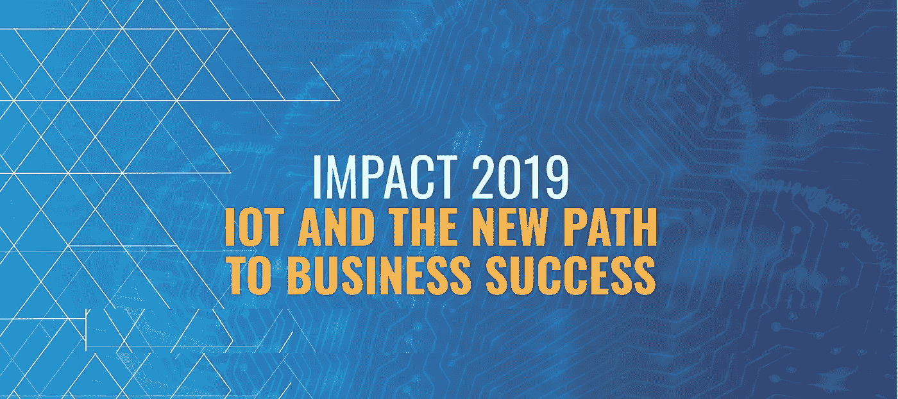
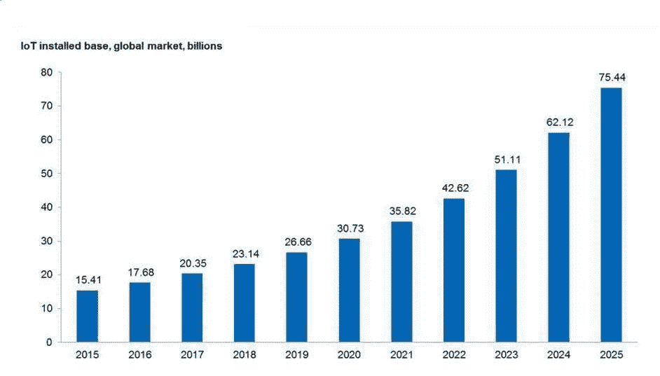
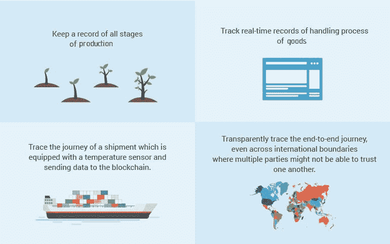
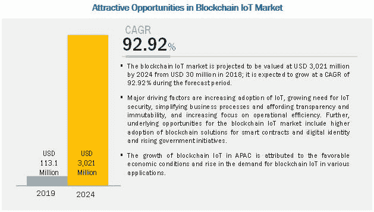
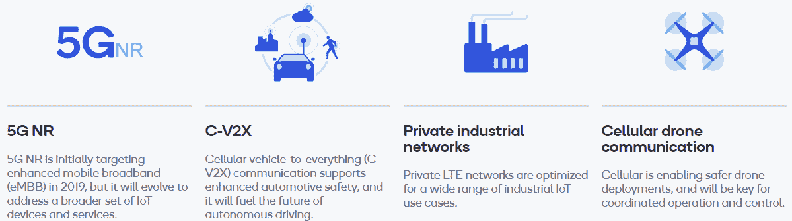

# 物联网趋势在哪些方面影响了您的业务

> 原文：<https://medium.datadriveninvestor.com/in-what-ways-iot-trends-impacting-your-business-18cd348d7ea8?source=collection_archive---------11----------------------->

物联网趋势难以捉摸，我觉得很难尝试一下。不要这么快就把你的拇指放在秤上。关于物联网趋势在企业运营中的实际应用，还有更多内容需要补充。

我对物联网趋势如何用于商业并不感到惊讶。

 [## 物联网解决方案如何改变供应链中的机遇|数据驱动型投资者

### 物联网(IoT)可能开始时规模很小，但它正在成为世界经济中的一个重要因素。事实上…

www.datadriveninvestor.com](https://www.datadriveninvestor.com/2018/11/14/how-iot-solutions-are-shifting-opportunities-in-the-supply-chain/) 

如果你了解物联网到底是什么以及它是如何工作的，你可能会想到无线耳机、智能电视或智能手表。我猜你们大多数人都这么想。所以，我们对什么是物联网(IoT)设备有一个大致的概念。也许你目前正在使用一个。但让我明确告诉你，电视和互联网设备只是物联网趋势的一小部分。

> 据《福布斯》报道，“物联网趋势背后的目标是创建智能企业，共同努力提高运营效率，实现新的商业模式，并创造更好的客户体验。”

由于物联网趋势，现在可以将工业机器变成物联网的一部分。因此，这些愚蠢的机器能够给你最好的数字体验，而不是以前由人类完成的任务。

***为了完成这一目标，84%的企业计划在两年内完成其物联网实施。***

***到 2020 年，物联网连接设备的数量将达到 204 亿美元，即 754.4 亿美元。***

虽然物联网趋势显然已经对企业世界产生了影响，但这种影响在未来几年只会越来越大。

让我们来看看在商业领域越来越受欢迎的物联网趋势。

## **物联网趋势#1 —区块链物联网的融合**

技术专家已经在努力让区块链物联网联盟在许多方面对企业有用。根据塔塔咨询服务公司(TCS)共享的资源，区块链物联网融合带来了四倍的好处。

*   降低应用构建的成本
*   扩展并提高了安全性
*   更安全、更快速的数据交换
*   数字交易中的信任建立

当我们等待区块链物联网的更多改进时，您可以使用物联网设备来保护您的业务。是的，IoE(万物互联)的概念将在缺乏全球意识的情况下形成。在未来几年，它将成为物联网趋势的最佳部分，将为机器、物体和人类提供唯一的标识符，并提供在分散网络中传输数据的能力。

> 例如，[**【BICS】(全球通信推动者和国际运营商)**](https://www.lightreading.com/iot/iot-strategies/bics-is-building-a-global-iot-business-/d/d-id/753249) 通过利用可放置在滑板车、智能手表等中的智能芯片和 SIM 卡的力量，构建全球物联网业务。无论产品在哪个国家销售，都要跟踪部件的性能。

**让我们看看它在现实世界中是如何工作的:**

> **Markets And Markets 预测，区块链物联网市场将在 2019 年赚 1.131 亿美元，到 2024 年赚 30.21 亿美元。**

因此，这是影响整个业务链的有影响力的物联网趋势之一。

您还可以通过区块链物联网实施加密和适当的保护来提高您的业务生产率、安全性和真实性。无论您拥有何种业务类型，区块链物联网集成流程都相当透明和简单。

你可以雇佣区块链的开发者来实现你的想法，这样你就可以将区块链的物联网趋势成功应用到你的业务中。

## **物联网趋势#2** **— AIoT 商业行业的未来**

在未来的物联网趋势中，我们将看到从销售产品到广告服务的商业活动的更多势头，所有这些都将通过支持人工智能的物联网设备成为可能。行业中的许多大牌都在构建更高效的人工智能和物联网设备。

考虑一下像[奔驰 E 级](https://www.mercedes-benz.com/en/vehicles/passenger-cars/e-class/the-new-e-class-the-most-intelligent-business-saloon/?csref=_sm:in_e-class-_ytb_pc)这样的豪华车，它具有自动驾驶、准确预测交通模式、安全地将乘客带到目的地等功能。

人工智能将在两个不同的层面上改变物联网。首先，它将把智能应用到配备传感器的设备上。其次，人工智能将用于实时或批量分析数据流。

人工智能和物联网趋势只会增加自动化，不仅管理设备本身，还用于分析数据、市场趋势以及在物联网设备的整个生命周期中保护数据。

> **物联网安全负责人 Bodil Josefsson 表示— *“物联网的趋势不仅在于自动化，也在于保护它们。”***
> 
> **据报道，物联网趋势和 AI together (AIoT)将对多个行业垂直领域产生重大影响，并将引领工业 4.0 革命。**

考虑一个将每一帧发送给物联网系统进行验证的摄像机。通过将 AI 应用于相机，它将仅在检测到对象时发送帧进行验证。这将改善相机 CPU 的处理过程，并节省 CPU 处理每张图像所消耗的时间。

受益于物联网趋势和人工智能的另一个领域是工业企业的制造业。不同的制造过程可以通过人工智能来控制，包括客户细分、产品质量分析以及用智能数据处理平衡生产策略的过程。

**总部位于新加坡的 NCS 集团(NCS Pte Ltd)** 将带来一个新的物联网平台 [NCS 的 unifAI](https://www.ncs.com.sg/unifai) ，该平台内置人工智能，允许用户通过联网的物联网设备接收关于当前趋势和对象的更新和见解。

同样，人工智能和物联网趋势将影响从航空到汽车、医疗保健、金融、制造等各个行业。你也可以通过人工智能和机器学习开发者的帮助，为你的业务添加人工智能和物联网功能。

## **物联网趋势之三——云计算 AIoT 的一部分**

AI 和 IoT 的致命结合给我们带来了很多创新的东西。为了完成 AIoT 的过程，我们还需要看看物联网和云计算等连接系统。

物联网趋势#3 通过促进企业远程存储和访问数据来实现更好的协作，以便在业务项目中毫不延迟地实施。

云计算将成为 2019 年最重要的物联网趋势，为我们提供了物联网连接系统的五个关键方面。

> **数据收集:**云技术从设备收集[遥测数据](https://en.wikipedia.org/wiki/Telemetry)，并将数据发送到中央位置。
> 
> **数据存储:**收集的数据将被存储在[可扩展存储系统](https://www.intel.com/content/www/us/en/storage/vmware-storage-white-paper.html)中，以供进一步处理。
> 
> **处理:**云使能的[大数据平台](https://www.nist.gov/sites/default/files/documents/itl/ssd/is/NIST-BD-Platforms-01-Pednault-BigData-NIST.pdf)现在用于处理遥测数据集。
> 
> **分析:**现在将通过[数据可视化器](https://docs.microsoft.com/en-us/azure/azure-monitor/visualizations)分析来自遥测数据集的见解。
> 
> **数据控制:**程序员和工程师现在将根据大数据系统发送的建议来控制物联网设备。

云计算和物联网为您提供数据收集、存储、处理、分析和控制的能力，从而降低设置防火墙、交换机、服务器和硬件系统的总成本。

即使发生洪水、火灾等灾难，云计算也能让您的业务保持运行。在不丢失数据的情况下，您可以保持业务正常运行，员工可以不受任何干扰地工作。

企业不需要担心持续的数据维护、更新和管理流程，因为所有这些都可以通过云和物联网系统简化。目标是专注于核心业务活动。

云和物联网致力于遥测数据的模式，允许企业根据数据采取适当的行动。

更进一步，AI 会通过分析数据自动采取行动，成为整个过程的大脑。联系行业内最优秀的软件开发人员，设计和开发基于物联网和云计算的企业级软件解决方案。

## **物联网趋势# 4–5G 和物联网为企业带来更大转变**

[高通的 5G 物联网](https://www.qualcomm.com/invention/5g/internet-of-things)创新预计将通过广泛的物联网设备、应用、传感器和物体的统一连接，极大地惠及下一代。事实上，我们将很快在各种物联网设备上看到大规模的 5G 部署。

> **这一切都是为了将我们的移动服务扩展到新的物联网服务，如 C-V2X(蜂窝车辆连接一切)、面向工业客户的专用 LTE 网络、蜂窝无人机系统以及面向快速响应宽带体验的 5G NR。**

为什么 5G 是物联网趋势中最令人期待的技术之一？是因为 5G 有潜力改变整个商业世界。在未来几年，你可以将 5G 视为一种下一代连接，这是 4G 或更早的 3G 和 2G 技术无法实现的。换句话说，5G 和物联网的结合将开辟新的方式来为各种物联网设备提供服务。

谈到 5G 和物联网，企业管理和改善的连接只是一个开始。来自设施管理和制造的公司将发现 5G 支持的物联网传感器比以往任何时候都更有效、更具成本效益。这些传感器可以安装在任何产品、物体、车辆、移动原材料和许多其他东西上。这意味着企业可以完全跟踪他们的供应链、出租车等。借助 5G 数据和物联网设备。

因此，在很多方面， [5G 和物联网](https://www.rcrwireless.com/20190807/5g/how-will-5g-iot-small-cells-support-enterprise)都将改变企业。这只是 5G 时代的开始，要了解它的全部影响，请雇用物联网开发人员，或者你可以加入[论坛](https://forums.digitalspy.com/discussion/2292479/5g-discussion)，与从事物联网项目的 5G 行业专家交谈。

## **下一步是什么？**

仅此而已！您将看到更多关于物联网趋势及其在商业领域发展势头的信息。我可以肯定地说，对于所有寻求采用物联网生态系统的开发者、企业和公司来说，2021 年将是最令人兴奋的一年。除了连接性，物联网还让公司有机会打造更像样的产品和设备。

很快，您将在零售、营销、银行和计算领域看到物联网，因为数据生成、收集、分析和数据通信、集成是物联网生态系统的支柱。欲了解更多信息，请联系 PIM 解决方案提供商 Syncrasy Tech 和物联网开发公司。