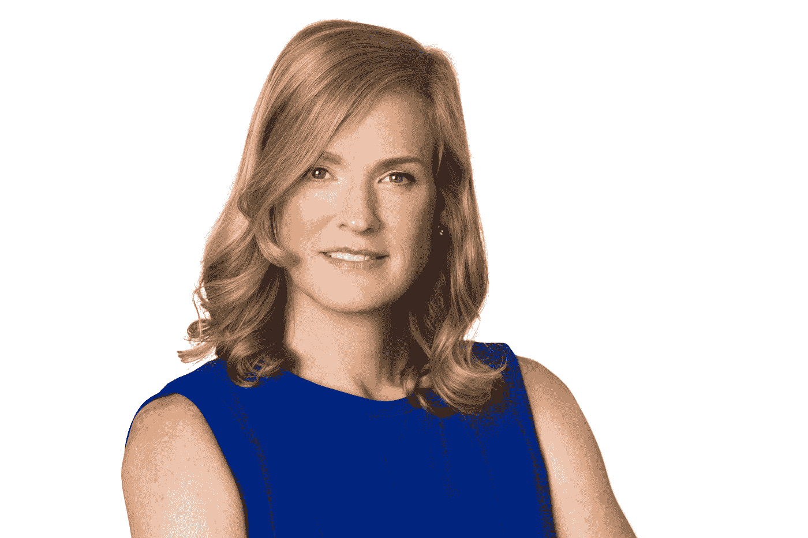
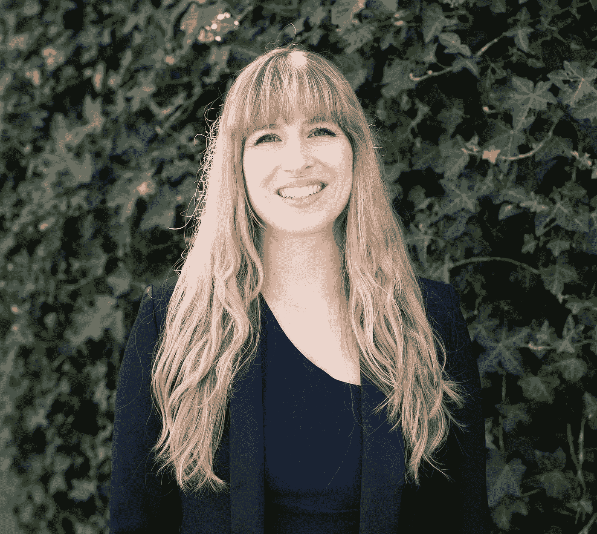
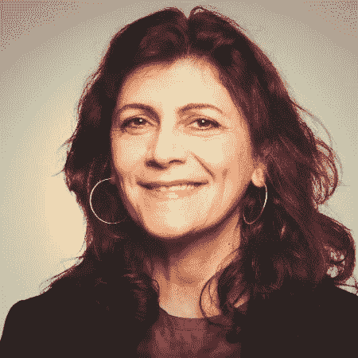
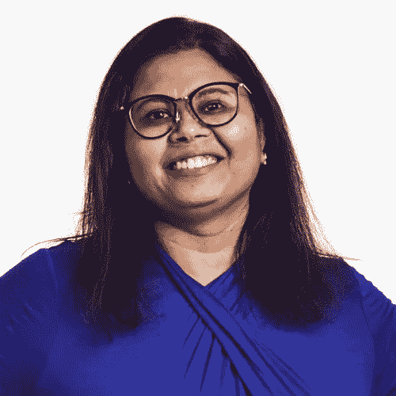
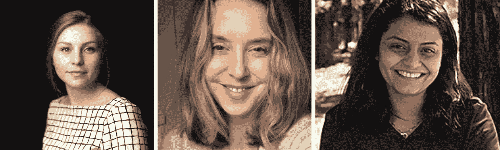

# 首届人工智能女性伦理峰会

> 原文：<https://medium.datadriveninvestor.com/inaugural-women-in-ai-ethics-summit-5440bd59da45?source=collection_archive---------13----------------------->

## 当你把 30 个为 AI 争取人权的女性集合在一起会发生什么？

Source: [pixabay.com](https://pixabay.com/en/network-earth-block-chain-globe-3885328/)

我们已经看到太多人工智能(AI)系统基于种族、性别或其他受保护的数据类别做出有害决定或建议的例子(例如，[刑事判决](https://www.propublica.org/article/machine-bias-risk-assessments-in-criminal-sentencing)、[利率](https://www.whitecase.com/publications/insight/algorithms-and-bias-what-lenders-need-know)、[预测性警务](https://link.springer.com/article/10.1007/s11292-016-9272-0)、[借贷应用](https://www.npr.org/sections/alltechconsidered/2017/03/31/521946210/will-using-artificial-intelligence-to-make-loans-trade-one-kind-of-bias-for-anot)、[打车服务](https://www.washingtonpost.com/news/wonk/wp/2016/03/10/uber-seems-to-offer-better-service-in-areas-with-more-white-people-that-raises-some-tough-questions/?utm_term=.92704181f4c7)、 [AI 助手](https://www.technologyreview.com/s/608619/ai-programs-are-learning-to-exclude-some-african-american-voices/))。我们越来越多地看到美国、丹麦、中国和其他地方的政府使用人工智能来决定刑事判决、谁获得医疗福利、哪些孩子最有可能被虐待、哪些孩子有资格获得学校、工作和政府合同，慢慢地走向“独裁”(由算法统治)。人工智能偏见和伤害的原因是复杂的和多因素的，但有一个庞大的妇女群体在为之奋斗

2018 年 12 月 19 日，来自科技公司(例如，Salesforce、Workday、英特尔、IBM、谷歌、亚马逊、Socos Labs)、非营利组织(例如，Markkula Center for Applied Ethics、Omidyar Network、AI4All、斯坦福大学全球数字政策孵化器、BSR)和分析师(Altimeter)的 25 名女性聚集一天，分享她们的经验和见解，并为我们面临的巨大挑战集思广益。

> “我所知道的每一场社会正义运动都来自于人们坐在小团体中，讲述他们的生活故事，并发现其他人也有类似的经历。”格洛丽亚·斯泰纳姆

# 站在巨人的肩膀上

这一天以一系列闪电谈话开始，与小组分享其他人可以在自己的工作中利用的实践经验。我做了一个演讲，分享了我在 Salesforce 道德人工智能实践架构师这个新职位上学到的经验。

Photo Credit: Scott R Kline

# [Vivienne Ming，](https://www.linkedin.com/in/vivienneming/) Socos Labs (@neuraltheory)

明博士在*《卫报》* 的采访中谈到了[最近强调的许多主题。她分享了她和其他人如何致力于开发人工智能(例如，治疗糖尿病，预测双相抑郁)，但这总是伴随着**可怕而复杂的伦理问题**。比如。用她的话说，*“技术只是工具。总的来说，这是一个了不起的工具，对世界产生了深远的积极影响。但是* ***它只能反过来反映我们的价值观*** *。…看似无害的技术可能会产生令人惊讶的负面影响，例如不平等、俘获效应和社交网络的不稳定性。最后，技术永远不应该只是让我们感觉良好或让我们轻松度过一天；它必须永远挑战我们。当我们关掉科技时，我们应该比开启科技时更好。*](https://www.theguardian.com/technology/2018/dec/07/technologist-vivienne-ming-ai-inequality-silicon-valley)

> *“哀为善易；这是人工智能-这不是-不好，这是困难的。”—维维安·明，索科斯实验室*

**

# *苔丝·波斯纳*

*我们得到了 Tess 在技术事件的意外后果[演讲的个性化版本。她分享了一些关于多样性危机多重来源的令人失望的统计数据，包括 Element AI (2018)、NSF Science&Engineering Indicators(2018)、Kapor、ASU、Pivotal Ventures 和 AI Index。](https://youtu.be/9zony2pjNes)*

*   *全球 12%的 **女性**是人工智能研究人员*
*   ***人工智能职位**的申请者中有 71% **为**男性*****
*   *在美国，7%的有色人种女性拥有计算机科学学士学位*
*   *在高等教育机构中，近 80%的人工智能教师是男性*
*   *美国 60%的 K-12 学校甚至根本没有计算机科学*

*[AI4All](http://ai-4-all.org/) 希望通过扩大多元化渠道、提高对人工智能教育的认识和获取途径，以及为良好的应用开展人工智能研究来改变这一局面。*

> *“现在有一场多样性危机，而且迫在眉睫。” —苔丝·波斯纳，AI4All*

**

# *圣克拉拉大学马库拉应用伦理学中心的伊琳娜·莱库*

*我看到了 Irina 在上个月举行的[Partnership on AI(PAI)](https://www.partnershiponai.org)All Partners 会议上做的一个简短发言，我很喜欢，但是时间过得太快了，我们没有机会提问，但是在峰会上却不是这样！她谈到了“无人工智能区”的必要性。“关于什么算法能比人类做得‘更好’，公众的讨论充满了炒作和误导。在人类生活中，有没有一些问题或领域，自动化决策不但没有帮助，反而可能会带来更多伤害？ *如果是，这些可能是什么，我们应该如何改进对话？”潜在领域:育儿、人际关系、宗教/信仰。**

> *“算法不能用来决定社会规范。” —马库拉应用伦理学中心的 Irina Raicu*

**

# *[Susan Etlinger](https://www.linkedin.com/in/susanetlinger/) ，高度计组(@setlinger)*

*苏珊最近出版了一本[人工智能成熟剧本](https://www.prophet.com/2018/12/the-ai-maturity-playbook/)，与我们分享了[2019 年值得关注的五大人工智能趋势](https://www.linkedin.com/pulse/five-ai-trends-watch-2019-susan-etlinger/):*

1.  ***我们如何互动:**从屏幕到感官*
2.  *我们如何决定:从商业规则到概率*
3.  ***我们如何创新:**从数据分析到数据科学再到数据工程*
4.  ***我们如何领导:**从专业知识驱动到数据驱动*
5.  ***我们如何行动:**从“快速行动，打破常规”到“道德人工智能”*

*她还预测了 2019 年的三种可能结果:*

1.  ***跳鲨:** *“受微软、Salesforce、IBM 和其他公司的启发，更多公司发布人工智能伦理原则——但仅此而已。代替实际进步的美德信号会滋生行业和媒体的冷嘲热讽以及不可避免的反弹。”**
2.  ***半措:** *“遮羞布。一些公司、非营利组织和学术机构承担了人工智能伦理的重任，公司采用了他们的框架和工具。发生的不多，但感觉是进步。每个人都宣布胜利，什么都没有改变。”**
3.  ***【The Big Dig】**:*“2018 年被证明是人工智能走向伦理的真正进展的转折点。像微软、IBM 和英特尔这样的公司扩大人工智能的规模，并提供其他企业采用的可访问、有用的框架，以及来自 AINow、麻省理工学院和其他公司的框架。”**

> *“我们还没有完成——还差得远呢。公布道德准则和组建道德团队是良好的第一步。在新闻发布会上看起来棒极了。但这是真正的工作开始的地方。” — Susan Etlinger，高度计组*

**

# *IBM 的 Priya Vijayarajendran*

*词汇一直是人工智能伦理世界讨论的话题。像“公平”、“偏见”、“透明”和“道德”这样的词对不同的人有不同的含义。Priya 强调了两个概念之间的区别，这两个概念在讨论人工智能公平性或偏见检查工具时很重要:*

*   ***公平性度量**:这些可以用来*检查*在机器学习工作流程中的偏差。*
*   ***偏见缓解器**:一旦发现工作流程中的*偏见，这些*会克服偏见，以产生更公平的结果。***

*IBM 有一套令人印象深刻的开源人工智能公平资源([人工智能公平 360 开源工具包](https://aif360.mybluemix.net/))，包括检查偏见和克服偏见的工具。然而，仅有工具是不够的。****“AI 不仅仅是技术问题。”我们必须改变组织内部的激励结构。大多数盈利性公司根据收入、点击量、用户采用率等来激励员工。，这可能不利于做出困难但合乎道德的决定。作为一个小组，我们讨论了这些可能会是什么样子(例如，由于担心社会影响而取消项目时的奖励，销售代表发现可能违反公司价值观的潜在客户时的奖励)。*****

> **“我们需要在系统中投入更多的人力。” — Priya Vijayarajendran，IBM**

****

# **[克洛伊·奥蒂奥](https://www.linkedin.com/in/chloeautio/)(@ ChloeAutio)[希瑟·帕特森](https://www.linkedin.com/in/heather-m-patterson-7bb57783/)(@ h2pi)&[伊曼·萨利赫](https://www.linkedin.com/in/imansaleh-phd/)(@伊曼 _ 萨利赫)、英特尔**

**克洛伊代表她的两个同事，希瑟和伊曼，他们不幸生病了。他们分享了一些将人工智能道德融入产品生命周期的最佳实践，以及一些通过检测和修复偏见来确保人工智能公平的工具和能力。**

*   ****引起整个组织领导层的兴趣和关注****
*   **将人类故事置于更广阔的背景中**
*   **个性化信息技术:为一系列特定的道德问题的优先排序提供一个案例**
*   **决定愿景并规划出成功之路**
*   ****先和信任的同事测试**，然后迭代**

**英特尔为数据科学家和非数据科学家提供了许多人工智能伦理课程。随后，小组成员讨论了如何使培训课程更具吸引力，并可通过(例如，现有知识、学习方式、时间、地点)获得。如何知道某人是否保留了培训并正在应用它(即，课程的影响是什么)？**

> **“我预计劳动力开发、招聘、多元化和包容性团队、数据科学家和产品团队将更加紧密地合作，以确定偏见进入数据系统的领域，并提高产品质量。”-克洛伊·奥蒂奥，英特尔**

# **推动组织变革**

**一天结束时，大家头脑风暴了几个想法，都是关于人们可能推动组织变革的潜在方式。并不是所有的方法对所有的组织都有意义，或者应该一次尝试所有的方法，但是这是一个很好的获取想法的列表！**

*   ****机密员工调查**确定进展顺利和不顺利的团队/区域。在这些团队中，什么是有效的，什么是无效的？**
*   ****根据公司价值观或道德原则**来衡量行为，而不是“道德”，并且要清楚你的词汇，这样每个人都在使用相同的衡量标准。**
*   ****确定解决道德问题如何影响底线****
*   **在项目开始时写一份新闻稿和常见问题解答，想象好的和坏的情况。帮助团队理解他们正在构建的东西对人类和社会的影响。**
*   ****进行道德预判和后判**以识别潜在的意外后果和用例，以及如何减轻它们**
*   ****倡导为个人贡献者提供向董事会成员展示的机会****
*   ****创建合乎道德的** [**红色团队**](https://en.wikipedia.org/wiki/Red_team) 来识别意想不到的后果或用例，因为太靠近项目/产品的团队成员可能看不到它们。像对待安全漏洞一样优先对待道德漏洞。如果没有足够的资源来创建一个专门的团队，那么在每个版本中，团队成员轮流扮演顾问的角色。**
*   ****让一名高管发起道德努力**(例如培训、红队)并向整个公司传达他们的支持**

> **“当我是公司中唯一一个处理这些问题的人时，我会感到孤立，但现在我有了一个可以求助的社区。我并不孤单。我们可以一起做这件事！”—峰会成员**

**我对第一届人工智能女性伦理峰会的进展感到非常高兴，我期待着更多的会议。如果你想参加未来的 AI 伦理峰会，请让 [me](mailto:kbxter@salesforce.com) 知道！**

> **“脑子累但心满！”—峰会成员**

# **感谢**

**特别感谢 Lighthouse 的 [Mia Dand](https://www.linkedin.com/in/miadand/) 提高了大家对人工智能伦理领域[杰出女性的认识](https://becominghuman.ai/100-brilliant-women-in-ai-ethics-to-follow-in-2019-and-beyond-92f467aa6232)以及 Workday 的伦理人工智能总监 [Danielle Cass](https://www.linkedin.com/in/cassdanielle/) 建议举办此次活动并招募了许多杰出女性！感谢所有加入我们分享她们的想法、经验、能量和光明的女性！**

*   **米歇尔·卡尼，亚马逊音乐**
*   **奥米迪亚网络的卡纳·哈蒙**
*   **汉娜·达恩顿，BSR(企业社会责任)**
*   **艾米莉·威特，销售人员**
*   **索科斯实验室的布尔布·古普塔**
*   **Shannon Vallor，圣克拉拉大学马库拉应用伦理学中心**
*   **Roya Pakzad，斯坦福全球数字政策孵化器**
*   **艾莉森·伍德拉夫，谷歌**
*   **汉娜·达恩顿，BSR**
*   **芭芭拉·科斯格罗维，工作日**
*   **凯瑟琳·比尔斯，Salesforce.org**
*   **亚凯拉·努内斯，销售力量**
*   **Susan Etlinger，高度计组**
*   **克洛伊·奥蒂欧，英特尔**
*   **伊曼·萨利赫，英特尔**
*   **英特尔公司希瑟·m·帕特森**
*   **苔丝·波斯纳**
*   **Priya Vijayarajendran，IBM**
*   **Irina Raicu，圣克拉拉大学马库拉应用伦理学中心**
*   **维维安·明，索科斯实验室**
*   **米娅·丹德，Lighthouse3.com**
*   **丹妮尔·卡斯，工作日**

***感谢* [*蒂芙尼 Testo*](https://www.linkedin.com/in/tiffany-testo/) *的所有反馈！***