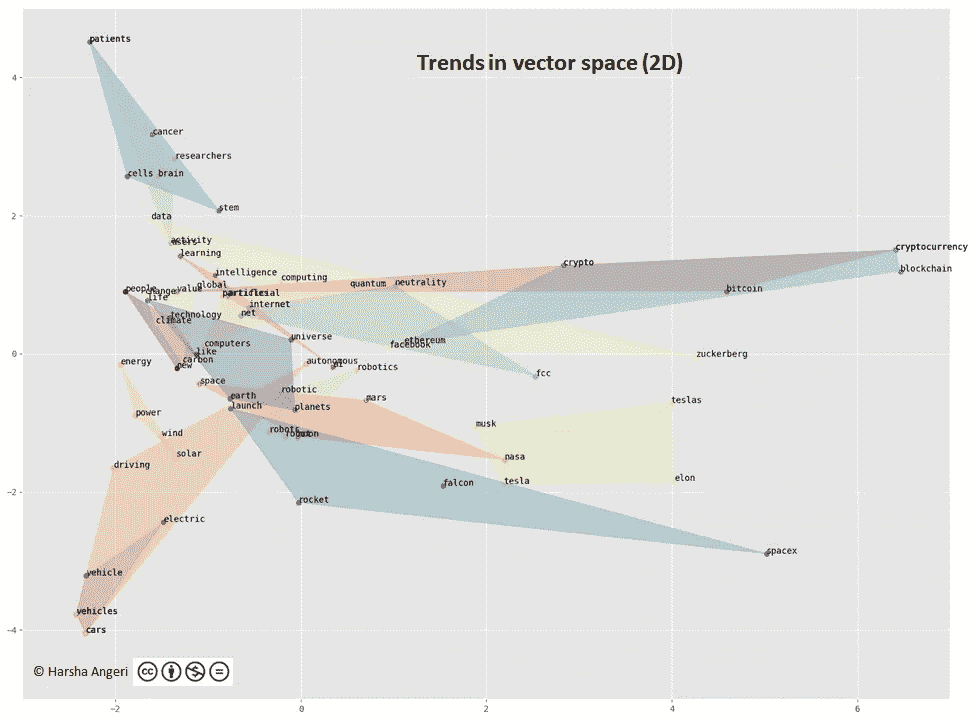
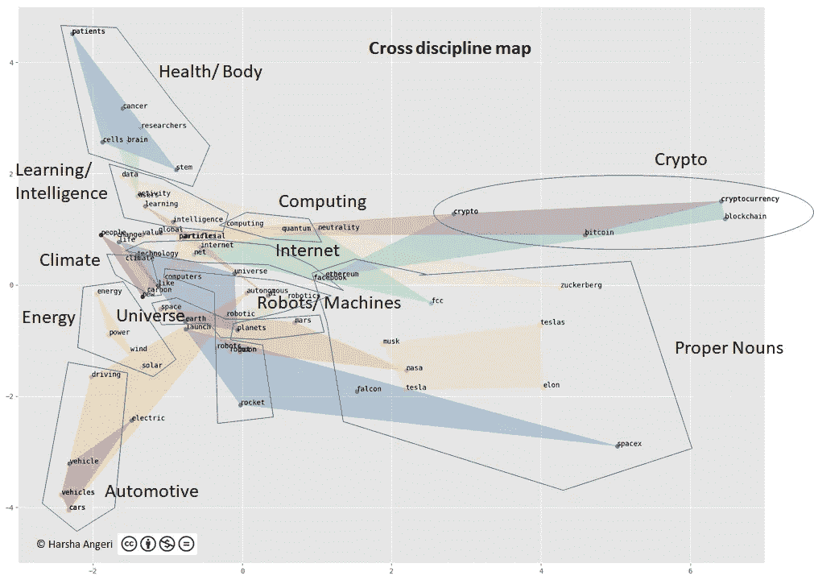
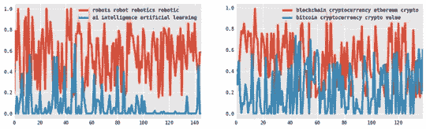
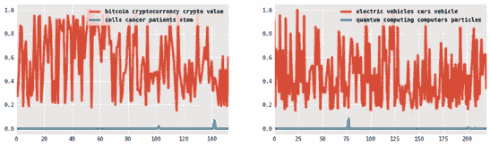
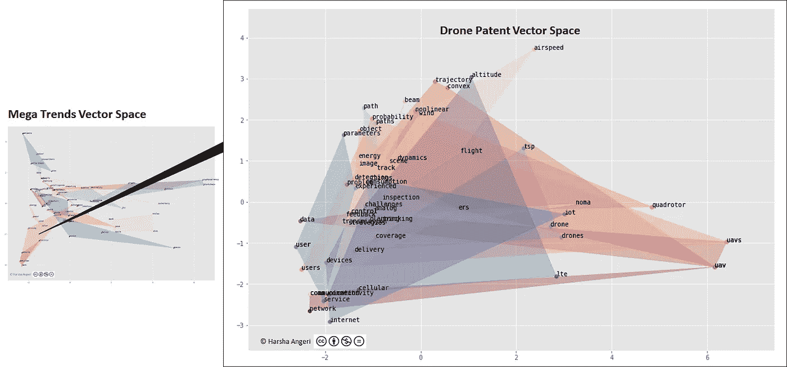

# 盗梦空间:人工智能理解大趋势

> 原文：<https://medium.datadriveninvestor.com/inception-ai-understands-mega-trends-e3f0ce19ea1f?source=collection_archive---------6----------------------->

谁做的？

我们的人工智能(AI)机器被训练成通过理解相当大的文档语料库来“清理生活”([AI to De-cluster Life](https://medium.com/datadriveninvestor/ai-to-de-clutter-life-fc9c11d84776))。在这种情况下，机器被训练来识别大趋势并提供关于它的见解。

**它是怎么做到的？**

这台机器从各种来源接收了 1000 多篇关于未来和技术的文章。机器“读取”文档，创建自己的语言模型，并使用它将每个文档转换为向量。然后，魔术恰好识别对话并提供见解。

**它发现了什么？**

最大的趋势如下所示(图 1)

Figure 1 — Mega Trends

机器原始解释(衍生出 18 种趋势)在左边，快速浏览一下就会告诉你它们代表什么。为了方便起见，我(人类)在右手边为您解释了相同的内容。

这是一台通过阅读文章自动解密的机器，人类看到的最大趋势是人工智能，太空旅行，自动驾驶汽车，可再生能源，癌症和大脑研究等等。它甚至区分了电动汽车和自动驾驶汽车。要重申机器的辨别能力，请注意它明白比特币和区块链是不同的趋势。

**了解的深度是多少？**

机器将每一份文件转换成一个向量，并在 2000 维空间中想象它。为了简化理解，下面(图 2)是一个二维(2D)图表，其中多维度减少到 2。轴没有标签，因为这是一个维度缩减图。

Figure 2

在该图中，趋势词(每个 4 个)被绘制在向量空间中。每个多边形代表一种趋势，这是由机器连接代表趋势的单词自动生成的(例如:能源、风能、太阳能——4 个单词连接成一个多边形)

深度可见于词的共位。与健康相关的所有方面，如癌症、大脑、干细胞等都位于左上角，而与太阳能、风能等能源相关的所有方面都位于同一位置。

如前所述，它区分了像比特币和区块链这样的细微差别，尽管相关是独立的趋势，这可以在上面的图表中看到，它们位于同一空间，但在邻域中是明显不同的点。

这种理解让机器能够提供很多有趣的见解。

**什么见解？**

这是我们谈论的事情&被教导过，但是现在你可以想象。我们的机器会自动识别顶级趋势，并意识到创新是跨学科的(汽车+机器人=自动驾驶汽车)

每个学科都被自动理解并组合在一起，因此相交的多边形是跨工程/医学学科的。

下面的图 3 显示了这一方面。

Figure 3

有趣的是观察到所有的专有名词都被组合在一起。啊哈…机器在告诉我们当今世界“人是趋势”。我称之为“不寻常的洞察力”,这就是它令人震惊的地方。今天，埃隆·马斯克是一种趋势，马克·扎克伯格是一种趋势，如果你想一想，趋势是围绕特定领域的人、研究、投资、创业等的势头。埃隆·马斯克(Elon Musk)已经开放了私人太空旅行和电动汽车。他是趋势，是趋势向量空间的关键锚点。

机器现在可以在向量空间中游戏，并且理解更多。哪些趋势是一致的，哪些不是？下面是趋势的交叉列表(图 4)

Figure 4

为了了解每个彩色方框的含义，我们来举几个例子。作为人类，我们知道区块链源于最初的比特币概念，并发展成为一种趋势。机器知道吗？参见图 5(右侧)以及机器如何看待这两种趋势的接近程度。

让我们来看看人工智能和机器人技术，它们经常被互换使用。它们是不同的趋势(图 5 左侧),但密切相关。

机器理解一些趋势没有太多共同点的推论。参见下面的图 6，其中癌症研究和比特币似乎没有太多共同点，量子计算在电动汽车中的用例似乎也没有被谈论太多。

问题是这些是产品/市场机会吗？

向量空间中那些空的空间呢？那里需要什么样的创新？有哪些多边形缺失，可以构建？

如你所想让我给你提供一些令人难以置信的东西:-)

取一个趋势多边形，递归地深入到向量空间。例如，自动驾驶汽车可以在地面上(例如:自动驾驶汽车)，也可以在太空中(例如:飞行出租车、无人机)。无人机可以有一个市场和技术的向量空间。第 n 层递归会是什么样子？下面是基于专利的无人机技术向量空间。向量空间中的向量空间中的向量空间等等……***盗梦空间*** 。

Inception

注意:有兴趣在其组织/产品中利用上述知识产权的公司可以通过 [Linkedin](https://www.linkedin.com/in/harshaangeri/) 联系