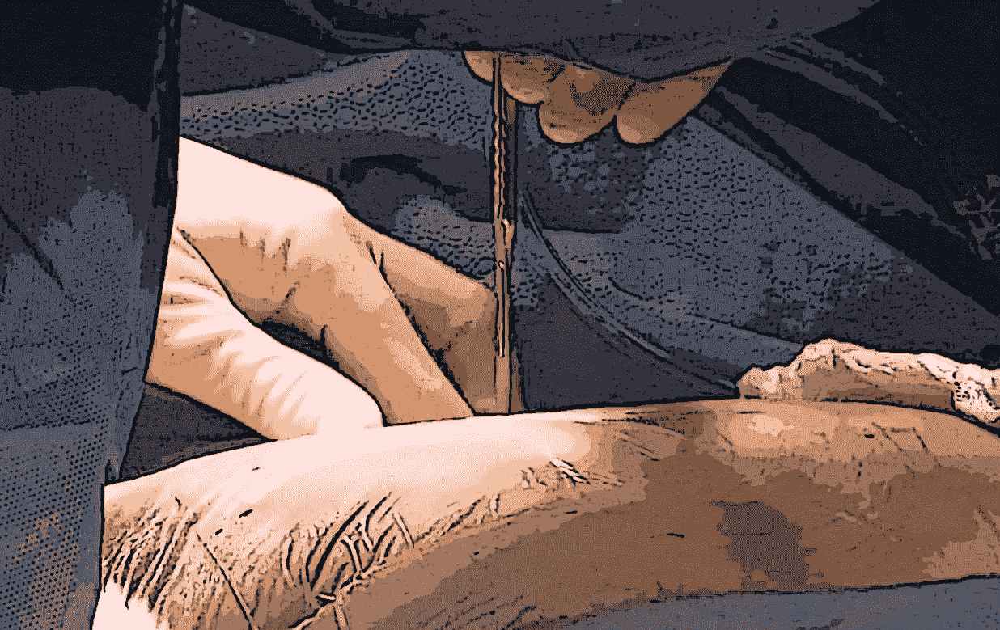

# 收入保障也是一个程序！

> 原文：<https://medium.datadriveninvestor.com/income-protection-is-a-procedure-too-d27a4e5ab354?source=collection_archive---------2----------------------->

For everything in this life, there is a beginning.

作为一名三年级的医学生，我清楚地记得我在手术室的第一周。能去那里我太激动了！我有点紧张。你想给你的临床导师留下深刻印象！第一个案例是一个相对简单的腹部手术。前一天晚上，我读了第三年住院医生让我读的所有东西，所有的东西。当时，这对我来说很复杂。当我第二天早上 4:30 起床时，我的想法是我永远也记不住所有的步骤。修卡……我什么都不记得了，因为护士说，“再做一次，耶灵顿。”她选择不阐明我的错误。我脑海中回荡着选择的话语。

这是我的第一个外科病例，我想我真的想成为一名心脏外科医生。我正在收缩皮肤、脂肪和肌肉(因为这是三年级医学生在外科手术中做的事情)，感觉就像永远；我一直被问题困扰着，半答半答地应付着。十足的白痴。印象很好，耶灵顿！你明天可以再做一次。耶！在一天结束的时候，大约晚上 8 点，我看起来明显不太好。我从我的第一位外科主治医生那里得到的逐字逐句的基本反馈，我拼命想让他大吃一惊……他直截了当地说，“你今天吃饭了吗？”

不，我没有。我起初没有回答，这位外科医生，我那天的教授，只是轻轻地摇了摇头。对于那些不认识我的人来说，我生性啰嗦，那一刻我是最自然的自己……我筋疲力尽，感到沮丧和饥饿，所以没有进一步的麻烦，完全没有高度皮层过滤，我脱口而出，“怎么会有人记得每一个步骤和顺序，你已经做了所有的……那个……东西？”作为一名大学英语专业的学生，当他捧腹大笑时，我对“stuff”这个词的使用一定让他特别感动。“坐下，”他说，但感觉像是命令。我答应了。

我以为他会给我医学生对普通外科轮转的三重建议，“能吃就吃；能睡就睡，能睡就睡；永远不要弄乱胰腺。然而，他不是这么说的。转述如下:“外科手术不是一个大手术，你事先记住所有的步骤，然后执行。在每个手术中，外科医生利用数百个甚至数千个小手术的组合，以最正确的方式将每个病人连接在一起。首先是了解患者的诊断，然后是制定护理计划。”

在接下来的六个月里，我会尽可能多地去做手术，但更多的时候，我没有参加手术，而是站在手术台上观察。我爱上了麻醉学；我找到了自己的医学之路。但那位外科医生的建议从未离开过我。麻醉，尽管表面上看起来复杂而神秘，但它只不过是一系列小步骤，所有这些步骤都恰当而具体地联系在一起，适用于每个病人。

毫不奇怪，医生必须拥有的基本收入保障也是如此。这是个程序。收入保障是任何人生理财计划的基石。然而，有一个主要的区别。外科手术或麻醉程序通常需要几个小时或一天的时间来完成，在这几个瞬间背后是一生的实践和经验。医生的收入保护“程序”执行了几十年，只有几分钟到几个小时的解释，通常在关键步骤之间有几年。

我们的现代医院，手术室，甚至医生的办公室都是为了减少变量和控制可以在短时间内控制的东西，以实现结果最大化。相比之下，我们的生活却不是这样。变数太多；几十年来，生活事件、孩子、年迈的父母、外力、成功和悲剧不断发生。最后，也是最重要的，我们，我们自己，我们改变了我们的生活。

对于那些三年级的医学生、住院医师、年轻的主治医师和牙科同事们，你们正在为自己的临床或研究生涯奠定基础。这些职业将跨越未来几十年，你将在生活中看到惊人的技术和变化。你们中的大多数人将在 8 到 12 年的时间里每周花费 60 到 80 个小时来学习和理解照顾病人或推动科学和医学向前发展的数以千计的步骤。然后你会花无数的时间用这样或那样的方式把你所知道的教给别人。错误是会犯的，大多是小错误或者几乎是错误。你会比其他任何形式的教学更快地从这些中学到东西。

给那些了不起的人。医学和牙科学生、住院医生和年轻同事们……你们也在为自己的个人财务生活奠定基础。你的财务生活将贯穿你在地球上的余生。你的日子将会看到生活的惊人变化，以及我们过得好的工具。你们中的大多数人在一生中会花 60-80 个小时*来学习和思考如果你知道……你可以做什么，或者应该做什么，或者会做什么，为了你自己的财务保护和安全，也为了那些你选择在这一生中去爱和负责的人的财务保护和安全。错误是会犯的，大多是小错误或者几乎是错误。你会从这些错误中吸取教训，但往往为时已晚。不幸的是，这些小错误会随着时间的推移而增长。*

在你的职业生涯中，会有太多的财务代表向你伸出援手，大谈金融游戏中令人不快的一面。少数人会教你如何做好人生财务计划的防御。很少有人会在最开始的时候陪你坐在一起，当你被自己的债务和几乎无限的潜力包围时，简单地教你如何保护你最大的资产，你的职业收入。

职业收入保障和安全以及随之而来的自然资源管理和财富积累；所有复杂的外表，对一些人来说，伟大的和不断变化的神秘；这些只不过是一系列的小步骤，以一种恰当而具体的方式联系在一起，适用于每个病人，我指的是客户，我真的指的是你。

克里斯托弗·耶灵顿博士

俄亥俄州哥伦布市

链接:[https://www.doximity.com/pub/christopher-yerington-md](https://www.doximity.com/pub/christopher-yerington-md)

链接:【https://www.linkedin.com/in/chrisyerington/ 

简介:2010 年，因残疾从临床麻醉学领域退休的耶灵顿博士将他对教学和服务他人的热爱转向了他的家庭、同事和社区。他对医疗团体和住院医师项目进行演讲和教育，让他们了解巨额伤残保险的重要性。克里斯曾就读于法学院和商学院，是一名终身学生，目前正在攻读金融证书。