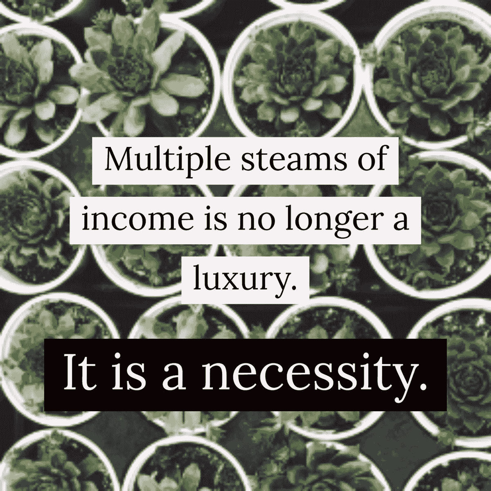

# 收入流始于滴滴

> 原文：<https://medium.datadriveninvestor.com/income-streams-start-from-drips-7ec21e042a59?source=collection_archive---------18----------------------->

## 兼职和自由职业可以减轻你的经济负担

*“不是你赚的钱。是你留着的钱*。”

这就是[沃里克·布朗](https://twitter.com/warwickabrown)的金融智慧。作为一名账户管理积极分子和顾问，他引导三种收入来源:日常工作、副业和投资。

“他们还没有赚到大钱，”他说，但他强调要做好自己的工作，尽可能地保住自己的钱。

布朗和[布里·雷诺兹](https://twitter.com/briewreynolds)与金融行业最受欢迎的专业人士之一[温妮·孙](http://winniesun.com/about/%22%20%5Ct%20%22_blank)谈论如何将金钱点滴转化为收入流。

 [## 财富的创造源于目标

### 安全的未来始于了解金钱如何为你工作

medium.com](https://medium.com/datadriveninvestor/wealth-creation-grows-from-purpose-7e375b4963c9) 

雷诺兹是 FlexJobs 公司的高级职业专家和教练。该公司手动筛选数千份远程工作，为客户带来最大的、当前合法的、专业的、无诈骗的在家工作机会。

雷诺兹说:“这些年来，我有过各种各样的收入安排，通常是全职或兼职员工工作以及与职业指导和写作相关的自由兼职项目的组合。”“在 FlexJobs，我们看到许多人有多种收入来源。很鼓舞人心。

“我们的成员通常是寻求灵活收入的人:兼职、自由职业、兼职或远程工作，”她说。“父母、学生、残疾人、数字游民、军人配偶——许多情况都需要多种灵活的收入来源。”

# 收入意味着不同的东西

同样，Sun 的许多客户有几个收入来源:日常工作和副业，如咨询工作、生活激情、非营利工作、品牌、影响者或其他媒体工作。

每位企业家都找到了创造新收入来源的不同灵感。

“很多时候，你的兴趣和现有的工作会激发新的冒险，”孙说。“这真的刺激了我们的其他项目。

“它可能开始是一滴一滴，然后慢慢变成一条小溪，”她说。“起来，磨磨蹭蹭。不知不觉中，你的收入流就会泛滥。”

 [## 做你最擅长的事，赚更多的钱

### 资金紧张时，爱好带来的收入是天赐之物

medium.com](https://medium.com/financial-strategy/earn-more-money-from-doing-what-you-do-best-b41809919dc9) 

布朗追求他的激情。

“我一直遵循我的爱好，”他说。“我以前建网站，卖摄影。我现在的公司是从创造价值的激情中诞生的，这是一种双赢的商业关系。

“从你喜欢的开始，”布朗说。"一开始可能不会有利可图，但肯定会令人满足。"

雷诺兹的其他收入与她的日常琐事密切相关。

“我热爱我的日常工作——职业指导，”她说。“我倾向于相关的项目或兼职。FlexJobs 的成员由在当前领域寻找额外工作的人和希望尝试新事物或不同事物以获得更多收入的人组成。

雷诺兹说，这些都是收入理念的好问题:

*   你希望你能更经常使用的技能是什么？
*   有哪些产品、服务等等改善了你的生活？
*   如果你不做现在的工作，你想做什么？
*   什么技能或任务对你来说很容易？
*   你梦想的工作是什么？

# 将服务与消费者匹配

“如果你的服务或商业理念是可行的，找到你的第一批顾客或客户并不困难，”孙说。

她说:“一旦你拥有了他们，就要尽你最大的努力，从他们提出的问题、他们对你服务的需求以及其他方面学习。”"为了增加你的客户和建立你的观众群，要清楚地了解你服务的对象."

 [## 脸书营销是一个迷宫

### 这个社交媒体巨头已经为社区建设做好了准备

blog.markgrowth.com](https://blog.markgrowth.com/facebook-marketing-is-a-maze-ing-abfe0961a107) 

布朗建议创建一个脸书主页。

“在你的网站上安装 pixel，”他说。“上传你的电子邮件列表或 LinkedIn 联系人，然后[自学脸书广告](https://www.facebook.com/blueprint)。其针对性之强令人震惊。当是你的流量，就便宜了。

“开一个博客，”布朗说。“学习搜索引擎优化。学习内容营销。”

[快报记者](https://twitter.com/ExpWriters)的 Julia McCoy 写了一篇文章，解释如何[创造一个搜索引擎优化友好的内容策略](https://expresswriters.com/seo-content-creation-in-2018/)来吸引你的理想客户。

“我们看到的自由职业者和兼职骗子通过几种不同的方法找到他们的客户，”雷诺兹说。“这些包括在线列表和招聘广告；以前客户的推荐；朋友、家人和熟人的推荐；从研究中获得新客户。”

平衡几项工作需要分清主次。

“当你平衡多份工作时，你需要非常有条理，”孙说。“确保不会错过重要的任务和约会。你还需要快速学会如何优先处理你的首要任务，以更好地利用你的时间。

她说:“使用一个被证明特别适合你的日历和任务系统。”

# 多重多任务处理

雷诺兹建议不要承担太多。

“你能处理多少场演出？”她说。“如果你刚刚开始——或者有很多其他优先事项在进行——这可能没问题。研究表明，大多数自由职业者一次有一到三份工作。51%的人同时有两到三份工作；38%的人有一个；百分之八四至五；比 6%多 3%。

“对你的时间和努力要现实一些，”雷诺兹说。“不要对客户承诺过多。学习杰出的组织和时间管理技能。做一名自由职业者或零工意味着你在经营一家企业。很多自由，但也有很多责任。”

 [## 时间管理就是说“不”

### 我们不能管理时间，但我们可以通过选择来管理项目

medium.com](https://medium.com/datadriveninvestor/time-management-is-all-about-no-423998e899b6) 

布朗的方法是一步一步来。

“描绘出你理想中的一天，”他说。“把它分成几块。然后决定如何度过你的时间，这样你就能保持专注。我用[一个 Trello 板](https://trello.com/b/I1c2c0tX/getting-things-done-template)来让我在需要做的事情上保持目标。

布朗说:“有时候你不得不对你非常想做的事情说‘T4’不。“这适用于朋友和你的骗局。有时候骗局会赢，有时候不会。确保平衡。不要太忽视人际关系，以至于当你需要它们的时候，它们却不在了。”

各种各样的技术将使受众和客户了解新的产品和服务。

孙使用电子邮件分发列表和社交媒体平台，如 Twitter、和 LinkedIn，来更新她的公司事件。

雷诺兹说:“我们看到自由职业者和兼职皮条客在拓展客户和观众方面变得非常有创意。”“时事通讯、共享的谷歌文档和电子表格、视频、社交媒体聊天——有太多便宜的方式来保持联系并随时随地与客户见面。”

布朗已经涉足人工智能，如聊天机器人。

“我真的很喜欢 ManyChat 和脸书 messenger，这是向我的名单发送报价的一种方式，”他说。“在你的网站上设置你的机器人和生长工具是免费的，也非常容易。你只需要一个脸书页面开始。

“网络研讨会也很有趣，”布朗说。“它们是现场活动的绝佳参与和精彩实践。我使用 [GetResponse](https://twitter.com/getresponse) ，它不仅非常适合电子邮件营销，还包含[一个出色的网上研讨会解决方案](https://www.getresponse.co.uk/email-marketing/gb-referral-program/refer-a-friend.html?refuid=tkEQI&s=d)。该套装物超所值。”

# 快速金融

他回忆说，不到一个小时，他就在[的 WooCommerce](https://twitter.com/WooCommerce) 和[的 WordPress](https://twitter.com/WordPress) 上建立了自己的第一个电子商务网站，其中包括在 Stipe 和 PayPal 上建立支付。

“我非常感动，”布朗说。

为了通过销售服务和产品赚取额外的钱，孙推荐了适合特定行业和一般销售的平台。它们包括 [Fiverr](https://twitter.com/fiverr) 、LinkedIn 和 [Craigslist](https://twitter.com/craigslist) 。

 [## 开始在网上做生意不是为了胆怯

### 在迈出这一步之前，要知道你将面临什么

medium.com](https://medium.com/datadriveninvestor/startcustoing-business-online-not-for-faint-of-heart-6367e4e6bc4d) 

社交媒体也有利于创造商业机会或收入。

“它实际上只是一种现代通用语言，”孙说。“你建立的关系非常有价值。随着你的分享和倾听，机会自然会找上门来。”

布朗倾向于 LinkedIn 来增加现金流。

“这是一个出色的 B2B 平台，”他说。“通过职位很容易找到可以联系的人。我喜欢它将[导向漏斗](https://blog.markgrowth.com/businesses-live-or-die-through-outreach-f2e646c0e7af)的方式——比如从 LinkedIn 到网上研讨会。花时间在那里，你会得到回报。一年的时间对我来说有了巨大的改变。”

参与仍然是社交媒体的货币。

“用它来向新客户介绍你自己，”雷诺兹说。“建立你的专业品牌和形象。找到你所在领域的其他自由职业者或客户来推销。通过富有洞察力的帖子提升你的思想领导力[。](https://www.flexjobs.com/blog/post/how-to-use-social-media-to-find-freelance-work/?platform=hootsuite)

在许多情况下，参加简单的认证课程可以带来额外的收入。

雷诺兹说:“YouTube 上有很多学习新技能的免费教程。" [LinkedIn Learning](https://twitter.com/LI_Learning) 提供了大量高质量的培训视频。想想你真正感兴趣的技能，然后从那里开始。

“没有任何证书能真正保证额外收入，但学习新技能能让你提供更多，”她说。"我们希望这能转化为更高的收入潜力。"

# 谷歌解决方案

布朗还推荐[谷歌数字车库](https://learndigital.withgoogle.com/digitalgarage)认证。

“这是一个很好的起点，”他说。“它是免费的，可以帮助你创业和发展——以及你的职业生涯。证书在纸面上看起来很棒。你可以很容易地把这变成帮助小企业的副业。”

 [## 把爱好展示变成赚钱机器

### 各种程序有助于推广您的内容

medium.com](https://medium.com/datadriveninvestor/turn-hobby-showcase-into-a-money-maker-b9f54b38aede) 

不要忽视你已经在做的可以创造额外收入机会的事情。

“如果有人有兴趣付钱给你，你就有了商机，”孙说。“关键是要真正了解你的受众，以及他们对你的商业产品或服务的兴趣。有可重复的收入吗？

“大多数行业都有一个平等的竞争环境，”她说。"只是寻找一个机会，让他人的生活变得更好，以此赚钱."

对雷诺兹来说，这意味着要问，“你能教给别人什么？你能为人们解决什么问题？教学、写作、编辑、行政等等都是很好的技能。”

布朗倾向于电子商务的收入。

“你*真的*过不了[易贝](https://twitter.com/eBay)，”他说。“我过去一个月只卖摄影作品和我不再需要的东西就能赚几百元。”

兼职或业余工作可能最终会带来经济利益，但不会立即盈利。

雷诺兹说:“我们研究了 10 份兼职的高薪工作。“这些都是每小时 25 美元或更高的报酬。这些工作包括作家、培训专家、行政助理、在线讲师、社交媒体协调员和语音测试员。

“这就是兼职工作派上用场的地方，”她说。"没有额外的通勤成本或紧张的日程安排."

# 更多的工作，更多的钱

有时候回报来得出奇的快。

布朗说:“我喜欢网上学习，并对它产生收入的速度感到震惊——大约两个星期。“我在[thinkfic](https://twitter.com/thinkific)上写了课程大纲和登录页面，举办了一次网上研讨会，并像一样销售试点课程。

“这是一个*很多*的工作，但它是*快速*钱，”他说。

孙、雷诺兹和布朗为那些对收入来源多样化感兴趣但不知道从哪里开始的人提供了一些建议。

“开始非常专心地听，”孙说。“看看你独特的才能是什么，以及它们是否有经济价值。如果你还不能解决这个问题，不要担心。专注于你的日常工作。当你准备好的时候，总有时间去追求创业之旅。

“创业很容易，维持一个企业很难，”她说。“赚钱更难。在你做好心理和经济准备之前，不要即兴发挥。”

 [## 为一生的自由职业生涯做好准备

### 自由职业者可以最大化公司的生产力

medium.com](https://medium.com/datadriveninvestor/brace-for-the-freelancing-ride-of-a-lifetime-5ae72ea07c6e) 

雷诺兹建议直接去那些倾向于雇佣自由职业者的公司，从招聘自由职业者的前 30 名公司开始。

“涉猎、修补和保持梦想，”布朗说。“我已经尝试了大概一千种不同的东西。只要不断地凿下去，直到你找到你想要*做的事情。”*

**关于作者**

吉姆·卡扎曼是拉戈金融服务公司的经理，曾在空军和联邦政府的公共事务部门工作。你可以在[推特](https://twitter.com/JKatzaman)、[脸书](https://www.facebook.com/jim.katzaman)和 [LinkedIn](https://www.linkedin.com/in/jim-katzaman-33641b21/) 上和他联系。

*原载于 2018 年 11 月 2 日*[*www.datadriveninvestor.com*](http://bit.ly/2CWoAgm)*。*