# 通过 K-最近邻+ Python 代码中的重新缩放功能，将准确度提高 10%

> 原文：<https://medium.datadriveninvestor.com/increase-10-accuracy-with-re-scaling-features-in-k-nearest-neighbors-python-code-677d28032a45?source=collection_archive---------0----------------------->

## 理解关键概念以提高 K 近邻的性能


Photo by [Siora Photography](https://unsplash.com/@siora18?utm_source=medium&utm_medium=referral) on [Unsplash](https://unsplash.com?utm_source=medium&utm_medium=referral)

这个故事是我之前关于 KNN 算法故事的*的延续。对于没有看过我之前的故事的人来说，高度评价 ***劝*** 先看，这样你就可以在这个时候跟上故事了。你可以看下面我之前的故事。*

> *[Python+超参数调优中的 K 近邻](https://medium.com/datadriveninvestor/k-nearest-neighbors-in-python-hyperparameters-tuning-716734bc557f?source=your_stories_page---------------------------)*

*KNN 是一种基于 ***距离的*** 算法，其中 KNN 根据与 K 邻居的*接近度对数据进行分类。然后，我们经常会发现我们使用的数据的特征不在同一个 ***尺度/单位*** 。一个例子是当我们有特征**时。显然这两个特征有不同的 ***单位*** ，特征年龄在 ***年*** ，身高在 ***厘米*** 。****

**[](https://www.datadriveninvestor.com/2019/02/08/machine-learning-in-finance/) [## 金融中的机器学习|数据驱动的投资者

### 在我们讲述一些机器学习金融应用之前，我们先来了解一下什么是机器学习。机器…

www.datadriveninvestor.com](https://www.datadriveninvestor.com/2019/02/08/machine-learning-in-finance/) 

此单位 ***差异*** 导致基于距离的算法(如 KNN)无法最优地执行*，因此有必要 ***重新调整具有不同单位的*** 特征的比例/单位。有许多方法可用于重缩放要素。在这个故事中，我将讨论 3 种重新缩放的方式，即 ***最小-最大缩放*** 、 ***标准缩放*** 和 ***鲁棒缩放*** 。*

1.  ***最小-最大缩放比例***

*最小-最大缩放使用特征的 ***最小值*** 和 ***最大值*** 来重新缩放某个范围内的值。具体来说，最小值-最大值计算:*

**

*Formula Min-Max Scaling*

*其中 ***x*** 为特征向量，*为特征 ***x*** 的单个元素， ***x'i*** 为重标元素。您可以通过***minmax scaler()***方法在 Scikit-Learn 中使用最小-最大缩放。**

**2.**标准缩放比例****

**与最小-最大缩放相比，另一种重缩放方法是标准缩放，其工作原理是将特征重缩放至大约 ***标准正态分布*** 。为了实现这一点，我们使用标准化来转换数据，使其具有平均值(*)0 和标准差(*)1)。****

***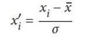***

***Formula Standard Scaling***

***其中 ***x'i*** 是我们对***【Xi】***的标准化形式，在 Scikit-Learn 中你可以使用***standard scaler()***方法。***

**3.**稳健缩放****

**本故事中要讨论的最后一种重新调整方法是鲁棒调整，它通常用于克服数据中出现的 ***异常值*** 。在这种情况下，鲁棒缩放使用 ***中值*** 和 ***四分位数范围*** 来重新缩放特征。**

**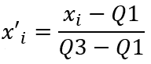**

**Formula Robust Scaling**

**其中 ***x'i*** 是我们对 ***的标准化形式 Xi******Q1***是第一个四分位数， ***Q3*** 是第三个四分位数。在 Scikit-Learn 中，我们使用***robust scaler()***方法来实现这一点。**** 

**在我们知道重缩放特征是如何工作的之后，下一步是用 Python 实现*。我将使用 Python Scikit-Learn 库。***

> ***要了解这个故事，你至少应该知道:
> 1。 [**Python**](https://www.python.org/) *中的基础编程。
> 2。* [**熊猫**](https://pandas.pydata.org/) *和*[**Numpy**](https://numpy.org/)*库为数据分析工具。
> 3。*[**Scikit-Learn**](http://kit-learn.org)*机器学习库。
> 4。* [**Jupyter 笔记本**](http://yter.org) *。****

***在 KNN 重新缩放要素的步骤如下:
1。加载**库**库
2。加载**数据集**
3。潜行峰值数据
4。标准缩放比例
5。强大的缩放功能
6。最小-最大缩放比例
7。调谐超参数***

> ***数据集和完整代码可以在我的 [**Github**](https://github.com/adiptamartulandi/Rescaling-Features) 下载，所有工作都在 Jupyter 笔记本上完成。***

> ***注:**在**重标之前，KNN 模型在所有评估指标中，包括**准确性**和 **roc 得分**都达到了 **55%** 左右。调整**超参数**后，它的性能提高到大约**的 75%** 。***

***加载这个故事中使用的所有库，包括 Pandas、Numpy 和 Scikit-Learn。***

```
*****import pandas as pd
import numpy as np****from sklearn.neighbors import KNeighborsClassifier
from sklearn.preprocessing import StandardScaler
from sklearn.preprocessing import MinMaxScaler
from sklearn.preprocessing import RobustScaler
from sklearn.metrics import accuracy_score
from sklearn.model_selection import train_test_split
from sklearn.metrics import roc_auc_score
from sklearn.model_selection import GridSearchCV****import warnings
warnings.filterwarnings('ignore')*****
```

***2 加载将在本故事中使用的数据集，即包含 303 行 14 列的 heart 数据集( [***描述数据集***](https://www.kaggle.com/ronitf/heart-disease-uci) )。***

```
****df = pd.read_csv('heart.csv')****
```

**3 潜行峰值数据，查看哪些特征与另一个特征具有不同的单位或比例。**

```
**#See top 5 data
**df.head()****
```

**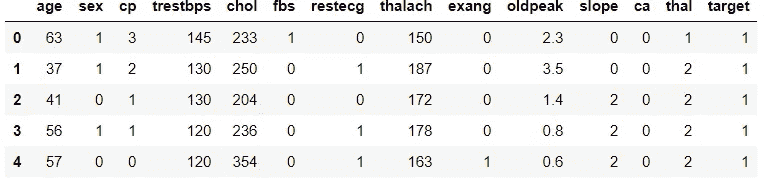**

**Top 5 Data**

*   **如你所见，有 5 个数字特征有不同的单位。分别是 ***年龄，trestbps，chol，thalach*** ，和 ***老匹克*** 。**

**4 第一次重新缩放使用 Scikit-Learn Library Standard scaler()的标准缩放。**

```
**#Create copy of dataset.
**df_model = df.copy()**#Rescaling features age, trestbps, chol, thalach, oldpeak.
**scaler = StandardScaler()****features = [['age', 'trestbps', 'chol', 'thalach', 'oldpeak']]
for feature in features:
    df_model[feature] = scaler.fit_transform(df_model[feature])**#Create KNN Object
**knn = KNeighborsClassifier()**#Create x and y variable
**x = df_model.drop(columns=['target'])
y = df_model['target']**#Split data
**x_train, x_test, y_train, y_test = train_test_split(x, y, test_size=0.2, random_state=4)**#Training the model
**knn.fit(x_train, y_train)**#Predict testing set
**y_pred = knn.predict(x_test)**#Check performance using accuracy
**print(accuracy_score(y_test, y_pred))**#Check performance using roc
**roc_auc_score(y_test, y_pred)****
```

**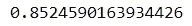**

**Accuracy Score**

**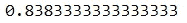**

**ROC Score**

*   **从上面的值我们可以看到，knn 模型的性能在***85%******精度*** 和***83%***ROC***左右用 **StandardScaler** 提升！*****

**5 下一步重新调整是使用**稳健调整**来处理数据中异常值的存在。**

```
**#Create copy of dataset.
**df_model = df.copy()**#Rescaling features age, trestbps, chol, thalach, oldpeak.
**scaler = RobustScaler()****features = [['age', 'trestbps', 'chol', 'thalach', 'oldpeak']]
for feature in features:
    df_model[feature] = scaler.fit_transform(df_model[feature])**#Create KNN Object
**knn = KNeighborsClassifier()**#Create x and y variable
**x = df_model.drop(columns=['target'])
y = df_model['target']**#Split data
**x_train, x_test, y_train, y_test = train_test_split(x, y, test_size=0.2, random_state=4)**#Training the model
**knn.fit(x_train, y_train)**#Predict testing set
**y_pred = knn.predict(x_test)**#Check performance using accuracy
**print(accuracy_score(y_test, y_pred))**#Check performance using roc
**roc_auc_score(y_test, y_pred)****
```

**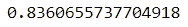**

**Accuracy Score**

**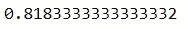**

**ROC Score**

*   **使用 ***鲁棒定标器*** 时， ***精度*** 在*83%*在*81%。其性能是 ***下的*** 标准定标器。*****

**6 最后一次重新缩放使用最小-最大缩放，使用特征的最小和最大值。**

**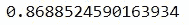**

**Accuracy Score**

**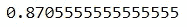**

**ROC Score**

*   **使用 ***最小最大缩放器*** 时，模型的性能在其他缩放方法中是*最高，精度*在**ROC*在 ***87%！********

**为了获得最佳性能，我使用 GridCV 来调优我的 KNN 模型的超参数。**

```
**#List Hyperparameters to tune
**leaf_size = list(range(1,50))
n_neighbors = list(range(1,30))
p=[1,2]**#convert to dictionary
**hyperparameters = dict(leaf_size=leaf_size, n_neighbors=n_neighbors, p=p)**#Making model
**clf = GridSearchCV(knn, hyperparameters, cv=10)
best_model = clf.fit(x_train,y_train)**#Best Hyperparameters Value
**print('Best leaf_size:', best_model.best_estimator_.get_params()['leaf_size'])
print('Best p:', best_model.best_estimator_.get_params()['p'])
print('Best n_neighbors:', best_model.best_estimator_.get_params()['n_neighbors'])**#Predict testing set
**y_pred = best_model.predict(x_test)**#Check performance using accuracy
**print(accuracy_score(y_test, y_pred))**#Check performance using ROC
**roc_auc_score(y_test, y_pred)****
```

**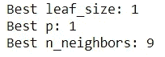**

**Best Hyperparameters Value**

**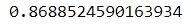**

**Accuracy Score**

**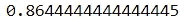**

**ROC Score**

*   **用 ***调整超参数***+**+*重新调整*** 其性能略与 ***相同*** 用 MinMaxScaling 性能 ***而不用*** 调整超参数。**

> **从我们所做的可以得出结论，基于**距离的**算法(如 KNN)的性能也受到特征的**比例/单位**的**影响。因此，重新调整特征是一种可以用来提高基于距离的算法(如 KNN)性能的方法。****

**谢谢你把这个故事看完，如果有 ***的批评*** 或者 ***的建议*** 可以马上 ***评论。*****

**参考资料:**

**[1] [卡格尔](https://www.kaggle.com/ronitf/heart-disease-uci)
【2】[克里斯·阿尔邦](https://chrisalbon.com/)**