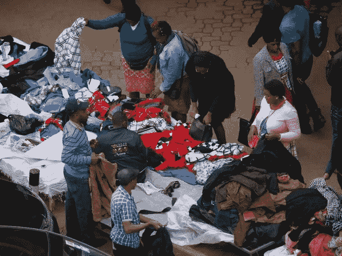

# 新兴经济体不断增长的需求

> 原文：<https://medium.datadriveninvestor.com/increasing-demand-in-an-emerging-economy-7bfc89c62606?source=collection_archive---------7----------------------->

Hawkers selling their wares within Nairobi’s Central Business District (image courtesy of Kenyan Report)

2018 年，[一项经济调查](https://www.knbs.or.ke/economic-survey-2018-launched/)发现，肯尼亚人的平均生活费为 78 美元/肯尼亚先令。一个月 7800。他们用 42 美元/Ksh 养活自己。一个月 4200，剩下的花在非食物项目上。

即使按照肯尼亚的标准，这一数额也相当低。一个人在这样的预算下在超市购物是相当有压力的；现在考虑这样一个人正在供养年迈的父母、孩子甚至(有时)配偶。

 [## 为什么包容性财富指数比 GDP 更能衡量社会进步？-数据驱动…

### 你不需要成为一个经济奇才或金融大师就能知道 GDP 的定义。即使你从未拿过 ECON 奖…

www.datadriveninvestor.com](https://www.datadriveninvestor.com/2019/03/08/why-inclusive-wealth-index-is-a-better-measure-of-societal-progress-than-gdp/) 

人们是如何靠这么少的钱生存的？

有些人存了少量的钱，然后把他们的资源集中起来购买大量的食物，并在他们之间分配，或者从从事这种活动的零售商那里购买(在肯尼亚，他们形成了通常所说的“kadogo”经济，因为当用钱交换货物时，交易量很小)。还有一些人在雇主那里存了一小笔钱，他们可以取出来用于支付学费或其他高成本支出。

一些人与他们社区的一家小零售商建立了良好的关系，要求软贷款，他们用这些贷款来赊购食品，一旦他们的月付款到位，就退还零售商。

还有一些人在月中经济吃紧时从非政府组织、富裕的亲戚、邻居和/或朋友那里接受经济援助；其他人要求雇主预支薪水，然后从他们的下一份工资单上扣回。

以上都是 5 种非常普通的金融工具的肯尼亚版本:储蓄、信贷、支付、保险和汇款。

要讨论如何刺激新兴经济体的增长，我们还需要了解和理解该经济体中普通消费者的经济和金融现实。

有一个学派通常被称为涓滴经济学，它基本上认为，当我们加强并正式形成上述所有动力时，繁荣是自动的。然而，我们必须记住，钱必须先赚后花——这是一个时间密集型的过程；还有，必须先满足基本需求，再满足投资需求。最后，如果连最基本的需求都难以满足，就很难发展和参与全球经济。

为了这次谈话的目的，我们将假设需求是新兴经济体经济增长的最终因素(即使有相反的论点)。如果我们想要增加 78 美元的收入，我们必须刺激和增加需求。我希望在新兴市场做生意的人能在他们的日常生活中找到有价值和有用的建议。

# 什么是需求？

经济学家会告诉你，需求是人们在特定时间内以不同价格购买的商品数量。单从定义来看，人们可能会把事情简单化，认为定价和时机会影响需求。然而，有无数已知和未知的因素影响着需求。

[影响个人消费者需求的 5 个关键因素](https://www.thebalance.com/five-determinants-of-demand-with-examples-and-formula-3305706)包括:

1.  商品/服务的价格
2.  消费者的可支配收入
3.  相关商品/服务的价格——补充品和替代品
4.  消费者的口味和偏好
5.  消费者对商品/服务未来市场价格的猜测

当我们观察新兴市场时，商品/服务的价格和消费者的收入往往是齐头并进的。对许多人来说，他们的收入很低，这迫使他们对价格敏感；这使得大多数企业竞相成为成本领先者并为大众服务，或者成为利基领先者并为不到 20%的人口服务。

其次，当收入较低时，消费者的品味和偏好发挥的作用不太明显。价格敏感性也将商品和服务转化为商品——当他们的总预算是 3 美元时，没有多少人会停下来考虑他们将购买什么品牌的衣服、花生酱和耳机；他们必须节约用钱，寻找便宜货。

这一原则在实践中的一个很好的例子是内罗毕的消费者如何购买女鞋。巴塔肯尼亚是该国最大的鞋店连锁店之一。小商店(俗称“展览”)储存从中国和土耳其等外国进口的鞋子，二手物品的个人进口商也清洗和出售鞋子。在一个典型的女士眼里，那些鞋子或多或少都是一样的。

看到机会；现在出现了一种特殊的展览商店，只出售 500 肯尼亚先令/ 5 美元的平底鞋。它们相当便宜，质量很低(只能持续一年)；然而，它们服务于目的(走在内罗毕粗糙的人行道上)，它们看起来很时尚，几乎和你在巴塔这样的地方找到的一样。

那么，企业能做些什么来增加本地需求并保持活力呢？

首先，他们需要通过更频繁地尝试来弄清楚市场上当前的口味和偏好——拥抱风险并保持敏捷。在企业完全投资之前，为什么不直接向目标市场销售即将推出的产品呢？这将使他们有机会实施诸如 A/B 测试之类的技术，并了解最佳价格应该是多少——购买原始研究有很长的准备时间，而现有的研究又少又旧。当目标市场在农村地区时尤其如此。此外，如果创造性地完成，它可以增加消费者对价格将快速上涨的预期，所以当场购买将是明智的。这意味着这些市场中的品牌确实需要产生“这是一个多么好的机会啊！”他们在大众市场创造的顾客体验。

其次，企业应该把他们的朋友捆绑在一个新兴市场。当补充品与商品/服务配对时，这两者有助于击退替代品的竞争。企业可以考虑建立更具战略性的合作伙伴关系，以整合领域优势，更快地扩大规模。此外，从长远来看，捆绑销售有助于降低价格敏感度。

第三，考虑更多与消费者共同创造的机会。利用大多数新兴市场社会中常见的现有集体主义，当消费者让其网络中的人使用或购买产品时，向消费者提供更小数量的共同创造产品、原始产品的折扣，甚至增加可支配收入。这将使网络效应在网上和网下都为你服务。与你的消费者建立共生关系。

最后，关注来自全球投资组合的不断增长的投资收入，以使企业拥有耐心的资金并降低风险。如果企业不能在多个国家开展业务(在这些国家投资自有资产)，可以考虑投资这些国家的债券市场。这些额外的收入有助于为更多的 R&D 提供资金，并在企业经历内部困境、淡季甚至商业周期低谷时为其提供帮助。

当我们对市场采取学习者的心态时，我们就能适应并保持控制，从而使我们能够在新兴市场发展和扩大更多业务。