# 使用 Apache Sqoop 的增量数据加载

> 原文：<https://medium.datadriveninvestor.com/incremental-data-load-using-apache-sqoop-3c259308f65c?source=collection_archive---------0----------------------->

Apache Sqoop 可以在 Hadoop 文件系统和关系数据库之间高效地传输数据。
数据可以一次全部加载到 HDFS，也可以增量加载。
在本文中，我们将探讨两种从关系数据库增量加载数据到 HDFS
(1)增量追加
(2)增量最后修改

**注:**本文假设具备 RDBMS、Sql、Hadoop、Sqoop 和 HDFS 的基础知识。
我们将从默认安装在 Hadoop 上的 MySQL 加载数据

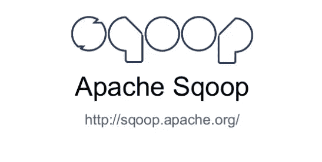

**Apache Sqoop**

为了增量加载数据，我们创建了 **sqoop 作业**，而不是运行一次性的 sqoop 脚本。
Sqoop 作业存储元数据信息，如最后值、增量模式、文件格式、输出目录等，作为增量加载数据的参考。

# **增量追加**

当源数据库表中不断增加 id(键)值的新行时，使用这种技术。

**1。创建一个样本表并用值填充它**

我们可以在下面的截图中看到股票表有三行。

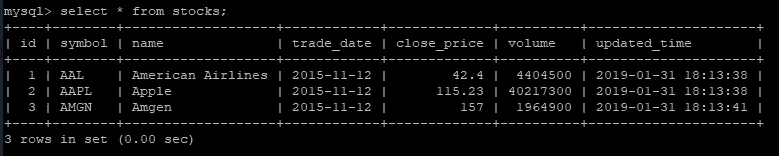

Stocks Table in MySQL

**2。授予该表的特权** 将股票表的特权授予本地主机上的所有用户

*将 test.stocks 的所有权限授予“@”localhost；*

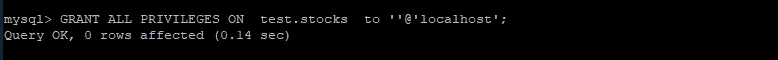

GRANT ALL PRIVILEGES ON test.stocks to ‘’@’localhost’;

**3。使用增量附加选项**创建并执行一个 Sqoop 作业

*sqoop job—create incrementalapendimportjob—import—connect JDBC:MySQL://localhost/test—用户名 root —密码 hortonworks1 —表 stocks—target-dir/user/hirw/sqoop/stocks _ append—incremental append—check-column id-m 1*

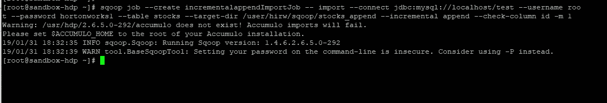

**列出 Sqoop 作业**，检查是否创建成功

*sqoop 作业—列表*

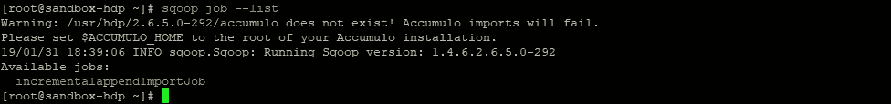

sqoop job — list

**使用显示作业选项**检查 Sqoop 作业的重要元数据信息，如表名、增量列、增量模式等。

*sqoop 作业—显示 incrementalappendImportJob*

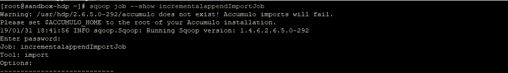

sqoop job — show incrementalappendImportJob

默认情况下，**增量列是表**的主键列，在本例中为 id 列。

**执行 Sqoop 作业**并观察写入 HDFS 的记录

*sqoop 作业—执行 incrementalapendimportjob*

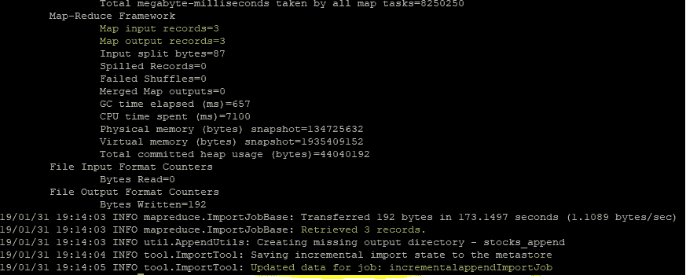

*sqoop job — exec incrementalappendImportJob*

**4。观察作业**中的元数据信息

Incremental.last.value 字段存储在 HDFS 导入的 id 字段的最后一个值
该值现在更新为三。

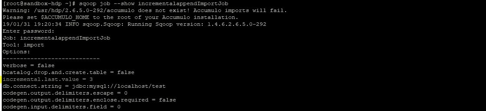

sqoop job — show incrementalappendImportJob

下次运行该作业时，它将只加载 id 值大于 3 的那些行。

**检查 HDFS 文件系统** 我们可以观察到所有三个记录都写入了 HDFS 文件系统

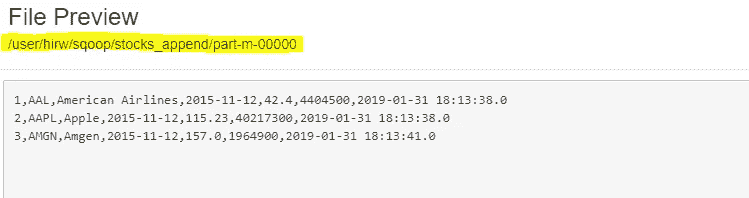

HDFS Filesystem /user/hirw/sqoop/stocks_append/part-m-00000

**4。在源表中插入值**

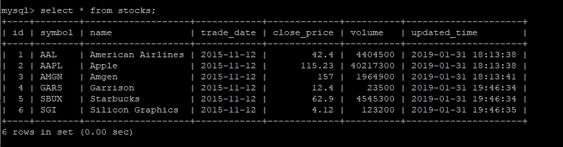

**5。再次执行 Sqoop 作业，观察 HDFS 的输出**

*sqoop job —执行 incrementalapendimportjob*

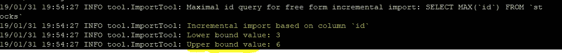

**在 HDFS 观察到数据已经被增量加载**

作业已加载 id 值大于 3 的所有行

HDFS Filesystem /user/hirw/sqoop/stocks_append/part-m-00001

**6。观察作业**中的元数据信息

Incremental.last.value 已从 3 更新为 6！！！

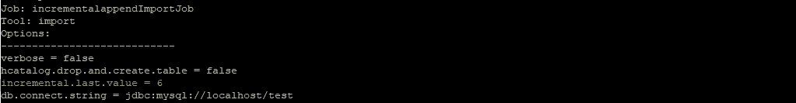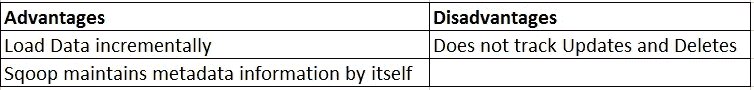

# **增量上次修改**

当源数据库表中的行被更新时，使用这种技术。
它类似于增量追加，但它也跟踪对表进行的更新，我们需要在源表中使用 updated_on 列来跟踪正在进行的更新。

**1。创建增量上次修改的作业**

我们使用 incremental lastmodified 选项代替 append

*sqoop job—create incrementalimportmodified job—import—connect JDBC:MySQL://localhost/test—用户名 root —密码 hortonworks1 —表 stocks—target-dir/user/hirw/sqoop/stocks _ modified—incremental last modified—check-column updated _ time-m1—append*

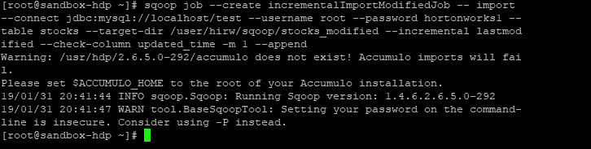

**2。观察作业**中的元数据信息

观察 incremental.mode 设置为 DateLastModified，incremental.col 设置为 updated_time

*sqoop job —显示 incrementalimportmodified job*

**3。执行 Sqoop 作业并观察元数据信息**

*sqoop 作业—执行 incrementalImportModifiedJob 作业*

执行之后，我们可以观察到所有六行都已经加载到 HDFS 文件系统中。

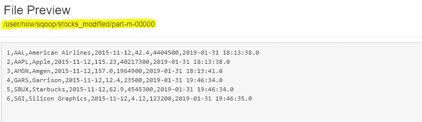

HDFS Filesystem /user/hirw/sqoop/stocks_modified/part-m-00000

*sqoop job —显示 incrementalimportmodified job*

我们可以看到 incremental.last.value 被设置为股票表的 updated_time 列的最大时间戳。
在下一次运行时，作业将加载 updated_time 值大于下面屏幕截图中突出显示的时间戳的行。

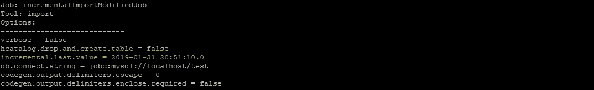

**4。修改源表中的数据**

我们更新了两行并插入了三个新行，总共有五处更改。

**5。执行 Sqoop 作业并观察元数据信息**

sqoop 作业—执行 incrementalImportModifiedJob

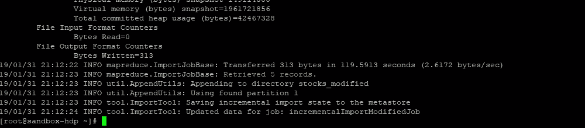

检索到我们插入并更新的五条记录。

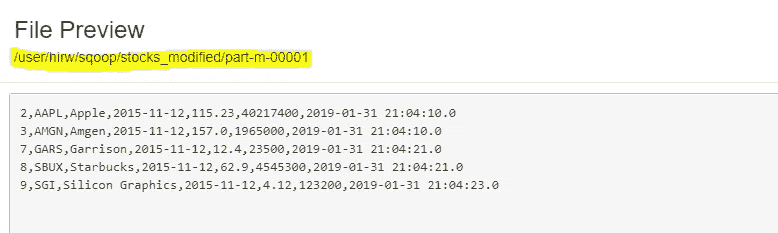

HDFS Filesystem /user/hirw/sqoop/stocks_modified/part-m-00001

我们已经检索到已更改的记录，但这不是预期的结果，因为我们需要合并更改。

6。合并变更

首先，我们使用 Sqoop codegen 命令为股票表生成一个 JAR 文件

*sqoop codegen —连接 jdbc:mysql://localhost/test —用户名 root —密码 hortonworks1 —表格股票—outdir/home/hirw/sq OOP/sq OOP-codegen-stocks*

然后将 stocks.jar 复制到我们的 hadoop 集群的本地文件系统

使用 Sqoop Merge 命令合并变更，并提到我们想要合并变更的主键，在本例中是 id。

*sqoop merge-new-data/user/hirw/sqoop/stocks _ modified/part-m-00001-onto/user/hirw/sqoop/stocks _ modified/part-m-00000-target-dir/user/hirw/sqoop/stocks _ modified/merged-jar-file stocks . jar-class-name stocks-merge-key id*

该命令将使用合并关键字 id 将文件零件-m-00001 中的数据合并到文件零件-m-00000 中。

**观察合并目录中的输出**

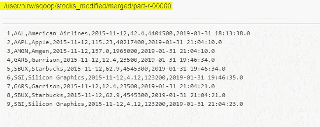

HDFS Filesystem /user/hirw/sqoop/stocks_modified/merged/part-r-00000

我们已经成功地合并了两个文件中的更改！！

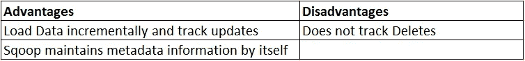

我希望你喜欢这篇文章，请在下面的评论中告诉我你的想法。

领英:[https://www.linkedin.com/in/karan-dama](https://www.linkedin.com/in/karan-dama-46234957/)

## 来自 DDI 的相关故事:

 [## 数据科学和软件工程哪个更有前途？-数据驱动型投资者

### 大约一个月前，当我坐在咖啡馆里为一个客户开发网站时，我发现了这个女人…

www.datadriveninvestor.com](https://www.datadriveninvestor.com/2019/01/23/which-is-more-promising-data-science-or-software-engineering/)  [## 成为数据科学家所需的 8 项技能——数据驱动型投资者

### 数字吓不倒你？没有什么比一张漂亮的 excel 表更令人满意的了？你会说几种语言…

www.datadriveninvestor.com](https://www.datadriveninvestor.com/2019/02/07/8-skills-you-need-to-become-a-data-scientist/)