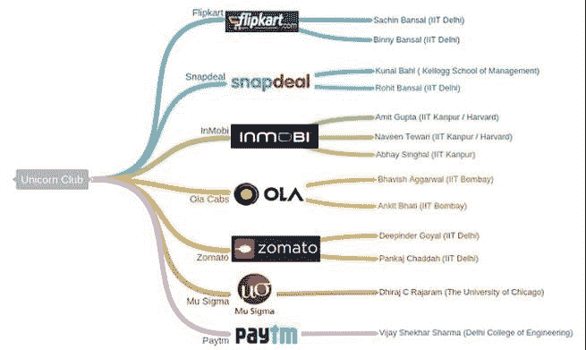
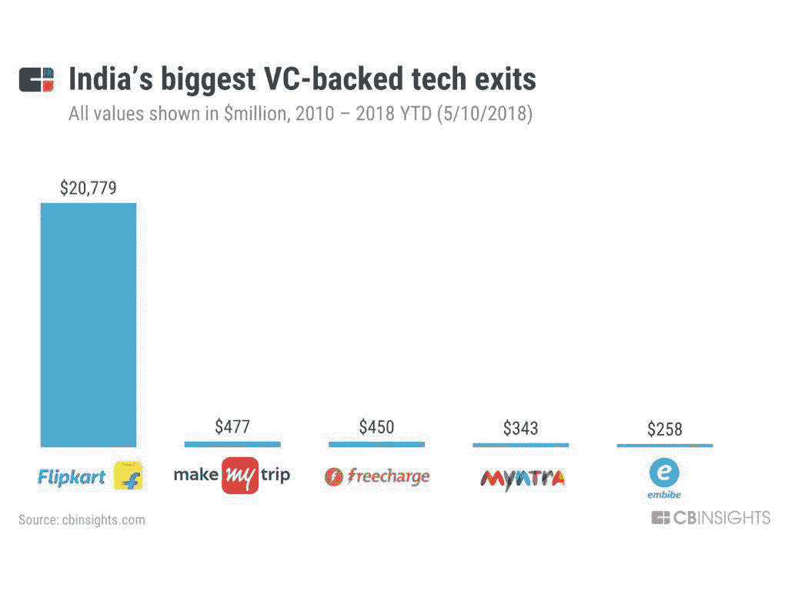
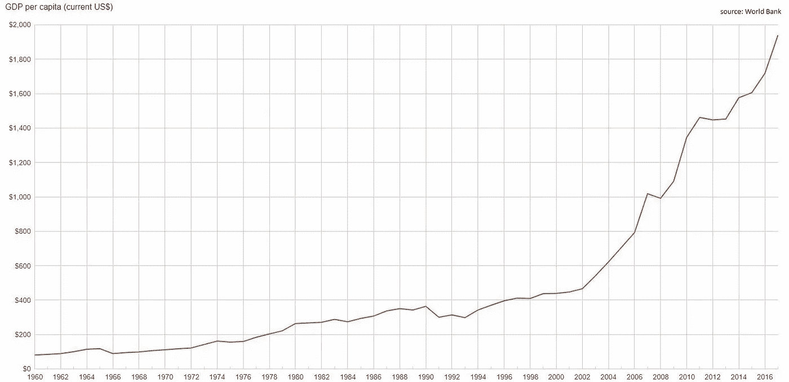

# 印度:我们到了吗？

> 原文：<https://medium.datadriveninvestor.com/india-are-we-there-yet-4fb9cebd3f26?source=collection_archive---------47----------------------->

印度是新兴市场的象征，也可以说是其中最神秘的一个。世界上最大的年轻人口和大量需要解决的问题既带来了活力，也带来了紧迫性。当谈到创业活动时，这个国家正从死亡之吻慢慢转向准备起飞。

以下是创业和风险投资成功的三个有希望的标志——带有警告。

**1)百万创业公司的土地**

印度有 13 亿人口，我们应该会有成千上万的初创公司。事实上，2017 年获得资助的创业公司比以往任何时候都多。也就是说，在印度，像我们在真正成熟的生态系统中看到的那样，没有这种模式的企业家仍然很少。

生态系统中正在发生的关键转变是从世界的后台办公室转向推出实际产品。虽然很难量化到底什么是产品公司，但对 UX 和用户界面的高度敏感是无可争议的。将产品整合到平台上，并创建像谷歌、亚马逊、阿里巴巴或腾讯这样规模的公司来生产产品而不仅仅是服务，这是难以置信的艰难的下一步。

最后，印度越来越显示出差异化的技术护城河。具体来说，India Stack 提倡无现金、无纸化、无人在场和基于同意的交易，这为本地创业公司提供了一条通往可扩展性和防御性的道路，这是以前所没有的。

**2) M & A 活动**

到目前为止，2018 年是印度并购最强劲的一年。不言而喻，退出是多么重要——这对企业家来说是一个巨大的动力，并给风投带来他们继续从有限合伙人那里筹集资金和投资未来创业公司所需的回报。M&A 在当地的活动不仅仅是为了整合——企业收购预营收初创公司和进行收购的活动也在增加。

但这仍然是一个让 M&A 所有其他活动相形见绌的大出口。大型科技公司在印度采取了谨慎的行动——苹果(2016 年收购了 Tuplejump)、谷歌(2017 年收购了 Halli Labs)和亚马逊(2018 年收购了 Tapzo)各收购了一家公司。数字没有公开，但亚马逊的 4000 万美元支票可能是支付的上限，即这些是较小的收购。

**3)全球用户群**

乍一看，印度创业公司走向全球的景象看起来很棒:

*   按需提供出租车的 Ola 已经获得了在英国运营的许可。
*   连锁酒店 Oyo 宣布进军中国，这是其继尼泊尔和马来西亚之后的第三个国际市场。
*   帮助病人寻找医生和预约的 Practo 在菲律宾、印度尼西亚、新加坡和巴西都有分支机构。
*   Zomato 是一家餐馆搜索和发现服务公司，业务遍及 24 个国家。

但从更深层次来看，这也应该是令人不安的。如果企业走向全球是因为它们没有找到足够的国内市场，那么这意味着印度故事还没有准备好。人均 GDP 通常是决定一个国家是否拥有庞大中产阶级的关键指标。根据世界银行的数据，印度的人均收入在过去十年翻了一番，但这可能掩盖了高 GINI，即真正是富人越来越富，而不是更多的人消费更多。大多数专注于印度的风投都在寻找具有国际可扩展性的初创公司。尽管国际扩张将带来指数级增长，但考虑到与印度消费者相关的庞大数量，提出这样一个问题很重要——为什么不为印度制造？

*这是一篇与*[*Bhavna Kumar*](https://www.linkedin.com/in/bhavna-kumar-6014587/)*合作的文章。这些都是专注于实践见解的有目的的短文(我称之为 GL；dr —良好的长度；确实读过)。如果它们能让人们对某个话题产生足够的兴趣，从而进行更深入的探索，我会感到非常兴奋。我在三星的创新部门工作，该部门名为*[*NEXT*](http://samsungnext.com/)*，专注于 deep tech 中软件和服务的早期风险投资，这里表达的所有观点都是我自己的。*