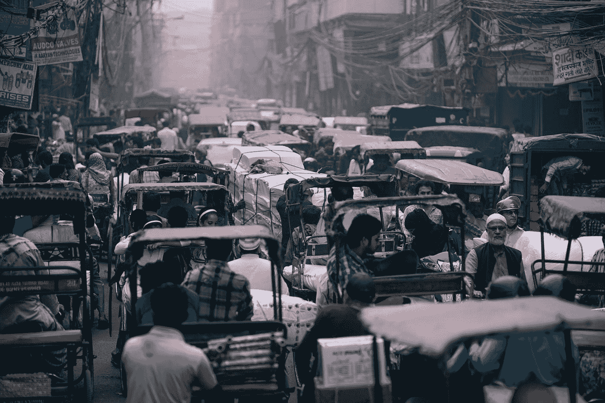

# 印度的包容之旅

> 原文：<https://medium.datadriveninvestor.com/india-inclusion-a-journey-across-generations-26a2592d5f09?source=collection_archive---------6----------------------->

***成为你希望看到发生的变化——圣雄甘地***

Photo by [Fancycrave](https://unsplash.com/@fancycrave?utm_source=medium&utm_medium=referral) on [Unsplash](https://unsplash.com?utm_source=medium&utm_medium=referral)

大多数领导者在职业生涯的某个阶段和各种场合都经常引用上面的话。当我在伦敦地铁站的墙上看到它时，我感到非常震惊，并想知道为什么它会被放在那里。是因为奥运会，还是因为英国正在加强与印度的贸易联系，还是因为咖喱是英国人最喜欢的食物，还是因为伦敦是一个非常多元化的城市。我可以继续探究原因，会有很多。

同样，当人们思考印度及其丰富的遗产和不断发展的社会时，也会发现许多悖论、刻板印象、神秘事物和文化，商人在印度做生意时也不得不面对这些。甘地先生一点也不知道他的名言会如此多才多艺，适用于所有人。

 [## 准备在 2019 年改变世界的技术-数据驱动的投资者

### 很难想象一项技术会像去年的区块链一样受到如此多的关注，但是……

www.datadriveninvestor.com](https://www.datadriveninvestor.com/2019/01/17/the-technologies-poised-to-change-the-world-in-2019/) 

在过去的十年里，印度已经证明了它的多面性，被认为是全球平台上的一个新兴经济体和有影响力的大国。在这一章中，我分享了我对印度包容之旅的多方面特征的看法。

***新兴的包容性社会***

一位 45 岁左右的高管对我说:“我喜欢我那个时代的 23 岁年轻人所表现出的活力，我几乎感到困惑的是，他们无所畏惧，不担心挨饿。当我在他们这个年龄时，生存是我的首要任务。”

一个显著的变化是金融包容性。当然，消除与贫困和生活水平相关的不平等的征途仍在继续。前景是光明的。根据经合组织的数据，到 2039 年，印度中产阶级将从目前占人口的 5%—10%扩大到 90%。这意味着将近 10 亿人。印度目前的人口是 12 亿，换句话说，几乎全部人口都将被归为中产阶级。(中产阶级被定义为人均收入每天 10-100 美元的人)。

印度的年轻人很有抱负，不想经历和他们父母一样的挣扎。

一位 25 岁的高潜力高管对我说 ***“我出身卑微，从政府资助的机构获得学位，属于平庸之辈。在这里，我为一家世界 500 强公司工作，并有机会去美国和英国工作。这一经历让我对自己的职业抱负和改善生活充满了希望。”***

印度目前拥有世界上最多的青年人口。几乎超过 45%的人口年龄在 24 岁以下，预计在未来十年，世界人才管道将在印度。

收入水平的提高将创造消费者对家用电器、汽车、手机、教育、休闲体验、旅游、购物中心和许多海外进口品牌的需求和选择。人们的志向很高，正在努力提高生活质量。

一家银行的首席执行官在休假期间去了印度的农村地区。根据最近的人口普查数据，68.8%的人口居住在印度农村地区(8.335 亿人)。这位高级管理人员正在冒险观察她的银行在企业社会责任方面的投资如何影响三个不同村庄人民的生活。

***平菇***

比哈尔邦一位年近五十的女农民正在种植平菇，这些平菇出口到东南亚国家——越南、柬埔寨和泰国；这些蘑菇在烹饪中备受青睐。这位农民能够改善她家的生活条件。

***水保***

印度在季风季节有三个月的降雨，在一年的其余时间里，条件可能是干旱的。这位高级主管在旅行中遇到了一位寡妇，她开始打井蓄水，并种植了树木以改善她所在地区的供水。她有足够的收入支付她女儿的 MBA 学习费用。

***喜马拉雅生态旅游***

一个住在喜马拉雅平原水稻种植园的女人。这个特殊的家庭有合理大小的住所，家庭中的女性想开始做生意。她开始向游客出租房间，并经营一家宾馆。额外的收入使她能够把孩子送到一所更好的英语学校。

***包容性组织***

我有印度血统；我早年在非洲度过，在英国长大。年轻的时候，我去印度度假，听爷爷奶奶讲故事。我对慈善事业的热爱和对更美好世界的价值观让我在印度南部的偏远地区做志愿工作。我喜欢洗地板和粉刷墙壁，以建立移动医疗单位，并教孩子们英语字母。这个早期的经历是我对真实理解印度人民的主张。

2005 年，我在印度的工作之旅始于全球多元化网络(一个由提倡多元化和包容性最佳实践的公司组成的网络，该网络由 Schneider Ross UK 协调和管理)。发展包容性的领导风格和包容性的文化被视为一种积极的驱动力，有助于公司发展关键职位的本地人才，作为增长战略的一部分。

我在 2007 年的第一项研究发现，工作场所的多样性经常受到损害。“在努力满足业务需求的过程中，多样性往往会受到影响。招聘经理根本没有充裕的时间去发掘多样化的人才库。相反，他们更有可能从现有员工那里获得推荐，这通常意味着雇佣背景相似的人。多元化和包容性——解决印度和中国人才库困境的杠杆——Schneider Ross，全球多元化网络和社区商业。

2010 年，作为孟买研讨会的一部分，我进行了一项后续研究。这一进展令所有人震惊——人们原本以为 2008 年的金融危机会阻碍这一进展。调查结果与此相反。

“案例研究组织证实，多元化和包容性已经提上了高层领导团队的议事日程。五个案例研究组织的驱动因素各不相同。招募和留住最优秀的人才是所有五家跨国公司的一致驱动力。”

“自我们 2007 年的研究以来，印度的跨国公司在利用多元化和包容性的优势方面一直保持着上升趋势。”

***引自 Schneider Ross 2010，印度公司如何利用多元化和包容性的优势。***

***性别包容性***

与所有国家一样，性别包容性是一个主要重点，商业案例驱动因素非常相似。虽然取得了进展，但这只能被描述为拼贴。一些组织已经进步，一些组织正在转型，一些组织刚刚起步，一些组织处于抵制模式。

许多西方人仍然认为印度是一个女性被边缘化、没有权利的地方。当然，世界经济论坛 2012 年性别差距指数报告的数据进一步证实了这一点。在该基准涉及的 135 个国家中，印度排名第 105 位。

然而，来自多个渠道的最新数据显示，印度 13%的首席执行官职位由女性担任，相比之下，美国的这一比例为 2%，英国富时 100 指数公司的这一比例甚至更低。2013 年 4 月 13 日的《经济时报》报道:

***“现在，印度三分之二的女性员工愿意将出差作为工作的一部分，另外 33%的女性更喜欢“高压力、高回报”的工作环境。***

该研究进一步发现，82%的女性员工认为她们的家庭支持她们的职业抱负，而 60%的人认为婚姻不会阻碍她们的职业发展。

媒体头条谈论妇女拥有自己住房的经济力量，同时还提到每 18 小时就有一起强奸案被报道。

统计数据和媒体报道用巨大的矛盾来定义印度。在企业领域，随着雇佣最优秀人才的动力持续不断，进步是迅速的。

增长战略需要能够推动经济发展的人才库。印度 40%的大学毕业生是女性，女性拥有的企业数量也在增加。

人力资本、多元化专家和董事会冠军可以从印度的性别包容之旅中吸取经验教训。

***辈分包容性***

许多研究表明，到 2030 年，印度将成为许多行业的人才。这个国家已经有了最多的青年人口。

印度的年轻人正在几个方面寻求改革，挑战由世界上最古老的内阁统治的政治体系。为人们谈论最多的德里轮奸寻求正义的抗议是几代人如何合作寻求立法改革的一个例子。社会中的 Y 世代和千禧一代领导了抗议活动。老一代人对年轻人和他们创造一个更好的印度的愿望持积极态度。

***技术包容性***

7.52 亿人是移动用户，1.21 亿人是互联网用户，并且这些数字每天都在增加。

《财富印度》2013 年 1 月报道，一家全球电信公司的用户总数从五年前的 2600 万增加到 1.53 亿。在 1.53 亿用户中，近 50%来自 37.6 万个村庄。该图说明了印度农村技术进步的规模，以及这如何有助于创造包容性。

一位银行分行经理对我说:

“我很高兴能为当地农民提供服务，他们能够将产品卖给以前从未考虑过的供应商；移动技术使这成为可能。”

节俭工程这个术语是在印度发明的。意味着为新兴中产阶级发明负担得起的奢侈品。塔塔 Nano 汽车是一款经典的经济型汽车，可以取代许多家庭的两轮车。许多制造商正在利用这一增长机会，为大众市场制造价格实惠的家居用品。

为了支持经济增长，对能源的需求正在增加。政府认识到了这一点，并设立了一个“清洁能源基金”，用于可再生能源技术的研发和部署。

显然，技术是印度创建更具包容性社会之旅的关键支持者和驱动者。

***地理包含***

印度有 28 个邦，有 20 种不同的语言。30%的人把印地语作为第一语言，自 1965 年以来，英语一直是官方语言。印度是一个世俗国家，宗教自由受宪法保护。印度教徒占 80.5%，穆斯林占 13.4%，基督教占 2.3%，锡克教占 1.9%，其他占 1.8%。

商界人士乍一看觉得印度很复杂。现在有一种集中在大城市德里、孟买、班加罗尔、钦奈和加尔各答的趋势，这些城市通常被称为一线城市。许多公司将总部或第二大业务设在印度。

随着未来十年第二阶段的增长,“二线”和“三线”城市将成为关注的焦点。目前，估计有 53 个城市属于这一类别，到 2030 年将增加到 68 个。许多国家的人口超过 100 万，在某些情况下，就人口规模和经济产出而言，还超过一些国家。

在最近的一次旅行中，我有机会参观了孟买的一所大学。我与一群大学生交谈，他们代表着 10 个不同的州和 15 个不同的城市，都在使用一种在他们的家乡可以买到的流行平板电脑。学生们附和说，他们很享受这种“品牌奢侈品”的享受，而这种享受在他们的家乡 3-5 年前是他们的哥哥姐姐们无法免费获得的。

印度的基础设施备受谈论和批评；廉价航空公司和其他交通方式的改善有助于创造地理包容性。

***包含一段跨越几代人的旅程***

总之，我要说，印度是一个年轻的国家，体现了建设包容性社会的变革精神。挑战很多，风险无数；然而，过去 20 年的发展表明，变化是可能的。

对于在印度成功实施多元化和包容性计划的组织来说，我认为以下指导原则至关重要。

1.将多元化和包容性的业务驱动因素和业务案例定义为组织整体业务战略的组成部分。

2.高层领导重视多样性和包容性计划的经济主张。商业案例通常与文化变革有关；经济价值主张也定义了对底线的影响。

3.使用多种变革管理技术，实施多元化和包容性计划，作为文化变革的愿望。这样效果更明显。

4.与其他战略一样，多样性和包容性是一个持续的过程，需要持续投入时间和资源。

***当我启动青年精英会计划时，我是否想起了我在印度与包容性相关的旅程。我对年轻的印度在全球平台上有所作为的潜力感到兴奋和热情。***

改编自 2013 年为 PWN Books 写的一章。