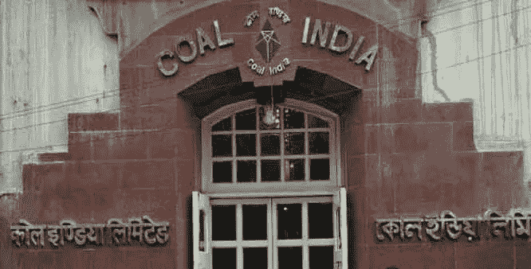

# 印度公用事业:悬崖勒马

> 原文：<https://medium.datadriveninvestor.com/indian-utilities-back-from-the-brink-b91117399b31?source=collection_archive---------22----------------------->

***最早发表于 2015 年 6 月《金融家》***

当煤炭价格在 2010 年和 2011 年大幅上涨时，印度公用事业受到了沉重打击。[印度国有煤矿公司印度煤炭有限公司](https://www.coalindia.in/)无法满足发电用煤的需求，迫使发电商以更高的价格进口额外的煤炭。

但该行业的情况正在好转。煤炭价格逐渐下降，但却是决定性的，目前比 2011 年的峰值下降了 50%。对公用事业的长期未来更重要的是，印度煤炭公司正在开发新矿以增加产量。

与前一年相比，2015 财年的产量增长了 6.9%，与 2010 年至 2014 年期间相比有了大幅增长，当时产量平均每年仅增长 1.8%。

今年的成功让这家国有企业有信心制定雄心勃勃的目标:在短短五年内，它的目标是将产量从今年的约 4.05 亿吨提高到 10 亿吨。对于依赖稳定的煤炭饮食来维持印度电力供应的公用事业公司来说，在可预见的未来，更大的国内供应和更便宜的进口都意味着更低的成本和更好的底线。

***拜访***[***jenserikgould.com***](https://www.jenserikgould.com)