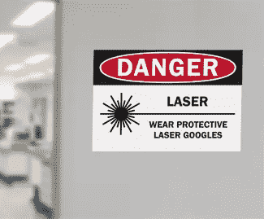

# 工业激光器的未来一片光明

> 原文：<https://medium.datadriveninvestor.com/industrial-lasers-future-is-bright-7fe07c4a64e8?source=collection_archive---------20----------------------->

经过工程师和科学家多年的先驱性工作，1960 年，一位美国物理学家能够产生一束单一波长的密集、非常窄的光束。从那以后，利用受激发射的光放大或激光技术的着迷、想象和新发现不断涌现。根据工业激光解决方案主编 David Belforte 的[报告](https://www.industrial-lasers.com/articles/print/volume-33/issue-1/features/2017-was-a-great-year-for-industrial-lasers.html), 2017 年工业激光市场增长了 26%,预计 2018 年的增长将更加温和，这是由精细金属、非金属和添加制造的发展推动的。

# 激光使用增加

工业界对激光的兴趣越来越大，推动了增材制造(也称为 3D 打印)的发展。在添加制造中，组件仅仅是由粉末和激光制造的。实施这种制造方式的行业包括航空航天、汽车、医疗、牙科、科学和零售。一些用途包括切割、焊接、测量、标记和包覆。在医疗领域，定制模型和零件在不牺牲强度的情况下具有成本效益。最近，3D 打印已经在牙科中找到了制造牙冠和桥梁的应用，并且它正在朝着在牙科复合材料中制造永久修复体的能力迈进。

向添加制造的范式转变带来了不使用任何工具生产复杂物体的希望。正在取得稳步进展，尽管进展缓慢。EOS 印度公司的负责人 Anand Prakasam 说:“它非常适合装配的产品在应用、批量和生产过程方面各不相同的制造环境。然而，Star Rapid 的总裁兼创始人戈登·斯泰尔斯(Gordon Styles)表示，缺乏针对制造的设计知识正在推迟这项技术在增材制造中的全面采用。学习需要时间，掌握需要经验。他说，另一个阻碍是 3D 打印技术缓慢且昂贵。“尽管离真正的商业可行性还有几年时间，但它现在肯定能找到合适的应用，”他说。

A sign alerts workers to wear eye protection while lasers are in use.

# 激光安全控制

根据美国能源部伯克利实验室的说法，对激光使用的主要担忧是眼睛和皮肤受伤的可能性。眼部伤害推动了对工作场所激光安全、资金、控制和应用的需求。直接暴露和漫反射暴露的生物效应会有所不同。[美国国家标准协会](https://www.ansi.org/)在美国有激光安全的符合标准:ANSI Z136。以下是在增材制造中传达激光危害和安全的几个技巧:

*   在激光危险警告标志上传达激光分类、激光参数和佩戴激光眼镜的光密度要求
*   在激光控制面板附近张贴标志/程序(或等效物),以传达变化的操作模式
*   在控制区入口附近张贴紧急进入程序，包括如何禁用激光危害的描述
*   在激光工作区附近张贴游客政策
*   展示核心激光安全实践海报
*   标签紧急关闭按钮

激光器在工业中有多种应用。随着这项技术的发展，工作场所安全计划也必须发展。高能激光材料加工包括切割、钻孔和焊接，这些都有潜在的危险。使用定制或[预制的激光安全标志和标签](https://store.graphicproducts.com/en-us/duralabel/preprint/sl-chemical-hazard/laser)警告危险并显示与激光相关的预防措施。传达并强调在有激光的地方佩戴适当的个人防护装备的重要性，以保护灰尘颗粒、视力和皮肤等。