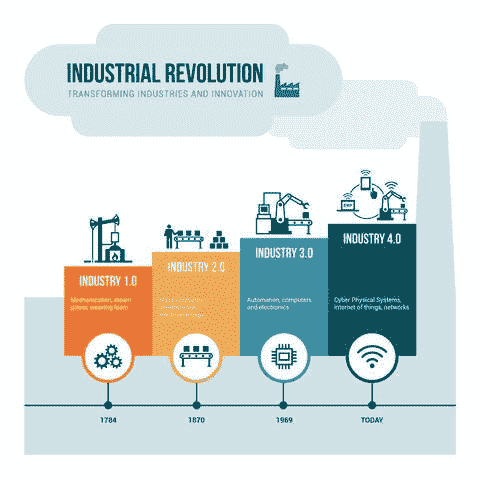
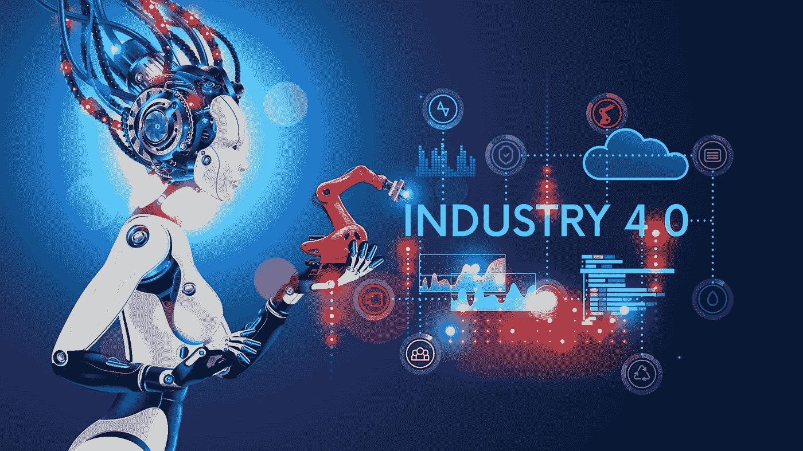

# 工业革命 4.0——女性的好机会

> 原文：<https://medium.datadriveninvestor.com/industrial-revolution-4-0-a-good-opportunity-for-women-1bd635ed92b5?source=collection_archive---------5----------------------->

你听说过工业革命 4.0 吗？

制造技术中自动化和数据交换方式的新趋势。它包括物联网、云计算和信息物理系统。

简单来说，我们可以说工业革命 4.0 正在改变我们的生活方式；我们通过引入自动化来工作。然而，问题是工业革命 4.0 将如何为女性创业带来新的机会。

众所周知，女性解决问题的能力更强，只有克服一些挑战，同理心才能让女性成为最优秀、最理想的商业人士。

 [## 数据驱动的趋势和统计-2019 年 2 月-数据驱动的投资者

### 虽然寻找视觉内容最简单的方法是“谷歌”它们，但如果你能…

www.datadriveninvestor.com](https://www.datadriveninvestor.com/2019/03/07/data-driven-trends-statistics%e2%80%8a-%e2%80%8afeb-2019/) 

然而，女性唯一缺乏的是对最新技术的了解，比如纳米技术。意识到这一点后，女性可以将她们对各种问题的解决方案商业化。因此，工业革命 4.0 中的企业家不限于他们的性别，但它要求每个人在创业或维持业务时都要有长远的想法。毫无疑问，工业 4.0 正在成为一个新的标准，因此应该在未来的商业计划中加以考虑。

然而，这就是为什么在我们的[mom entrepreneurs hip Workshop](http://bit.ly/SGMompreneurshipWorkshop)期间，我们将讨论向女性介绍新技术的重要性。在本次研讨会中，我们将鼓励女性利用技术和企业家精神创造惊人的经济机会。我们致力于激励母亲们追求更安全、自动化可能性更小的职业。

**女人手中有权力:**

毫无疑问，制造业和建筑业等行业是男性主导的，因此很可能受到自动化的影响。相比之下，很少有行业像心理学、护理和医学这样抵制自动化。女人只需要了解她们的力量。全世界女性拥有的学位比男性多。她们比男性有研究生学位和博士学位。此外，女强人还会带来一些技能，曾被称为“软技能”，即根据某人的肢体语言理解某事的能力。

**家庭和工作在一起:**

数以百万计的公司正在失去有才华的女性，只是因为她们有其他的责任要履行。他们有孩子，所以必须在孩子和事业之间做出选择，当然孩子很重要。但这并不意味着女性必须在事业上妥协。然而，最好的事情是工业革命 4.0 可以让女性在未来永远不再面临这样的情况。

自动化家务劳动将成为可能；这可能会减轻一部分双重负担。是的，女人不会同时养家糊口和照顾家庭。随着像工作这样的变化——更多的远程工作机会，其他父母将更容易更好地结合工作和家庭。

**创业的灵活性:**

这种新的数字景观将为世界各地的妇女提供以相对较少的投资创业和在全球销售产品的灵活性。是的，去年，易贝宣布他们将拥有来自 5 个以上非洲国家供应商的产品，这是一个前所未有的大好机会。

虽然制造和技术行业一直是男性主导的行业，但工业革命 4.0 将为该领域的热情女性带来深远的新机遇。我们正在进入工业革命 4.0。然而，女性在这一领域的职业机会从来没有像我们看到的数字技术与实物生产的融合那样大。

因此，请参加我们 3 月 30 日的活动，我们将邀请行业领先的当地商界女性帮助您探索 4IR 时代的新机遇。

该研讨会旨在通过建立一个成功女性集群来参与和促进现有的绝佳机会，这些成功女性将继续关注可能出现的机会和挑战。

你还在等什么？

报名参加[企业家研习班](http://bit.ly/SGMompreneurshipWorkshop)，并有机会结识成功的女企业家，了解她们如何克服实现卓越道路上的所有障碍。

点击下面获得您的“早鸟”票吧！

【http://bit.ly/SGMompreneurshipWorkshop 

# 谢谢，我们在研讨会上见！