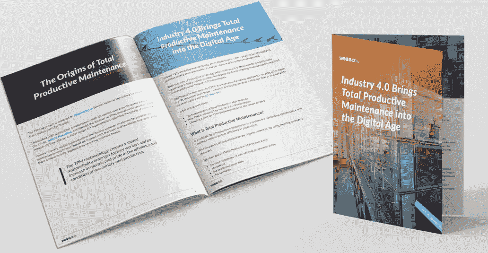
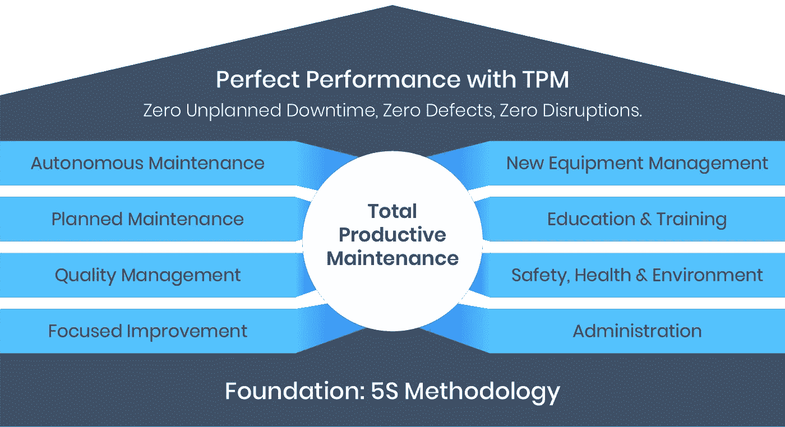
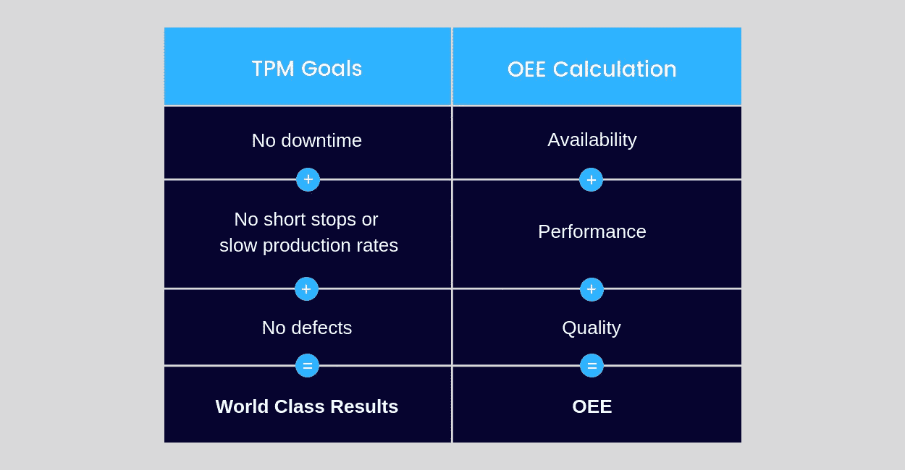

# 工业 4.0 将全面生产维护带入数字时代

> 原文：<https://medium.datadriveninvestor.com/industry-4-0-brings-total-productive-maintenance-into-the-digital-age-a5888607439c?source=collection_archive---------4----------------------->

工业 4.0 正在多个方面颠覆制造业——从生产吞吐量、预测性维护和质量，到供应链和库存管理。

虽然传统保守行业对这一创新浪潮充满热情，但要成功采用工业 4.0 技术，需要明确的部署和持续管理战略。

全员生产性维护(TPM)是一种精益制造方法，于 1971 年在日本开发，如今被广泛使用，它是作为一种非常适合智能工厂及其[物联网用例](https://www.seebo.com/iot-use-cases/)的战略而提出的。

在本文中，我们将讨论:

*   全面生产维护的基础
*   工业 4.0 技术如何增强全员生产性维护
*   在智能工厂中选择 TPM 实施试点

# 什么是全面生产维护？

简而言之，全面生产维护是一个优化维护并达到完美生产效率状态的系统。

全员生产性维护侧重于通过有机手段提高效率，即。利用现有的公司资源。

全面生产维护的主要目标是:

*   没有短暂停工或次优生产率
*   没有缺陷
*   没有计划外停机
*   没有意外

## [随身携带免费白皮书](https://iot.seebo.com/total-productive-maintenance-wp?utm_campaign=Medium%20Cornerstone%20-%20PDF&utm_source=Total%20Productive%20Maintenance%20Cornerstone&utm_medium=PDF%20CTA)

[Get the whitepaper here](https://iot.seebo.com/total-productive-maintenance-wp?utm_campaign=Medium%20Cornerstone%20-%20PDF&utm_source=Total%20Productive%20Maintenance%20Cornerstone&utm_medium=PDF%20CTA)

# 全面生产维护的起源

TPM 的方法归功于[日本电装](https://www.denso.com/global/en/)(今天被称为电装公司)，一家为丰田生产零部件的公司。

被认为是全员生产性维护创始人的 [Seiichi Nakajima](https://en.wikipedia.org/wiki/Seiichi_Nakajima) 对 20 世纪 60 年代从美国沿袭下来的预防性维护方法不满，他提倡工厂工人应该在机器维护方面承担更广泛的责任。

不再是每条机器/生产线都有单独的员工负责操作和维护，而是对员工进行工具和知识培训，让他们有更全面的方法来确保机器的健康。

> *全员生产性维护方法在工厂工人中创造了一种共同的责任，并提高了士气以及对机械和生产效率和条件的自豪感。*

# 5S——精益 TPM 的基础

全员生产性维护的基础是另一种同样源自日本的管理方法，即 [5S](https://en.wikipedia.org/wiki/5S_(methodology)) 。

5S 专注于组织工作场所环境，通过 5 项主要活动提高效率和有效性:

# 排序(Seiri)

行动——对某个区域的设备和材料进行分类，将不必要的物品移至另一个区域或进行处理。

结果-减少杂乱使检查更容易，释放可用空间，并使东西更容易找到。

# 按顺序排列

行动——工具和设备以适合工作的方式放置。最常用的工具是最容易拿到的，存放处有标记，便于将物品放回指定位置。

结果—更顺畅的工作流程。

# 闪光/清扫(Seiso)

行动——定期清洁和检查工作区域、工具和机械。

结果——减缓设备和基础设施的损坏，提高安全性。

# 标准化

行动——向员工详细告知不同的程序，并提供有组织的时间表、明确的说明和必要的现场视觉辅助工具，以标记、照片和插图的形式提供。

结果——计划、定期执行和监控涵盖前 3s 实践的程序。

# 持续/自律(Shitsuke)

行动—设立培训课程并进行定期监控，以确保合规性。

结果——遵循 5S 方法不是因为员工被告知要这样做，而是因为他们选择这样做，通过经验开始额外的改进。

# 工业 4.0 &全面生产维护的八大支柱

TPM 以 5S 为基础，提出了一个 8 支柱方法，旨在涵盖工业制造环境中维护的每个可能方面。

以下是这 8 大支柱的概述，以及工业 4.0 如何进一步推进这一方法:

# 1.自主维护

这可能是全员生产性维护最独特的特点——这里的想法是，每天与机器打交道的人最“了解”机器的行为和性能。

操作人员经过培训，对其机器拥有“所有权”,负责清洁、润滑和检查等日常维护活动，在拜访专业技术人员之前，应首先尝试处理其培训范围内的问题。

随着工业 4.0 的出现:随着机器变得更加自动化，监控得到改善，仪表板更容易阅读，操作将变得不那么复杂，从而使全员生产性维护所建议的“所有权”变得更加简单，因此更易于工人使用。

# 2.计划维护

维护可以预防故障，而高级技术人员的干预是经过精心计划的，因此任何软件更新或部件更换都只需要最少的停机时间。

使用工业 4.0:通过[机器学习](https://www.seebo.com/machine-learning-ai-manufacturing/)使用预测性维护，维护活动仅在必要时执行，并且可以定时以完全避免停机。

# 3.质量管理

工人接受培训并被鼓励识别生产中最终导致缺陷和质量问题的问题。

使用工业 4.0:输入“[预测质量](https://www.seebo.com/predictive-quality/)”—传感器数据和机器学习有助于识别机器行为中的异常，向操作员发出警报，然后操作员可以执行有针对性的[根本原因分析](https://www.seebo.com/root-cause-analysis-case-study/)。问题可以比以前更早地得到纠正，减少了质量恶化和缺陷造成的经济损失。

# 4.重点改进

组建跨职能团队，并鼓励积极参与。影响生产的问题由工人解决，他们从主要障碍/障碍开始，向下移动到更小的低效问题。

工业 4.0:通过有组织的数据收集和人工智能算法(如人工神经网络)的应用，可以暴露缺陷和根本原因之间不太明显的相关性。检查信息和假设可以在公司范围内共享，从而实现更好的同步和更成功的协作。

# 5.新设备管理

新设备的设计和安装过程应根据以前的经验进行规划，以确保快速达到性能目标，最大限度地减少启动问题，并提高安全性。

使用工业 4.0:可以分析历史记录系统中的生产数据，以确定以前安装/设计的最佳实践，同时考虑当前工厂/工厂条件。

# 6.教育和培训

参见支柱 1——操作员接受培训，获得维护机器和识别问题的必要技能。反过来，维护技术人员学习更主动的工作方法，同时鼓励管理人员提高领导技能。

借助工业 4.0: [数字孪生可视化](https://www.seebo.com/digital-twin-software/)提供了一个极好的机会来了解各个层面的制造复杂性:从组件和机器到生产线和整体设施管理。

教育内容可以在线提供，员工可以全天候获取。新手人员可以被指派有经验的指导者，他们可以访问他们的活动并且可以回答询问。

# 7.安全、健康和环境

通过识别健康风险和潜在危险并努力消除它们，创造一个更安全的工作环境。不舒适的环境会影响工作效率，员工在有风险的情况下也不应该有工作效率。

工业 4.0:传感器可以测量空气质量、辐射、温度和其他可能影响健康和性能的环境条件，而有害气体、电涌和火灾的早期检测可以挽救生命并防止设备损坏。

# 8.管理

TPM 方法可以应用于不直接参与制造的系统，包括办公室管理。将行政职能列为八大支柱之一的意义在于，这一层次的管理——订单处理、调度、劳动力管理、会计——应通过有效的沟通、透明度和屡试不爽的协议与工厂的其他方面保持同步。

对于工业 4.0: [人工智能算法](https://www.seebo.com/industrial-ai/)非常适合分析和决策过程，使这项技术对办公自动化极其有利。

办公自动化注定要发展，并将包括需求预测、智能定价、智能采购和外包。

> *根据全面生产维护方法，在上述 8 个支柱中的每一个支柱上实现卓越就是证明制造工厂正在产生“世界一流”的结果。*

# OEE 和全员生产性维护

全员生产性维护催生了制造业中应用最广泛的关键绩效指标之一——整体设备效率(OEE)。

OEE 是全员生产性维护中的一个重要指标，用于衡量工厂的整体效率状态。

如果我们看一下我们之前概述的全员生产性维护的目标，就会清楚这些目标是如何与 OEE 计算相匹配的:

# 为下一级 TPM 应用智能工厂解决方案

在工业 4.0 中实施 TPM 时，最好从概念验证开始，进行分析，然后扩展到更大的挑战。决定合适的试点是实施过程中重要的第一步。

在为您的工业 4.0 项目选择 TPM 试点时，请考虑以下三个复杂级别:

# 1.简单的改进

赞成的意见

发起一个小小的改进是在短时间内赢得“胜利”的好机会，并且不需要深入的 TPM 知识。这是一个很好的试点类型，可以从一开始就招募利益相关者并建立对流程的信心。

骗局

仅仅做一个小的改进将导致项目相对较低的 ROI，并且不会产生太多关于 TPM 过程的信息。

# 2.最佳化

赞成的意见

通过解决生产线中的瓶颈或缓解限制，您将看到总产量的立即增加。

骗局

重点优化可能需要一些计划停机时间来进行实验和分析，并且存在您可能无法在原始输出速率上实现可测量的改进的风险。

# 3.解决问题

赞成的意见

用机器/流程解决一个长期存在的问题将会赢得 TPM 实施的支持，并会受到操作人员的欢迎。

骗局

ROI 可能相对较小。此外，一个复杂的问题作为起点可能是一个太大的挑战，导致项目失去动力。

# 工业 4.0 对全面生产维护的影响

随着工业 4.0 的推进，进一步扰乱产品和材料的制造方式以及市场本身，新的工厂/工厂管理问题将会出现。

为了应对这些挑战，管理人员将充分利用 TPM 等方法来平稳过渡到工业 4.0，并通过提高产出率、质量和客户满意度来确保底线影响。

*原载于*[*【www.seebo.com】*](http://www.seebo.com)*。*