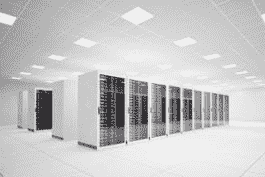
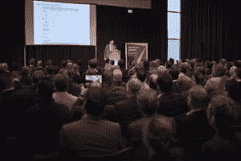
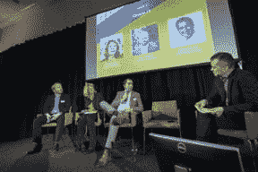

# 行业领袖将在 2019 年欧洲 Kickstart 大会上讨论数据中心的未来

> 原文：<https://medium.datadriveninvestor.com/industry-leaders-to-debate-data-center-future-at-kickstart-europe-2019-d806936ece91?source=collection_archive---------35----------------------->

数据中心以前被认为是互联网最传统的基础设施、传统架构和现代生活基础的宿主。

这些建筑为连接世界的技术提供了一个**家园，为传输电子邮件、聊天以及最终这些文字的电缆提供了一个**家园，这些文字目前正被写入 Google Drive 文档中；但随着第五代无线和物联网设备的快速涌入，数据中心的业务模式正在发生变化。

向云计算的转变意味着企业必须适应现代世界，否则将面临落后的风险。这种数字化转型见证了行业的纵向和横向扩张；向**展示无限的纵向扩展和横向扩展机会**。

**增长呈指数增长**，没有放缓的迹象，但新技术和机遇不会没有挑战。像电力不足、对熟练员工的需求增加以及不间断的 24/7 服务需求等问题已经被证明是难以管理的。

那么，首席执行官和行业思想领袖是如何跟上增长的呢？考虑到其他因素，如英国退出欧盟等社会经济问题，他们如何知道应该关注哪些趋势和市场？像许多正在经历重大变革的行业一样，技术和电信思想领袖明白必须采取一些措施。对话必须开始。

# 提示 KickStart 欧洲 2019

KickStart Europe 2019 是第二届专注于数字技术领域战略和基础设施网络的年度会议。

正如最近的[新闻稿](https://www.prnewswire.co.uk/news-releases/industry-leaders-gather-at-kickstart-europe-2019-to-discuss-the-urgent-need-for-investment-in-digital-infrastructure-859792807.html)所述，为期一天的活动鼓励企业之间的合作，同时为现代问题提供创新和新鲜的解决方案。特别关注新兴趋势和探索塑造行业的技术，如云基础设施、连接和数据中心。

该活动于 2019 年 1 月 15 日在阿姆斯特丹的 RAI 会展中心举办，预计将吸引 C 级高管，他们将利用新的联系和想法来保持领先，同时考虑今天和明天最紧迫的问题。

辩论主题包括大数据和由物联网、人工智能和机器学习驱动的互联网增长；连通性，关于对等和边缘计算；用于不断增长的数据的架构和基础设施；超大规模云网络的增长及其对行业的影响；以及电源管理的变化，包括可持续能源消耗。

从讨论的广阔领域可以明显看出，依赖互联网的企业开始担心，必须找到一种方法来利用和利用行业中的这种变化。

# 迄今为止，企业是如何利用变革的

**超大规模数据中心(HDCs)** 及早发现问题，并进行调整以更好地利用资源和提高可扩展性，从而满足当前的市场需求。HDC 是**低密度和高质量的**型号，对主要依赖应用程序和云服务器的大公司有意义，但对较小的企业不太适用。

但是它们到底是什么呢？该模型被设计成**随着市场的变化而变化**；它建立在由成千上万台独立服务器组成的高速网络上。通过设计，这可以最大限度地提高性能。

可以想象，对于大多数企业来说，几十万台单独的服务器有些难以企及。这就是为什么亚马逊、贝宝和易贝等关键公司是迄今为止为数不多的几个实现超大规模的公司。

同样，**边缘计算**，由一个微型数据中心网络组成，也去掉了大型集中式数据中心的功能，让服务器更靠近终端用户。这被称为网络的“边缘”。这样做的好处包括减少了延迟，因为数据在被重新路由到相关位置并在网络中经历多次跳跃之前，不必传输到最近的大型数据中心。

当试图解决农村地区糟糕的连接和大城市日益增长的需求时，这一点尤为重要，在大城市，每个人都拥有大量支持互联网的设备。

# 传统数据中心如何面向未来？

行业思想家不仅关注现在发生的事情，也关注未来。从这种商业模式的出现可以明显看出，l **egacy 数据中心必须适应**以提供强大而稳定的连接，同时提供自动驾驶汽车等所需的巨大计算能力。

这本身就提出了问题:企业如何开始适应？在更加本地化的地区建立微型数据中心是否会增强连通性？

微型数据中心是一个较小的独立系统，旨在解决一系列特定的问题和处理传统设施无法处理的工作负载。一系列微中心组成了整个边缘计算网络，该网络因将服务器和电源放在邻居的中心而增强了客户体验而受到称赞。小型替代方案仅对寻求**远程分支**的中小型企业或大型公司的某些类型的工作负载有意义。

这种新的基础设施通常被认为更能抵御灾难，可以在**隐形模式**下运行，在这种模式下，它不需要持续的物理监控，甚至不需要开灯，至少在[华为的情况下](https://www.computerweekly.com/feature/Micro-datacentre-What-IT-problems-it-solves-and-what-workload-systems-is-it-best-suited-for)。

数据中心的灾难防护仍然是一个很大的争论:中心的物理位置，包括空间、温度和电力，以及政治环境，如英国退出欧盟，都必须考虑。目前还不知道该行业将如何以可持续的方式应对环境挑战，但**热量和能源浪费必须减少。**

边缘网络可能在某种程度上有所帮助，但是，从传统基础设施转移到创新基础设施可能在时间和金钱方面都很昂贵**。**

显然，一场**行业重组是必要的**。边缘计算在某种程度上是一个时髦词，可能是也可能不是答案，尽管超大规模可能正在蓬勃发展，但它不适合较小的公司。必须更加关注具有可持续性和可扩展性潜力的新业务模式，以满足各种规模企业的需求。

# 你怎么能加入辩论呢？

随着新年的临近，对未来 5 年和 10 年的预测开始充斥科技领域，因为每个相关方都会发表一些研究论文和分析。但是通过参加 [KickStart](https://www.kickstartconf.eu/) ，代表们可以参与到辩论中，获取信息并获得洞察力，而阅读 30 页的报告是不可能的。

来自行业和全球的思想领袖将在本博客中就讨论的问题以及更多问题展开辩论。

代表们有望听到:

他们将讨论在未来基础设施和技术发展中占据突出地位的地缘经济区域，这将推动欧洲数据中心市场、数字基础设施投资和融资，并讨论能源电网。

阅读更多关于 [KickStart Europe](https://www.kickstartconf.eu/) 的信息，获取您的门票。

KickStart Europe 由 [Digital Gateway to Europe](http://www.digitalgateway.eu/) 发起，由创始合作伙伴 [Vertiv](https://www.vertivco.com/en-emea/) 、 [Unica 数据中心](https://www.unica.nl/datacenters-en?language_content_entity=en)、 [NIBC](https://www.nibc.com/) 、 [Caransa Groep](https://caransa.com/) 、 [CBRE](https://www.cbre.nl/nl-nl/global/real-estate-services/real-estate-industries/data-center-solutions) 和[开发机构 Noord-Holland Noord&agri port A7](https://investinnhn.com/invest/businessareas/agriport-a7)提供支持。主要合作伙伴是 [ABB](https://new.abb.com/benelux/) 和[铁山](http://www.ironmountain.com/digital-transformation)。

*原载于 blog.radialpath.com***。**