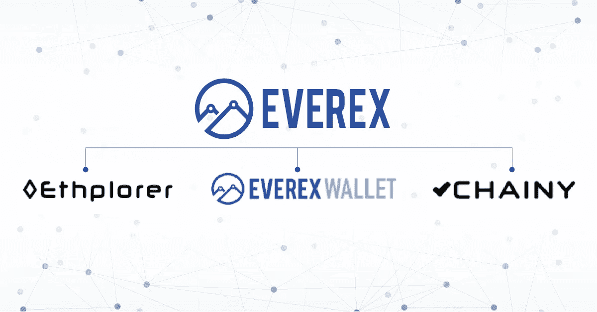

# Everex 创造的塑造行业的区块链产品

> 原文：<https://medium.datadriveninvestor.com/industry-shaping-blockchain-products-created-by-everex-a361a1f56447?source=collection_archive---------22----------------------->

Everex 团队拥有以太坊区块链开发领域的专业知识，提供的产品已经并将继续改善加密行业。这类产品包括 Everex Wallet、Ethplorer 和 Chainy。

**Everex Wallet**
[Everex Wallet](https://everex.cash/#)是一个基于以太坊区块链的应用程序，允许用户在不到一分钟的时间内在世界各地接收和转移数字资产，没有中间人，只使用智能手机。这是一个用于以太币的多币种、多资产交易钱包，有助于提高区块链上所有交易的透明度和可见性。

Everex 钱包有多重功能。它可用于:

*   银行和非银行客户的跨境转账；
*   在线和线下商店的货币兑换和直接支付；
*   企业金融服务，如贸易融资和贷款。

目前，Everex Wallet 已在泰国和缅甸推出，不久将有更多国家推出。然而，其他国家的用户可以下载该应用程序并订阅时事通讯，以接收可用性更新的通知。

**eth plorer**
简而言之， [Ethplorer](https://ethplorer.io/) 是一个用户友好的区块链浏览器和令牌查看器，允许跟踪交易和检查以太坊区块链上特定地址的余额。

Ethplorer 在加密领域已经是一个知名的领先平台。它作为以太币不存在公共独立第三方查看器的问题的解决方案。它向开发者和公众展示了以太坊或其他区块链代币的信息。

**Chainy**
Chainy 是一个独立的、开源的、基于以太坊的智能合约(DApp)，提供不可替代的区块链 URL 或“永旺链接”、文档存在的永久证明以及公共短信服务。

简而言之，只要区块链活着，它的数据就存在，独立于任何人。这些数据可以在任何时候查看，无论是在这个浏览器上还是在将来任何可以访问以太坊 API 的浏览器上，例如 Mist 或开源查看器。

Everex 最近宣布加入企业以太坊联盟(EEA)，与寻求基于以太坊服务的企业建立了更紧密的联系。通过这样做，Everex 加入了连接财富 500 强企业、创业公司、学术机构和技术零售商与以太坊主题专家的平台。

对 Everex 的产品和服务有什么想法或希望在平台上合作？通过[推特](https://twitter.com/everexio)、[电报](https://t.me/everexio)、[脸书](https://www.facebook.com/everex.io)联系 Everex 社区，或者通过[电子邮件](mailto:team@everex.io)联系。

更多信息，请访问 [Everex 网站](https://www.everex.io/)。