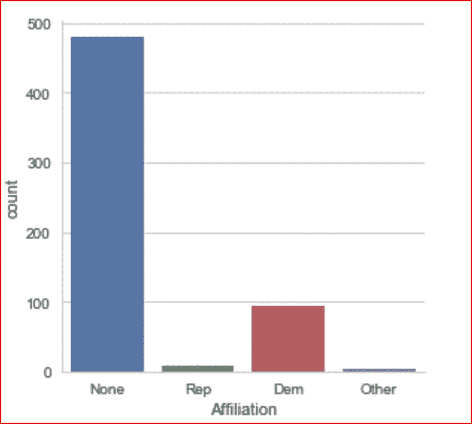
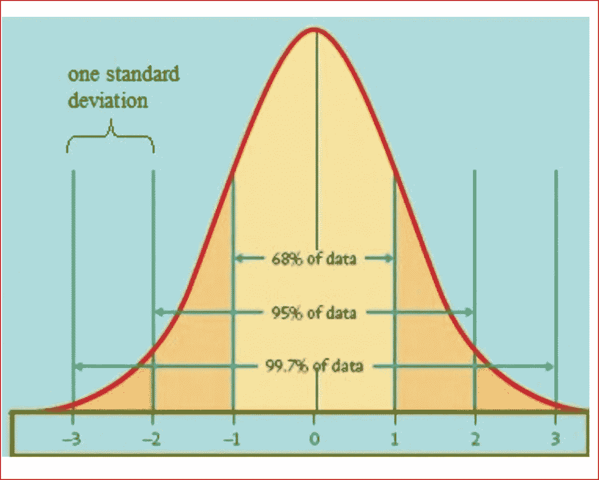
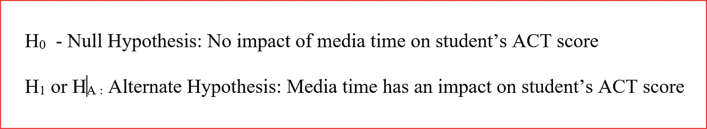
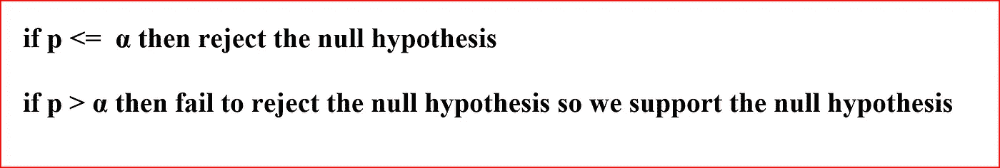
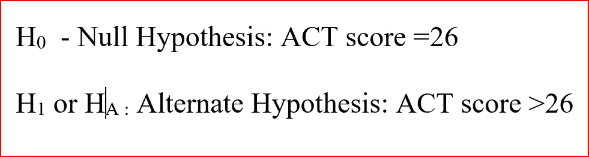
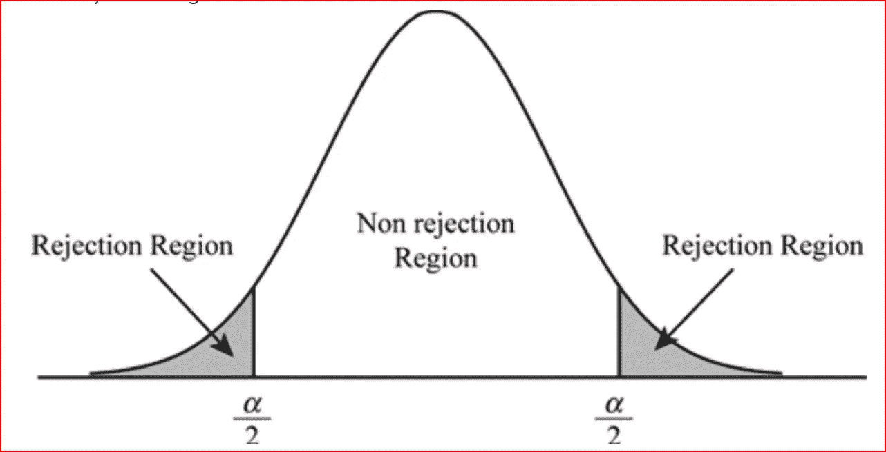
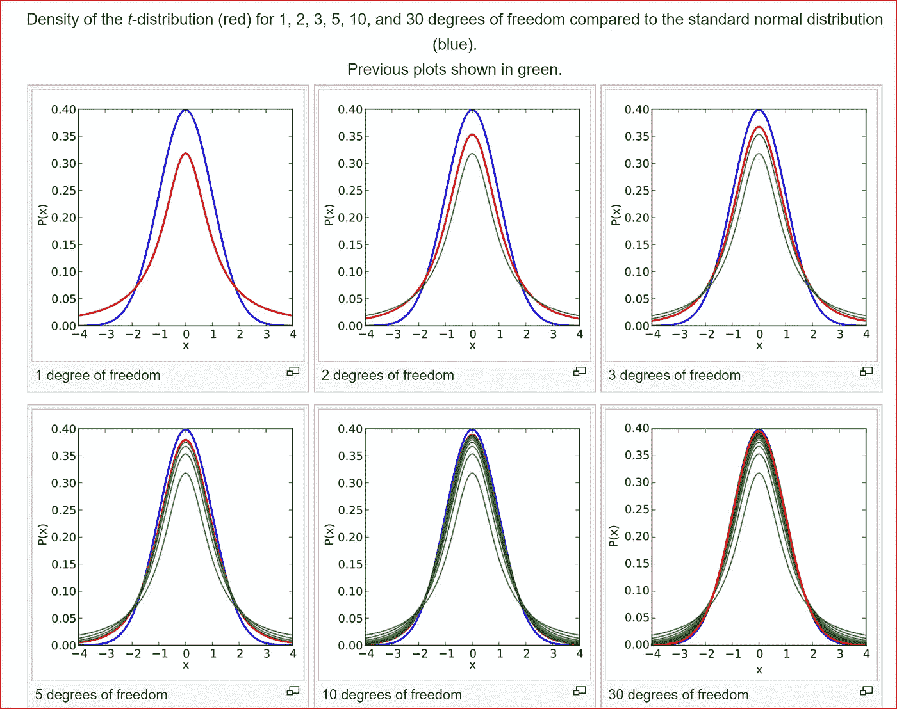
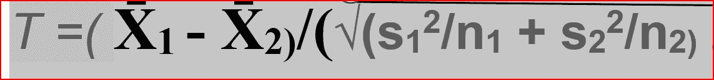
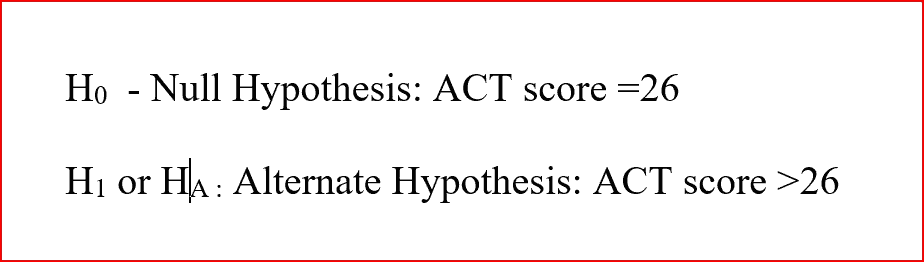
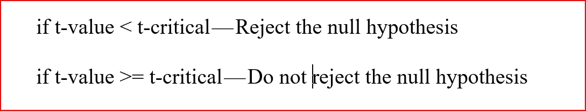

# 推断统计学

> 原文：<https://medium.datadriveninvestor.com/inferential-statistics-ce8f8f21b3ab?source=collection_archive---------3----------------------->

*这篇文章是关于使用不同的统计工具对数据得出结论*

*我们将在这篇文章中学习以下内容*

*   *如何利用推断统计学从数据中得出结论。*
*   *了解描述性统计和推断性统计的区别。*
*   *探索不同的统计技术，帮助我们得出关于数据的结论，如 Z 统计、零假设、替代假设、显著性水平*
*   *如何用 p 值来识别单尾和双尾检验是否能拒绝零假设或不能拒绝零假设。*

# 什么是推断统计学？

推断统计学根据从总体中抽取的随机样本数据对总体进行推断。

我们使用从总体中收集的一组较小的随机数据来扩展并得出关于总体的结论或概括。

当我们无法访问我们想要调查的整个人口并得出关于整个人口的结论，但只有有限的人口数据时，推断统计学是有用的。

举个例子，如果我们想知道奥巴马是一个更好的总统，还是人们认为特朗普更好。

我们不能调查整个国家，所以我们从美国的不同地方进行随机调查，然后试图对人口进行推断。

*现在让我们来理解描述性统计和推断性统计的区别*

# 描述性统计和推断性统计有什么区别？

描述性统计描述了数据，比如数据的平均值是多少，哪个值出现得最多，数据的分布如何，数据的偏斜度是多少。

它用数值计算和图形表示来描述数据。

如果我们想了解受访样本的不同从属关系，以决定奥巴马或特朗普是否会成为更好的总统，并可以使用条形图来显示统计数据

有关[描述性统计的更多信息](https://medium.com/@arshren/descriptive-statistics-bc01594c4cbe)

推断统计学从随机样本中获取数据，并对更大的总体做出结论。

当我们对更大的人群进行归纳时，我们的预测可能会有误差，所以我们也需要小心选择一个真正随机的样本。

如果一个样本不是真正随机的，那么结果将是有偏差的，并且不能给出一个关于总体的概括结论。

为了更好地理解这一点，如果我们调查大多数共和党人，那么我们的结果将更倾向于特朗普。然而，我们调查大多数民主党人，那么结果将倾向于奥巴马，因此我们需要一个真正随机的样本

*我们怎样才能做出推论？*

差分推断统计技术是

*   z 统计
*   假设检验
*   t 统计
*   正态分布
*   中心极限定理
*   置信区间
*   方差分析
*   稀有
*   回归

*我们将在这里讨论 Z 统计、假设检验和 T 统计*

# z 统计

*Z 统计使用 Z 得分，因此我们将直接进入 Z 得分*

z 得分表示数据点高于或低于总体平均值多少标准偏差。

z 分数也称为标准分数，因为它可以放在正态分布曲线上。

z 分数范围从-3 标准差到+3 标准差。Z 得分的负值表示数据点低于平均值，Z 得分的正值表示数据点高于平均值

Bell curve showing -3 standard deviation to +3 standard deviation. Image source : wikipedia

**我们为什么要用 Z 评分？**

这有助于我们了解分数是高于还是低于平均值，以及高出多少。z 分数告诉我们一个分数是在前 5%还是仅在前 25%。

在回答这些问题时，我们测量特定值在数据集中的相对位置。

## 我们在哪里使用 Z score？

*   z 得分表示数据点出现在正态分布曲线上的概率
*   帮助比较来自不同正态分布的两个分数
*   在比较来自两组不同数据的数据点时非常有用

示例:

我们让约翰和杰克参加两种不同的考试。约翰参加了统计学考试，得了 60 分，杰克参加了历史考试，得了 60 分。

即使百分比相同，我们如何知道哪个学生在各自的班级中表现得更好或更差？

Z score 来救我们了。

***但是如何计算 Z 分值呢？***

**Z 得分公式=(观察值—平均值)/标准差**

**z = (X — μ) / σ**

其中 z 是 z 得分，X 是元素或数据点的值，μ是总体平均值，σ是标准差。

当样本量大于 30 时，使用 z 得分。如果样本量小于 30，那么我们可以使用 t 统计

继续我们上面的例子，从公式中我们知道，我们需要找到每个主题测试的平均值以及标准偏差(SD)来计算 Z 得分。

z 分数将帮助我们确定哪个学生在考试中表现更好。

假设统计测试的平均值( **μ)** 为 50，标准差( **σ)** 为 10。

对于历史数据，平均值( **μ)** 为 70，标准差( **σ)** 为 10。

约翰的 z 分数将是(60–50)/10 = 1sd

杰克的 z 分数是(60–70)/10 =-1 标准差

*现在我们举一反三*

因为约翰的分数是+1 标准差，而杰克是-1 标准差，这意味着约翰在统计课上比普通学生做得好，而杰克的 Z 分数是-1 标准差，所以他在历史课上比普通学生做得少。

*我们对 Z 分数的了解将帮助我们进行假设检验*

# 什么是假设检验？

通俗地说，假设是我们对周围世界做出的有根据的猜测。这是你需要测试的东西。

假设检验是一种统计学方法，用来检验随机样本的研究结果，看看我们得到的结果是偶然的，还是可重复的，不是偶然发生的。

我们研究样本来预测人口。

举个例子，看看奥巴马和特朗普谁更适合做总统。我们可以提出一个假设，奥巴马是比特朗普更好的总统。

另一个例子是，如果学生花在媒体上的时间越少，他们的平均 ACT 分数就会越高。

我们如何进行假设检验？

**第一步**:我们首先陈述零假设，这是目前公认的事实

**第二步**:我们陈述另一个假设，我们试图证明它是对还是错

**步骤 3** :选择用 **α** 表示的显著性水平，通常是 0.05，但我们可以选择 0.02 或 0.01，以适合我们的测试

**第 4 步**:找到正确的测试，可能是 z **统计**，或 **t 统计**，我们将此赋值为 p 值

**第五步**:将 **p** 值与 **α** 值进行比较，决定是否需要拒绝原假设或支持原假设

首先，让我们开始为我们的例子写零假设和替代假设

为了编写假设语句，建议使用一个 if else 语句，其中包含我们希望基于可用数据进行测试的因变量和自变量。

在开始之前，我们需要了解什么是**零假设和备择假设。**

**零假设**通常是公认的或已知的事实或默认的立场，就像因变量和自变量之间没有关系一样。

零假设通常是实验试图否定的假设，目前是一个公认的事实。这是现状，因此只包括相等运算符。

备选假设是我们试图通过实验或调查来证明的假设。

它可以用一个不等式运算符，小于或大于运算符来表示

无效假设和替代假设应该总是互斥的。

让我们举一个例子来理解我们如何陈述无效假设和交替假设

我们来了解一下媒体时间对一个学生的 act 成绩有没有影响。在这里，我们想调查学生花更少的媒体时间是否会增加他们的 ACT 分数。

我们从一个已知的假设开始，即媒体时间对学生的 act 成绩没有影响，这成为我们的零假设。

另一个假设是，媒体时间对学生的 act 成绩有影响。

我们现在写下原假设和备择假设。

在我们了解如何确定需要接受哪个假设之前，我们需要了解更多的术语

**置信水平**是指如果你随机抽取大量样本，统计结果正确的概率。它由 C 表示

95%的置信度是最常见的

现在让我们理解另一个术语，叫做**显著性水平**，用 **α表示。**

显著性水平是指当假设为真时，通过测试拒绝零假设的概率。

显著性水平= 1-置信水平

或者

**α = 1-C**

由于 95%是置信度最常见的值，我们的显著性水平将是 1-.95 = 0.05。

所以用简单的语言来说，如果我们有信心在 95%的情况下可以得到相同的结果，显著性水平是 0.05。

但是我们如何接受或拒绝零假设呢？

我们使用 **p 值**，然后比较我们选择的意愿显著性水平 **α。**

p 值是当零假设为真时，得到非常不寻常结果的概率。

如果得到异常结果的概率小于或等于 5%，那么我们拒绝零假设。

记住这一点的简单方法是: ***如果 p 很低，那么它必须拒绝***

Rejection or supporting null hypothesis depends on p value

对于 p 值，我们可以使用 Z 得分或 t 统计，然后与显著性水平- **α** 进行比较，以决定我们是否可以拒绝或支持零假设。

我们举个例子来了解一下整个过程。

在我们的 act 例子中，我们认为媒体时间对学生的 ACT 分数有影响。如果一个学生一周花在媒体上的时间少于 8 小时，那么他们的 ACT 分数平均会增加 3 分。

媒体时间少于 8 小时的 50 名学生的 ACT 分数随机[样本](http://www.statisticshowto.com/sample/)的[均值](http://www.statisticshowto.com/mean)为 31。有足够证据支持媒体时间的减少导致 ACT 分数的增加吗？平均人口 ACT 得分为 26，标准偏差为 3。

让我们首先陈述我们的无效假设和替代假设

Step 1 and 2 — Defining null and alternative hypothesis

让我们选择一个显著性水平，α为 0.05

对于 p，我们将使用 Z 分数，因此我们的平均值(μ)是 26，SD(σ)是 3，媒体时间少于 8 小时的学生的平均 ACT 分数是 31。

因此，根据上面的 Z 得分公式，Z 得分为(31–26)/3 = 1.66，当我们使用 Z 表查找 p 值时，p 值为 0.048。

为了找到 Z 得分的 p 值，我们可以使用 Z table-[https://github . com/arshren/machine learning/blob/Statistics/Z % 20 table . xlsx](https://github.com/arshren/MachineLearning/blob/Statistics/Z%20Table.xlsx)

这里我们使用了一个尾部假设。一旦我们完成假设检验，我将解释单尾和双尾假设。

所以现在我们有 p 是 0.048，α被选为 0.05，现在是关键时刻

如果 p≤ α，我们拒绝零假设。0.048 小于 0.05，因此我们拒绝零假设，支持替代假设。

*那么什么是单尾和双尾假说呢？*

**双尾检验**是一种统计检验，当分布的临界区域为双侧时，检验该范围是大于还是小于某个值范围。

在上面的例子中，我们的另一个假设是 ACT 分数大于平均总体，所以我们使用了一个尾检验。

如果我们的另一个假设是 ACT 分数小于平均总体，那么我们将使用一个尾检验

然而，如果我们的替代假设是关于 ACT 分数大于或小于平均总体，那么我们将使用双尾检验。

因此，如果我们使用一个尾检验，那么我们的显著性水平只适用于一个方向，左或右。

如果我们使用双尾检验，那么显著性水平在两个方向上被分成相等的两半，如下所示

*什么是 t 值和 t 统计量？*

**T 统计**

*   T 统计也称为**学生的 T** 与 z 统计非常相似。
*   t 统计帮助我们使用样本数据来检验未知人群的假设。它描述的是样本而不是总体。
*   当总体标准差未知且样本数少于 30 时，使用 t 统计。
*   如果样本数大于 30，则 t 分布类似于 z 分布。
*   自由度是样本数-1

**df = n-1 其中 df 为自由度，n 为样本数量**

下图显示了不同自由度的 t 分布

Image source : wikipedia

由于样本量小，t 分布具有更平坦的尾部，因此 5%比正态分布更远。因此，很难用 t-统计量拒绝零假设。

*如何计算 t 分？*

t 分数可以用下面的公式计算

**t =(x̄—μ)/(s/√( df)**

> x̄是样品意思
> 
> μ是总体平均值
> 
> s 是样本的标准偏差
> 
> df 是自由度，即样本数-1

t 统计量也被定义为两个平均值之间的差异与样本可变性之间的比率，当我们使用两个或更多样本时使用。

*我们现在举一个例子来更好地理解 t 统计*

我们有一个 ACT 准备的网站，我们假设使用我们网站准备 ACT 的学生的 ACT 平均成绩会有所提高。目前全国平均水平是 26。使用我们的网站准备 ACT 考试的 10 名学生的 ACT 成绩随机样本分别为 35、29、33、34、28、34、28、25、31、34。我们有足够的证据支持使用我们的网站准备 ACT 考试可以提高 ACT 分数吗？

我们只有样本量为 10 的小样本的详细信息，总体标准差未知。

我们将使用样本数据来检验未知人群的假设。

> n 是 10，所以自由度是 9
> 
> x̄，样本平均值是 31.1
> 
> μ，总体均值为 26
> 
> s，样本的标准偏差为 28.9

**应用公式 T = (x̄ — μ) / ( s/√(df) )**

T=0.528

现在，我们将使用 95%置信水平和 9 个自由度的 t 表来计算 t 临界值，结果为 1.833

T 表可在此获得—[https://github . com/arshren/machine learning/blob/Statistics/T-% 20 table . xlsx](https://github.com/arshren/MachineLearning/blob/Statistics/T-%20Table.xlsx)

因此，我们的 t 值为 0.528，小于 t 临界值 1.833，因此我们拒绝零假设。

这个结果暗示了网站确实对 act 分数有积极的影响。