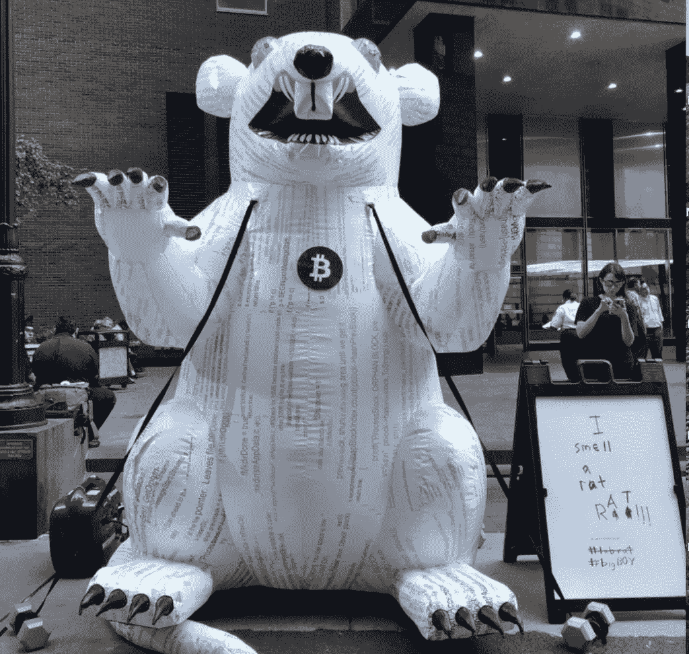
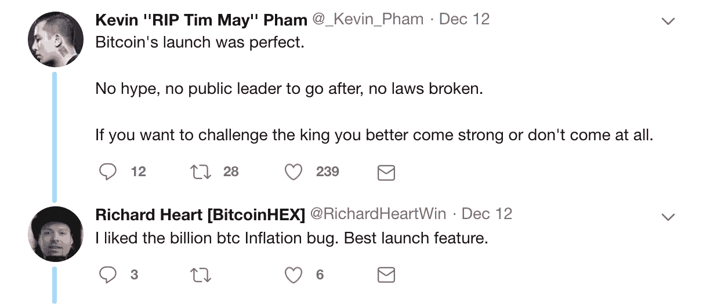
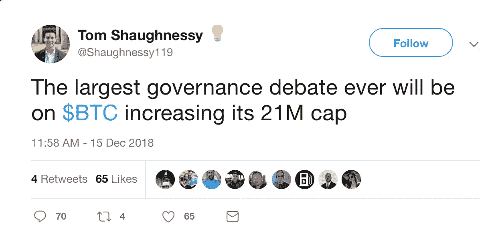

# 膨胀的比特币

> 原文：<https://medium.datadriveninvestor.com/inflating-bitcoin-d8634c3e5c0d?source=collection_archive---------5----------------------->

Image source: [https://twitter.com/BreakerMag/status/1050378632370298880](https://twitter.com/BreakerMag/status/1050378632370298880)

比特币在过去 10 年中呈指数增长的原因之一是，围绕程序化固定供应有着压倒性的共识- [它似乎是不可膨胀的](https://keepingstock.net/bitcoin-refuses-to-centralize-1c2a50182d28)。**这是比特币**独有的特质。如果其他所有已知资产的价值上升到足以保证增加供应的程度，它们就容易出现通胀。例如，如果黄金的价值增加，我们会花更多的时间和精力去开采黄金，直到供求达到平衡(开采的利润趋于零)。

我将详细介绍让比特币膨胀需要采取的步骤，以及我认为不可能说服市场接受通货膨胀的原因。**我听到的认为比特币可能膨胀的观点可以归结为两种可能性**。

# 可能性 1:发现并利用了一个漏洞，使得某些人可以增加供应量

BTC has already had 2 inflation bugs discovered and fixed to maintain the consensus around the 21m supply limit.

这是有人可能试图膨胀比特币的最现实的方式，2018 年 9 月，[开发人员发现并修复了一个漏洞，*可能被利用来完成这个*](https://cointelegraph.com/news/the-anatomy-of-bitcoin-cores-recent-bug)。想象一下如果这个 bug 被利用了。每个运行含有漏洞的比特币客户端的人现在都违背自己的意愿膨胀了他们的财富，发现自己由于错误地运行有漏洞的软件而意外地陷入了一个不一致的网络(旧的比特币客户端没有受到影响)。有非常强烈的经济动机促使他们运行软件的补丁版本来重新达成共识。共识由市场和全节点运营商决定运行哪些软件来衡量。

我更新了我的个人节点来运行打了补丁的软件，以防止漏洞被利用。如果漏洞被利用了，我肯定会运行一个修补了漏洞的客户端，因为没有人能强迫我运行他们的漏洞软件。在这种情况下，如果修复得到市场和全节点运营商的压倒性共识，更新将把比特币分成 2 个网络。第一个网络是反对 bug 的大多数，第二个网络是支持 bug 的少数。我会把我在少数通胀虫网络上的所有硬币换成多数无虫网络上的硬币。如果一个新的网络是在违背共识的情况下创建的，那就不是通货膨胀，而是一个廉价的仿冒品，也是共识用户从非共识用户那里重新分配比特币的机会。这个漏洞会影响比特币的应用吗？从短期来看，是的，但可能不是长期的，因为网络几乎肯定会遵循无通货膨胀的分类账，因为像我这样的个人会用有问题的版本来交换无通货膨胀的版本。出于共识创造出来的比特币网络克隆体的价值([巴布](https://coinmarketcap.com/currencies/bitcoin-cash/)、 [BTG](https://coinmarketcap.com/currencies/bitcoin-gold/) 、 [BCX](https://coinmarketcap.com/currencies/bitcoinx/) 、 [BCD](https://coinmarketcap.com/currencies/bitcoin-diamond/) 、 [BTCP](https://coinmarketcap.com/currencies/bitcoin-private/) 等。)与 BTC 相比，历史证据表明，市场严厉惩罚那些试图违背共识、从比特币价格上涨中获利的人。

# 可能性二:比特币参与者达成共识通胀供给

Bitcoin is governed by the market and by which software node operators choose to run (economics). You can’t debate economic reality.

由于关于供应已经建立了压倒性的共识，这是极其不可能的，但我从怀疑者那里听到的前提是:一旦在 2140 年达到 2100 万的供应上限，网络就不再能够通过矿工费用来维持所需的安全水平，使其容易受到攻击。绝大多数用户将运行新的比特币实施方案，这些方案会增加供应量，以给矿商额外的激励，让他们以一定的通胀成本来保护网络。这将是一个硬分叉，这意味着它将创建 2 个网络，除非它有 100%的共识，然后市场将通过完全放弃不可膨胀的网络来选择具有膨胀的网络。

为了使*有意义，这个论证必须做出如下假设:*

1.  在接下来的 122 年里，尽管比特币是它被创造出来的原因，尽管我们在头 10 年目睹了它的指数级增长，尽管它的[经验](https://coin.dance/volume/localbitcoins/COP/BTC) [证据](https://coin.dance/volume/localbitcoins/KZT/BTC)表明它的[目前](https://coin.dance/volume/localbitcoins/KES/BTC) [越来越多地](https://coin.dance/volume/localbitcoins/NGN/BTC) [被采用](https://coin.dance/volume/localbitcoins/PEN/BTC)，尽管所有的[经济理论和货币历史](https://fee.org/articles/what-do-we-mean-by-sound-money/)都描述并预测了它的持续增长。如果整个世界都将比特币作为主要货币，很可能所有剩余的能源都将被用来保护比特币，因为每个人都需要它来保护自己，而我们彼此不信任。
2.  采矿看起来与今天一样，这意味着 ASIC 芯片并不超级便宜，没有广泛分布，也没有确保网络完全摆脱过剩的可再生能源。比特币不一定需要挖矿才能作为一个特定的行业来运营。矿业已经走上了将[变成](http://www.thinkgeoenergy.com/bitcoin-mining-fuelled-by-geothermal-power-in-iceland-to-create-new-gold-rush/) [的标准](https://bitcoinist.com/huge-wind-farm-to-power-bitcoin-mining-will-be-built-in-north-africa/)用于[绿色](https://cointelegraph.com/news/new-york-state-to-see-bitcoin-mining-operation-powered-by-hydroelectric-dam-in-q4-2018) [能源](https://www.geekwire.com/2018/bitcoin-miners-central-washington-start-paying-electricity/) [生产](https://bitcoinexchangeguide.com/paraguays-itapua-hydroelectric-dam-becomes-point-of-interest-for-new-bitcoin-mining-operation/)作为抵消[能源](https://www.ccn.com/australia-could-see-first-solar-powered-bitcoin-mining-farm-in-coal-town/)过剩[的](https://bitcoinnews.com/powering-bitcoin-mining-with-nuclear-reactors-could-be-the-future/)[成本](https://www.ccn.com/bitcoin-mining-wind-turbines/)的途径，使得[绿色](https://www.newsbtc.com/2018/09/05/canadas-ocean-falls-turns-to-bitcoin-mining-to-breath-life-into-rural-town/) [能源](https://qz.com/1026605/photos-chinas-bitcoin-mines-and-miners/) [比更脏的替代品](https://bitcoinmagazine.com/articles/op-ed-can-solar-power-drive-bitcoin-mining-africa/)更便宜。
3.  最后，如果上述 2 个假设是正确的，它假设围绕放弃不可膨胀版本的比特币并在可膨胀版本上全力以赴达成压倒性共识是可能的。这是极不可能的，因为它要求非采矿节点运营商投票反对他们的经济利益(贬值自己的财富)，并给予采矿节点额外的权力。比特币前 10 年的[更高的供给发行率](https://medium.com/@jimmysong/mining-centralization-scenarios-b74102adbd36)和国家经济如何随时间演变的[历史](https://www.washingtonpost.com/news/monkey-cage/wp/2016/03/29/how-wall-street-became-a-big-chunk-of-the-u-s-economy-and-when-the-democrats-signed-on/?noredirect=on&utm_term=.3826946d6497)都证明了通货膨胀如何随着时间的推移导致财富集中。

所有这些都表明，除非人类进化成某种非人类的蜂群思维生物，或者除非一个有意识的邪恶 AI 同时入侵每台计算机并控制比特币网络，关闭整个世界经济并奴役人类，**比特币不会膨胀**。