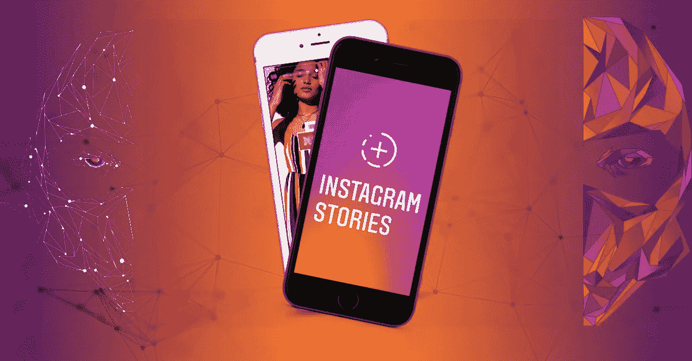

# 2019 年影响者营销— Instagram 风格

> 原文：<https://medium.datadriveninvestor.com/influencer-marketing-2019-instagram-style-29bc6ad9f00b?source=collection_archive---------11----------------------->

[*正如我们上次讨论的*](https://medium.com/@NinjaPromoAgency/trends-of-influencer-marketing-for-2019-3396c0e2e000) *，Instagram 在 2018 年爆发了，很可能会在整个影响者营销领域占据更大的份额。所以今天我们在*[*Ninjapromo*](http://ninjapromo.io/?utm_source=medium&utm_medium=article&utm_campaign=instatrends19)*就来说说 2019 年要牢记的#Instamarketing 的趋势。*

# **Instagram 故事**

[insta gram Stories 拥有超过 4 亿的日活用户](https://www.socialmediatoday.com/news/instagram-stories-now-has-400-million-daily-active-users/526818/)，几乎已经成为自己的一个营销平台。许多公司相当开放，在他们的影响者营销活动中将它作为一个单独的类别。

这种格式如此受欢迎的原因之一是它不断增加的功能，例如贴纸。它们的功能一直在更新，为营销人员提供了吸引注意力的新工具。此外，贴纸提供了更多与受众互动的方式——最新添加的“倒计时”贴纸证明了自己是一种非常有效的工具，可以提高对帖子的兴趣，并通知关注者即将发生的事件或发布的消息。

这导致了在不久的将来 Instagram 广告中添加贴纸的可能性，所以不要错过它们。

另一个可能与故事相关的潜在变化是出现品牌或名人相关的贴纸，类似于 Instagram 中已经存在的品牌过滤器。

# **真实性**

这是社交媒体的普遍趋势。但是由于内容的高技术质量的可访问性(*现代智能手机允许几乎专业质量的照片和视频*),真实性将在 Instagram 上变得特别流行。

平台被过滤和分阶段的照片弄得超负荷。因此，真实性和独特的体验是 2019 年在 Instagram 上变得引人注目和相关的唯一途径。因此，在 Instagram 推广期间，品牌、产品和服务应该积极使用。

# **IGTV**

就在几年前，垂直视频还被认为缺乏品味。或者最好是一些非常私人或紧急的事情，当没有时间将相机水平放置时。但随着 Instagram 的崛起，垂直视频获得了第二次机会。

IGTV 的引入允许上传超过 1 分钟长的视频，因此当目标观众主要使用 Instagram 时，无需在 YouTube 等其他平台上创建单独的帐户，也无需在这些帐户上浪费时间。

> 本质上，IGTV 为 Instagram 广告提供了另一种形式，并为品牌提供了一种接触 Instagram 观众的新方式。

# **Instagram 购物**

据专家称，超过 70%的**用户在 Instagram 上看到产品后会购买。该平台已经利用了这一点，引入了购物贴的概念，允许直接从照片上购买。由于它提供了重要的结果，这类帖子的数量很有可能会增加。鉴于该平台的主要受众——Z 世代和千禧一代——将每一个动作的便利性看得比其他任何东西都重要，我们应该预计这一功能今年会有大幅增长。**

**Instagram 带着面向广告商的新工具集步入 2019 年。对于 Instagram、其用户和营销人员来说，推广、接触和吸引观众的新方式预示着一个迷人的 2019 年。**

*感谢您阅读本文！如果你喜欢它，请分享它，并告诉我们你对微影响者与加密相关项目的相关性有什么看法。另外，你可能会喜欢我们的其他故事:*

> *-*[*2019 年影响者营销趋势*](https://medium.com/@NinjaPromoAgency/trends-of-influencer-marketing-for-2019-3396c0e2e000)
> 
> [*——区块链影响者营销手册*](https://hackernoon.com/influencer-marketing-fdff540b092e)
> 
> [*——为什么微影响者和区块链项目属于一起*](https://hackernoon.com/why-micro-influencers-and-blockchain-projects-belong-together-e1194e4cb2bd)
> 
> *-* [*ICO 发布:你想法的真实价格*](https://hackernoon.com/ico-launch-the-true-price-of-your-idea-52dcc61587d4)
> 
> [*-ICO 公关活动的主要步骤*](https://medium.com/datadriveninvestor/major-steps-of-ico-pr-campaign-3cf8a47bb6ec)
> 
> [*——在推销你的加密项目时，因为显而易见而被你忽视的事情*](https://medium.com/@NinjaPromoAgency/things-you-neglect-because-they-are-obvious-while-marketing-your-crypto-project-4100cf3bef05)
> 
> [*——ICO 为什么需要它的社区，如何关注它*](https://medium.com/@NinjaPromoAgency/why-crypto-community-matters-and-how-to-focus-on-it-ebd2d293c94)