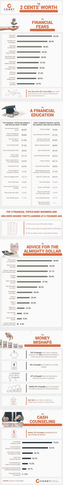

# 信息图——给千禧一代的理财建议

> 原文：<https://medium.datadriveninvestor.com/infographic-financial-advice-for-the-millennials-ea88c1474882?source=collection_archive---------20----------------------->

近期文章:头条: [**JPM 银行间的区块链，FB & TSLA 的麻烦和美联储的点状阴谋**](https://medium.com/datadriveninvestor/headliners-jpms-interbank-blockchain-fb-tsla-troubles-and-fed-s-dot-plot-d95904b87e2e) **，** [**智慧迪拜——全球首个区块链驱动的政府倡议**](https://medium.com/datadriveninvestor/smart-dubai-worlds-first-blockchain-powered-government-initiative-a5ed91544b30) **，** [**大趋势塑造 FinTech**](https://medium.com/datadriveninvestor/big-trends-shaping-fintech-a3e0c55233f0) ， [**跨境支付系统:SWIFT、RippleNet 还是 BWW？**](https://medium.com/datadriveninvestor/cross-border-payment-systems-swift-ripplenet-or-bww-891d5add58bf)

保持联系:[Twitter](https://twitter.com/fklivestolearn)|[StockTwits](https://stocktwits.com/trade_nut)|[LinkedIn](https://www.linkedin.com/in/faisal-khan-2a3009b/)|[Telegram](https://t.me/joinchat/IWzyHBGWCFwPQTe8Tm5H_Q)|[trade alike](http://www.tradealike.com/)

*原载于 2018 年 9 月 30 日 www.datadriveninvestor.com***。**