# 信息图表文摘—第 3 卷

> 原文：<https://medium.datadriveninvestor.com/infographics-digest-vol-3-da67e69d71ce?source=collection_archive---------2----------------------->

只是一封简短的感谢信，感谢大家真的喜欢这个信息图形博客。你们的支持鼓励我继续将此作为我每周的常规博客之一。这是这周的剂量。尽情享受吧！

## 人工智能(AI):

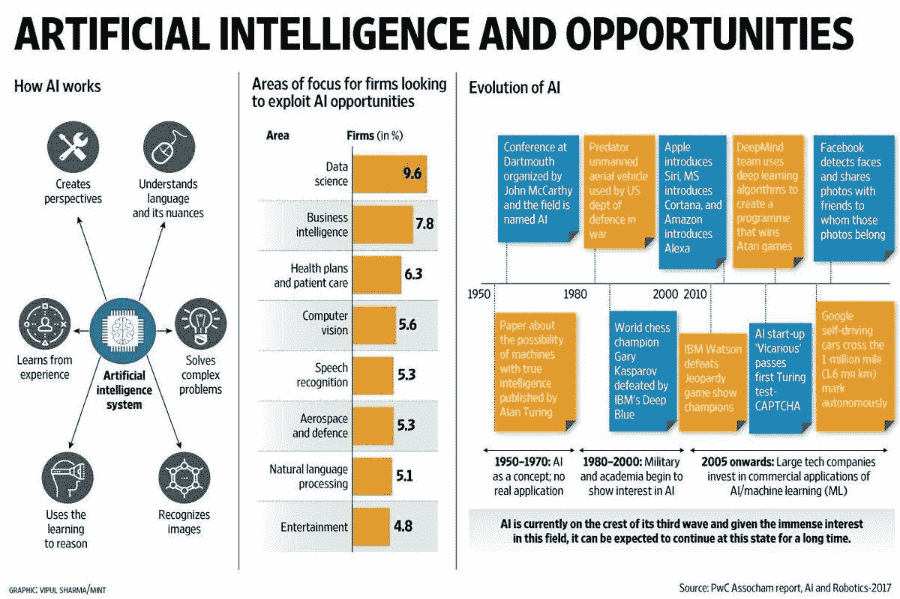

## 区块链:

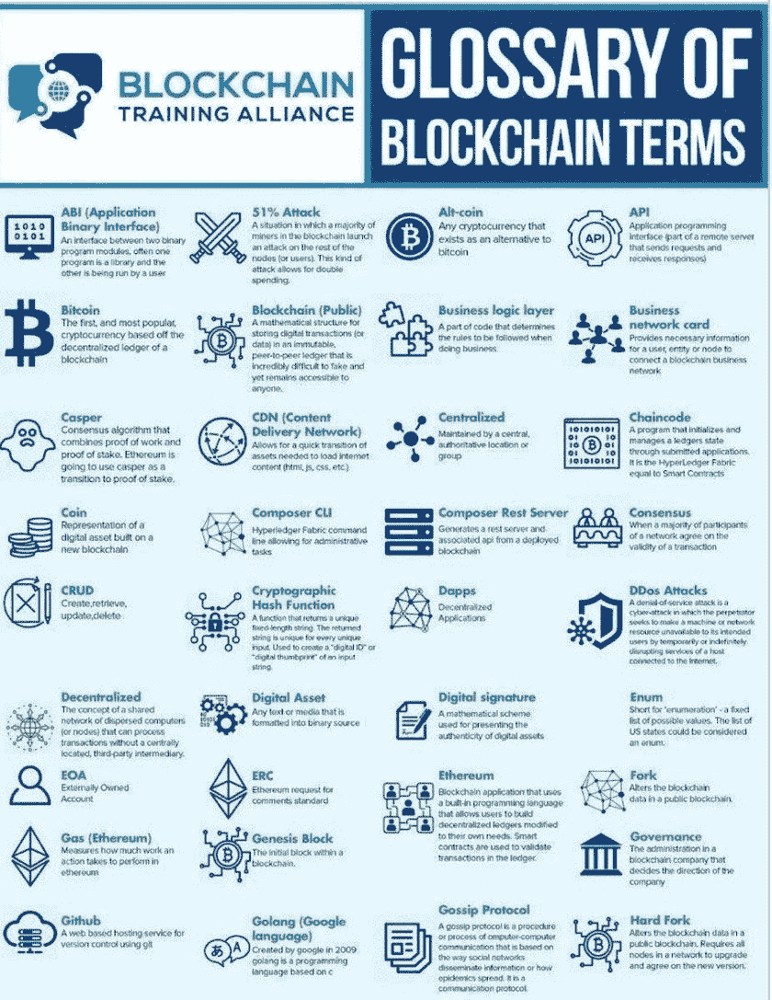

## 未来的城市:

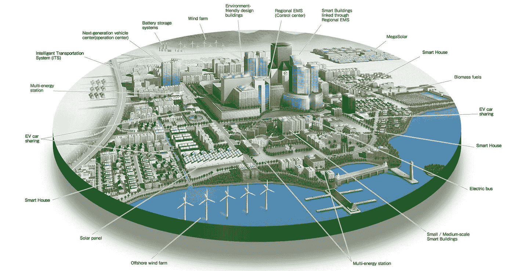

## 网络安全:

## 暗网:

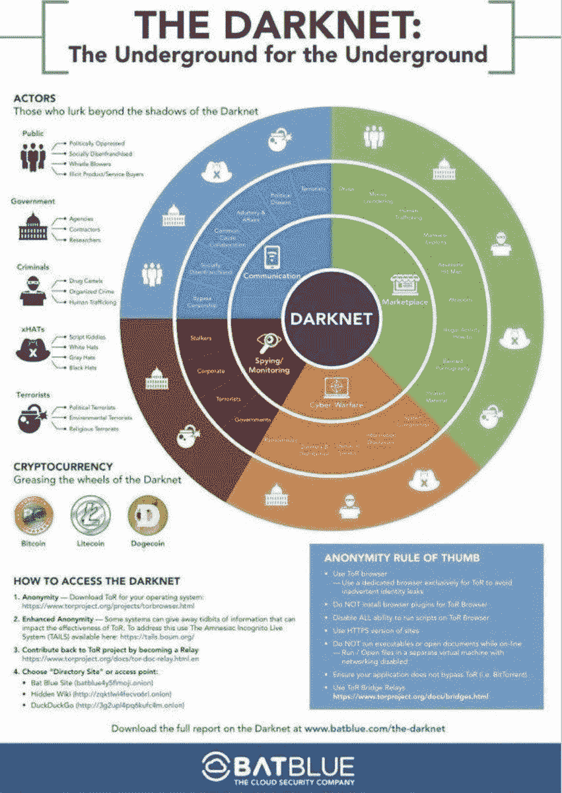

## 数字化转型:

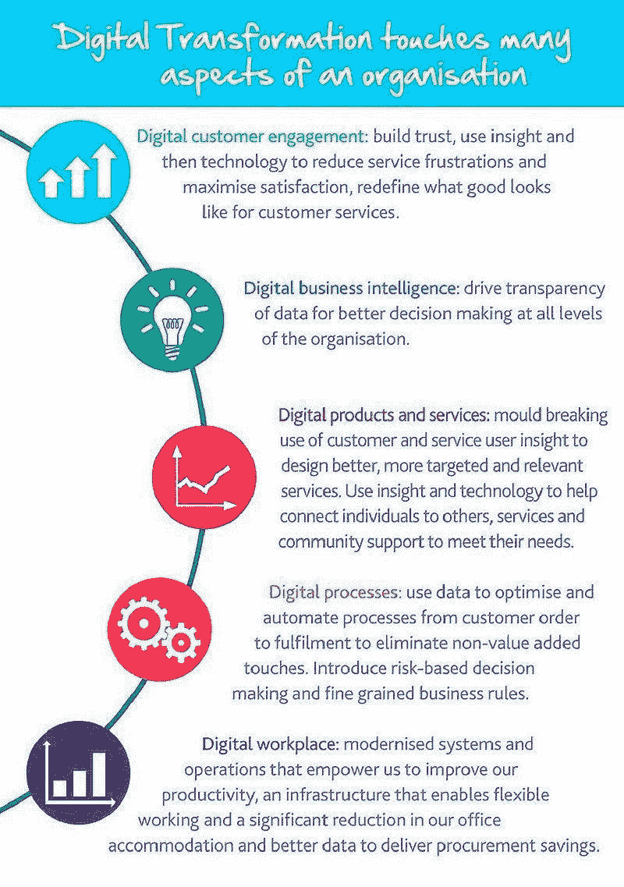

## 金融科技:

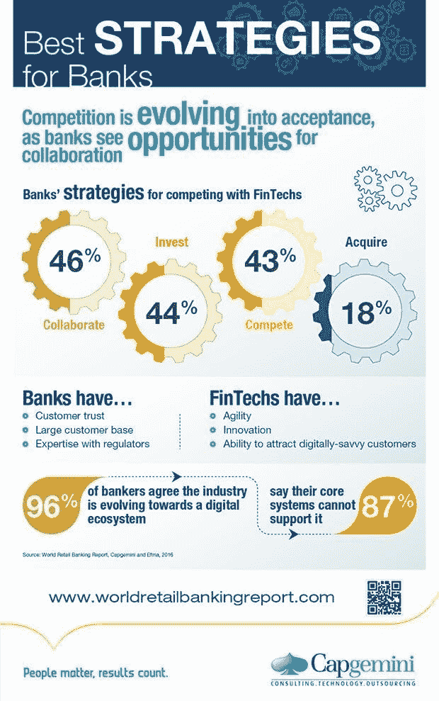

## 工作的未来:

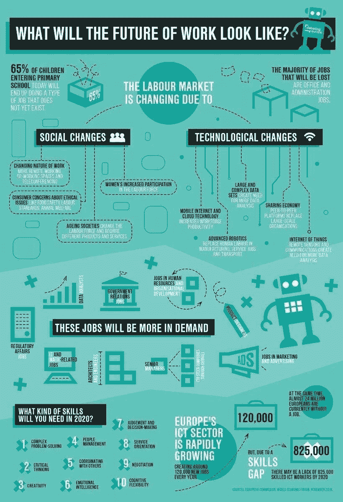

## 黑客攻击:

## 互联网:

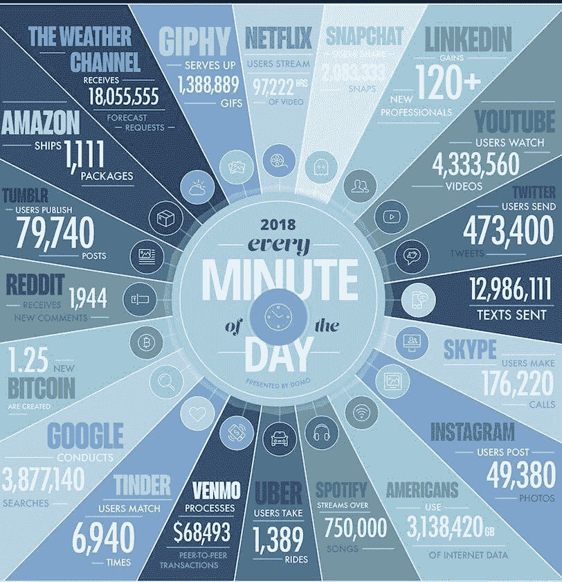

## 物联网:

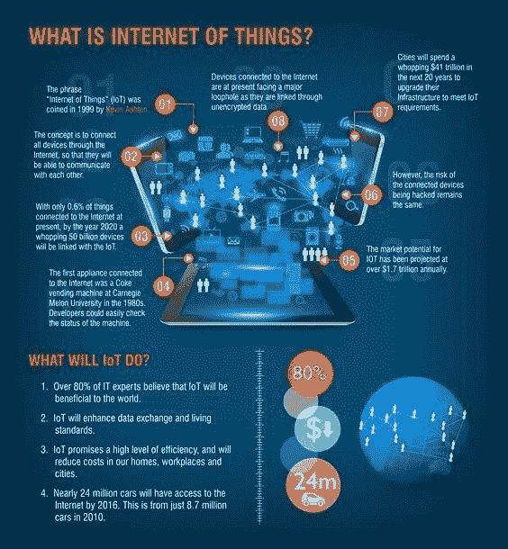

## 机器学习:

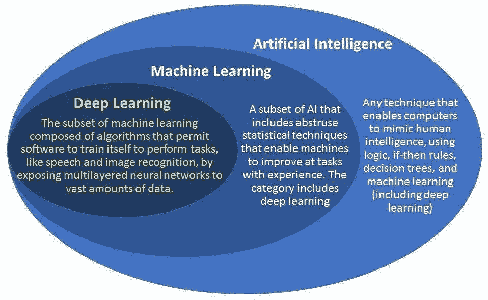

## 市场(科技公司):

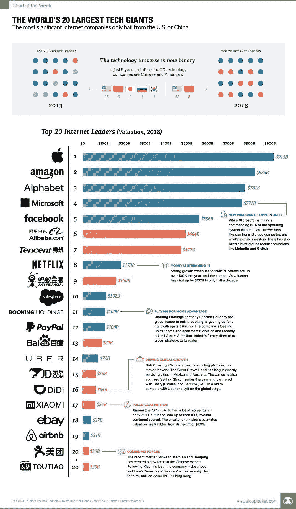

## 移动货币:

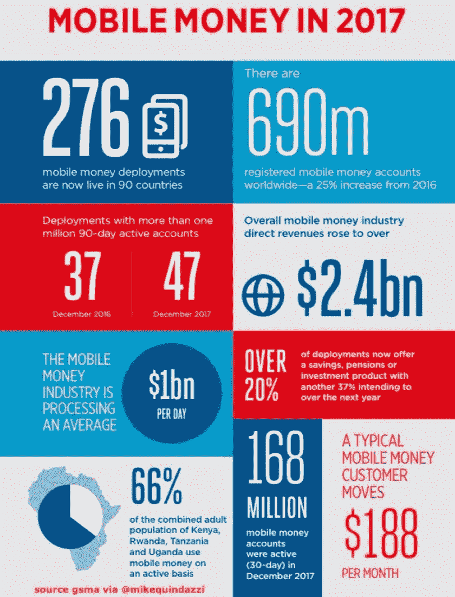

## 搜索引擎优化:

## 未来的技能:

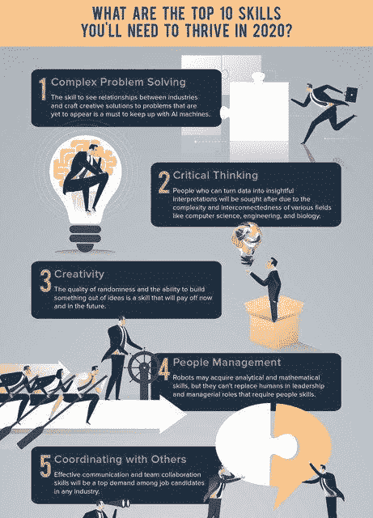

## 创业公司:

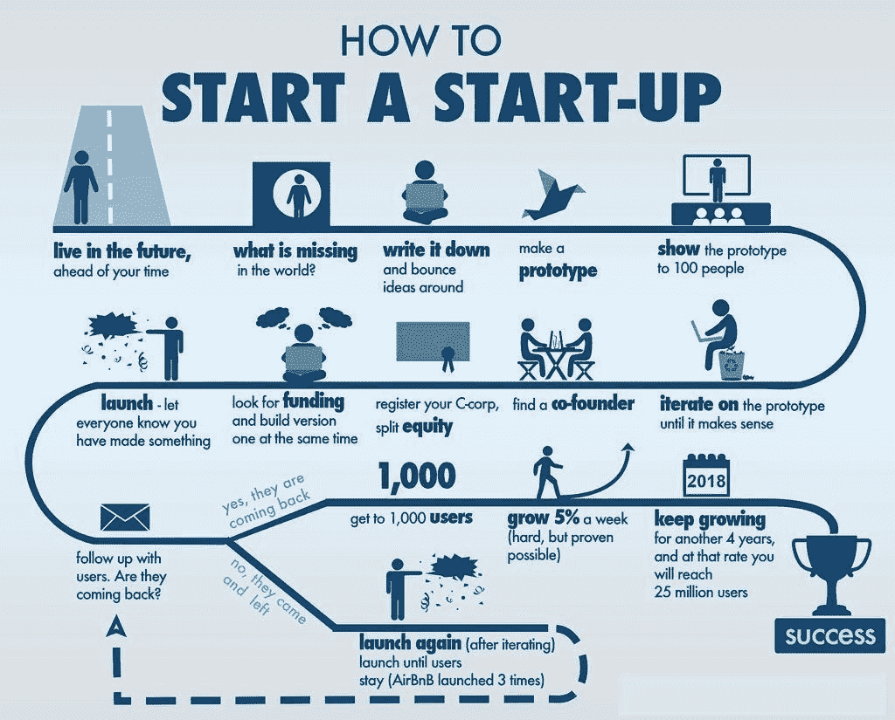

## 技术发展:

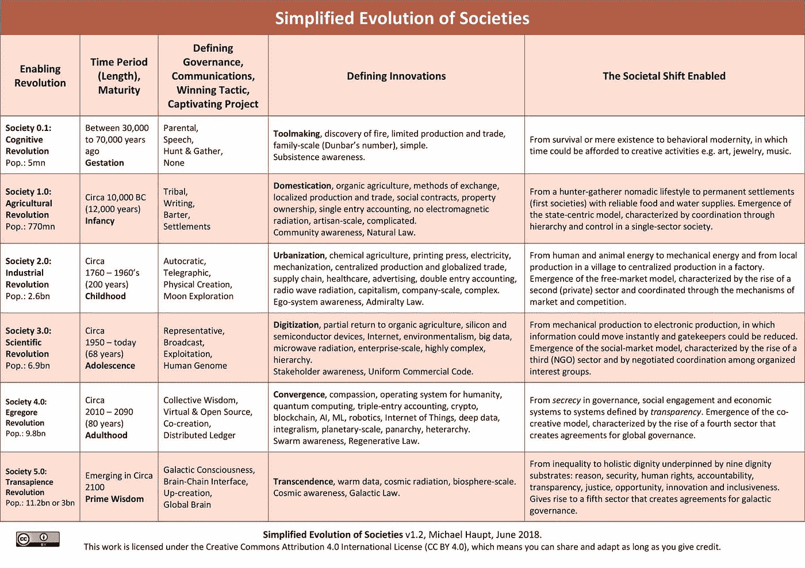

## 技术术语:

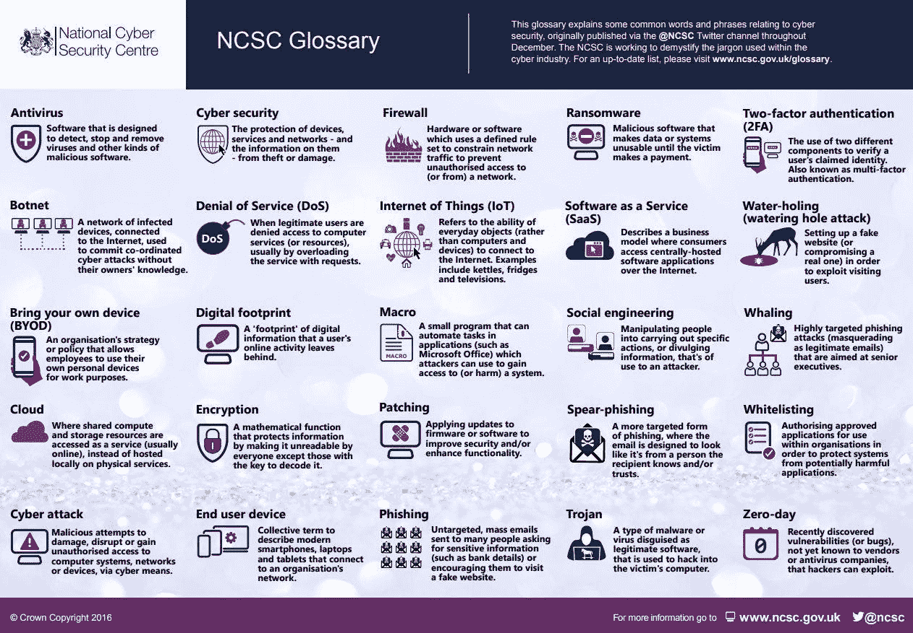

## 交易:

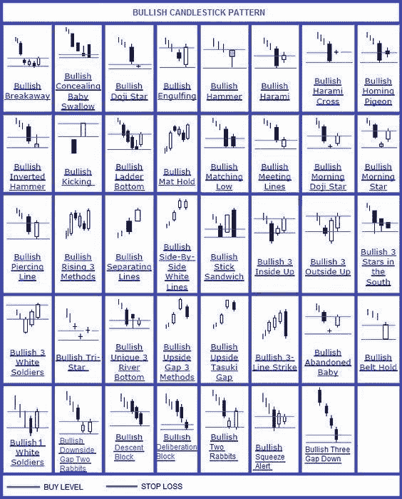

保持联系:[Twitter](https://twitter.com/fklivestolearn)|[StockTwits](https://stocktwits.com/trade_nut)|[LinkedIn](https://www.linkedin.com/in/faisal-khan-2a3009b/)|[Telegram](https://t.me/joinchat/IWzyHBGWCFwPQTe8Tm5H_Q)|[trade alike](http://www.tradealike.com/)

相关内容:[**信息图文摘要—第二卷**](https://medium.com/datadriveninvestor/infographic-special-everything-you-want-to-know-vol-2-42a1a6d32f09) **，** [**信息图文摘要—第一卷**](https://medium.com/datadriveninvestor/an-info-graphic-special-everything-you-want-to-know-f59fd714b78e)

*原载于 2018 年 7 月 7 日*[*www.datadriveninvestor.com*](http://www.datadriveninvestor.com/2018/07/07/info-graphic-digest-vol-3/)*。*