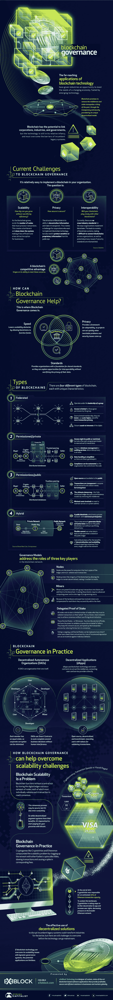

# 信息图—区块链应用、挑战和治理

> 原文：<https://medium.datadriveninvestor.com/infographics-digest-vol-7-blockchain-applications-challenges-governance-d8b8e13a917c?source=collection_archive---------16----------------------->

近期文章: [**智慧迪拜——全球首个区块链驱动的政府倡议**](https://medium.com/datadriveninvestor/smart-dubai-worlds-first-blockchain-powered-government-initiative-a5ed91544b30) **，** [**大趋势塑造 FinTech**](https://medium.com/datadriveninvestor/big-trends-shaping-fintech-a3e0c55233f0) **，** [**跨境支付系统:SWIFT、RippleNet 还是 BWW？**](https://medium.com/datadriveninvestor/cross-border-payment-systems-swift-ripplenet-or-bww-891d5add58bf) **，** [**元数据概念&差分隐私**](https://medium.com/datadriveninvestor/concept-of-metadata-differential-privacy-77c8422d8a9)

保持联系:[Twitter](https://twitter.com/fklivestolearn)|[StockTwits](https://stocktwits.com/trade_nut)|[LinkedIn](https://www.linkedin.com/in/faisal-khan-2a3009b/)|[Telegram](https://t.me/joinchat/IWzyHBGWCFwPQTe8Tm5H_Q)|[trade alike](http://www.tradealike.com/)

*原载于 2018 年 9 月 26 日*[*www.datadriveninvestor.com*](http://www.datadriveninvestor.com/2018/09/26/infographics-digest%e2%80%8a%e2%80%8avol-7-blockchain-governance/)*。*