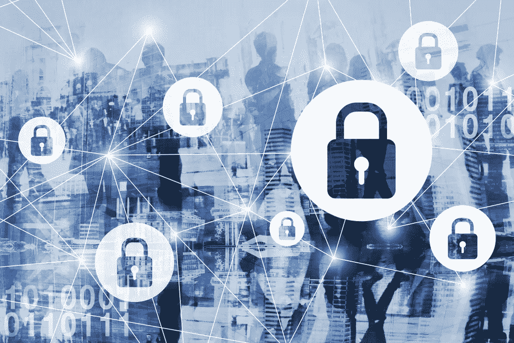

# 信息安全:三元组及相关概念和安全 API

> 原文：<https://medium.datadriveninvestor.com/information-security-triad-and-associated-concepts-security-api-56834cb282f?source=collection_archive---------15----------------------->

对于几乎所有组织来说，信息安全是保护机密数据免受网络攻击的关键一步。技术创造了一种环境，在这种环境中，迫切需要保护应用程序免受攻击、保护硬件免受黑客攻击、保护传输中的信息以及管理安全数据库中的数据。信息安全考虑四个要点:

1.  根据组织的功能保护组织的能力
2.  促进组织内安全的 IT 系统
3.  保护数据组织收集、处理和管理
4.  保护组织的软件和资产

 [## 人们对隐私的不理解是什么？数据驱动的投资者

### 你知道那种感觉。无论是访问应用程序、订阅还是你最喜欢的运动鞋。你按下…

www.datadriveninvestor.com](https://www.datadriveninvestor.com/2019/04/11/privacy-and-convenience/) 

大量的安全风险与在公司中实施[信息安全](https://www.ncbi.nlm.nih.gov/pubmed/10157659)相关联。在公司的基础设施中，云应用和服务是最薄弱的环节。软件开发人员进来了。软件开发人员有责任构建能够抵御网络攻击的应用程序和软件。构建软件而不考虑相关的威胁是不专业的。这是开发人员在应用程序中实现特性时要记住的事情。网络罪犯发现系统中的漏洞，并执行堆栈溢出或 DDoS 攻击，以停止系统并出于恶意目的运行系统。

**信息安全概念——中央情报局三部曲**

互连的业务环境和协议最需要信息安全。暴露于产生大量数据的公司直接或间接地与各种系统漏洞和威胁相关联，这些漏洞和威胁需要在开发时加以应对。在开发之后，安全思维不再像编写代码和修复相关安全问题时那样一成不变。为此，有一个关于信息安全的 CIA 三元组的概念，它给出了对威胁类别的更广泛的理解，许多安全威胁都与威胁类别相关联。

1.  **保密**

机密性仅仅意味着组织的数据对其用户的访问是受控的。向用户提供受控的访问权限非常重要，例如，查看或编辑数据的权限等。如果组织中的用户只能查看数据，他无论如何都不能编辑数据。允许以高度安全的方式访问机密数据。机密性的三个主要概念是:

**验证:**验证用户身份的过程。为了确保这一点，可以做三件事，通过 PIN 或密码证明，即你知道的和私人的东西，提供令牌，即你拥有的东西，或通过生物特征证明你的身份，等等。也就是你是什么。

**授权:**经过认证的身份被允许访问数据的过程。例如，登录到您组织的系统并不意味着您可以访问每个数据库。授权确保向特定用户提供受控访问。

**加密:**一种通过强密码功能来确保系统机密性的方法。由于数据始终在组织中流动，因此有必要保护数据包，使其在传输过程中不会被更改，并在从源发出时到达目的地。

**2。完整性**

完整性意味着数据的状态保持不变，即数据在到达目的节点后与从源节点发出时一样。为了确保这一点，使用强加密哈希对数据进行哈希处理，以减少在传输过程中更改数据完整性的机会。攻击者首先必须找到相应的密钥来打开传输中的数据，而这很难在几秒钟内完成。嗯，也要看用的密码功能有多强。

此外，这里的**责任**意味着系统知道谁在什么时候改变了系统中的某些东西的能力。它确保检测到变化并尽可能快地修复错误。

另一个概念是**不可否认性**。不可否认性意味着负责做一些改变的人被记录在审计员的记录中。编辑与他所改变的系统部分相关联，并对其负责。现在，用户不能否认他所做的更改，因为它已经被审计了。

**3。可用性**

可用性仅仅意味着数据在需要时可用。这是信息安全的一个重要方面，即确保数据始终存在于数据库中，并且可以在需要时使用。最常见的导致数据在用户需要时不可用的网络攻击是拒绝服务(DoS)和分布式拒绝服务(DDoS)攻击。

灾难恢复是一个与可用性相关的概念，可用性是指当公司的重要信息因自然或非自然灾难而遭到破坏时，可以采取行动的计划。类似地，故障转移也是一个概念，通过这个概念，如果主数据当时不可用，可以使用辅助数据。另一个数据实例用于填补空白。弹性是另一个相关的主题，它描述了系统抵御攻击的能力，即系统能够维持其状态和功能以通过人工智能或其他技术手段对抗攻击的能力。它有一些备用能量来保持它，而不是简单地随着攻击而下降。

**在线身份验证 API**

随着技术进步的增加，无论是向客户交付软件还是开发内部安全性，对信息安全的需求也在增加。为了避免网络攻击和相关的漏洞，[在线身份验证](https://shuftipro.com/api/docs/)已经以一种更好的方式覆盖。API 与识别和验证每个入职客户(如果是在线平台)的系统相集成。

每个身份都用这个 API 进行验证，软件开发人员将这个 API 作为第一道防线，帮助在系统和组织中引入可靠性。它符合信息安全原则，即 CIA triad。自动代码生成器(基于 API)允许开发人员在几秒钟内集成验证 API，并通过分别验证每个身份来监控传入和传出的流量。这是一种区分网络中漫游的可信和不可信流量的解决方案。

为了保护 IT 的全面管理，信息安全开始发挥作用。为了成功开展业务并打造完整的产品，信息安全是最重要的方面，应该通过创新的方法或通过满足基本和[智能安全](https://shuftipro.com/blogs/digital-id-verification-the-key-to-developing-intelligent-security-systems/)需求来实现。组织中的敏感信息不仅属于组织本身，用户信息也同样重要。攻击者通过常见的 DDoS 攻击、堆栈溢出攻击、网络钓鱼攻击和类似的网络攻击来执行恶意代码。随着时间的推移，这些攻击变得越来越复杂，为了阻止攻击的风险，需要在组织系统中安装完善的安全工具和技术。