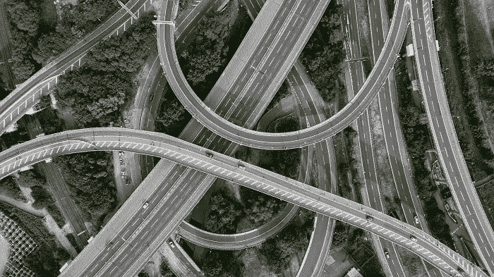

# 无人机测绘将基础设施技术带到了另一个高度

> 原文：<https://medium.datadriveninvestor.com/infrastructure-technology-takes-it-to-another-level-with-drone-mapping-aa72fd0896a0?source=collection_archive---------23----------------------->

甚至更多，但你必须继续阅读才能找到答案。

我们经常认为这是理所当然的，但事实上，我们甚至有了*公路*和*机场*已经成为一场巨大的工业革命，催生了繁荣时代，除非卡车司机有办法到达多个企业，运送他们运营所需的所有货物和材料，否则国家就无法运转。这就是我们所说的*基础设施*。每个直辖市、每个州、每个国家的基础——运输、配送、物流等的中心枢纽。你会认为有更好的方法来实现所有这些(确实有)。

# 毕竟头疼的事情很多，运输物流方面更多

交通堵塞、故障、封锁、撞车、报告丢失、人为错误、吃力不讨好的工作(特别是在某个政府关闭期间):我们在每天的新闻中都听到这些，所以肯定有*有*来改善所有这些(同样，我们已经提到过它…但是有*就有*。

它叫做**麦格理集团**，地球上最大的基础设施资产管理者。

路透社报道称，该公司为无人机地图系统的开发提供了种子资金，甚至还有一项电动汽车共享业务。那是*野心*用大写**一个**拼出来的。

他们想做的是从收费公路推进到车辆共享，并瞄准急需的技术，用无人机开发来革新航空业。天空的*字面上的*这里的极限。

随着对一些初创公司的支持，如无人机运营商的空域信息提供商 *AirMap* 和城市地区按需电动汽车产品平台 *Envoy Technologies* ，毫无疑问:麦格理正在推动这项技术彻底改变我们日常工作的基础——支持金额接近 100 万美元，甚至额外 1000 万至 2000 万美元的后续投资。

# 这是对一种新兴技术的有力支持

一项可以包含更多内容的技术:[区块链](https://vigyaa.com/@pierre/germany-takes-a-chance-not-a-risk-on-the-blockchain-and-heres-5ab50e24/)，[金融科技](https://vigyaa.com/@pierre/5-reasons-why-mobile-technology-benefits-the-money-minded-00331c57/)， [NLG](https://vigyaa.com/@pierre/making-technology-a-natural-part-of-humanity-the-advent-of-nlg-04989361/) 也是如此。你说吧。这是因为我们的整个框架依赖于我们周围的建筑、网络等基础设施。一切都将改变——但会变得更好。

你对基础设施技术有什么想法吗？ [**创建自己的 VIGYAA 账号，开始发布！**](https://vigyaa.com/accounts/login/)

*原载于*[*vigyaa.com*](https://vigyaa.com/@pierre/infrastructure-technology-takes-it-to-another-level-with-drone-ma-707de562/)*。*