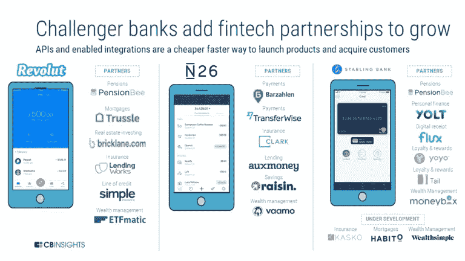
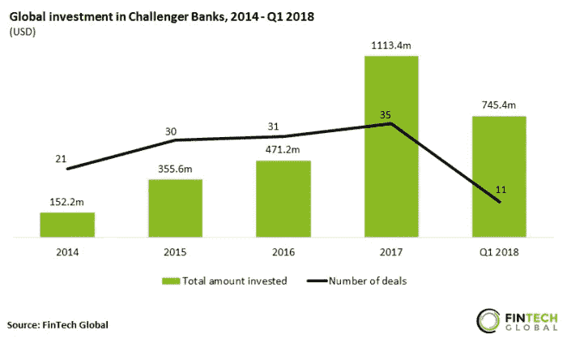
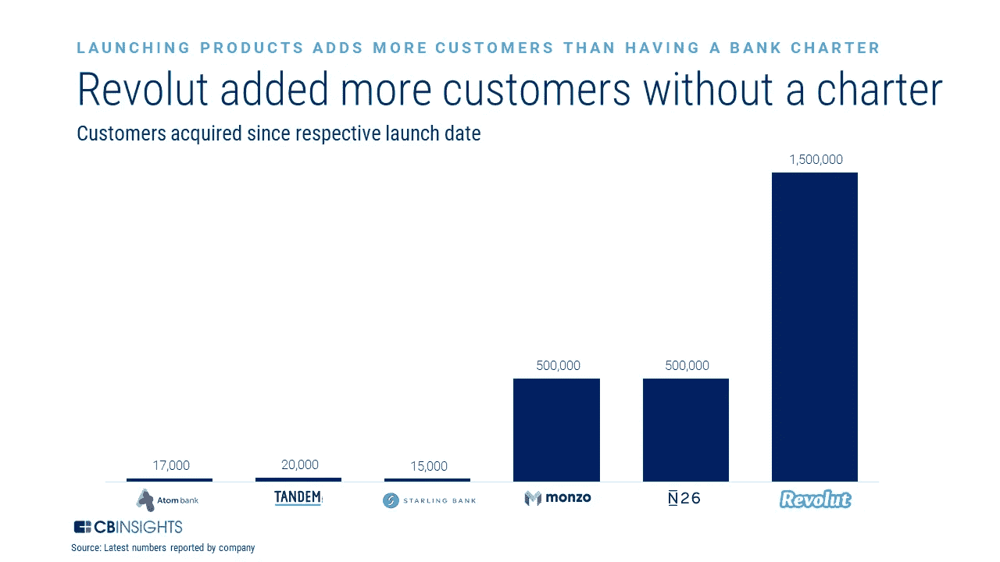

# 创新、挑战者银行和诱人的彩票

> 原文：<https://medium.datadriveninvestor.com/innovation-challenger-banks-and-the-luring-lottery-309b4a9b7657?source=collection_archive---------5----------------------->

Dandelion / [Unsplash](https://unsplash.com)

> 挑战者银行正在利用技术重建金融服务。融资正在飙升，新进入者的数量也在成倍增加，而现有企业正准备做出积极回应。这一切将如何发展？

# 首先:什么是挑战者银行？

**挑战者银行**(或新银行)**是利用技术数字化和简化零售银行业务**的公司。他们使用数字分销渠道来提供有竞争力的零售银行服务(如账户、信用卡、贷款、抵押贷款或投资产品)，迄今为止，他们的目标是服务不足和未得到服务的人群，如数字本地人、低收入消费者、外籍人士/移民或小企业。

新银行是在改善用户体验的基础上成长起来的，现在，随着最成功的银行寻求扩大规模，它们都在拓展新市场，并通过与其他金融科技的 API 集成(所谓的重新捆绑)推出新产品。

*Rebundling of banking services /* [*CB Insights*](https://www.cbinsights.com/research/challenger-bank-strategy/)

# **市场格局:像 1849 年一样匆忙**

像 [Revolut](https://www.cnbc.com/2018/06/07/revolut-has-2-million-users-to-launch-commission-free-trading-service.html) 、 [Nubank](https://www.reuters.com/article/us-tencent-holdings-nubank-m-a/chinas-tencent-invests-180-million-in-brazil-fintech-nubank-idUSKCN1MI20L) 、 [N26](https://techcrunch.com/2018/06/04/n26-now-has-1-million-customers/) 或 [Monzo](https://techcrunch.com/2018/10/30/monzocorn/) 这样的著名挑战者银行最近因其**爆炸性的客户增长、创纪录的融资和独角兽级别的估值**而成为头条新闻。

除了这些轶事证据，挑战者银行业的整体交易活动和融资正在飙升。近十年前，无数的新贵正沿着像简单的 T21 这样的创新者开辟的道路前进，现在新进者的名单已经铺天盖地。

*Challenger banks raised record amount in 2018Q1* / [FinTech Global](http://fintech.global/challenger-banks-raised-two-thirds-of-last-years-total-in-q1-alone/)

此外，作为对潜在威胁的回应，**几乎每一家大型现有银行都在开发数字优先的银行业务**(大通银行的[芬恩](https://www.chase.com/personal/finnbank)、高盛银行的[马库斯](https://www.marcus.com/us/en/banking-with-us/about-marcus)、桑坦德银行的[超级数字](https://superdigital.com.br)或 BBVA 的[阿兹洛](https://www.azlo.com)和[丹尼森](https://www.denizen.io)仅仅是几个例子)，它们渴望与挑战者提供的服务一样好，如果不是更好的话。

我们可以假设所有这些狂热的投资活动证明了相关市场机会和盈利商业模式的存在吗？或者这只是另一个(不)理性从众行为的例子？**建立挑战者银行会成为一项有利可图的投资吗？**

# **繁荣和萧条的投资周期**

正如[引诱彩票](https://en.wikipedia.org/wiki/Platonia_dilemma)一样，风险投资行业的整体表现历史上一直与融资有关，但不是以一种好的方式。当业绩强劲时，有限合伙人投入更多资本。当投入或投资更多资本时，由于供应过剩，年份回报会受到影响。

Vintage year returns vs. capital commitments / [Kaplan & Lerner](http://faculty.chicagobooth.edu/steven.kaplan/research/kaplanlerner.pdf)

因此，随着时间的推移，风险资本的投资和回报一直受到繁荣和萧条周期的影响。也就是说，VC 有一个延迟的自我修正机制:一段时间的不良回报导致资本流入减少，进而导致回报的恢复。

挑战者银行在投资周期中处于什么位置？市场是否过热？那么，该领域当前投资活动的预期回报应该是多少？

# **风险与回报和权力法则**

尽管分析挑战者银行的融资总额可能会有所启发，但这只是部分相关。首先，融资水平只有在与他们打算征服的市场总规模相比时才有意义。在这种情况下，迄今投资于新银行的几十亿美元与零售银行数万亿美元的全球市场资本相比相形见绌。

第二，平均或预期回报只是故事的一部分，因为我们不是生活在一个正态分布的世界里。我们生活在[权力法则](https://en.wikipedia.org/wiki/Power_law)之下。正如[彼得·泰尔](https://www.amazon.es/Zero-One-Notes-Startups-Future/dp/0804139296)所指出的，“这种极少数人从根本上超越所有竞争对手的异常鲜明的模式，在自然和社会世界中无处不在地围绕着我们”。因此，**我们可以预期，挑战者银行的投资回报也将遵循幂律**:少数新银行的表现将远远超过其他银行。

Customer acquisition starts to resemble a power law / [CB Insights](https://www.cbinsights.com/research/challenger-bank-strategy/)

# **前进的道路**

我们不应该期待看到一个蓬勃发展(或崩溃)的新银行业，而更有可能是少数几个指数级主导的案例和相当数量的微薄甚至巨大的崩溃(这可能包括不止一家现有银行无法与挑战者竞争)。

即使是那些潜在的成功也不能想当然。诸如不愿从传统银行转型、来自其他进入者和现有者的激烈竞争、有限的客户参与、低甚至负的边际贡献等巨大挑战是新兴银行今天面临的严峻现实的一部分。

然而，当前的市场动态和资本流入只是等式的一部分。**由使命感结合在一起的小团队的专注、才能、创造力和动力将在银行业的转型中发挥至关重要的作用。**

精心的计划和完美的执行会让领导者脱颖而出。一些优秀的团队已经在努力应对这些巨大的挑战，并专注于确保他们成功的杠杆:

*   实现特定细分市场无与伦比的**客户契合度**。
*   创造差异化和**优势产品**。
*   建造更好的专利技术。
*   推广和利用网络效应。
*   比竞争对手更快、更可持续地实现规模经济。
*   发展强大且值得信赖的品牌。

# 战场已定。让战斗开始吧！