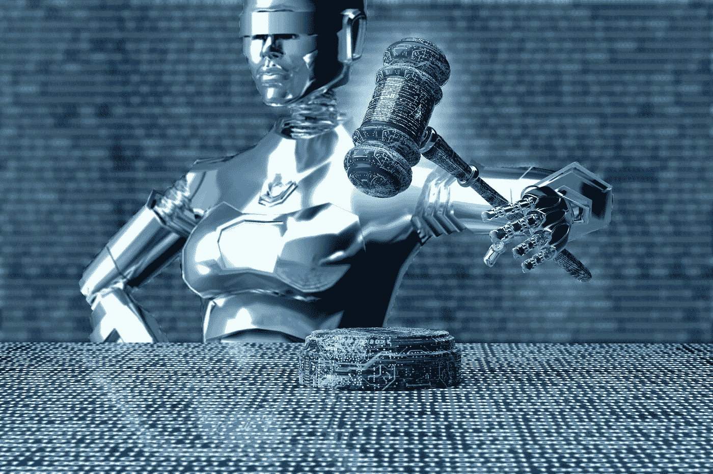

# 法律创新…你为什么要关心？

> 原文：<https://medium.datadriveninvestor.com/innovation-in-law-why-should-you-care-d59dfc487138?source=collection_archive---------7----------------------->

## 为更多的机器人律师做好准备

机器人律师来了。他们人数不多，但已经在我们中间，而且有希望有更多的人加入。

放松点。没什么好担心的。驾驭人工智能和其他尖端数据驱动技术的能力对我们法律行业的所有人来说都是并将继续是一件好事。

 [## 艾预测:“颠覆，然后是生产力”|数据驱动的投资者

### 人们越来越担心，随着机器学习和互联网的普及，所有白领工作都将消失

www.datadriveninvestor.com](https://www.datadriveninvestor.com/2018/08/06/ai-forecast-disruption-then-productivity/) 

是的。我们谈论的是彻底的破坏。我们谈论的是每个律师在不久的将来所面临的问题；已经在这里了。

太多的行业专业人士认为 LegalTech 只不过是一个时髦词，不知道它意味着什么，也不知道它涉及什么“技术”。缺乏远见不仅伤害了律师，也伤害和阻碍了整个行业。

不幸的是，尽管法律行业在发展过程中经历了一些小的变化，但它的运作方式仍与托马斯·爱迪生发明灯泡之前的 140 年基本相同。在流程、交付模式和结果保证方面，法律行业一直没有受到最近席卷从交通运输到金融等众多行业的变革性技术变革的影响。

总的来说，法律的停滞和不愿利用技术不仅损害了从业者的利益，也损害了他们所服务的客户的利益。从历史上看，每次引入技术来解决问题，它都会立即遭到怀疑、不信任和通常为反对者保留的盘问技巧。和敌人。

在一个如此依赖万无一失的业绩来证明其存在的行业，这怎么可能呢？

坐下吧。我可以列出一百万个理由。

一个很大的原因是律师是这个过程的奴隶。

只要看看这个行业是如何运作的:

法律专业人士面临一个问题。他们一小时又一小时地灌输信息；记录每一分钟的费用。希望他们能提供法律解释和解决方案。他们向客户展示他们的作品。发账单。继续前进。

如果一个律师幸运的话，他的工作成果会变成一份摘要，一份合同，或者是一个实际商业交易的框架。然而，工作产品经常消失在黑洞中。也许客户实现了它；也许他们没有。或者，这份经过充分研究的备忘录被裱起来挂在墙上，因为这是客户所能做的一切，因为他们找不到一个真正适合自己业务的实施策略。

从普通律师的角度来看，当一个公式起作用时，几乎没有改变它的愿望。法律就是这样无限运行的。

律师不愿意采用技术的另一个重要原因是，他们毫无根据地担心，他们钟爱的计费时间将随着他们的金钱永远失去。

我记得在我法律职业生涯的早期，技术辅助文档审查(TAR)被引入到诉讼期间的文档分析和制作中。在非常昂贵的发现过程中，TAR 为律师事务所节省了资源，为客户节省了资金。最初，高级同事们意识到由于我们实践中的简化程序，成百上千的计费小时被浪费了，这让他们感到恐慌。我们将如何保持灯亮着？我们如何将气体保存在罐中？

事实证明，焦油是一个伟大的东西。我们了解到人工审查并不是可靠性或准确性的黄金标准。将任务重新分配给技术人员，解放了律师去做更重要的工作。这项技术是可靠的，消除了人为错误，并再次为客户省钱。客户喜欢在法律费用上省钱，因为这让他们可以把钱花在其他重要的事情上，比如支付员工工资、进行战略投资，以及几乎任何比把钱冲进探索厕所更有价值的事情。

快乐的客户往往也是忠诚的客户。

称之为顺应时代。称之为机器人律师的入侵。称之为精明的生意。但是这种趋势确实正在流行。2017 年，我们在 61 笔交易中看到了对法律技术公司的 2.33 亿美元投资。去年，在 40 多项交易中，分配了创纪录的 10 多亿美元。

筹集这种类型的资本是法律技术的一个重要里程碑。然而，看看其他行业，如 LawGeex 所说的“LegalTech 更富有、更成功的哥哥”金融科技，2018 年的投资约为 420 亿美元。[旁注——亲爱的 LawGeex，我喜欢[“哥哥”的类比](https://blog.lawgeex.com/legaltech-hits-1-billion-investment-as-lawyers-embrace-automation/)，但也许想想将整个行业归为男性会如何让一些更富有的姐姐感到被遗忘…只是说…]

作为对比，让我们看看银行业，以及为什么金融科技正在超越法律科技。在过去一百年左右的时间里，银行业的基本运作没有发生重大变化；然而，银行业在技术辅助流程方面投入了大量资金，以使银行柜员、顾问和职员的能力和效率大大提高。手机银行甚至将部分银行业务外包给消费者。

银行业和金融业告诉我们的是，将低级别的工作或项目外包给技术解决方案和机器人并不意味着没有大量的工作要做。

那里仍然有大量的职位和工作要做，工作时间已经在别处找到了。

推翻那种认为法律服务的质量取决于为一件事情投入的数百个劳动小时的说法是一个艰难的步骤。但如果法律行业想要保持相关性并掌控自己的命运，这是它必须迈出的关键一步。

随着 LegalTech 的持续发展，我们还必须考虑变化对我们的客户意味着什么。他们习惯了按小时计费的老方法，即使他们想知道他们的服务提供商在 RFP 中的创新方面做了什么。虽然新技术会为他们省钱，但说服客户真正利用他们要求的创新仍然是一项艰巨的任务。当这项技术还没有得到法官或监管机构的批准时，这是一项更加艰巨的任务。

为新框架和平台寻找创造性应用的责任落在了律师身上。在法律中，创造力通常是一种被遗忘的技能，但是当客户对一些对所有相关方都有好处的新事物保持警惕时，创造力就必须被调用。从业者不仅应该问自己如何使用增强的技术解决客户的问题，还应该问自己如何以一种让客户对这些技术感到兴奋的方式来解决问题。

实施现代化标准需要艰苦的工作和大量的时间。法规有时可能不方便。但是法律行业会因此变得更好。我们不仅会给客户带来更有价值的结果，而且可能会降低法律费用，为以前负担不起的人提供法律服务。

法律行业将迎来一场大变革，这是肯定的。如我所说，机器人律师已经出现，还会有更多。

例如，ROSS Intelligence 是一个前沿应用程序，它利用人工智能来管理基于自然语言搜索的相关法律研究和数据。Cyxtera 的 Brainspace 使用增强智能和高级数据分析平台进行调查、电子发现、情报挖掘和合规性，该公司目前正在评估更多的使用案例。全国各地的初创企业和法学院正在开发其他数据分析方法。

在我最新的 Tech onReg 播客中，我们与西北大学法律和技术倡议主任小丹尼尔·沈小兰一起深入探讨了大学 R&D 进程。

“围绕法律、商业和技术的交叉问题授课是我们喜欢的方式，”沈小兰说。“所以这不仅仅是技术。但是想想下一代律师真正需要的技能，人际技能，流程技能，数据技能，技术技能。”

[收听](https://podcasts.apple.com/us/podcast/get-ready-for-more-robot-lawyers/id1483479206?i=1000454689582)了解我们在法律、技术和机器人律师创新方面的更多进展。

达拉·塔尔科夫斯基。企业家、作家、演说家、母亲|打造新事物；联合创始人[@ actuate law](https://actuatelaw.com/)\[@ quointec](http://quointec.com/)