# 城市交通创新:奥斯汀自行车共享项目数据分析

> 原文：<https://medium.datadriveninvestor.com/innovation-in-urban-mobility-analyzing-austin-b-cycle-sharing-program-data-56ce0cd92131?source=collection_archive---------10----------------------->

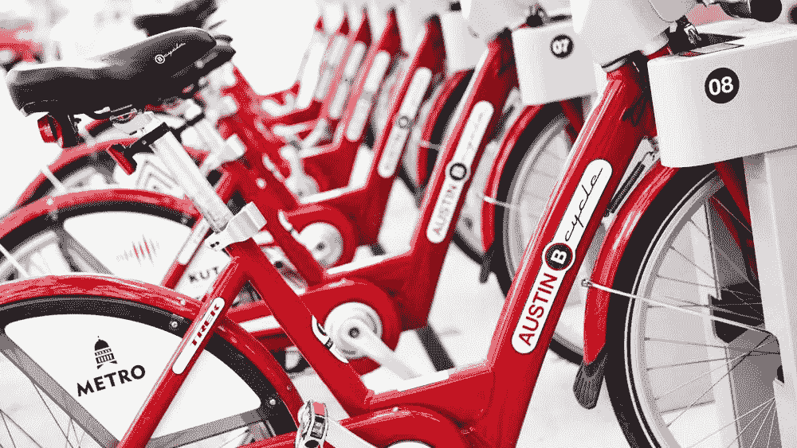

每个人都想快速便捷地从一个地方到达另一个地方，但是，说实话，交通容量已经达到了极限，尤其是在大城市。这造成了基础设施超负荷、交通拥堵和延误。我们需要考虑未来，停止创造更多的交通工具，让交通工具更加个性化。

# 奥斯汀的交通

我在奥斯汀地区，交通是这个城市的热门话题，如果你曾经试图在高峰时间开车去某个地方，你就会明白为什么。奥斯汀很棒，但它是全州通勤时间最长的城市之一。根据德克萨斯 A & M 运输协会的数据，穿过市中心的 IH 35 号公路被列为德克萨斯第三大拥堵路段！

# 协调联运

*刚刚读到这个术语和* ***联运*** *涉及到一种以上运输方式的使用。*

现代多式联运客运的主要目标是减少对作为地面运输主要方式的汽车的依赖，增加公共交通的使用。

我将把重点放在这个替代方案上，以减少对汽车的依赖，这就是自行车共享计划，特别是在奥斯汀地区。

# 自行车共享计划

我真的很喜欢骑自行车，成为自行车共享计划的一部分是一件很棒的事情，当你生活在一个高峰时间非常痛苦的大城市时！

这是可以理解的，不是每个人都能经常骑自行车上下班。有些人住得离办公室太远，或者天气怎么样，天气不好的时候你不能骑自行车！

如果你在奥斯汀市中心工作，并且住得离这个地区很近，租一辆自行车上下班是个好主意！

但是即使你不骑自行车上班，你仍然可以偶尔骑自行车。你可以以此为乐。骑自行车可以帮助你保持健康，并进行日常锻炼。经常骑自行车有很多好处。

如果你没有自行车，但仍然喜欢骑自行车，自行车共享计划是为你准备的。许多城市都有这种自行车共享计划，在特定的地理区域提供负担得起的短期租赁。这些可能由私营公司、教育机构、市政机构或公私合营企业经营。

自行车共享计划的主要目标是为当地人和游客提供一个有趣、健康、低成本的交通选择。

# 奥斯汀自行车赛

奥斯汀 B-cycle 是一项公共自行车共享计划，于 2013 年 12 月在奥斯汀推出。该系统归奥斯汀市所有，并由奥斯汀当地的 501c3 非营利自行车共享组织运营。奥斯汀 B-cycle 在 SXSW 期间立即打破了全国结账记录，成为该国最成功的自行车共享项目之一。目前，奥斯汀市区周围有 76 个自行车站。你可以在这里查看他们的网站:

 [## 奥斯汀自行车赛

### 奥斯汀自行车，游览奥斯汀的最佳方式

austinbcycle.com](https://austinbcycle.com/) 

# 分析和可视化数据

在重新定义自行车共享计划之前，我们需要了解数据并提取有意义的见解，然后做出更好的决策。

让我们从获得官方数据集开始…

你可以在**奥斯丁的开放数据门户**获得官方数据集。请访问此网站获取它们:

 [## 奥斯汀自行车旅行|开放数据|德克萨斯州奥斯汀市

### 奥斯汀自行车出行-该数据集包含奥斯汀自行车共享项目的出行数据。你也可能是…

data.austintexas.gov](https://data.austintexas.gov/Transportation-and-Mobility/Austin-B-Cycle-Trips/tyfh-5r8s) 

# 加载数据

网站上有两个数据集:

*   **奥斯汀自行车出行:**该数据集包含奥斯汀自行车共享项目的出行数据
*   **奥斯汀自行车租赁亭位置:**该数据集包含奥斯汀自行车租赁亭的位置信息。

第一个数据集包含以下字段:*旅行 ID、会员类型、自行车 ID、结帐 ID、结帐时间、结帐亭 ID、结帐亭、返回亭 ID、旅行持续分钟数、月份和年份。*

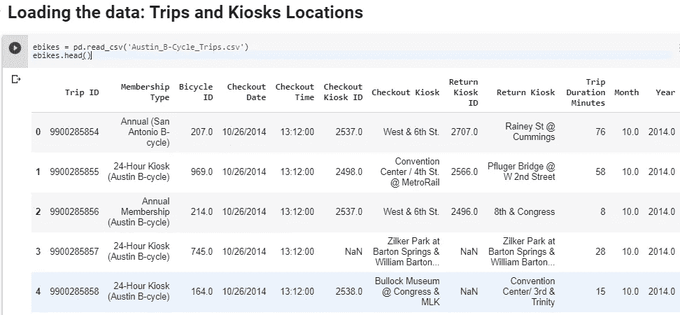

Trips Data

第二个数据集包含以下字段:*信息站 ID、信息站名称、信息站状态、纬度、经度和位置。*

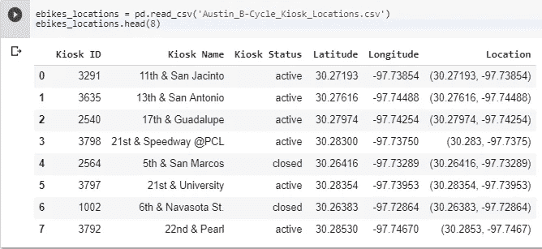

Kiosks Locations Data

# 最受欢迎的收银台

让我们挖掘数据，看看哪些是最受欢迎的收银台:

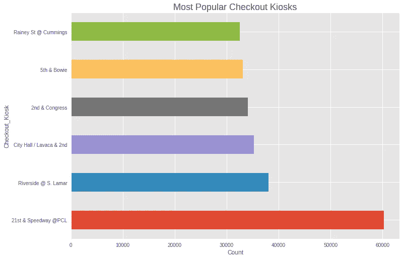

Most Popular Checkot Kiosks

如图所示，最受欢迎的信息亭是位于德克萨斯州奥斯汀东 21 街的**21 号&赛道 PCL** ，邮编 78705

但是里面有什么？让我们在地图上看看:

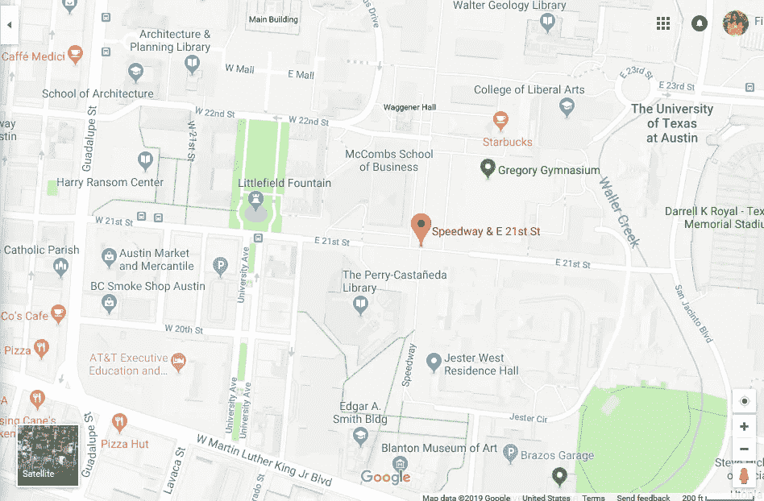

The UT!

这个亭子位于德克萨斯大学(UT ),所以它是最受欢迎的，因为学生每天骑自行车去上课，这更有意义，因为一些学生住在德克萨斯大学附近，所以自行车是上学的一个很好的选择！

# 最受欢迎的退货亭

现在让我们看看哪些退货亭最受欢迎:

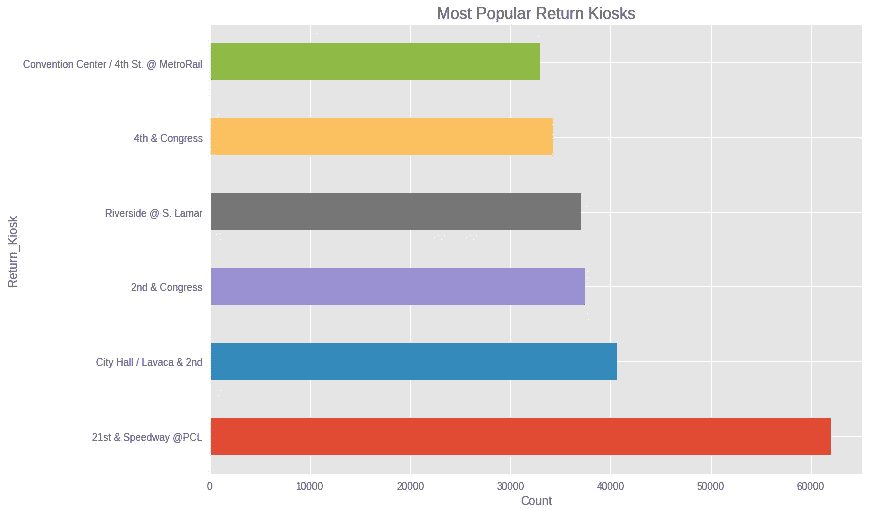

Most Popular Return Kiosks

同样的亭子最受欢迎，但是现在我们知道原因了:学生！

# 最受欢迎的会员资格

会员类型字段，可以告诉我们哪些是会员类型首选项:

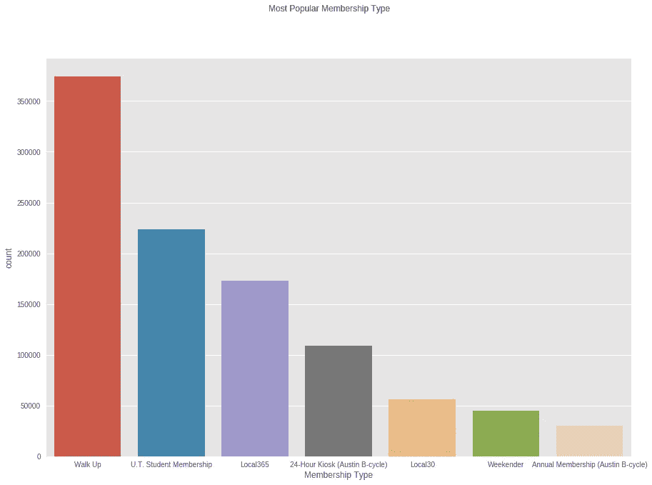

Most Popular Membership Type

**向上走**和 **U.T .学生会员**是最受欢迎的会员。我知道 U.T .学生会员会出现，但是**走上去**呢？

在网站上查了一下，好像**【Walk Up】**会员已经不存在了。他们在网站上提到了这个计划，类似于**【探索者】**会员。该计划提供以下内容:

*   24 小时开放奥斯汀 B-cycles，收费 12 美元(含税)
*   包括长达 60 分钟的无限制旅行
*   超过 60 分钟的旅程每增加 30 分钟就要花费 4 美元(含税)

让我们看看**大学学生会员**提供了什么:

*   德克萨斯大学的全日制学生每月缴纳 1 美元(含税)的费用，即可成为该校的学生会员。U.T .学生会员仍需承担额外费用，包括但不限于自行车被盗、超龄费和自行车损坏。
*   德克萨斯大学的教职员工每年可享受 50%的 Local365 Austin B-cycle 会员优惠。
*   德州大学的学生会员享有 Local365 会员的所有权益
*   在奥斯汀周围的 60 多个车站使用 500 辆自行车
*   你想骑多少次就骑多少次，一次最多 60 分钟

以及 **Local365 成员资格**:

*   80 美元/年的年度会员费(含税)
*   包括长达 60 分钟的无限制旅行
*   超过 60 分钟的旅程每增加 30 分钟就要花费 4 美元(含税)
*   在其他 B-cycle 城市中的 B-连接访问

# 最活跃的日期

多亏了“结帐日期”字段，我们可以看到哪些日期是最活跃的:

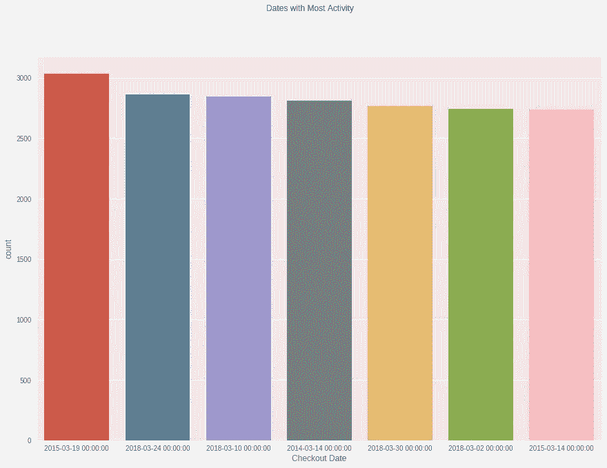

Dates with Most Activity

结果很有趣:

03–19–2015

03/24/2018

03/10/2018

03/14/2014

03/30/2018

03/02/2018

03/14/2015

所有的日期都有一个共同点:三月！我在谷歌上做了一点研究，发现了 3 月 7 日在奥斯汀发生的事情:

SXSW

**SXSW 2014 日期:**

2014 年 3 月 7 日—2014 年 3 月 17 日

**SXSW 2015 日期:**

2015 年 3 月 13 日—2015 年 3 月 23 日

**SXSW 2018 日期:**

2018 年 3 月 9 日—2018 年 3 月 18 日

最活跃的约会发生在 SXSW 约会，这并不奇怪，SXSW 约会是德克萨斯州奥斯汀最受欢迎的活动！

# 热图中的售货亭位置:使用薄层

Folium 是一个很棒的 Python 库，可以帮助您创建几种类型的传单地图。我用这个工具创建了一张地图，上面标出了奥斯汀地区的所有售货亭位置:

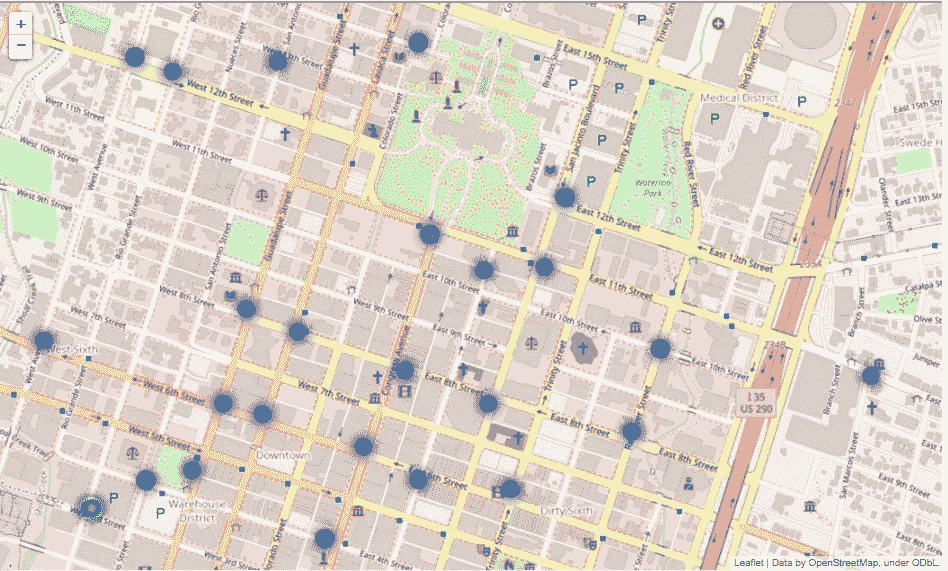

Kiosk locations in the heatmap

# 信息亭状态

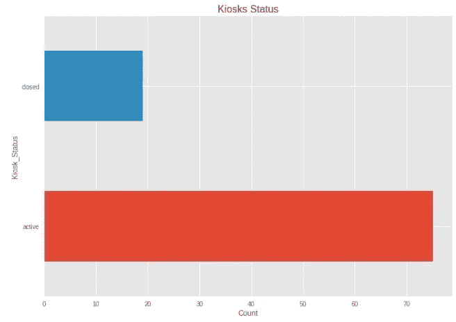

Kiosks Status

19 个报亭被关闭，75 个仍在使用。让我们看看哪些信息亭处于关闭状态:

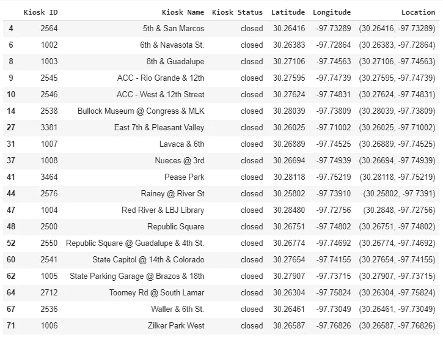

他们关闭这些售货亭可能是因为它们不像其他售货亭那样受欢迎，导致收入减少？

我认为这个地点仍然是一个很好的机会。新的活动和节日可以在这些地区进行规划，因此酒吧和餐馆可以从中受益。最好能分析每个地点，看看他们关闭这些售货亭的原因是什么。

# 活动信息亭

奥斯汀地区有 75 个活跃的信息亭:

Some Active Kiosks

# 最受欢迎的旅行月份

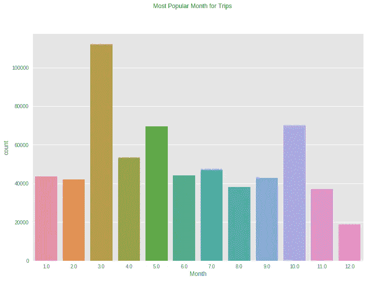

我们可以看到最受欢迎的旅行月份是:三月、十月和五月！

再次挖掘奥斯汀所有的节日和活动信息。我们知道 SXSW 每年三月举行。但是五月和十月呢？山核桃街头艺术节和奥斯汀市界限，它们分别发生在三月和十月！

奥斯汀城市极限音乐节(Austin City Limits Music Festival)是一年一度的音乐节，于 10 月连续两个为期三天的周末在德克萨斯州奥斯汀的 Zilker Park 举行。

山核桃街头艺术节是美国最大、持续时间最长的艺术/手工艺和音乐节之一，由山核桃街头协会(一个 501(c)4 非营利组织)主办。这个节日每年举行两次:2019 年春季山核桃节在 5 月 4 日和 5 日举行，2019 年秋季山核桃节在 9 月 21 日和 22 日举行。

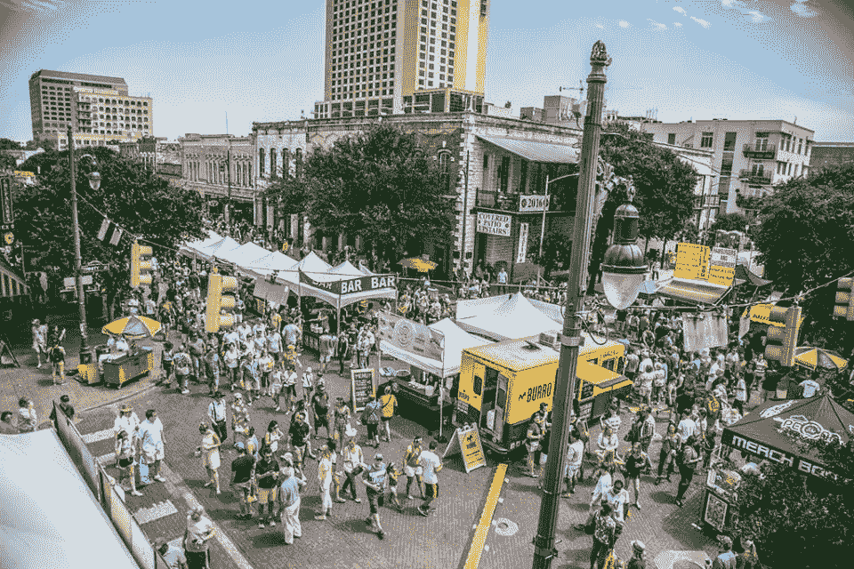

我认为这三项活动为公司创造了更多收入。在那些日子里，外面的人来参观，协助节日和会议。

# 最受欢迎的旅行日

由于 Checkout Date 字段，我们可以提取一周中的某一天，以查看哪一天的旅行最受欢迎:

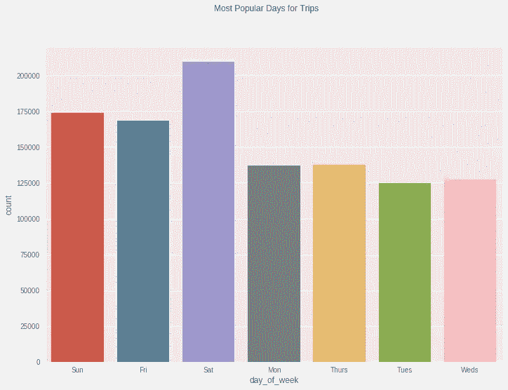

Most Popular Days for Trips

从图中我们可以看到，最受欢迎的旅行日期是:星期五、星期六和星期天。周末是在奥斯汀租自行车的最佳时间！周末是为了享受城市和乐趣，在 Lady Bird Lake 做运动，周六晚上在你最喜欢的餐厅用餐或周日吃早午餐！

# 持续时间少于 2 分钟的行程

持续时间不超过 2 分钟的旅行是不正常的。这可能是一个问题，而租用自行车，自行车是在恶劣的条件下或任何种类的错误，使用户返回自行车？

让我们来看看这些时长不到 2 分钟的行程:

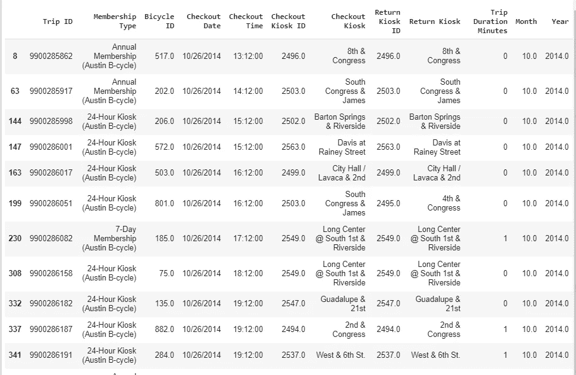

Trips with duration less than 2 Minutes

总共有 35，032 次行程持续时间不到 2 分钟。还可以观察到结账和还车亭是一样的，这就证实了自行车有问题。

# 短途旅行最频繁的日期

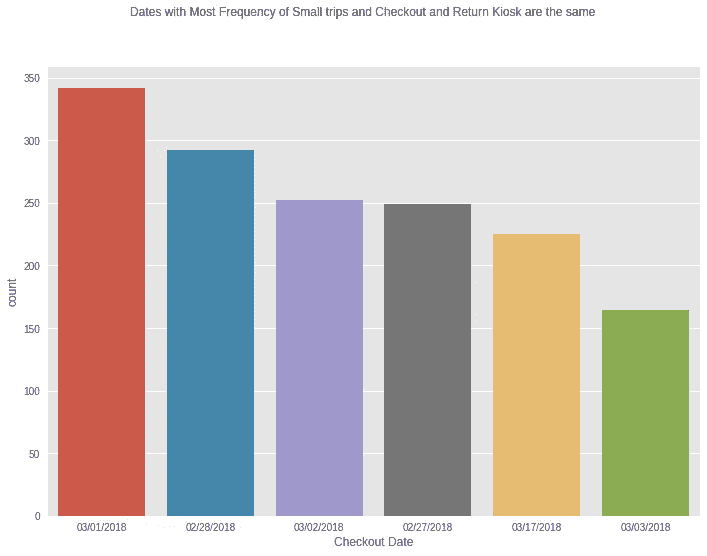

Dates with most frequency of small trips

好像 2018 年 3 月有问题，具体是 3 月 1 日。当天有 348 个用户租了一辆自行车，但时长为 0 分钟。记住 SXSW 发生在这个月。

# 短途旅行最频繁的售货亭

让我们看看哪些最受欢迎的信息亭出现了这个问题:

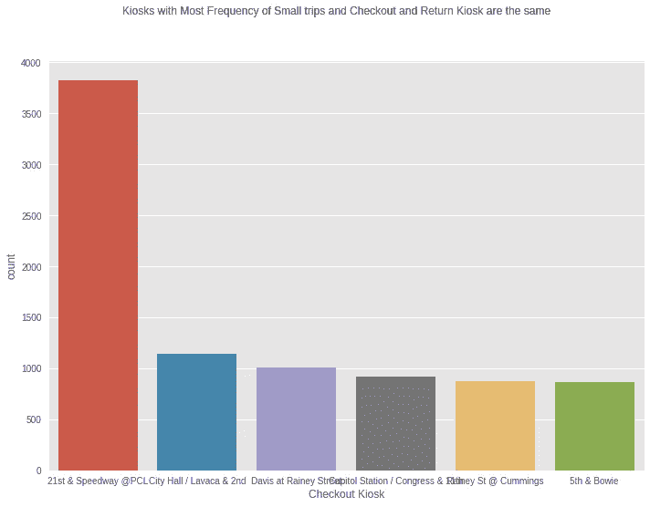

Most popular kiosks for small trips

有意思！靠近 UT 的售货亭。以及一些与 SXSW 节相关的地点。我认为学生们想去 SXSW，由于节日在不同的地方举行，这就是为什么他们更喜欢租一辆自行车从一个地方到另一个地方。

# **次数最多的小行程** s

时代周刊呢？

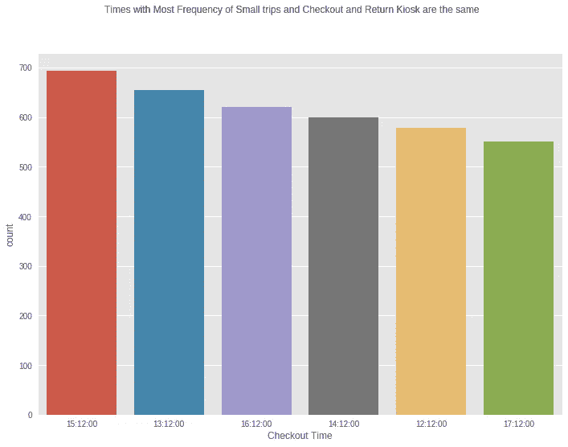

Times with most frequency of small trips

多巧啊，小行程最常见的时间是:15:12，13:12，16:12，12:12，17:12。为什么都以 12 分钟结束？

我在这里发现的唯一原因是，他们可能在某个时间从家里或任何地方出来，步行大约 10 分钟到亭子去租自行车！

# 大型旅行

现在，让我们来关注一下租用自行车进行超过 60 分钟长途旅行的用户:

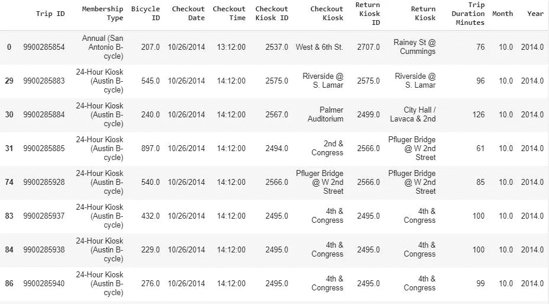

Large trips, longer than 60 Minutes

# 大型旅行和相同的结帐和退货亭！

我在这里可以推断的是，租用自行车超过 60 分钟的用户是因为他们在奥斯汀的某个地方锻炼。当结帐和归还亭相同时，您会认为用户可能会将车停在亭附近的某个地方，租用自行车超过 60 分钟，当他们完成后，他们会回到同一个亭，归还自行车，然后去他们停车的地方，这是有道理的。

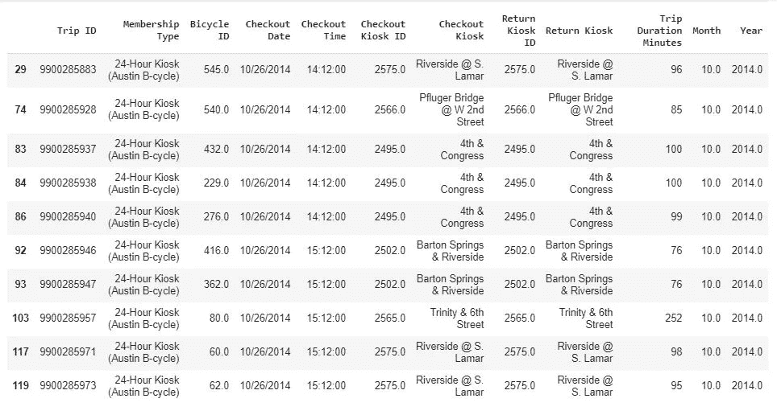

Trips longer than 60 Min and checkout and return kiosk are the same

# 上午的旅行

让我们看看中午前租自行车最受欢迎的时间:

Popular times to rent a bike before noon

11:12:00 最受欢迎，10:12 也是。他们可能是学生或工作人员。

# 下午旅行

让我们看看下午旅行最受欢迎的时间

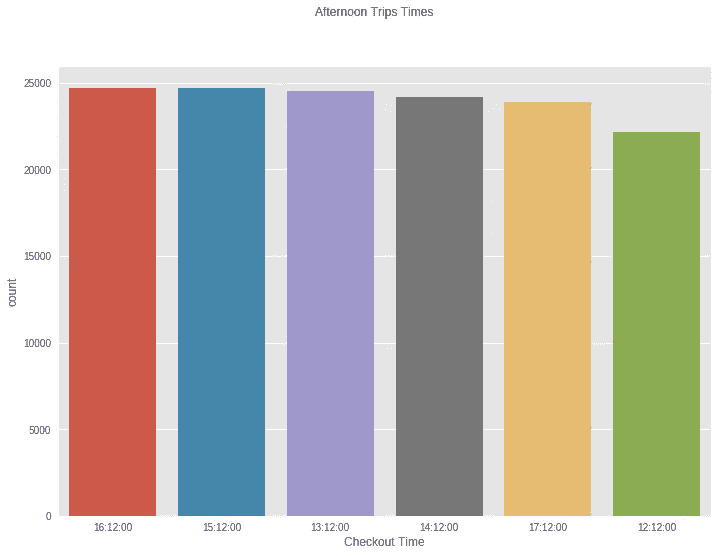

Most popular times for afternoon trips

它们都以 Min 结尾。12!他们可能是工作或学校的人，去某个地方吃午饭或下班或放学！

# 分析周六的旅行

通过分析周六的旅行，我们可以获得许多见解。人们在周末比平日更多地使用自行车。

# 周六最受欢迎的售货亭

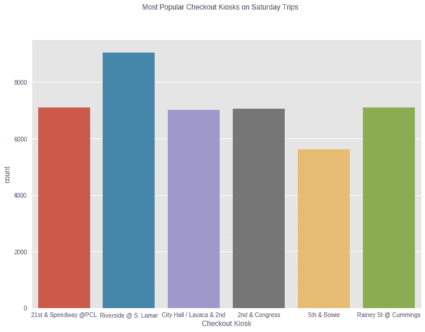

Most Popular Checkout Kiosks on Saturday Trips

# 分析周一的行程

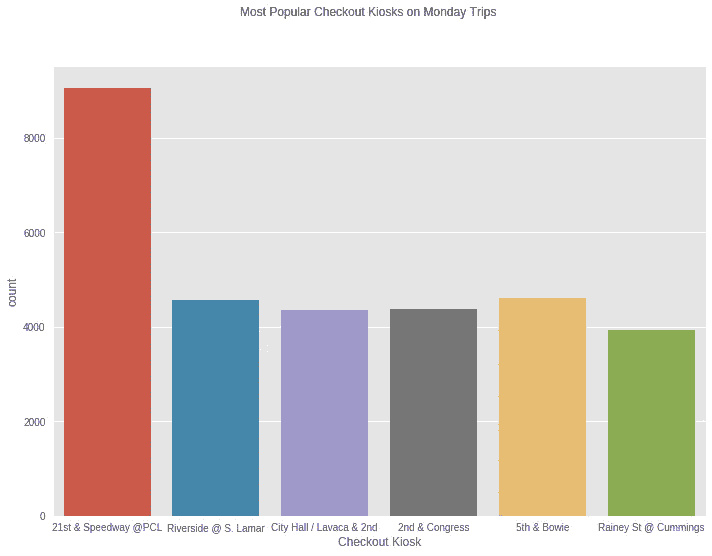

Most Popular Checkout Kiosks on Monday Trips

# 最受欢迎的旅行持续时间(分钟)

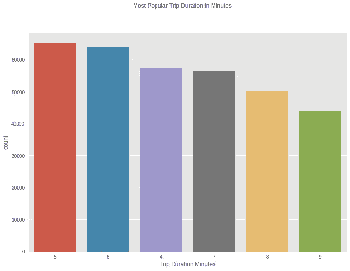

Most Popular Trip Durations

似乎更常见的是短途旅行:结果显示，5、6、4、7、8 和 9 分钟是最常见的旅行持续时间。正如我之前所说。这是那些在市区工作或生活的人，他们用自行车去吃午饭或在停车的地方取车。

# 结论

这些是我的见解。我确信从这些数据中可以发现很多东西。所有这些信息对运营自行车共享项目的公司都有很大帮助。

所以，租一辆自行车而不是开车去你的目的地总是一个很好的选择。如果你做到了，你就是在为塑造未来生态可持续的智能交通做出贡献。有时候，你可能需要开车，因为你的办公室离家太远，但是只要你能租到自行车，就去租吧！另外，是健康的，骑自行车可以让你燃烧一堆卡路里！

自行车共享计划正在以更清洁、可持续和更便捷的交通方式改变城市交通

数据对于自行车共享计划至关重要。所有收集到的数据都可以用来监控用户行为，并预测哪些信息亭位置有更多的需求。它还允许操作员知道哪些自行车没有被使用，可能需要维护。

了解奥斯汀的所有节日和活动有助于运营商主动预测当地需求，以优化再分配、管理和其他运营活动。对于运营商来说，人工智能可以成为新市场增长的推动者。

# 未来的工作

*   获取奥斯汀所有节日和活动的数据，并在地图上查看它们发生的位置，然后将位置与信息亭位置进行比较。看看我们是否能找到一个新的报亭位置，让同一地区的企业受益
*   创建深度学习模型，利用过去的信息预测日租金和月租金
*   分析天气信息，预测哪一天会有更多的出租，考虑这一重要信息
*   我正在研究奥斯汀 B 轮 Yelp 评论来做情感分析

希望你喜欢这些信息。分析新数据并从♥中获得见解总是好的！

稍后我会分享笔记本！

在 GitHub 上关注我:

 [## viritaromero -概述

### 软件工程师，对数据科学和机器学习充满热情。-维里塔罗梅罗

github.com](https://github.com/viritaromero)