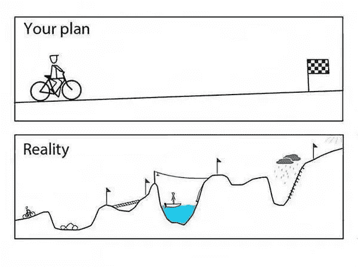

# 创新为商业基础注入乐趣

> 原文：<https://medium.datadriveninvestor.com/innovation-injects-fun-into-business-fundamentals-408a620713aa?source=collection_archive---------1----------------------->

## 思想开放和灵活会导致创业成功

无论是战术、技术还是创新思维，每一个元素都有助于创新。他们还将乐趣融入商业基本面。

[Dorie Clark](https://twitter.com/dorieclark) 和 [Winnie Sun](http://winniesun.com/about/) 谈论了这些和其他有助于创新商业策略的因素。

孙是金融行业最受欢迎的专业人士之一。克拉克是营销战略顾问、专业演讲人，也是《哈佛商业评论》的特约撰稿人。

拥有一个创新的战略对你的生意很重要。创新意味着你思想开放、灵活，这是一种对待商业和生活的好方法。你的竞争对手寻求他们最大的优势。你也需要参与游戏。

 [## 不开玩笑:营销是为了搞笑

### 漫画家描绘了商业生活中轻松的一面

medium.com](https://medium.com/datadriveninvestor/no-fooling-marketing-goes-for-laughs-597b9ba84f18) 

“希望保持相关性和前瞻性思维的企业将始终关注创新的商业战略，”孙说。“这是关于听、读、跟上新的概念、技术，以及你的行业和其他人在说什么。”

克拉克说人们需要保留身份。

“我们面临的最大风险是成为一种商品，”她说。“拥抱创新让我们与众不同，并获得额外奖励。”

# **战略与战术**

创新是你整体商业战略中的一种策略。以这种方式思考会使对齐变得自然。战略和创新不是独立的实体，而是一个宏大计划中的一部分，以实现相同的目标。

“企业有两种选择——被动或主动,”孙说。“如果你选择后者，你需要将投入学习和寻求创新的时间纳入你的商业使命。这是关于保持敏捷和谦逊。”

仅仅为了创新而创新是不好的。

“有时人们会为创新而疯狂，并为创新而创新，”克拉克说。“对研究实验室来说没问题，但商业必须把客户放在心上。

“此外，还有*为时过早这样的事情——参见 Friendster，”她说。“密切关注市场。我一次只承担两个新目标，以免不知所措。”*

 [## 不管是好是坏，做好数字革命的准备吧

### 商业过程在线上线下都是脆弱的

medium.com](https://medium.com/datadriveninvestor/for-better-or-worse-brace-for-digital-disruption-34cd82b4fc20) 

将你的商业策略建立在观察的基础上。了解你的顾客。知道如何满足他们的需求。观察你的竞争对手在做什么。知道如何才能带来更好的价值。是的，你可以跟着感觉走，但是你的感觉应该来自观察和经验。

“你不会百分之百地知道哪种商业策略完全适合你的企业，”孙说。“然而，你确实知道——凭经验和直觉——你应该朝哪个方向走。

“这是关于在做出坚定的决定之前尝试和完成事情，”她说。

# **实验**

试错也发挥作用。

克拉克说:“大多数情况下，只有你去尝试，你才会知道什么样的商业策略是正确的。”。“所以，少下赌注，不要一开始就冒太大的风险。在建立产品和市场契合度之前，保持精简和不超支至关重要。”

当建立电子邮件列表时，从你的个人联系人开始。他们最了解你，可能是你最大的粉丝。添加你从社交网络中收集的任何联系人，包括面对面的和在线的。一定要包括选择退出。

如果你不利用电子邮件对你的受众有价值，那么它就什么都不是。创建和分发时事通讯。展示您的创新如何满足客户的需求。要积极。回答问题。

 [## 铅磁铁:吸引人的入门方式

### 有价值的赠品是营销的关键部分

blog.markgrowth.com](https://blog.markgrowth.com/lead-magnets-attractive-ways-to-get-your-foot-in-the-door-2005d8be6f96) 

“重要的是要有一个好的销售线索磁铁，而不仅仅是‘嘿，订阅我的列表’我们都收到了太多的电子邮件——因此，没有吸引力，”克拉克说。

“今年，我一直致力于建立一个自动回复序列，慢慢地向新读者介绍我和我的作品，”她说，包括一个她开发的线索磁铁的例子。

“我喜欢用 [ConvertKit](https://convertkit.com/) 来划分我的电子邮件列表，这样我就可以根据兴趣和行为来锁定目标人群，”Clark 说。

# **花时间倾听**

最好的营销投资是时间和注意力。花时间和人们交谈，听听他们说些什么。你是否完成销售是一回事。发现你可以满足他们和其他人的额外需求——通过推荐——是一个受欢迎的奖励。

“我们一直坚持和致力于的任何事情都是好的投资，”孙说。“从电话推销、研讨会、网络、社交媒体到公开演讲，只要我们坚持并致力于此，它就会为我们所用。

“当然，社交媒体和公开演讲一直是我们的最爱，”她说。

 [## 给没有被提及的企业家的建议

### 企业家面临着各种各样的挑战，其中许多来自无效的沟通。他们寻找…

medium.com](https://medium.com/datadriveninvestor/tips-for-entrepreneurs-not-spoken-for-9de87df8653) 

克拉克四处投资。

“付费参加高端会议在早期是一笔可怕的开支，但从营销和网络的角度来看非常有价值，”她说。“据约翰·林(John Lim)说，在播客上投资 T2 时间对我来说意义重大。我做了 160 次采访来宣传我的书，《T4》*脱颖而出* 。”

最有用的创新商业技术是脑力。技术使得现场承保人寿保险成为可能，有时客户在几分钟内就能获得批准。然而，是承销商认为把责任委托给代理人是好的。

“这是我们两个耳朵之间的技术，”孙说。“归根结底，技术和工具的好坏取决于致力于使用它们的人。一切都在于采取行动。”

克拉克同意人在哪里就在哪里。

“技术帮助我实现我的商业模式——convert kit、 [AppSumo](https://appsumo.com/social-media-bundle/) 、 [LeadPages](https://www.leadpages.net/) ，”她说。“但策略来自于与人的互动。我最深刻的见解来自各种会议和智囊团，以及看到同事们在做什么。”

# **远见者**

对许多公司来说，未来是光明的。这包括那些帮助美国中产家庭识别和解决关键财务问题的项目。创新项目，如在短短九年或更短时间内摆脱债务，可以帮助任何人。

“我们公司的宗旨是改善他人的生活，”孙说。“我们帮助更多的人在财务上变得平静，对实现他们的财务目标充满信心。我们与尽可能多的人分享这些知识。

“我们也在扩大我们的办公空间，更智能地工作，更高效地使用电子邮件和社交媒体，”她说。

 [## 鼓舞人心的空间让员工心情愉悦

### 创造舒适、高效的工作场所对每个人都有帮助

medium.com](https://medium.com/datadriveninvestor/inspiring-spaces-put-workers-in-the-mood-516bd6947d01) 

克拉克凝视着远方。

“我的愿景是多元化，以加速增长和限制风险，”她说。“现在有九个收入来源，我相信还会有更多。

“我也喜欢兴趣多样化和利用‘百分之二十’的时间，”她说。“我的是音乐剧。也许 10 年后我会写下一章。”

自动化增加了一些公司的业务，同时也满足和伤害了客户。虽然很容易在网上获得人寿保险批准，但保底保单价格昂贵，因为这个人年老多病，而大多数人都不是这样。

解决非个人化、听起来很棒但价格很高的提议的方法是坚持在餐桌上面对面的会面。这为个别案例提供了个人见解，让代理完成适合每个人需求和预算的计划。

“我们的行业在合规性法规方面是分层的，”孙说。"我们可以暂时简单地在它们的范围内工作."

# **保持灵活**

克拉克重视灵活性。

她表示:“一个持续存在且日益严重的问题是，给定策略或渠道的可行窗口正在缩短。”。“你得把*换成快*。

克拉克说:“我一直在寻找仍然有优势的频道，并把赌注加倍在诸如 Lynda.com 的 T4 课程上。”。

 [## 简单的销售渠道会产生巨大的效果

### 商业以系统和可预测的方式发展

medium.com](https://medium.com/datadriveninvestor/simple-sales-funnels-yield-big-results-1e5c41fddf55) 

企业家可能想创造一个[点击漏斗](https://www.clickfunnels.com/)来推动销售。这是一个你可能不需要的创新，尤其是如果你有一个使用类似策略的公司总部。要记住的一条创新规则是不要重新发明轮子。

“我努力把‘顾客之旅’记在心里——确保他们在提出任何销售要求之前已经真正了解了我，”克拉克说。“此外，正确的标记也是很重要的，这样你就不会向人们抛出他们不感兴趣的报价。”

# **启动心态**

最近，大公司开始将创业策略应用到商业战略中，这对他们来说是一种创新。

有一个创业的心态可以让你保持新鲜感。你不太可能变得自满，陷入舒适区。创业公司反抗现状。如果大公司认为创业策略是一件好事，那么这种方法对真正的创业公司来说应该非常有效。

“这很聪明，”孙说。“大公司面临许多相关的竞争，这些竞争来自规模只有它们几分之一的公司。一切照旧的日子已经不够了。我们都需要保持敏捷，跟上技术和消费者情绪的快速变化。

她说:“这无疑给了小企业一个机会，让它们也能从成功的蛋糕中分得更大一块，这很令人兴奋。”。

 [## 创业公司和投资者寻求合适的契合点

### 企业家必须问自己是否做好了投资准备

medium.com](https://medium.com/datadriveninvestor/startups-and-investors-seek-the-right-fit-57671d9c07d6) 

克拉克说，这意味着创业公司正在获得正确的创新商业解决方案。

“创业公司知道一些大企业不知道的事情——最少可行产品的力量，而不是用钱解决一切，”她说。

“创业公司通过强制约束变得聪明，”克拉克说。"大公司可能不得不人为地强制执行，但这是可行的."

# **社交媒体是还是不是？**

社交媒体可以在线索挖掘和新业务开发中发挥作用。这都是关于互动和参与。这可以产生线索，然后发展你的业务。

“我的座右铭一直是让社区知道我们的存在，”孙说。“开诚布公地与他人分享，让他们了解我们的个性和我们的工作。这是一条双行道，我们有机会也有责任去分享。

“一旦他们知道我们是谁——我们是做什么的——他们就会决定伸出援手，”她说。“这帮助我们建立了许多有价值的新业务关系。”

克拉克寻找其他途径。

“我没有协调一致地使用社交媒体来引导一代，”她说。“对我来说，这是品牌建设。真正的行动是通过电子邮件列表发生的。

“电子邮件列表就在那里，”克拉克说。“Twitter 和其他社交媒体很棒，但它们是‘租来的，不是你自己的’。”

# **衡量成功**

如果你有一个商业计划，你应该有一个衡量你是否达到里程碑的目标。一份季度清单将包括那些你可以用来给自己的成功打分的指标。

 [## 疯狂设定目标背后是有方法的

### 专注于一个目标，为自己或公司制定一个计划

blog.markgrowth.com](https://blog.markgrowth.com/theres-method-behind-goal-setting-madness-9a8ba0a96ee1) 

“你能做的最好的事情之一就是每个季度与你的团队进行一次公开讨论，”孙说。“什么可行，什么不可行，我们下一季度要关注什么？

“你可以和你的客户或其他社区的焦点小组做同样的练习，”她说。"交流对学习如何改进大有帮助，并能节省你的时间."

克拉克引用了哥伦比亚大学的丽塔·麦格拉思(T2)的话。

“她说大多数成功的公司都有季度计划，而不是年度计划，”克拉克说。“这有助于它们变得敏捷。

“我喜欢把每个季度的目标分成更小的部分，”她说。"第一季度是重新设计网站，让我们的自动回复程序运行."

**关于作者**

吉姆·卡扎曼是拉戈金融服务公司的经理，曾在空军和联邦政府的公共事务部门工作。你可以在[推特](https://twitter.com/JKatzaman)、[脸书](https://www.facebook.com/jim.katzaman)和 [LinkedIn](https://www.linkedin.com/in/jim-katzaman-33641b21/) 上和他联系。