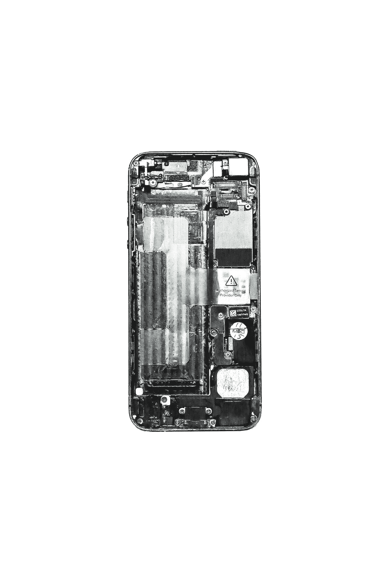

# 创新还是疯狂？

> 原文：<https://medium.datadriveninvestor.com/innovation-or-just-insanity-a87659626d4c?source=collection_archive---------48----------------------->

Photo by [Jonny Caspari](https://unsplash.com/@jonnycpic?utm_source=medium&utm_medium=referral) on [Unsplash](https://unsplash.com?utm_source=medium&utm_medium=referral)

> 这是一个屏幕中的一个屏幕，装在另一个屏幕中；以防你错过了前面的屏幕。
> 
> **因为屏幕多，这就是原因！**
> 
> 是“*创新*”。
> 
> “嘿你，你喜欢屏风？”
> 
> 给你，我们做了一个两面都有屏幕的手机；有了 L . E.D bezels incase，你可以在任何一个屏幕上多看一个通知。
> 
> 干得好。
> 
> 但是，创新呢？
> 
> 不完全是。
> 
> 我们需要它吗？呃…？

看你怎么定义 ***创新*** 。

如果炒作愈演愈烈，消费者就会接受。

智能手机停止了创新，在我们开始把它们当成瑞士军刀之后——除此之外，我实际上使用了我制作精美的瑞士军刀上提供的所有工具。

除了打电话/接电话、发短信/收短信或阅读/回复邮件之外，我不记得上一次用手机做其他事情是什么时候了。

除了偶尔检查我的银行账户或浏览互联网*(不是色情，我有一个私人剧院)*。

我们真正需要的*的设计和技术，而不是大多数消费者可能不知道除了作为一个 ***身份/时尚标志之外还能做什么的技术，这些快乐都去哪里了？这就是现在的智能手机。****

*它们太大了，放不进你的口袋，它们或多或少是公司之间的鸡巴测量比赛，这不是实际使用什么的问题——这是一个“看看我们能做什么”的问题。*

> *但是为什么呢？*
> 
> *因为去他妈的消费者这就是原因！这是你手机的另一个屏幕！你猜怎么着，这个弯了。*

*我没意识到我的手机是个杂技演员。*

*我知道它在监视我。*

> *因此，剧院，而不是我的智能手机的私人业务。*

*玩笑归玩笑，我们是否在技术上走得太远了？*

*这个有六个摄像头，可以读取你的想法*

* [## 荣誉魔法 2 揭示:满足手机，显然是如此智能，它可以读取你的想法

### 荣誉魔法 2 在中国发布会上亮相。这款人工智能手机具有手动滑出式三镜头自拍功能…

www.androidauthority.com](https://www.androidauthority.com/honor-magic-2-916650/) 

**这另一个基本上是高端摄像头和电影院，可以打电话:**

 [## 氢一号

### 世界上第一台全息 4 视图媒体机。比不戴眼镜的 3D 要好。

www.h4v.com](https://www.h4v.com/) 

在这一点上，创新者真的关心他们生产什么或者消费者需要什么吗？

还是说只是一个 ***【看看我们能做什么】*** 的问题，很像 ***超跑/ Hypercar*** 市场；我们知道这是出色的工程和设计，但我们也知道这可能是一个对汽车一无所知的人，他只是买了一辆车，这样他们就可以在红灯时加速发动机，直到在卑鄙的倦怠之后松开离合器。

除了偶尔会购买的发烧友，因为他们理解和尊重工程质量，并对其成就感到惊叹。

和其他人只是；你知道…买一个卖一个，因为他们可以！

我为视频中接下来的折磨道歉，这是我能找到的唯一合乎逻辑的例子。

**Credits: TMZ / Youtube.**

问题仍然存在，**奢侈品还是必需品？**

> 当然，我们可以指望消费者来决定，因为如果它得到大肆宣传——我们将在商店外面露营，成为第一个用我们以前的手机自拍的人，展示我们的新手机，新手机显然有更多的像素，甚至可能有几条染色体。(我不是说唱歌手，我从未声称自己是)

**嘿，谢谢你的阅读，看看我下面的其他疯狂漫谈:**

 [## 假面启示。

### 每个面具背后都有一个未被揭开的灵魂。

medium.com](https://medium.com/@nabeelt/the-masked-revelation-a4496a0ccf5f) 

原刊[此处。](https://www.datadriveninvestor.com/2018/11/15/innovation-or-just-insanity/)*