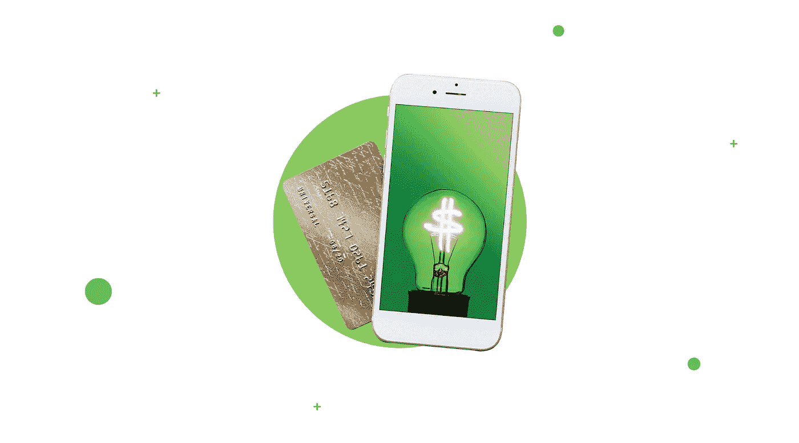
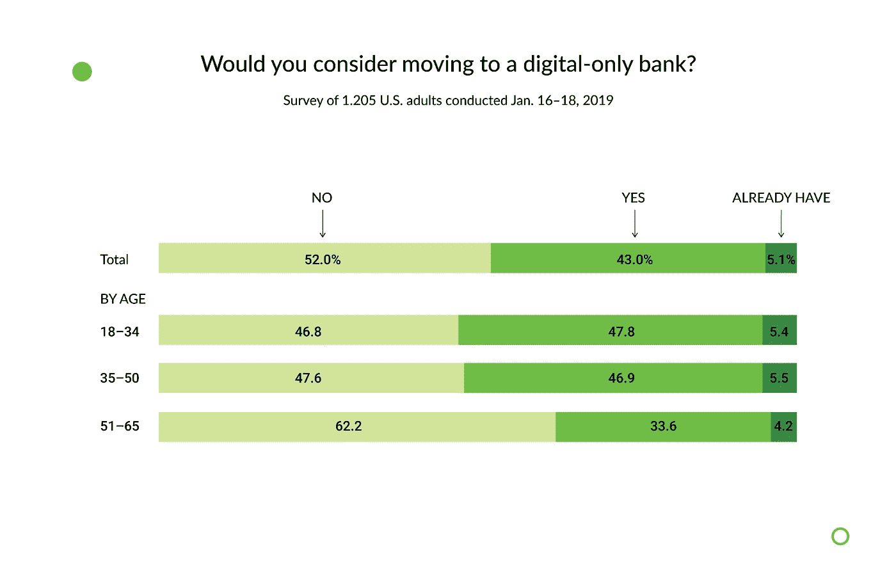
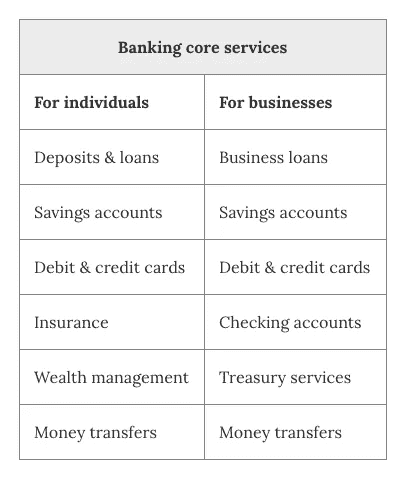
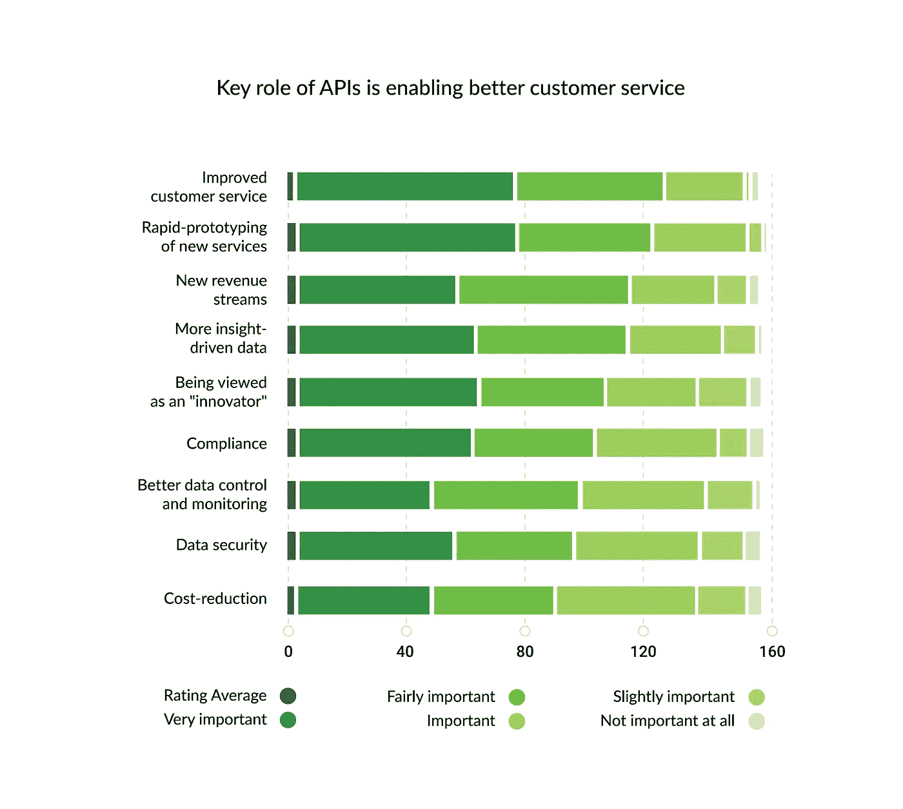
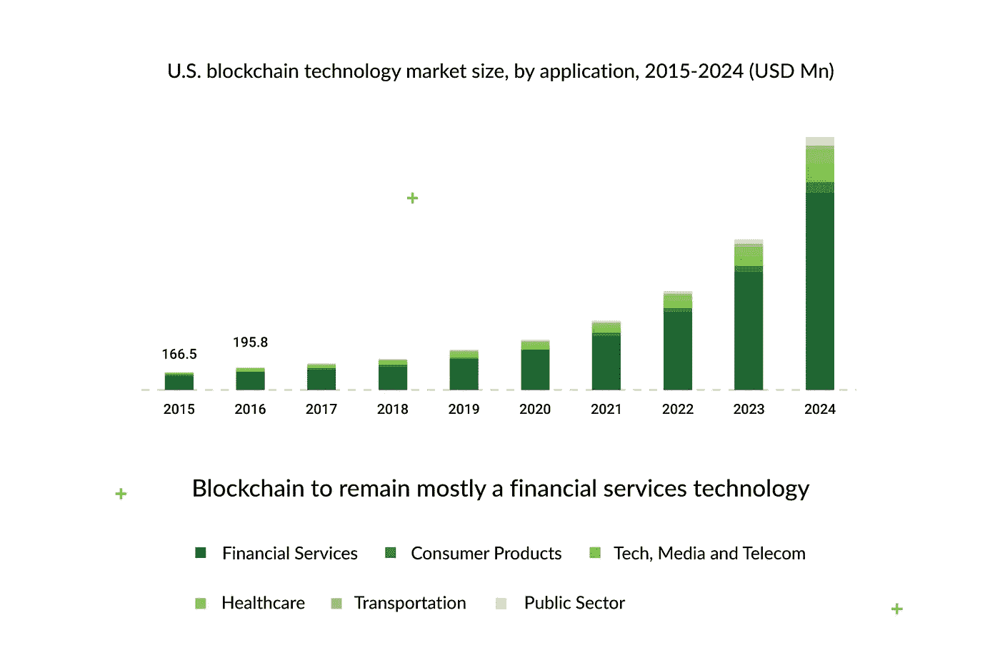
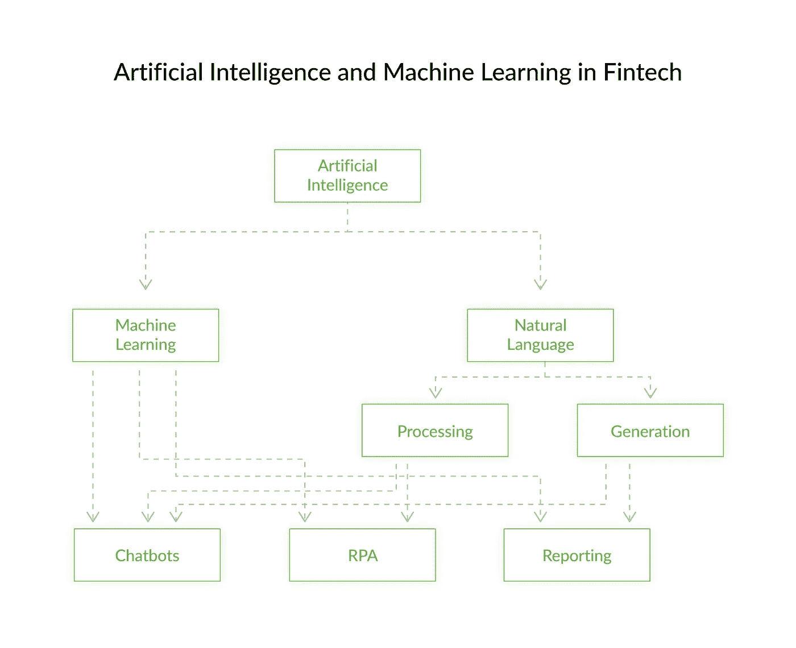
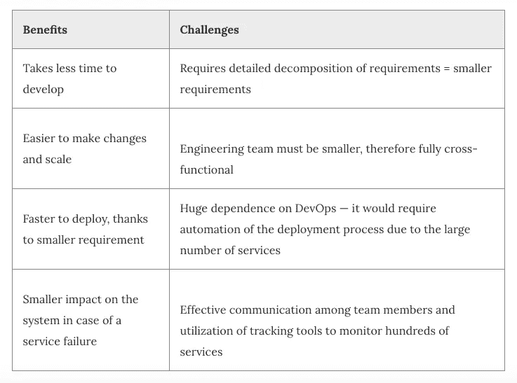
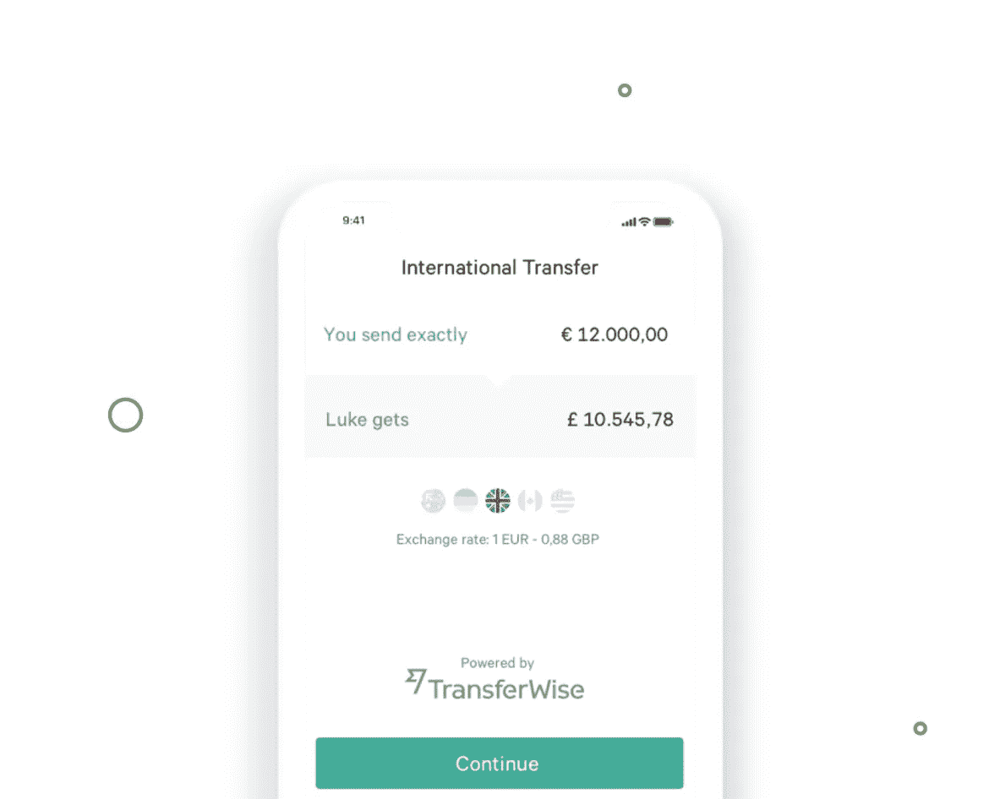

# 银行应用程序开发的创新:行业的新挑战和机遇

> 原文：<https://medium.datadriveninvestor.com/innovations-in-banking-app-development-the-new-challenges-and-opportunities-for-the-dd4cc7abaf5d?source=collection_archive---------6----------------------->

1967 年 6 月，随着第一台自动取款机在伦敦金融城安装，金融界发生了一场至关重要的变革。那时，信用卡还没有发明，所以自动取款机只接受支票，人们一次只能提取 10 英镑。然而，这是机器代替人——银行出纳员的第一个例子。这是人们与金融机构互动方式的转折点，因为这一天标志着技术介入一个如今看来像支票一样古老的行业的开始。

从那时起，每一项技术突破都以某种方式——直接或间接——影响了银行业，并塑造了我们今天所知的这个行业。很快就清楚了，技术试图颠覆这个行业的原因是，一个多世纪以来银行业的运作方式很难被称为“有效和便捷”，而是“官僚和沉重”。

 [## 分散金融的出现|数据驱动的投资者

### 当前的全球金融体系为拥有资源、知识和财富的人创造了巨大的财富

www.datadriveninvestor.com](https://www.datadriveninvestor.com/2019/03/14/the-emergence-of-decentralized-finance/) 

扰乱银行的想法可能隐含着良好的意图，但这是一个非常天真的想法。银行的存在是有原因的，它们不会去任何地方。他们在企业和消费者之间充当受监管的中间人，如果没有这种监管，金融体系就会崩溃。这里的关键词是监管，因为无论付出多少努力试图分散金融业，它仍然需要某种监管。反过来就不行了，证据就在这还没有发生的事实上。

> [在 Django Stars 博客上阅读原文。](https://djangostars.com/blog/banking-application-development/?utm_source=medium&utm_medium=medium.com%2Fdatadriveninvestor%2F&utm_campaign=innovations%20in%20banking%20app&utm_content=read%20original%20version)

这种理解对于金融科技社区至关重要，因为他们意识到试图取代银行是没有好处的。唯一双赢的解决方案是与他们合作。就银行而言，它们明白金融科技公司正在做一些有趣的事情，因此开始与它们合作，支持它们，并推广它们。

这个所谓的合作期始于 2010 年代中期，目前仍在继续。除其他外，银行和金融科技公司之间的合作关系影响了双方如今面临的挑战。

## 银行业面临的新挑战

可及性和可负担性曾经是银行面临的最大挑战。主要问题是“我们如何吸引最多的人使用我们的服务？”现在的问题是，“我们如何才能让最多的人使用我们的服务？”今天，一切都是为了取悦顾客。因此，考虑到这一点，以下是老牌银行和新兴银行面临的三大挑战。

## 顾客期望

如果说以前银行会尽一切可能限制金融科技初创公司，那么今天，斗争已经转向满足客户的期望。技术进步被视为我们日常生活中的一种常态，因此为了让客户满意，银行需要利用软件开发、设计和可用性方面的最新趋势，同时遵守众多法规和安全标准。但是，银行不能仅仅成为有趣的应用程序，这带来了一些我们仍然不确定如何应对的限制。另一方面，许多客户愿意完全数字化。根据 CB Insights 2019 的报告，当被问及是否会考虑仅迁移到独立的数字银行时，43%的受访者表示会。

客户的期望可能从易于使用的界面和降低的交易成本，到更奢侈的东西，如 ATM 定位器和聊天机器人，而不是个人助理。一旦客户了解到某个银行应用有 Apple Pay 功能，他们就会希望每个银行应用都有这个功能。这就是人类的工作方式——我们很快就习惯了新事物，我们甚至更快地学会了将它们视为理所当然。

## 成本管理

*技术正在取代人员*。这是一句让每个做日常文书工作的职员都害怕的话。正如 1967 年在伦敦所做的那样，银行业正在尽可能地使用流程自动化，改造组织结构并建立数字基础设施，从而提供更具成本效益的服务。

这是许多金融科技初创公司背后的核心理念——利用技术为客户提供更便捷的金融服务。现在市场上有很多个人玩家以较低的价格提供特定的金融服务，银行正在努力跟上竞争。但是他们仍然很难赶上，因为需要许多独立的齿轮来推动这个官僚机器。

## 安全性和身份验证

当关于数据泄露的新闻比委内瑞拉的革命更广泛地被讨论时，很明显，人们比以往任何时候都更关心他们数据的安全性。这导致对额外安全措施的需求增加，以确保除了所有者之外没有人能够访问他们的银行账户。自银行业诞生之初，安全性就受到了监管，标准也没有发生重大变化。

然而，发生变化的是，人们希望每次进行交易、存款或取款，甚至申请贷款时都有安全感。这当然会影响设计特点，因为正如我所说的，客户的期望通常是决定从传统银行转向创业公司的驱动因素。安全感和安全感本身没什么关系。更多的是一种可以通过各种手段达到的感觉，最明显的是设计。然而，如果银行的首要任务是提供顶级的安全性，它们就无法提供无缝的用户体验——这是一个仍然值得讨论的两难问题。

然而，新的挑战总是为企业带来新的机遇。由于重点已经从仅仅从事金融工作转移到满足上面列出的一切，新的金融科技公司通常旨在提供特定类型的服务。

这张表只是冰山一角。每个服务可以分成十个更窄的服务，这些服务可以再分成十个，以此类推。这是简化后的银行业结构。但即使没有彻底研究，银行和金融科技的概念正在融合已经很明显。银行在利用技术，科技创业公司与银行合作。这是什么时候成为可能的？是什么技术推动了这些创新？下一节给出了答案。

# 让创新成为可能的五项技术

科技让金融公司能够从不同的角度看待他们的客户。现在，通过应用一套不同的技术——更先进的技术——我们可以重新解释人们如何消费金融服务。我将在这一部分谈论的技术是开放银行 API、区块链、人工智能、移动银行和支付以及微服务。并不是所有的都是面向客户的(客户与之交互的)。但可以肯定的是，它们都在影响银行业的新标准。

## 1.开放银行业务

开放银行业务是指使用 API 使第三方能够访问客户银行数据(经其同意)以基于该数据创建新的应用程序和服务的实践。这是什么意思？这里有一个简单的例子:假设有一家公司可以了解某人的消费习惯和财务历史。可以对这些数据进行分析，以得出关于他们的客户概况的结论，反过来，这些结论可以用于创建更多以客户为中心的服务(因为他们更了解他们的客户)。所以在某种程度上，这意味着从基于假设到基于数据的产品开发的转变。

从更大的范围来看，开放银行业不仅仅意味着银行变得开放。更多的是他们运营和商业模式的改变。在他们的年度报告中，开放银行项目指出了为企业使用 API 的主要好处。除了改善客户服务——我在上一段中使用的例子——它还将促进快速原型开发和新的收入来源——为第三方提供访问特定类型数据的 API。

对客户来说也有很多好处。比如说，当有一个交易平台，拥有来自不同银行的不同应用编程接口时，客户将能够在支付提供商中进行选择，并选择一个提供最佳交易的支付提供商。利用 API 还意味着我们目前向其支付服务费的中介活动将会减少。

## 什么时候会发生？

API 的采用是由欧洲议会在 2015 年发起的，当时引入了名为欧盟支付服务指令 PSD2)的立法。为了遵守该法规，欧洲银行必须放弃笨重过时的软件，转而使用包含强大安全功能的基于 API 的基础设施。PSD2 将于 2019 年 9 月 14 日全面生效。

## **挑战是什么？**

在同一项调查中，开放银行项目发现，普遍使用 API 的最大挑战是企业文化和官僚主义。这两个其次是缺乏对技术的了解。我相信银行对开放银行业务有一定程度的不确定性和怀疑。部分原因是，PSD2 是有史以来强加于所有欧洲银行的最具开创性的立法之一，因此很容易理解为什么银行对此不太高兴。

## 2.区块链

下一项技术无需介绍。一个简单的解释是，区块链使用分布式数据库和数据加密来存储交易历史。记录的历史被称为分类账。所有各方都可以进入分类账，但不能编辑或删除，因为所有记录都是相互关联的，并与相同的信息同步，这为所有交易提供了透明度。银行业哪里可以应用？而且如果这么厉害，为什么不用在其他行业呢？本节回答了这些问题。

## **在银行业应用区块链**

把钱从 A 卡转到 B 卡归结起来就是敲几下。不同银行账户之间的转账稍微复杂一点，但这仍然是显而易见的，而国际交易仍然非常耗时，并且通常包括收取额外服务费的中介。区块链可以减少参与方的数量，从而减少数百万的成本。除了客户的隐性成本，区块链还可以帮助优化运营流程。每当涉及到查阅过去的信息时，比如当一名店员需要根据国家、年龄或客户的消费习惯创建一份付款报告时，他们就需要深入研究档案，并将表格与复杂的数字数据并置。犯错误的几率很高，完成这项日常任务所花的时间可以更有效地利用。区块链简化了数据提取，因此任务完成得更快，职员出错的可能性也更小。

如果你认为这听起来太牵强，这里是美国区块链市场的统计数据。你会看到金融服务业每年都在增长。这张图并不是我们所期望的投影。已经有一些应用程序使用区块链来处理本节中描述的所有事情。

房地产平台 Propy 有两个使用区块链在加州进行房屋支付交易的成功案例。戴利市的一栋房子卖了 91.7 万美元，虽然付款是用美元，但转账是用以太坊智能合约进行的。所有关于转让的信息——谁、转让给谁、转让什么、何时转让等等——现在都永远保存在平台的账本中。整个购买过程花了 30 天，和正常交易一样。

区块链仍然没有媒体通常宣称的那么快，这是有原因的。

## **区块链面临的挑战**

虽然甚至有逐步介绍如何为金融产品建立自己的区块链的文章，但在金融领域普遍采用之前，区块链还有几个障碍要克服。

*   **缺乏监管**。区块链没有规则和法律。很难被政府控制。这完全违背了《GDPR 》,因为一旦某人的个人信息出现在账本中，就无法删除。
*   **知识匮乏**。虽然区块链的口号是“降低成本”，但建立一个区块链网络是昂贵的。它需要最好的软件开发人员。大多数工程师无法理解其架构的复杂性，所以他们会犯错误——而这些错误让我们付出了相当大的代价。
*   **公众形象**。像所有新事物一样，区块链将需要时间让人们习惯并远离这种被秘密矿工用来致富的想法。此外，由于 2017-2018 年受到媒体的关注，它已成为专业界的流行语，经常被用于讽刺。
*   **技术限制**。直到我们对技术本身有了更多的了解，才会对接口的设计和技术性能产生一定的制约。通常，设置区块链钱包(账户)需要比普通登录网站更多的步骤，可扩展性问题会降低性能和交易速度。

## 3.移动银行(又名新银行)

完全数字化的银行——没有实体分行——被称为新银行。第一批流行的新银行是 Simple 和 Moven，都是美国的。在欧洲，领导者是分别来自英国和德国的 Monzo 和 N26。注册数字账户的好处是，你永远不需要去银行获得服务。你通过一个应用程序界面完成所有的财务活动。反过来，银行降低了维护物理分支机构和服务人员的成本，因此重点是提供经济高效且用户友好的应用程序和服务。

使用数字银行有什么吸引力？让我们找出答案。

Finder 报告称，在英国，9%的成年人已经在 neobanks 开了账户。如果你看一下针对个人的银行服务表格，你会发现银行所提供的并不是客户通常所做的。Neobanks 了解当前的客户需求，因此他们相应地设计了自己的功能。

## 新银行提供什么？

新银行不能帮你管理你的投资，也不提供各种储蓄、支票和信贷选择。以下是他们的做法:

*   **便利**。当您存入资金或与朋友分享午餐账单时，交易信息将立即更新，由于有了一个出色的界面，以前包括排队、表格、银行和审批在内的所有操作现在都被几下点击所取代。
*   **支出分析**。使用信用卡的一个缺点是，与现金支付相比，你会送出更多的钱，因为你不会注意到你是如何送钱的。正因为如此，出现了许多帮助记录费用的应用程序。这些应用程序要求用户每次付费时都要写下来，这非常不方便。Neobanks 内置了与持卡人的卡相关联的费用分析功能，因此你的钱去了哪里一目了然。
*   **降低费用**。新银行没有分支机构，因此需要更少的员工，从而降低成本。节省下来的钱后来转化为更低的客户费用。他们也倾向于有低到零的 ATM 取款费，这使得它非常有用，因为你不需要跑到附近去找你的银行的 ATM。

尽管有这些好处，但阻止客户完全数字化的可能是新银行可能无法满足他们的所有需求。

## **新银行面临的挑战**

我提到了缺乏投资管理和不同的账户选项。让我详细说明这一点和其他障碍。

*   **有限服务**。新银行为日常金融业务提供许多服务，但由于是数字化的，它们不能帮助你提供投资建议或抵押贷款，所以目前来说，它仍然不可能完全数字化。

*阅读更多*:

 [## 如何搭建投资平台

### 对知识的投资回报最高。投资建议并不是什么新鲜事。很明显，那些…

djangostars.com](https://djangostars.com/blog/how-to-build-an-investment-platform/?utm_source=medium&utm_medium=medium.com%2Fdatadriveninvestor%2F&utm_campaign=innovations%20in%20banking%20app&utm_content=read%20more) 

**客户端支持&保护**。如果出现问题，移动银行不会给你一个经理来领导你的案子，直到问题得到解决。对于大多数请求，在线聊天就可以了，但是如果问题升级了呢？并非所有法规和标准都适用于移动银行，因此可能会出现客户没有工作流程可循的情况。

新银行有了一个很好的开始，我希望他们在被普遍接受的道路上不会有太多障碍。

## 4.人工智能

人工智能(AI)是不同技术的高级术语，最著名的是机器学习(ML)、自然语言处理(NLP)和自然语言生成(NLG)。这些技术基于学习算法，通过收集和分析大量数据来自我改进。以下是每项技术的简要描述:

*   **ML** 是一种分析数据相关性和异常性的方法，并辅以人工干预。这使得机器能够处理比人多得多的数据，从而能够检测模式以得出新的见解。
*   **NLP** 是机器处理和使用人类语言作为特定活动输入的能力。NLP 主要用于拼写检查，语音命令，如 Siri 或 Google assistant。在银行业，它被广泛用于聊天机器人和情绪分析。更多信息请见下文。
*   **另一方面，指的是以书面或口头形式进行类似人类交流的能力。在金融领域，它用于生成新闻和报告。现在，没有必要让人类研究多个饼图，弄清楚它们显示了什么，然后就此写一份报告。**

***阅读更多*:**

** [## 金融服务中的 6 个人工智能示例

### 结论例如，在旅游行业，人工智能有助于优化销售和价格，以及…

djangostars.com](https://djangostars.com/blog/6-examples-ai-financial-services/?utm_source=medium&utm_medium=medium.com%2Fdatadriveninvestor%2F&utm_campaign=innovations%20in%20banking%20app&utm_content=read%20more) 

银行业是目前专注于为众多任务开发和集成人工智能的领先领域，以提高数据的准确性。金融领域的独立研究提供商 Autonomous Research 报告称，预计到 2030 年，人工智能将为银行业节省约 1 万亿美元。

我已经提到了人工智能在银行业的几个用例。在接下来的部分，我将详细说明这一点，并提供一些例子来说明这个行业如何从实施人工智能中受益。

## 金融科技产品案例研究:

 [## 案例研究——基于 Django、Python、JS 的项目示例

### 在 Django Stars，我们通过真实且成功完成的 Python 项目实例来证明我们的技能和知识…

djangostars.com](https://djangostars.com/case-studies/?industry=fintech&utm_source=medium&utm_medium=medium.com%2Fdatadriveninvestor%2F&utm_campaign=innovations%20in%20banking%20app&utm_content=read%20fintech%20case%20studies#filters) 

## 银行业中的人工智能用例

像 Autonomous Research 这样的报告提出了明确的证据，证明了将人工智能融入金融日常事务的优势。像摩根大通和美国银行这样的银行已经投资开发人工智能算法来解决某些问题。我想挑选出人工智能在银行业最值得注意的三个应用领域。

**聊天机器人**。Erica 是由美国银行开发的人工智能聊天机器人，通过语音和短信为客户提供帮助服务。Erica 的能力包括:

*   检查客户的卡信息(活动、账单、资金)
*   资金转移
*   与经理的约会安排
*   定位最近的分行或 ATM
*   关于资金管理的建议

2019 年 3 月，美国银行报告称，erica 拥有超过 600 万的活跃用户，并且这个数字还在不断增长。聊天机器人已经从少量的命令变成了一个类似人类的支持经理，他确切地知道该做什么。

**RPA** 。机器人过程自动化使用各种算法以计算机精度再现人类活动。这种工具可以分析数据输入(文档或报告),并根据给定的任务产生结果。摩根大通已经投资于 RPA 开发。其结果是 CoiN，一个从法律文件中分析和提取关键信息的平台，比一组分析师更快。

**报道**。NLG 可以将堆积如山的数据转化为一段易懂且连贯的文字。这种技术可以在 3 页的叙述中总结一份巨大的分析报告，并提供关键亮点。鉴于创建报告的准确性和时间超过了人类的表现，我们可以预测，在几年内，报告将成为一个完全数字化的过程。

在这些实际应用之外，我们可以为行业带来以下好处。与之前的 3 项技术(开放 API、区块链和移动银行)一样，人工智能旨在提高操作的速度和准确性，降低成本，并通过改善的个性化来取悦客户。

## 对行业的好处

**成本降低**发生在从以人为本的部门转向基于人工智能的工具。当成百上千个这样的工具同时工作时，像验证汇款请求(检查输入数据是否正确)这样的任务执行起来要快得多，而且人工参与也更少。因此，交易的**速度**显著提高。由于机器不需要休息，所以它们全天候运转。不仅机构从中受益，客户也从中受益。你不得不在分行排队等候服务的日子一去不复返了。随着人工智能继续自我学习，输出的精确度也在增加，以至于越来越难判断是人还是机器执行了这项任务。最后，算法收集的关于客户的数据越多，个性化**就越多。人工智能可以分析你的消费历史，并为你提供特定商品的信用贷款。所有这些好处都延续了通过用机器代替人而向更加以人为中心的操作转变的趋势。**

## 5.微服务架构

为了实现开放 API、区块链、neobanking 或 AI，银行要么必须彻底改造其技术基础设施，要么从头开始创建。无论哪种方式，都是昂贵而冗长的。这一小段是一种总结。是关于微服务架构的想法。

当复杂的数字系统(比如银行)被开发出来时，它的所有内部部分都是相互依赖的。改变一件事会影响其他事。如今，银行将 73%的 IT 预算用于维护遗留软件。通常，由于不兼容的架构，软件停留在原地，而不是与新技术合并，这导致几个系统具有重复的功能，而不是整合。这限制了它们的实用性。解决办法是建立易于改变的系统。这种系统的设计被称为**微服务架构**。

简而言之，微服务架构是一个由小型独立服务组成的系统，每个服务专注于某个功能，易于更改、删除或升级，而不会对整个系统产生太大的负面影响。这听起来像是让产品变得更简单，但事实上，它让产品变得更复杂。怎么会这样由于每个服务都是一个独立的单元，维护、管理和更新所有这些服务就变得更加困难。这需要更多的人参与到项目中，每个人都被分配到一个微服务中。还有，你可以拿一个老派的系统，加一个或者几个微服务。这是一个孤注一掷的游戏。整个银行必须使用微服务架构，这样它才能按预期工作。

## 好处和挑战

微服务是一个复杂的解决方案，很大程度上依赖于团队成员的专业知识，但另一方面，它允许在未来开发和利用创新技术时更加灵活。

# 机会

上一节描述的五项技术是尖端公司努力改善金融行业的标志。注意，我说的是“改变”，不是“扰乱”。双方——金融科技和银行——都在试图扩大市场份额，因此合作吸引不满意的客户。金融科技公司可以通过采用新技术和经济高效的解决方案来提高灵活性。反过来，银行拥有值得信赖的品牌、现成的基础设施和风险管理经验。他们可以共同建立工作伙伴关系，实现以下目标:

*   进入新的细分市场
*   为现有客户创造新产品
*   收集、存储和分析数据
*   深化客户参与和产品使用
*   FinTech 和银行的关系可能会走不同的道路，既会有合作的情况，也会有分离的情况。对于一家金融科技初创公司来说，仍然有很多机会靠自己取得成功。以货币交易为例。对于个人和中小型企业来说，哪些策略可以使交易更快、更便宜、更透明？

**以 N26** 为例，这里有四个小技巧。

*   **去掉复杂性，提供简单的接口**。当像从账户 A 向账户 B 转账这样简单的操作需要超过 3 个步骤，并要求用户填写不必要的输入字段时，这是令人沮丧的。解决方案将是一个简化的界面，关注于动作的成功完成。您也可以更改界面副本。不要用行话，试着用更简单的词，所以不要用“做交易”，而是读作*【汇款】*。

*阅读更多:*

 [## 如何用 UX 写作打造更好的产品

### 我读的关于界面和复制的书越多，我就越看到有人声称界面必须面向用户，而且…

uxdesign.cc](https://uxdesign.cc/how-to-build-a-better-product-with-ux-writing-926d78209ce8) 

*   **让交易更透明**。所谓透明，我指的是披露所有额外费用，并提前展示真实的交易数据。N26 抓住了他们的国际交易特点。他们向客户展示实时汇率，并清楚地表明你发送了多少，收件人将获得多少。在第四部分会有更多的介绍。

*   **精简令人沮丧的经历**。在某些时候，每个用户流都有一个令人沮丧的点。它可能是一条错误消息，也可能是一项需要许多小步骤才能完成的任务。现在，通常需要什么信息才能给某人几美元买电影票？最少是全名、地址、卡号和电话号码。然后会变得很奇怪。有些可能需要银行账号、IBAN、电子邮件地址和其他我们不明白为什么需要提供的信息。

…或者，您可以从列表中选择一个联系人。

*   **尽可能排除第三方**。许多银行应用程序提供的服务不是它们自己的，而是涉及第三方的。他们可能会利用中间银行进行某些操作——这就是隐藏费用所在。最显著的例子是国际交易。如果一家银行没有自己的 IBAN，它将使用一个中间机构。幸运的是，随着 open API 的扩展，银行越来越容易排除第三方，至少在一定程度上他们不会影响客户体验。N26 与 TransferWise 合作，允许以国际货币进行快速汇款。因此，客户享受无缝设计，没有隐藏成本。

# 最后

尽管许多人指责金融业官僚而不方便，但它实际上是过去 400 年来世界上最好的系统。银行已经接受了这样一个事实:其他人正在做一些令人惊叹的事情来改善这个行业。幸运的是，他们没有试图压迫他们，而是合作促进创新。

我们刚刚探索的五项技术——开放 API、区块链、移动银行、人工智能和微服务——是行业的未来。这不是猜测，而是事实，有大量证据支持这种说法。由于从庞大和单一的系统架构到灵活和以人为中心的系统设计的转变，我们可以在几秒钟内进行国际交易，并安全地存储我们的数据。因此，让我们采取一切必要措施，让使用金融服务成为一种愉快的永久体验。

> 这篇关于 [**银行应用开发**](https://djangostars.com/blog/banking-application-development/?utm_source=medium&utm_medium=medium.com%2Fdatadriveninvestor%2F&utm_campaign=innovations%20in%20banking%20app&utm_content=innovations%20in%20banking%20app%20development) 的创新的文章最初发布在 **Django Stars 博客**上。

**