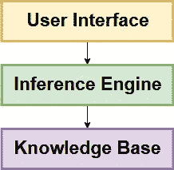
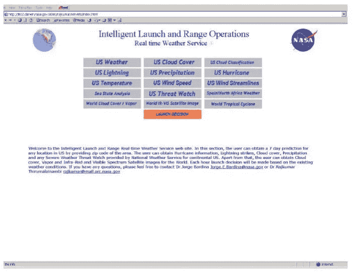
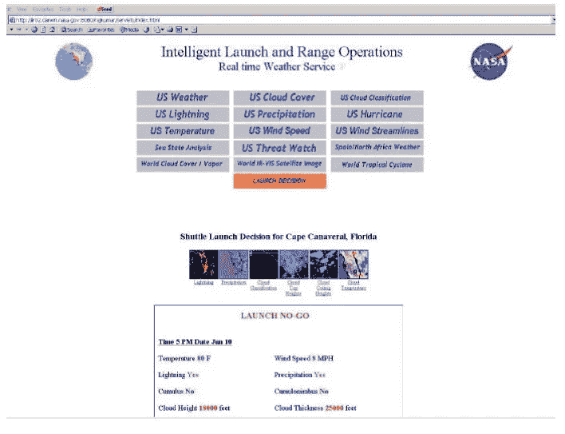
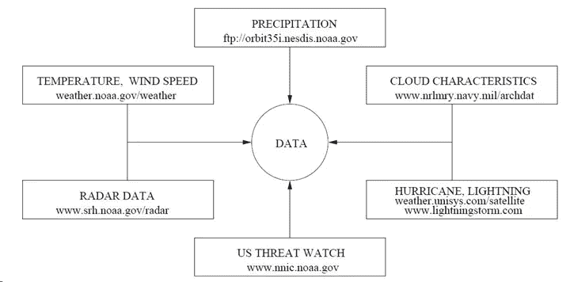
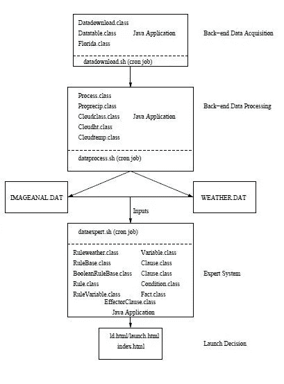
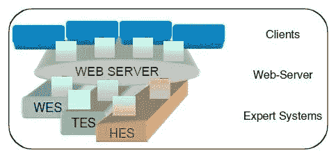

# 专家系统内部:

> 原文：<https://medium.datadriveninvestor.com/inside-of-an-expert-system-c086e4b42e46?source=collection_archive---------2----------------------->

[](http://www.track.datadriveninvestor.com/1B9E)

## 航天飞机发射的网络气象专家系统(WES)


最近，我有机会对一个真实世界的专家系统进行研究。我花了很长时间为我的研究寻找一个好的主题。在去办公室的路上，有几天，我一直在谷歌上搜索一个好话题。然后，在一个晴朗的周末夜晚，在大学图书馆里，我发现了一篇由**美国国家航空航天局(NASA)** 在他们的**天气专家系统**上发表的有趣文章。我发现这将是一个很好的主题。我继续阅读研究论文、文章和博客，深入搜索它。这篇博文展示了这项研究的结果。

首先，让我们确定一个专家系统的概念。

# 专家系统

人工智能有两大领域作为**人工认知系统**和**机器学习**。它们是基于与符号或理论处理相关的能力而不同的。机器学习可以找到给定问题的答案，但它无法解释答案，因而无法被证明。但是认知系统既可以回答，也可以证明。

专家系统属于**人工认知系统范畴。**专家系统处理规则、逻辑、对象、描述符等表示的符号知识。简单地说，专家系统限制了人类专家解决问题的能力。

例如，想象一个医生正在诊断一种疾病，一个建筑师正在设计一栋建筑。

专家系统技术受到简单原理的启发，即**领域/主题特定知识和问题解决知识**可以分开维护。注意**领域/学科特定知识和问题解决知识**指的是两个主要的认知特征**记忆和推理**。

# 专家系统的特点

专家系统中有许多常用的特性。要理解专家系统的特征，只要想想人类专家能做什么。例如，想象一个医生。

> -在狭窄的领域内运作。但不宽泛。
> 
> -问问题。
> 
> -能够处理不完整的信息。
> 
> -提供替代解决方案。
> 
> -提供答案的保证级别。
> 
> -给出建议而不是确切的答案。
> 
> -不仅提供答案，还提供答案的理由。
> 
> -在寻找答案时，使用启发法和经验。不是书本上的理论和规则！。

上面列出的专家特征可以科学地列举如下。

> **目标驱动推理或反向链接** —专家系统由一种推理技术组成，该技术使用 IF-THEN 规则反复将一个目标分解成更小的子目标，这些子目标更容易证明。
> 
> **·应对不确定性** —系统根据未知规则和数据进行推理的能力。
> 
> **数据驱动推理或正向链接**——使用 IF-THEN 规则从初始数据中推导出问题解决方案的推理技术。
> 
> **数据表示**—系统中特定问题数据的存储和访问方式。
> 
> **用户界面** —协调输入和输出之间的显示。
> 
> **解释** —系统解释其用于达成建议的推理过程的能力。

# 专家系统剖析



Figure 1: Anatomy of Expert System

以上描述了专家系统的结构。这种架构是基于问题解决知识和领域特定知识可以分开维护的原则而提出的。注意，这里的推理机包括问题解决技术，而知识库包括特定领域的信息。每个部分的基本功能如下所示。

**I)用户界面** —协调输入和输出之间的显示。

**II)知识库** —包括特定领域的数据、信息、知识、规则、程序的储存库。

**III)推理机** —探索知识库以找到智能解决方案。为此，它使用各种技术，如*搜索算法*、*前向和后向链接、冲突解决技术(先来先服务(FCFS)、最简单优先、最困难优先等)和不确定性处理。*

现在，让我们来看看专家系统在现实世界中的应用，这是这篇博文中强调的主题。

# **基于网络的航天飞机发射气象专家系统**

**基于网络的气象专家系统(WES)** 是**虚拟试验台开发**的关键模块，它支持美国国家航空航天局**智能发射和靶场操作**计划中航天飞机操作的**“去/不去”**决策。

## 介绍

发射和发射前天气指南是航天飞机发射的主要要求。美国国家航空航天局的这些指南是由美国空军靶场天气作业部和美国国家海洋和大气管理局太空飞行气象组提供的。

发射指南包括天气趋势及其对发射日的可能影响。他们考虑的基本气象发射标准是环境温度、风速、降水、闪电、云的类型和云的特征(云的温度和厚度)

发射前天气指南包括发射天气预报、地面操作预报和发射天气简报，供美国航天局的任务管理小组和航天飞机发射主任使用。它们还包含由 SMG 向宇航员、飞行指挥和任务管理团队简要介绍的**紧急着陆预测和任务结束预测**。

根据不同类型的车辆，有许多规则和条件。这些因素被用作气象专家系统的**规则**。

## 问题陈述

**美国国家航空航天局的智能发射和靶场作业虚拟试验台(ILRO-VTB)** 是用于大型多学科动态系统原型的软件。目前，这是用来模拟任务，控制，地面车辆，发射和靶场作业。


Figure 2: ILRO Test Bed Architecture Source:[link](https://ti.arc.nasa.gov/m/pub-archive/489h/0489%20(Bardina).pdf)

最初，他们在 ILRO-VTB 问题上有一些关键的问题。测试和评估复杂的航天飞机发射情况(即紧急着陆)要困难得多。在与航天飞机发射有关天气操作中，应该处理更多的复杂性和责任。天气分析涉及大量的时间和费用。决策过程被延迟，效率低下导致需要一个更高效的系统来解决许多相关问题。

## 动机—专家系统特征

开发气象专家系统的主要目标是使其能够以全球方式(宏观尺度)快速做出决策和回答。以下是 WES 拥有的其他一些专家系统特性。

> 有能力处理特殊/意外情况。因此，WES 可以帮助进行情况评估和发射计划。
> 
> 专家系统的输入可以在文本、数字和卫星图像之间变化。
> 
> 通过减少天气分析所需的时间来节省资金。
> 
> 管理层可以做出更明智的决策和工作
> 
> 更高的生产力。
> 
> 不在期望的位置-因为它是基于网络的，可以在世界上任何地方和白天/晚上的任何时间访问。
> 
> 避免人为错误
> 
> 传递定量信息
> 
> 通过基础和应用研究以及启发式方法开发
> 
> 可以处理不精确、不完整和不正确的数据。
> 
> 解释推理的能力。
> 
> 提出问题以获得答案。

## 专家系统设计

1.  **知识库**

存储信息和启发。

由产生式规则- **-** 表示，这些规则是从 NASA 几年来开发的天气应急规则中派生出来的。

以下是 WES 知识库中的规则示例。

```
*if 36 < Temperature < 98 and 0 < Wind Speed < 24 and Precipitation =\No" and Lightning=\No" and Cloud Temperature > 32 and Cloud height > 20000 ft and Cloud thickness < 4500 ft and Cumulus = \No "and Cumulonimbus = \No" then Launch=\GO"*
```

上面的规则有九个由连接词“\and”连接的子句，还有一个结果子句(Launch)。如果所有先行子句都设置为真，则触发规则。在知识库中，条款条件是为每种车辆类型导出的。根据运载火箭的不同，规则会略有不同。大多数运载火箭的规则变量保持不变。规则库由通过和不通过决策的规则组成。

**2。推理机**

分析知识库。

使用反向链接—反向链接更加集中，因为它只处理与问题相关的规则。这种推理机制只是遍历规则库，试图以系统的方式证明子句为真。

**3。用户界面**

接受输入，生成输出

WES 的输入数据来自各种雷达图像和卫星图像、特定天气细节(即:湿度、风速、气压、热指数和露点)、云分类、闪电数据、表面温度等值线和表面风速(节)、海况分析和紧急着陆的天气标准。

用户界面以这样的方式自动化，即专家系统的输入以周期性的方式被下载和馈送到系统。这些数据每小时都以图像和数字数据的形式从各个机构下载**。**



Figure 3: Front-end of Weather Web server Source: [link](https://ieeexplore.ieee.org/document/1245782)

前端是用 Java 开发的。前端包括如上所示的 16 个按钮。前四个按钮行涉及美国和北美大陆天气系统。第五排按钮提供包括热带气旋在内的全球天气系统信息。“发射决策”按钮激活专家系统，并提供航天飞机发射的专家决策。一旦数据被下载，图像就被处理，并得出美国佛罗里达州的具体数值****。**当点击“发射决定”时，推理机根据天气规则检查数值，并通过**决定是否发射航天飞机。****

****

**Figure 4: Output of Weather Expert System Source: [link](https://ieeexplore.ieee.org/document/1245782)**

**这里，绿色的输出代表进行决策，红色代表不进行决策。对于一次成功的航天飞机发射来说，所有的决定都应该是绿色的。在专家系统中不需要人工干预，并且发射决策自动显示为网页。这种 UI 的主要特征是它的简易性、优越性、效率、用户友好性和健壮性，因为它们允许用户通过操纵图形对象来进行交互。它支持网络，因此可以在世界任何地方观看。**

****4。后端系统****

****

**Figure 5: Real-time Input Data for Weather Expert System Source: [link](https://ieeexplore.ieee.org/document/1245782)**

**后端遵循一种称为**“Cron Daemon”**的特殊机制，这是一个长期运行的进程，在特定的日期和时间执行命令。所需的实时天气数据从不同的联邦天气监测机构获得。**

****

**Figure 6: Flow of Data for Weather Expert System Source: [link](https://ieeexplore.ieee.org/document/1245782)**

**上图显示了数据是如何在 WES 中流动的。有 5 个主要脚本支持整个数据流。**

***data download . sh——这个脚本执行三个 Java 应用程序，下载图像和其他类型的数据。***

***data process . sh——这个脚本处理图像，提取并转换成合适的数值。***

***imageanal.dat —存储图像处理后的数据***

***weather . dat-存储其他数值。***

***data expert . sh——读取数据，专家系统处理信息并提供航天飞机发射的决定。***

## **结论**

**基于网络的气象专家系统概述了影响航天飞机发射的各种气象因素的统一决策。通过提供航天飞机发射场规则，这个专家系统被认为适用于美国的任何发射场。在这里，用户可以定义任意数量的规则，专家系统非常灵活和健壮。这也为发射一年一次的航天飞机提供了机会。**

## **未来的研究**

**美国宇航局的研究人员已经确定，这个专家系统可以扩展到获得美国各发射场的航天飞机发射决策。未来的应用还将提供基于数据和人的规则获取系统和知识构建系统。未来的推理机机制将基于前向和后向链接技术。NASA 试图开发的一个主要需求是开发一个分布式的基于网络的专家系统。**

> **未来就在今天！**

**美国宇航局已经建立了基于网络的分布式专家系统。**

****

**Figure 7: Distributed Web Based Expert System Source:[link](https://ieeexplore.ieee.org/document/1574389)**

**这个分布式专家系统包括三个专家。**

> **1.气象专家系统**
> 
> **2.有毒气体专家系统**
> 
> **3.人体健康风险评估专家系统**

**他们还开发了一个与这个分布式系统并行的发射决策支持系统。这三个专家系统之间的互操作性基于互联网协议。除了专家系统的推理过程之外，数据也在专家系统之间共享。Tomcat web 服务器通过互联网浏览器将信息分发给客户，这使得专家系统之间能够进行横向合作。**

**多年来，美国国家航空航天局已经进行了许多研究尝试，试图在航天飞机发射中使用人工智能技术。专家系统、机器学习、模糊逻辑是他们利用的最流行的技术。**

**请注意，这些专家系统、开发和研究的所有贡献都应归功于 **NASA 及其研究人员**，他们为人类的存在做出了宝贵的创新。亲爱的 NASA，我在这里展示我对你们基地项目和研究的发现，感谢你们的启发。**

**希望这篇文章对你有用。我很想听听你的想法和主意。😇**

**感谢阅读。😊**

**干杯！😃**

# **参考**

**[1]《人工智能》——AS Karunananda 教授的参考书。**

**[2]https://ieeexplore.ieee.org/document/1245782**

**[3][https://ntrs . NASA . gov/archive/NASA/casi . ntrs . NASA . gov/19930015558 . pdf](https://ntrs.nasa.gov/archive/nasa/casi.ntrs.nasa.gov/19930015558.pdf)**

**[https://ieeexplore.ieee.org/document/1574389](https://ieeexplore.ieee.org/document/1574389)**

**[5][https://ti . arc . NASA . gov/m/pub-archive/489h/0489% 20(Bardina)。pdf](https://ti.arc.nasa.gov/m/pub-archive/489h/0489%20(Bardina).pdf)**

**[6][https://www . amzi . com/ExpertSystemsInProlog/01 introduction . htm](https://www.amzi.com/ExpertSystemsInProlog/01introduction.htm)**

**[7][https://www . scribd . com/document/365909736/Fuzzy-Expert-Systems-Using-CLIPS](https://www.scribd.com/document/365909736/Fuzzy-Expert-Systems-Using-CLIPS)**

**[https://link.springer.com/article/10.1007/BF03342038](https://link.springer.com/article/10.1007/BF03342038)**