# 作为一名旅游业分析师，我学到了什么

> 原文：<https://medium.datadriveninvestor.com/insights-from-tourism-industry-5b6eb98b7160?source=collection_archive---------4----------------------->

By Pexels — [https://pixabay.com/users/pexels-2286921/](https://pixabay.com/users/pexels-2286921/)

# 将访问数据方法应用于 Airbnb 数据集

## 介绍

旅游业的衡量标准与电子商务略有不同，在电子商务领域，你可以实施经过验证的投资回报率和转换模式。它本质上是一个*开环。*酒店业从事预订工作，可以实施电子商务模式，但一个国家、州和城市的旅游机构却不能。

这篇文章希望给我们一个小小的窗口，让我们了解这些上市公司可以在其工作流程中使用的分析类型，以规划预算、活动和*证明*他们在某个地点*促进旅游业的工作*对其指定地区的*经济*产生了影响。

## 方法

我们将尝试观察某些趋势，并找到数据集中的潜在因素，以理解其中的原因。构建分析框架、仪表板等的第一步。就是建立一种方法。希望这篇文章仍然有用，即使不是从洞察力的角度，至少可以理解在数据集中可以分析什么。

## 目标

这项研究的目的是了解我们是否可以通过使用访问作为除预订、停留等之外的指标之一来获得任何见解。过去，我曾处理过带有位置变化属性的营销活动数据集。现在，将一些知识应用到一个不熟悉的数据集应该会产生一些有趣的模式和挑战。我们必须不断计划未来的数据收集。

## 主要工具

虽然我在上一份工作中经常使用 SQL、Tableau、Excel、Powerpoint，但我们将为此使用 Python 和 Tableau。

 [## 为什么数据将改变投资管理|数据驱动的投资者

### 有人称之为“新石油”虽然它与黑金没有什么相似之处，但它的不断商品化…

www.datadriveninvestor.com](https://www.datadriveninvestor.com/2019/01/25/why-data-will-transform-investment-management/) 

对于常规的处理任务，如使用新的数据集更新报告分析，Python 对于准确性和效率都非常重要。虽然我最初在工作流程中很难使用 Python，但我现在意识到，即使是自动化的小任务也能让你变得高效，尤其是在处理数据纠纷时。

## 数据集

数据集可以在 Kaggle 上找到，如果你刚刚开始学习 Python、Tableau、R 等上的数据分析，这是一个非常受欢迎的数据集。

 [## 纽约市 Airbnb 开放数据

### 下载数千个项目的开放数据集+在一个平台上共享项目。探索热门话题，如政府…

www.kaggle.com](https://www.kaggle.com/dgomonov/new-york-city-airbnb-open-data) 

> 初学者提示:在 Python 中读取文件时，将它添加到数据集所在的文件夹中，以避免添加完整的代码路径。同一位置的太多 python 文件可能会造成混乱，并且在数据更新时可能需要单独检查。
> 
> data = PD . read _ CSV(' AB _ NYC _ 2019 . CSV ')

## 数据集:属性

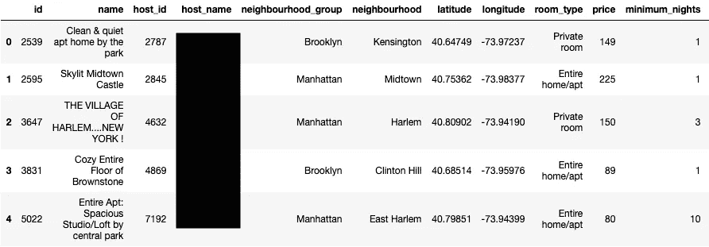

Data.head(5)

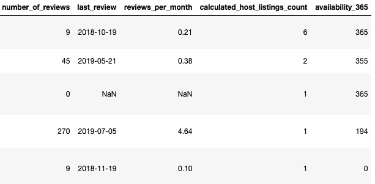

Data Table Continues

我们可以快速查看数据集属性，并删除分析中不需要的某些列。其中的主机名因隐私原因被编辑。通常，任何统计建模都会对任何与用户相关的分析计算 user_id 或 id。 ***这一切都是匿名的。***

## 数据争论

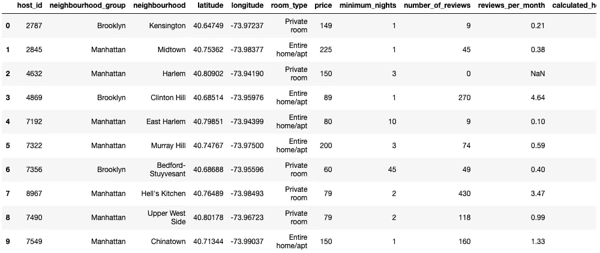

Data.drop([‘id’,’name’,’host_name’,’last_review’], axis=1, inplace=True)

我们将对 Drop- id、name、host_name、last_review 进行一些基本的分析。

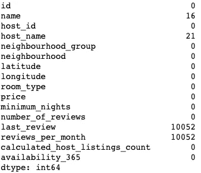

Data.isnull().sum()

Python 使得处理空值变得轻而易举。我们可以很快用 0 代替 Nan

***data . fillna({ ' reviews _ per _ month ':0 }，inplace=True)***

然后检查列(将返回 0)***data . reviews _ per _ month . is null()。*sum()**

## 数据验证

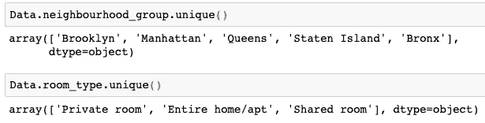

虽然在我们分析数据之前有很多方法可以验证数据。在本例中，我们检查了来自两列的唯一响应，它们符合我们的预期。

## 数据分析、可视化和洞察

为此，我们将使用 python 和 tableau 的组合，因为有时在 Tableau 中数据可视化更容易。

**按区分类的主机列表**——这给出了我们在每个社区群中有多少列表的大致概念，这对于*潜在的主机、希望进入 Airbnb 的房地产公司**非常有用。*这对于 AirBnb、旅游机构在规划纽约地区的广告支出时也非常有用。

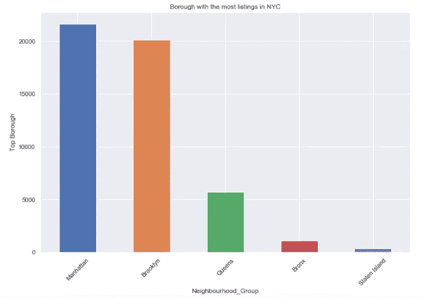

Seaborn Library is useful for quick analysis and can be automated within the same data set

> **曼哈顿和布鲁克林的房源占纽约市房源总数的 85%以上**

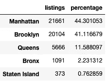

**基于访问的洞察-** 现在，在一个理想的世界里，Airbnb 应该有预订数据，并且可能有一个单独的数据库，用于存储已确认的预订数据，用户在那里预订并到达主机房源。我们将要讨论的一些基本观点可能会更有说服力，但我们会利用现有的观点，特别是如果您是像纽约市旅游/经济机构或纽约州机构这样的外部组织。我们至少要看看这里有什么可能。 ***都是关于建立一种方法*** 。

> 审查次数=访问次数(已确认)

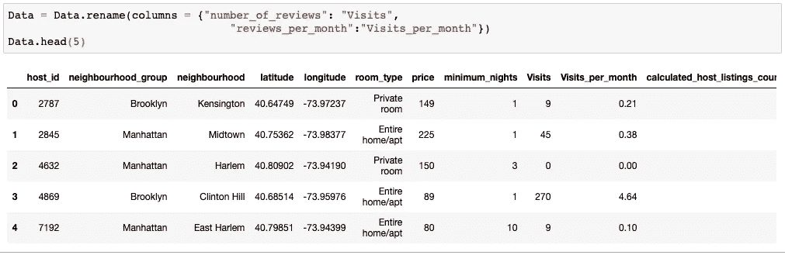

我有信心使用这些数据点的原因是因为我们拥有的总量。(见下文)

这种方法产生了 113 万次确认访问，我们已经可以看到，在这个特定时期，尽管曼哈顿有更多的房源，但更多的人更喜欢留在布鲁克林。

原因有很多，但最明显的是价格。

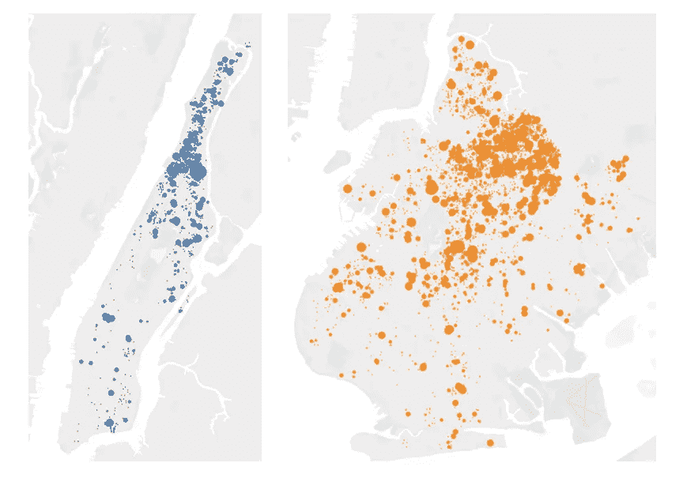

Manhattan vs Brooklyn (Monthly Rentals, $20 to $50/day)

> 区的访问清楚地告诉我们，布鲁克林拥有更多低价租赁房源，大约是曼哈顿的 3 倍。

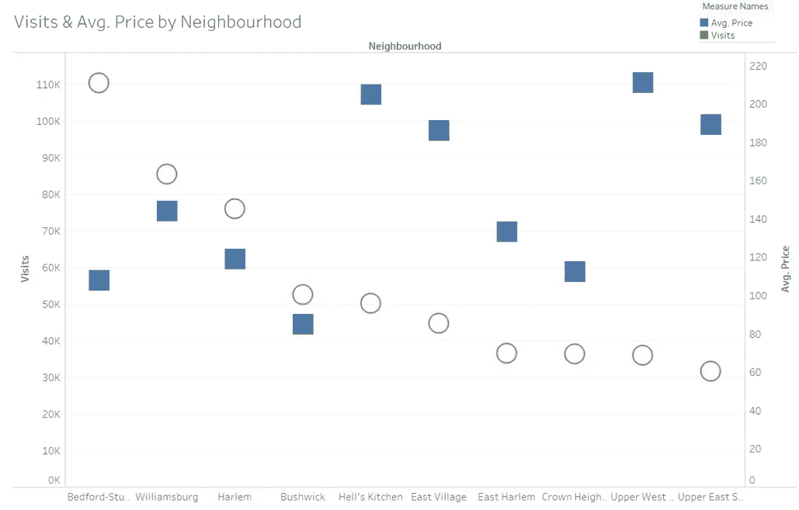

当我们按社区分析访问量和价格时，我们发现 Bedford Stuyvesant(布鲁克林)的访问量和平均价格最高。整体平均价格最低的布什维克的访问量排名第四。这意味着其他因素也会影响顾客选择特定的社区。也许我们可以将安全或运输作为其他因素进行评分，然后进行分析。

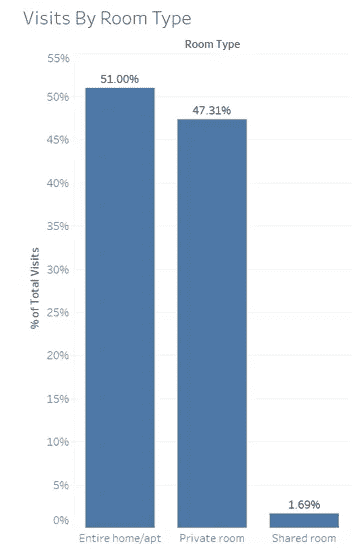

按房间类型进行的访问显示出一个明显的趋势，即大约一半的人更喜欢租整个房子，超过 98%的人更喜欢私人空间。

> **合住房间和私人房间的价格差不到 22%，这可能是大多数人不明白合住房间有什么意义的最大原因。**

**停留时间-** 这也是一个重要的洞察，突出了访客流动的趋势，从纯粹的战略和规划角度来看，我们可以利用这些数据根据客户偏好优化活动。

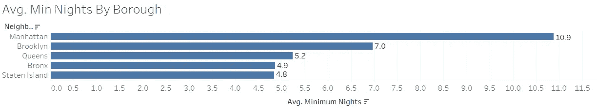

> 平均而言，住在曼哈顿的人比住在布鲁克林、皇后区、布朗克斯区的人呆的时间更长。根据利益相关者，这可以帮助规划未来的活动，列表搜索优化等。

## 结论

以上分析只是整个报告的一个子集。如果我们将*季节性、营销归因*与访问量结合起来，这将给我们一个更准确的描述和更好的战略方向，更重要的是，我们可以将访问量作为转化，建立一个 ROI 模型。分析的方法与上面的相同。我们可以利用其余的见解来支持和强调促成整体成功的重要活动。媒体公司、广告公司、旅游机构和其他利益相关者将从这种分析和报告中受益。