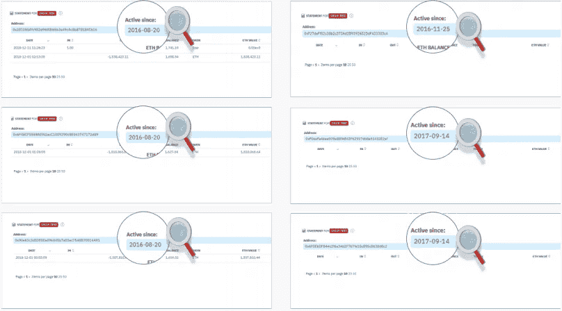
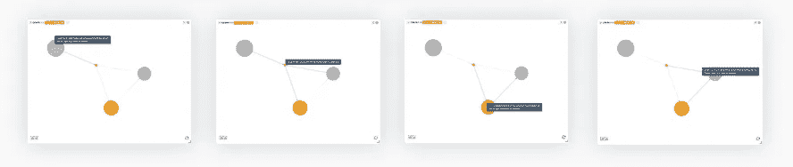
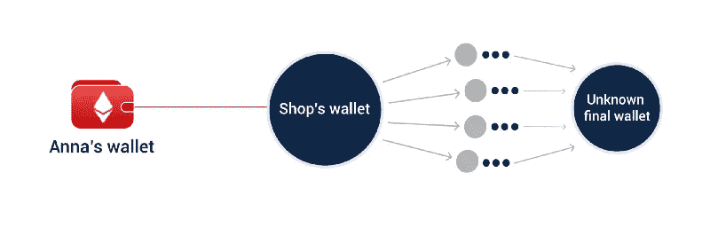

# 检查加密:充分利用区块链浏览器

> 原文：<https://medium.datadriveninvestor.com/inspecting-crypto-make-the-most-out-of-a-blockchain-explorer-f0c805ee05e5?source=collection_archive---------1----------------------->

B 锁链分类账包含数百千兆字节的不可读信息。为了便于理解和解释，有块探索者(通常被称为“区块链探索者”或“钱包探索者”)。

了解网络性能需要块浏览器。它列出了链的最新区块、给定区块中的交易、当前和历史余额、特定区块的年龄和高度以及其他有用的数据。下面，你会发现一些受欢迎的应用区块链探索者检查块，地址或交易。

# 用于分析地址的区块链浏览器

区块链探索者是关于特定地址的宝贵信息来源，无论是你自己的钱包还是可疑加密货币交易所的钱包。无需登录应用程序来检查您的余额或交易，您只需在 block explorer 的搜索栏中键入地址即可。

 [## 正在改变行业的 5 个真实世界区块链应用——数据驱动的投资者

### 除非你一直生活在岩石下，否则我相信你现在已经听说过区块链了。而区块链…

www.datadriveninvestor.com](https://www.datadriveninvestor.com/2019/02/13/5-real-world-blockchain-applications/) 

这将告诉您几乎所有您需要知道的关于该地址的信息，包括:

*   钱包余额及其等值美元
*   持有哪些代币，持有比例是多少
*   事务散列和值

探索地址还可以提供有关地址性质的信息。

> 如果一个地址经常从/向多个来源接收和发送资金，这可能意味着**它要么是一个交易所，要么是一个用于隐藏资金来源的翻滚服务**。

您还可以使用块资源管理器来分析与该地址相关的事务的完整列表。如果一些日期或金额与另一个钱包的日期或金额一致，这可以揭示它们的相互关系。

> 区块链探险者揭示地址关系的一个例子是[对 6 个以太坊钱包](https://c-hound.ai/investigations?utm_source=journalists)的案例研究，这些钱包被指控伪造去中心化。交易日期和交易量的一致性揭示了这种相互联系。

# 使用区块链探索者分析交易

在比特币或以太坊等公共账本的情况下，区块链交易很容易追踪。块探测器通常**实时更新**每个事务的主要细节，包括:

*   TxHash 搜索中使用的事务 ID
*   TxReceipt Status —交易状态的确认
*   块高度—发生事务的块的编号
*   时间戳—包含事务的块被挖掘的确切时间
*   发件人/收件人—发件人和收件人的地址
*   价值——发送的金额及其美元等值
*   实际交易成本/费用—交易的实际成本

利用这些数据，你可以找到很多有用的信息。例如，发件人/收件人地址和金额可以显示不同钱包之间的明确联系，并且它们对于将属于同一个人或实体的地址分组(*聚类*)在一起是至关重要的。理论上，你可以追踪交易的整个历史，直到你找到最初的账户持有人——除非这个链条被不倒翁交易打断了。

> 交易分析可以揭示的一个很好的例子是[quadrigax 调查](https://www.c-hound.ai/quadriga-research)。区块链的调查证明，这家臭名昭著的交易所一直在利用其他交易所将资金外部化，并满足提款要求，这是庞氏骗局的典型迹象。

# 加密调查:区块链探索者能告诉我们什么

Block explorers 作为开源情报工具，用于调查加密货币欺诈和其他非法活动的案件。通常，这种研究包括以下步骤:

1.**收集原始数据**并将其整理成事件时间表，尽可能标明主题、地点和动机。

2.**分析地址和交易**以确定资金的去向以及隐藏资金的策略(集群钱包、混合服务等)。).

3.**使用开源智能工具**(搜索引擎、新闻文章、社交媒体分析等。)来确定非法挪用资金的持有人或案件中其他缺失的信息。

如您所见，块浏览器是跟踪资金流动的不可或缺的工具。

> 你可以在[如何调查秘密犯罪中找到更详细的指南:一个简单的分步指南](https://cryptodigestnews.com/how-to-investigate-a-crypto-crime-a-simple-step-by-step-guide-5a9baf5112ad)。

# 关键要点

总之，区块链探索者是简单而强大的开源工具，具有广泛的应用范围。在他们的帮助下，你可以快速检查你的钱包余额，决定加密货币的可信度，调查欺诈案件等等。结合公共区块链分类账的透明度，这些开放工具进一步确保了加密货币运营的公平标准。