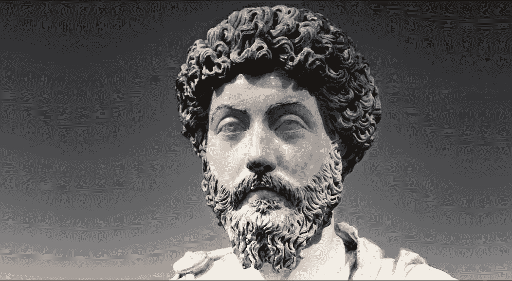
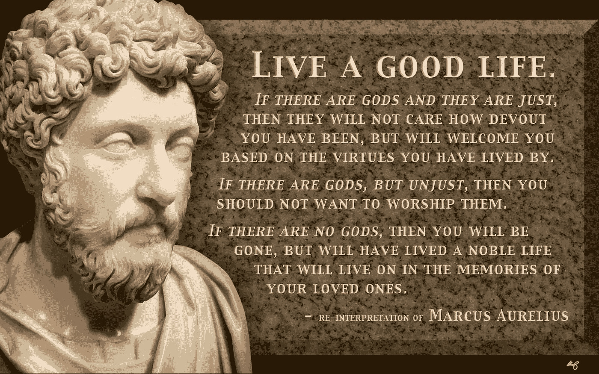
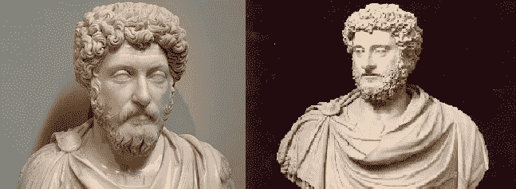

# 用马可·奥勒留激励人们

> 原文：<https://medium.datadriveninvestor.com/inspiring-people-with-marcus-aurelius-27120302a69e?source=collection_archive---------5----------------------->

## 用马可·奥勒留的教导激励人们

**无疑惊艳！**

**伟大的人格！**

**斯多葛派哲学。**

**马可·奥勒留**安东尼努斯(**r .**161–180 CE)，被誉为**罗马帝国**的最后一位【好皇帝】**。在他的斯多葛派哲学指导下，他对人民的忠诚是他统治时期的特点。**

**奥勒留于公元 121 年出生于西班牙一个被认为是西班牙王室的罗马贵族家庭。他是以他的父亲马库斯·安纽斯·维勒斯的名字命名的，而后者是以他的父亲以及在此之前的许多父亲的名字命名的。他的母亲多米蒂亚·露西拉(约 155-161 年)是一个富有的贵族，与皇室也有很深的关系。可悲的是，奥勒留的父亲在奥勒留三岁时就去世了，因此主要由他的祖父母和护士抚养。**

****

**Marcus Aurelius Sculpture (aka Stoic Legend)**

**奥勒留生前备受尊敬。他统治下的两个哲学耐力，*(他的日志)和**斯多葛主义。*****

# ***斯多葛哲学ˌ斯多葛学派***

***根据先例，奥勒留是一个斯多葛派。他的传记作者朱利叶斯·卡皮托利纳斯这样描述他。奥勒留向许多斯多葛派学习，特别提到了鲁斯提库，然而，在《沉思录》中没有任何地方明确提到马库斯是一个斯多葛派。这可能仅仅意味着奥勒留只是为自己而不是为观众写作。尽管公平地说，奥勒留对其他哲学传统的思想并不开放，但他只是被斯多葛派哲学所吸引，并据此进行统治。***

## ***什么是斯多葛派？***

***斯多葛派在公元前 3 世纪早期由 Citium 的芝诺在雅典创立，但由爱比克泰德、塞内加和马可·奥勒留等人广为流传。哲学是关于美德(像智慧一样)是幸福的，判断应该基于行为，而不是语言。我们不能控制也不能依赖外部事件，只有我们自己和我们的反应。***

***斯多葛派只有几个核心教义，比如:***

*   ***它提醒我们这个世界是多么不可预测。***
*   ***我们的生命是多么短暂。***
*   ***如何变得坚定，坚强，并能控制自己。***
*   ***最后，我们不满的来源在于我们对反射感官的冲动依赖，而不是逻辑。***

> ***“今天我摆脱了焦虑。或者不，我抛弃了它，因为它在我内心，在我自己的感知中——而不是在外面。”—马库斯·奥勒留***

# ***沉思***

******《沉思录》*是奥勒留的日记**，写于公元 170-180 年间，当时他正在德国参加军事战役，在这本日记中，他表达了自己哲学上的**斯多葛派的人生观。**本质上，它是对如何过你最好的生活的反思，并在它的十二本书中重复了许多主题，因为奥勒留在不同的时间回答了许多问题(马库斯·奥勒留:柏拉图的哲学家国王，2018)。***

> ***《沉思录》试图回答的问题主要是形而上学的和伦理的:我们为什么在这里？我们应该如何生活？我们如何确保做正确的事？我们如何保护自己免受日常生活的压力？我们应该如何处理痛苦和不幸？我们怎么能接受有一天我们将不复存在的事实呢？”***

******

***Re-interpretation of one of Aurelius’ passage from *Meditations.****

***几个世纪以来，他的《沉思录》激励了无数人，但现在，他最出名的是在好莱坞热门电影《角斗士》(2000)中扮演的角色。虽然他在《角斗士》中的描述是虚构的，尤其是他死去的方式和他如何想要统治罗马，但是他在电影中被同情地描绘成对他遗产的纪念。***

***安东尼·庇护(约 86-161 CE)**收养并培养奥里利乌斯**为罗马皇帝，但庇护斯更喜欢哲学家的生活。在他的《沉思集》中，他一直在写真实、诚实生活的重要性，试图找到内心的平静，而不是关注权力的象征和统治一个帝国所固有的责任。***

## ***冥想中鼓舞人心的摘录***

*   ***不骄不躁地接受，满不在乎地放手。翻译:“*得到而不骄傲，放下而不执着。”****

***奥勒留被认为是一个非常斯多葛派的皇帝，这是他的书中斯多葛派的一个主要例子。***

*   ***在一段话中，奥勒留写了他对艺术的热爱。他指出，悲剧(戏剧)提醒我们生活可能会扔给我们曲线球。“如果某件事在那个舞台上给了你快乐，它不应该让你在这个舞台上生气。”翻译:*“如果你能在小说中欣赏，你就能在生活中欣赏。”****

***这表明凡事都有好的一面，人们应该意识到这一点。这凸显了他对人民的忠诚。***

# *****挑战马库斯·奥勒留的权威*****

***公元 175 年，他面临一个巨大的挑战，**没人把他当回事**。听到**关于奥勒留病危的谣言后，阿维狄乌斯·卡西乌斯宣称自己是皇帝**。这迫使奥勒留向东行进并重新获得控制权。然而，他不需要和卡修斯战斗，因为他已经被自己的士兵杀死了。相反，奥列留斯**和他的妻子游历了东部省份，重新树立了他的权威**。不幸的是，福斯蒂娜(他的妻子)在这次旅行中去世了。***

***在与德意志部落作战时，奥勒留于公元 177 年在康茂德建立了他的共同统治者。他们一起抗击帝国的北方敌人。奥勒留希望通过这场冲突来扩展帝国的疆域，但是奥勒留没能活到这一天。***

***马可·奥勒留死于公元 180 年 3 月 17 日。他的儿子康茂德成为皇帝，很快结束了北方的军事行动。然而，马库斯·奥勒留并不是因为他发动的战争而被铭记，而是因为他的决策和基于事实的推理。***

******

*****Left**: Marcus Aurelius **Right**: Commodus***

***最后，总会有人挑战你，试图让你偏离正道，但请记住，永远坚持你的道德。奥勒留从未让任何人“进入他的皮肤”，并坚持他的斯多葛派哲学。由于这一点，他能够成功地统治和征服所有对立的部落。他是一个榜样，绝对是一个值得尊敬的人！***

# ***关键要点***

*   ***他在两种哲学忍耐下统治着，冥想(他的日记)和斯多葛主义。***
*   ***哲学是关于美德(像智慧一样)是幸福的，判断应该基于行为，而不是语言。***
*   ***我们不能控制也不能依赖外部事件，只有我们自己和我们的反应。***
*   ***《沉思录》是奥勒留的日记，写于公元 170-180 年。***
*   ***在《沉思录》中，他表达了他的哲学、斯多葛派的人生观。***
*   ***公元 175 年，他面临一个巨大的挑战，没有人把他当回事。***
*   ***在听到关于奥勒留病危的谣言后，阿维狄乌斯·卡西乌斯宣称自己是皇帝。***
*   ***马可·奥勒留死于公元 180 年 3 月 17 日。他的儿子康茂德成为皇帝，并很快结束了北方的军事努力。***

## ***如果你喜欢我的文章，请鼓掌并在 Medium 上关注我！还有，看看我的 LinkedIn — [阿玛恩商人。](https://www.linkedin.com/in/armaan-merchant-b3bba89a/)***