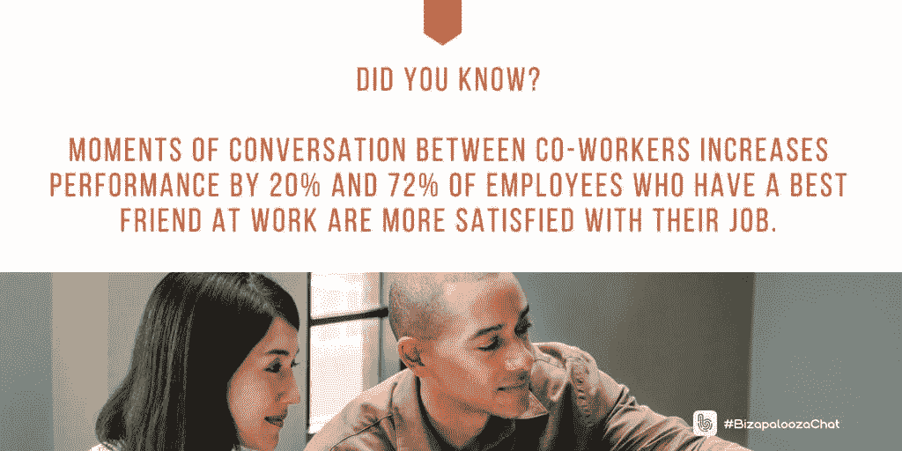
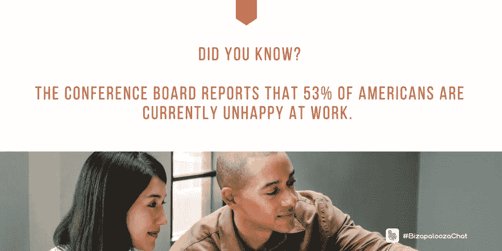

# 鼓舞人心的空间让员工心情愉悦

> 原文：<https://medium.datadriveninvestor.com/inspiring-spaces-put-workers-in-the-mood-516bd6947d01?source=collection_archive---------8----------------------->

## 创造舒适、高效的工作场所对每个人都有帮助

工作环境会给快乐的员工带来情绪，快乐的员工会更有效率。他们彼此之间也更加投入，这使得工作场所成为人们日常生活的目的地。

吸引人的地方请[马克卡鲁泽斯](https://twitter.com/MarkC_Avgi)。他专门研究小企业、企业家精神、技术和社交媒体。

卡鲁泽斯、[伊万娜·泰勒](https://diymarketers.com/about/)和[伊瓦·伊尼亚托维奇](https://twitter.com/IvaIgnjatovic)思考了创造工作环境如何帮助每个人。

泰勒拥有 DIYMarketers 公司，这是一家“致力于帮助小企业主摆脱困境”的公司。Ignjatovic 是一名营销、战略、领导力和商业顾问。

“我喜欢成为多功能团队的一员，喜欢轮流担任领导，”泰勒说。

与此同时，Ignjatovic 喜欢“各种意义上的多样性，与社交和情感上聪明的人一起工作。”

 [## “工作场所多元化”仍然是一个难以实现的梦想

### 企业面临着改变文化的挑战

medium.com](https://medium.com/datadriveninvestor/workplace-diversity-still-an-elusive-dream-858e45baec91) 

卡鲁泽斯赞赏促进团体友谊的安排。

“从身体上来说，我理想的工作场所应该允许人们团队合作，”他说。“任何障碍都会让人们在工作时受到最小的干扰，但仍能促进轻松的互动和交流。

“在文化上，我理想的工作场所是一个相互尊重、团结和团队合作的环境，”他说。“每个人都努力工作，但有享受乐趣的自由。人们每天都期待着去上班。”

尽管每个人都在努力，但今天的员工敬业度很低。

“几十年前，当公司开始裁员时，他们就打破了心理契约，”泰勒说。“公司不忠诚，员工也不忠诚。”

# 从员工的角度出发

Ignjatovic 认为，其中一个问题是，敬业度只是从雇主的角度来看。

卡鲁泽斯说:“就业参与度低源于未满足的期望，这些期望涉及但不限于薪酬、沟通、晋升、与工作相关的工作满意度以及糟糕的管理关系。”。

他说:“这也可能与个人因素有关，个人因素会影响绩效，导致人力资源或经理不必要的关注。”

 [## 寻找 HR 中消失的人

### 挥舞拳头，对着云大喊大叫，让工人们有意义地参与进来

medium.com](https://medium.com/datadriveninvestor/in-search-of-the-vanishing-human-in-hr-a9ea9a581bb1) 

虽然钱很重要，但它不是唯一的员工激励。

泰勒提到了自我表达的自由和对贡献的奖励。

Ignjatovic 说:“创造一个工作场所，让人们感受到鼓舞和透明。”“那时，雇主会承认并利用员工的优势。"

# 适应个人需求

卡鲁泽斯说，激励措施可以激励大多数员工，但是宽泛的方法会适得其反。

“在每段雇佣关系的早期评估什么可能最能激励每个人，”他说。“激励一代人——千禧一代、GenX 一代、GenY 一代或婴儿潮一代——的东西可能不会激励另一代人。人们有自己的需求和优先考虑的事情，这与他们在生活中所处的位置有关。

“一般来说，跨代的动机是工作中的享受和欣赏，”他说。“这源于与上级和同事之间健康的信任关系和相互尊重。”

泰勒对管理层想从员工身上得到什么不抱任何幻想。

她说:“管理层希望员工忠诚、努力、敬业，并致力于企业的成功。”。

Ignjatovic 对她在战壕里的日子没有什么美好的回忆。

“在营销机构工作时，管理层希望我们所有人都为公司而活，长时间工作，为公司赚钱，”她说。"他们没有给予任何实质性的回报。"

起初，卡鲁泽斯对管理层的期望描绘了一幅更美好的画面:

*   诚实:产生可预测结果的职业道德。
*   对同事、下属、管理层、老板和客户保持积极的态度。
*   学习和成长的能力。
*   主动和深谋远虑。

# 关系谬误

“可是谁在骗谁呢？”卡鲁泽斯说。“最终，管理层和所有者希望从他们雇佣的人身上赚钱，希望是在一个富有成效、积极的环境中。

“在营销机构工作时，管理层希望我们所有人都为公司而活，长时间工作，为公司赚钱，而不给予任何实质性的回报，”他说。

盖洛普的一篇文章击中了目标:“ [*文化通过最大限度地利用人们*](https://www.gallup.com/workplace/238052/culture-wins-getting-people.aspx?utm_source=twitterbutton&utm_medium=twitter&utm_campaign=sharing) 而获胜。”

许多人在工作中与老板或下属的关系很紧张。

“我没有处理它，”泰勒说。“我接受了，并尽了最大努力，但我害怕去工作。”

卡鲁泽斯回忆了一段感情挑战的历史。

“作为我大学教育的一部分，我在一家会计公司工作后，我的大部分职位都涉及解决问题、建议和促进变革，”他说。

“当我不是个体户的时候，我是在管理层——介于所有者或高管和员工之间，”卡鲁泽斯说。"这包括影响员工的责任，向我的下属汇报或建议改变."

 [## 企业文化的未来就在现在

### 企业家需要认真审视他们今天的处境

medium.com](https://medium.com/datadriveninvestor/corporate-cultures-future-is-now-2f7fd6bfcaa1) 

他的方法因职位而异。

“作为团队的一员，我努力向下属灌输团队精神，”卡鲁泽斯说。“我确保他们理解并接受这一点——在我的位置上——我仍然最终对团队成果负责。

“对于所有者，我的职责包括并结束于向我的上级所有者或经理报告和提出建议，”他说。“我不得不接受最终决定权在他们手中。我不得不接受他们的决定，否则就离开。”

# 不像机器

在任何位置，僵化都是要付出代价的。

“当一个看起来像机器人的人——坚持规则，呼吁制定规则——人们讨厌它，”Ignjatovic 说。“他们要求‘更人性化的方法’

“有了我的下属，事情就简单多了，”她说。“我致力于解决问题。对老板来说，这毫无意义。最终，我们分手了。”

# 个体差异

每个人都有自己的个性和兴趣。这导致了与系统、政策和程序的分歧。在这些时候，人可以是资产，也可以是负债。

“这取决于动机或意图，”泰勒说。“有些人就是消极。对于那些不偏不倚的人，我会把他们视为一种资产。”

卡鲁泽斯认为你可以和这两种类型的人共事。

“‘异议者’可以是资产、负债，也可以是在一段时间后或随着业务的变化而变成负债的资产，”他说。“决定它们价值的因素有很多。

卡鲁泽斯说:“持不同意见的人通常非常聪明，能够看到可能发生的有益变化。”。“他们见解的成功将取决于他们提出问题和解决方案的能力，以及其他人考虑这些问题的意愿。”

 [## 良好的一致性将你的价值观放在首位

### 核心价值观需要与员工相关并反映员工

medium.com](https://medium.com/datadriveninvestor/good-alignment-puts-your-values-top-of-mind-88bab188f6d8) 

最重要的是高层的行动。

“如果所有者和管理层愿意改变，这是实现员工积极推荐的关键，”卡鲁泽斯说。“如果决策者不愿意改变，价值永远是负的。

“如果持不同意见的人被其他人视为长期抱怨者，评论只会成为‘噪音’，被视为工作环境中的有毒成分，”他说。"这不考虑所说内容的潜在价值."

# 没有希望

还有一些无望的案例。

“不幸的是，有些人似乎只会流露出消极情绪，”卡鲁泽斯说。"它们将永远是企业的负担，需要被清除."

Ignjatovic 更喜欢给人以怀疑的好处。

“在我称它们为负担之前，我会倾听和调查，”她说。

《成就者》杂志上的一篇文章解释了员工参与度的神经科学的 T2。

对员工或老板的假设会破坏工作中的快乐和成功。

“所有者认为员工应该致力于所有者的成功，”泰勒说。员工认为他们可以做任何他们想做的事情，他们应该被接受。"

卡鲁泽斯从两面看世界。

“另一方欠我的，”他说。“在个人对企业的贡献或感知价值所实现的利益之间，经常会有一种不平衡的感觉。

“许多员工认为他们在 T4 的工作场所应该总是充满乐趣，”卡鲁泽斯说。“现实中还是职场。有时候会有不愉快的任务和人。这就是生活。”

# 只有你看到的

当补偿仅仅基于你所看到的就是你所得到的时，不愉快是复合的。

“不幸的是，一些业主和管理人员仍然认为员工所做的工作就是他们得到的报酬，”卡鲁泽斯说。"没有理由在货币或其他方面进一步升值."

 [## 企业家们今天挖掘以确保美好的未来

### 对更好生活的承诺让他们的眼睛盯着奖品

medium.com](https://medium.com/an-idea/entrepreneurs-dig-in-today-to-secure-great-futures-add76cb35941) 

提出问题也有处罚。

Ignjatovic 说:“当人们在问问题或要求澄清是错误的公司工作时，这是徒劳的，令人沮丧的。”

糟糕的领导和缺乏支持会让员工失去动力——或者用泰勒的话说，“愚蠢的规则和政策限制了生产力。”

卡鲁泽斯举了许多例子:

*   太多的政策和审批。
*   太多不同议程的“老板”。
*   不适应感。
*   感觉不被信任。
*   按小时而不是贡献来评估。
*   沟通不畅。
*   缺乏有意义的反馈。
*   业务缺乏透明度。
*   不明确的期望。
*   无法向雇主提供有关问题的反馈。
*   在“没有前途”的工作中缺乏职业发展的机会，或者缺乏学习和技能提高的机会。

Ignjatovic 说:“当无能为力时，人们就不信任领导。”。

一篇文章解释了为什么[公司文化对初创公司](https://e27.co/4-reasons-company-culture-important-startups-20180730/)很重要。

# 激励和奖励

有了这种理解，管理层可以激发和奖励创造性思维，这将扰乱和改善他们的业务。

卡鲁泽斯说:“如果管理层认为事情进展顺利，但还可以更好，或者员工已经失去了激情、活力或创造力，那就洗牌吧。”。“调动人员来创建新的团队或新的‘副业’项目。

“人们会变得自满，与同样的人一起工作，日复一日，年复一年地做同样的事情，”他说。"和不同的人一起应对新的挑战可能会让精力再次充沛起来."

 [## 创新为商业基础注入乐趣

### 思想开放和灵活会带来成功

medium.com](https://medium.com/datadriveninvestor/innovation-injects-fun-into-business-fundamentals-408a620713aa) 

一定要以正确的方式改变事情。

“重组或翻新工作场所，但不能以牺牲为员工做事为代价，”卡鲁泽斯说。“你不希望员工觉得你在‘浪费’他们的钱，因为他们觉得工资太低。”

泰勒说，管理层“必须接受对他们假设的挑战。他们可以定期开会，或者建立一个合适的架构来集思广益。”

领导者需要愿意冒险。

“接受一定程度的冒险，”Ignjatovic 说。“创造力和创新是有风险的。有时候管理层应该容忍失败和错误。”

如果她能写出工作规则，泰勒会把“了解并支持彼此的目标和愿望”放在首位。

“任何时候都要保持专业，”卡鲁泽斯说。“在公司内部以及与客户之间保持相互尊重。没有尊重，就不会有任何积极的收获。”

**关于作者**

吉姆·卡扎曼是[拉戈金融服务公司](http://largofinancialservices.com)的经理，曾在空军和联邦政府的公共事务部门工作。你可以在[推特](https://twitter.com/JKatzaman)、[脸书](https://www.facebook.com/jim.katzaman)和 [LinkedIn](https://www.linkedin.com/in/jim-katzaman-33641b21/) 上和他联系。