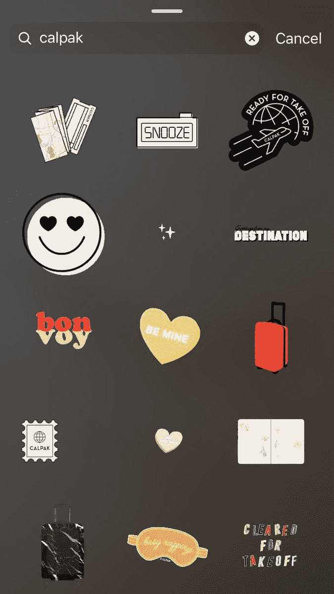
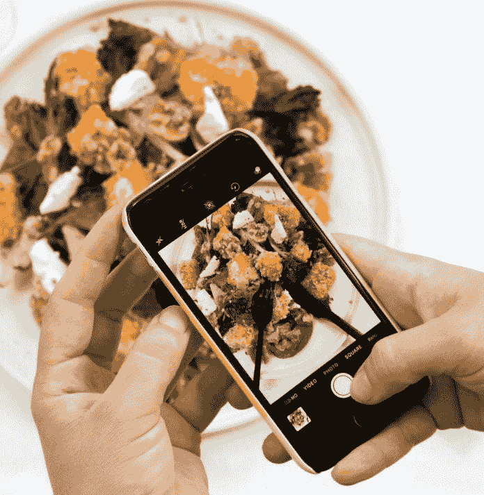

# Instagram 飙升至更高水平

> 原文：<https://medium.datadriveninvestor.com/instagram-surges-to-greater-heights-447448638be?source=collection_archive---------11----------------------->

## 回应要求更多真实性和透明度的呼声

推动 Instagram 成功和[克服神话](https://blog.markgrowth.com/driving-a-stake-into-instagram-myths-and-legends-6e8ac0648892)的许多因素包括:将 gif 图片电子化、每个人都有影响力的人的崛起以及简单地了解你的个人简介。

这就是福布斯 50 大社交媒体影响力人物[戴德·沃森](https://twitter.com/Dede_Watson)感到宾至如归的地方。她发现趋势，让客户在竞争中领先。

沃森与 [ManageSocial](https://twitter.com/ManageSocial) 产品设计师 [Kate Frappell](https://twitter.com/katefrappell) 和数字营销人员 [Madalyn Sklar](https://twitter.com/MadalynSklar) 一起研究了影响 Instagram 的近期和未来趋势，从影响者营销开始。

据影响者营销机构 [mediakix](https://twitter.com/Mediakix) 称，到 2020 年，全球在影响者身上的广告支出预计将达到 50 亿至 100 亿美元。

“寻找更多 10 万粉丝以下的微观影响者和纳米影响者——可能只有几千人或更少——成为品牌合作的更大焦点，”沃森说。

“人们希望看到品牌和影响者更加真实和透明，”她说。“政府也在打击。因此，影响者在获得任何形式的报酬时都必须披露。”

企业家也需要主动营销。

“更多的品牌和销售实体产品的普通人将使用 Instagram 上的购物功能，”沃森说。“它已经存在了一段时间，但很多品牌仍未充分利用它。直接从帖子上购物，无需搜索链接。

 [## 我们屏蔽了社交媒体，这引起了公愤。数据驱动的投资者

### 上瘾，我们看不出来。在最近的一项研究中，基于以前的研究成果，我们想…

www.datadriveninvestor.com](https://www.datadriveninvestor.com/2018/12/01/we-blocked-access-to-social-media-it-caused-an-outrage/) 

她说:“更多的广告支出将投向故事。”。“每日故事的用户超过 50 万。故事不是给二流内容看的。是时候升级你的故事游戏了，尤其是在你没有使用它们的时候。”

# 关注者里程碑

沃森指出，当涉及到追随者数量时，越多越好。

“当你的粉丝达到 10，000 人时，你可以在你的故事中分享一个链接，”她说。“有很多方法可以通过故事来推广你的网站和帖子，并与你的粉丝建立联系。让他们在更私人的环境中看到你。

“我对故事非常着迷，”沃森补充道。

虽然对 Instagram 充满热情，但 Frappell 对广告心存疑虑。

“定向广告开始变得有点多了，”她说。“更多的真实性是解决这个问题的关键。”

除此之外，Frappell 与 Instagram 有一段虚拟的恋情。

“我喜欢电影，”她说。“这些静止图像带有重复运动的[味道](https://twitter.com/JulienDouvier/status/571337949696036865)，通常以 GIF 或视频的形式输出，这是[朱利安·多维尔](https://twitter.com/JulienDouvier)的专长。

“我也喜欢品牌 gif 越来越受欢迎，”Frappell 说。“虽然我不太喜欢在我的 Instagram 故事上粘贴徽标，但我也喜欢遵循特定风格指南的 gif。箱包品牌 CalPak 就是一个很好的例子。”

主张自己的市场份额也很重要。

“我开始看到的另一个趋势是，更大的品牌创建更多的个人资料，并定位，”Frappell 说。“例如，一家全球服装公司可能会根据位置创建个人资料。通过这种方式，他们可以向经历温暖天气的顾客提供夏装。”

# 放大小社区

Instagram 是在较小的社区中获取高质量参与的首选平台。借助一个强大的工具，小企业可以获得更多的关注。

“标签，标签，标签和地理标签，”沃森说。“确保它们是有针对性的标签。

“利用当地人和顾客来分享他们的经验，”她说。“让你的顾客和客户成为品牌倡导者。让你的员工也成为你的拥护者，在他们的订阅源上发帖。在你的订阅源上分享他们的帖子和你的客户的帖子。这是用户生成的内容。"

 [## 将股份打入 Instagram 神话和传说

### 道听途说会把你引入歧途

blog.markgrowth.com](https://blog.markgrowth.com/driving-a-stake-into-instagram-myths-and-legends-6e8ac0648892) 

利用这些免费资源可以减轻一些对金钱的担忧。

“如果你没有大的广告预算，运行小的赞助帖子来吸引人们到你的订阅，”沃森说。“创建您的企业故事，并与您的 Instagram 社区分享。与你的目标群体建立牢固的关系。”

微影响者在抓住消费者的注意力和欲望方面起着战略性的作用。

“它们对品牌极其重要，”沃森说。“首先，它们将使一个品牌能够进一步传播广告收入。

她说:“如果你能拿出 5 万到 10 万美元，在一篇帖子中为一个大的影响者付费，并利用这一点接触到更有针对性的受众，其中有数百名微型和纳米影响者，那么使用他们就更有意义。”

微影响者自然会撕掉神秘感。

沃森说:“比起名人，人们更容易与普通人或较小的影响者产生联系。”“比起名人，他们更能在你我身上看到自己。

“作为品牌大使的微小影响者也变得越来越突出，”她说。“这些人是某个品牌的付费拥护者。看到他们定期与某个品牌的产品互动，对如今的品牌来说极其有效。”

# 追求最好的

沃森解释说，Instagram 的故事和帖子在分发内容方面各有一席之地。

“两者同等重要，应该经常使用，”她说。“您的订阅源应该包含您的最佳视觉内容。每个帖子都应该计划好，这样你就可以在应用程序中展示视觉效果，如稍后或平面。

“整体外观对你的主饲料很重要，”沃森说。"你可以添加更长的标题，并在一个帖子或一个转盘中讲述一个完整的故事."

这是发挥想象力的时候了。

沃森说:“故事让你变得非常有创造力，应该被认为是添加不可思议的内容的一种方式，这些内容可能不适合你的主要内容。”“Instagram 不断为故事添加更多功能。你肯定需要每天发布它们。

“现在 Stories 中有这么多功能可以帮助你创建动态内容和你可以使用的技巧，”她说。“Unfold 和 Story Art 等应用程序在为视频和图像创建令人难以置信的视觉效果方面非常出色。”

以 evergreen 为理念创建 Instagram 内容。越少提到日期和事件，就越容易一次又一次地使用你的主要文章，每次都强调不同的关键元素。

“在故事中分享你的帖子，”沃森说。“这是抓住你的追随者注意力的简单方法。要使用此功能，只需点击您的图片或在您的订阅源上发布。然后点击看起来像纸飞机的图标。

“重复使用你存档的故事，”她说。“要么从你的档案中重新调整用途，要么将原始图像或视频保存到你的相机胶卷中，然后使用手机上所有精彩的编辑功能，稍微改变一下。”

这导致了令人难忘的结果。

沃森说:“将视觉效果添加到展开或故事艺术应用程序的惊人模板中，给你的帖子增加额外的活力。”“或者使用 Hypetype app 添加字体或音乐。此外，我喜欢 Inshot 将 5 秒钟的视频变成 15 秒钟，给人们更多的时间观看——特别是如果我想让他们点击一个链接。

“在你的主页面上发布一个 [Instagram TV](https://blog.markgrowth.com/igtv-opens-video-venue-for-business-83d8fade57cd) 预览，”她说。"我用这种方式发布的帖子收到了近 1600 次浏览。"

# 交易目标

营销人员应该利用他们的密友名单，向特定受众分享有针对性的内容。

“增加目标追随者来分享独家交易，创建客户名单和会员资格，”沃森说。

“如果你用同一个账户做商业和个人用途，你可能会想把你的故事分成朋友和商业目标两部分，”她说。"为您的个人帐户或公司创建一个密友列表。截至目前，您只能创建一个列表。”

一个优化的 Instagram 传记将提高参与度，吸引人们关注你的订阅。在所有的社交平台中，你的简历就是你的名片。保持整洁，有事实依据，专业，让别人觉得你是专家，你在乎。

“大多数人都忽略了他们的简历，这是你 Instagram 页面上最重要的部分之一，”沃森说。“这是人们或品牌最先去了解你的地方之一。”

以下是她的传记小贴士:有一张很棒的个人资料图片，有当前的描述和链接。

“你知道吗，在 Instagram 上只有两个地方可以搜索到带有“@”的用户名和姓名？”沃森说。“一定要优化——尤其是你的名字。这可以不同于您的用户名，并且可以包括诸如您的行业之类的描述。

“添加一两个表情符号，”她说。“Instagram 上正在发布个人简历更新。不确定我是否喜欢。您需要点击“更多”来查看整个简介。大多数人不会花时间去挖掘更多。”

记住，注意力的持续时间是短暂的。

“确保人们能看到你是谁，你在做什么——要快，”沃森说。"如果你这周有时间的话，我强烈建议你去做一次生物审计."

Sklar 在一个[脸书现场视频](https://www.facebook.com/manageflitter/videos/268328897432743/?comment_id=268340270764939&notif_id=1553035362001962&notif_t=feedback_reaction_generic)中继续谈论 Instagram 趋势。

**关于作者**

吉姆·卡扎曼是拉戈金融服务公司的经理，曾在空军和联邦政府的公共事务部门工作。你可以在[推特](https://twitter.com/JKatzaman)、[脸书](https://www.facebook.com/jim.katzaman)和 [LinkedIn](https://www.linkedin.com/in/jim-katzaman-33641b21/) 上和他联系。

*原载于 2019 年 7 月 3 日*[*【https://www.datadriveninvestor.com】*](https://www.datadriveninvestor.com/2019/07/03/instagram-surges-to-greater-heights/)*。*