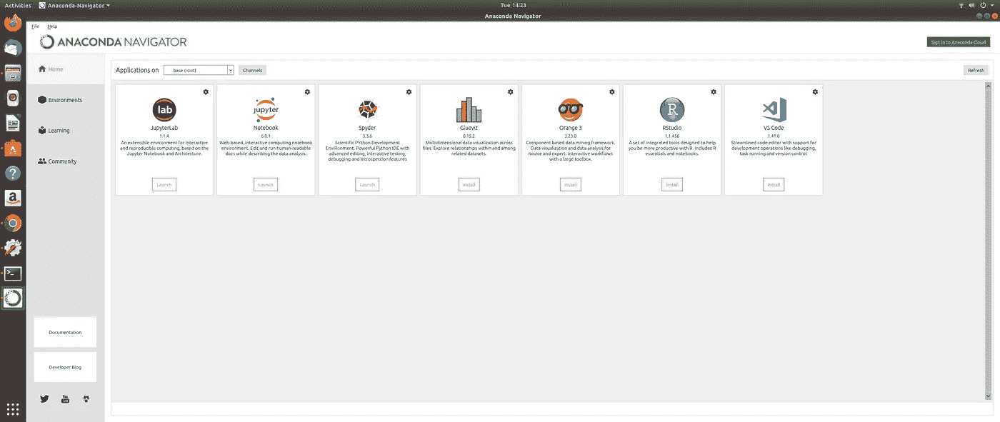
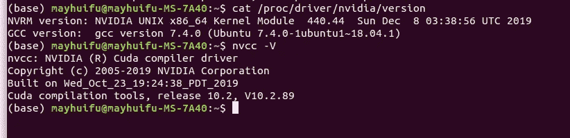
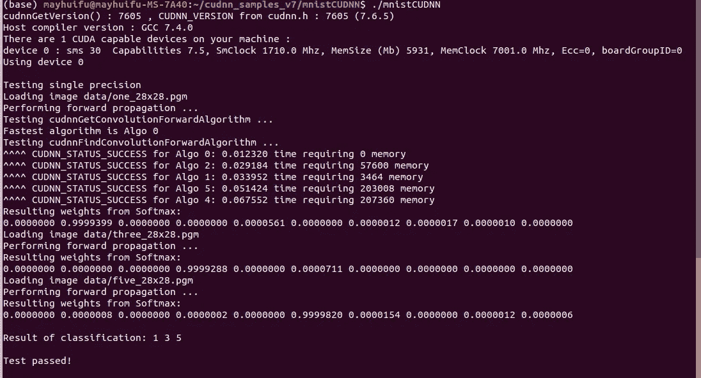
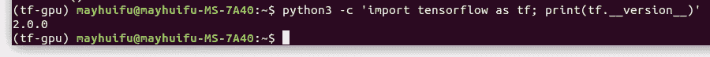
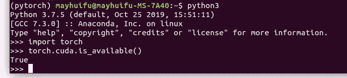
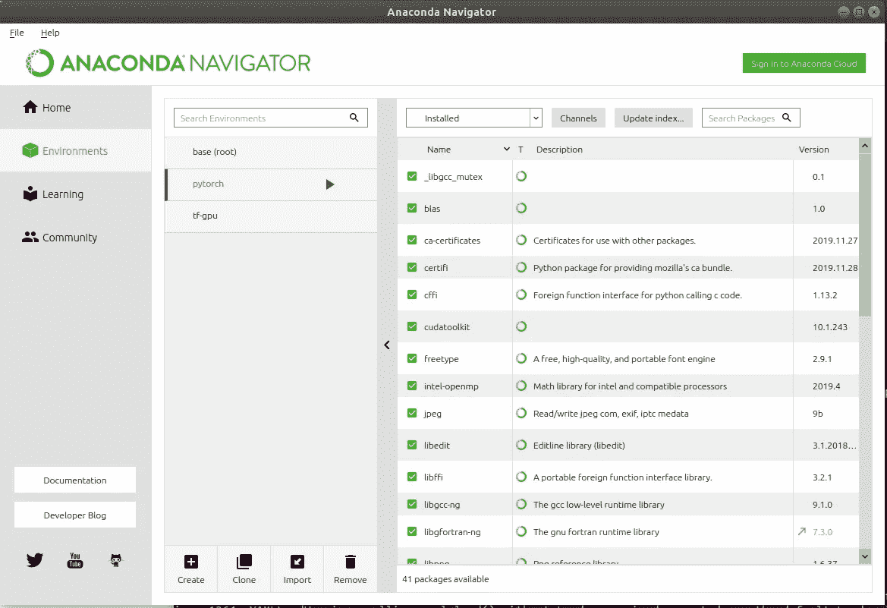

# 在 ubuntu 18.04 中安装 Conda cuda 10.2 cud nn 7 . 6 . 5 pytorch 1 . 3 . 1 和 Tensorflow2.0 进行深度学习

> 原文：<https://medium.datadriveninvestor.com/install-conda-cuda10-2-cudnn7-6-5-pytorch1-3-1-and-tensorflow2-0-in-ubuntu-18-04-for-deep-learning-5384ee09a503?source=collection_archive---------0----------------------->

# -完整的分步指南


Photo by [Mukil Menon](https://unsplash.com/@mukilmenon?utm_source=medium&utm_medium=referral) on [Unsplash](https://unsplash.com?utm_source=medium&utm_medium=referral)

我在黑色星期五大减价的时候得到了一张 GPU 卡。已经安装好了，现在想在我的 Ubuntu 18.04 TLS 中用 GPU 支持更新我所有的软件框架。

[](https://www.datadriveninvestor.com/2019/01/23/deep-learning-explained-in-7-steps/) [## 深度学习用 7 个步骤解释-更新|数据驱动的投资者

### 在深度学习的帮助下，自动驾驶汽车、Alexa、医学成像-小工具正在我们周围变得超级智能…

www.datadriveninvestor.com](https://www.datadriveninvestor.com/2019/01/23/deep-learning-explained-in-7-steps/) 

首先(假设你已经正确安装了 Nvidia 驱动程序(否则你会经常遇到 GNOME 冻结——如果你有这个问题，请查看这篇文章:[https://askubuntu . com/questions/1030060/freeze-after-log in-Ubuntu-18-04](https://askubuntu.com/questions/1030060/freeze-after-login-ubuntu-18-04))

1.  Anaconda 安装

前往 https://www.anaconda.com/distribution/[的 anaconda 页面](https://www.anaconda.com/distribution/)查看最新版本，在撰写本文时，我们已经发布了 2019-10 版本。

```
cd /tmp
curl -O [https://repo.anaconda.com/archive/Anaconda3-2019.10-Linux-x86_64.sh](https://repo.anaconda.com/archive/Anaconda3-2019.10-Linux-x86_64.sh)
```

下载后，验证一下。

```
sha256sum Anaconda3-2019.10-Linux-x86_64.sh
```

您应该得到如下所示的正确校验和:

```
output:
46d762284d252e51cd58a8ca6c8adc9da2eadc82c342927b2f66ed011d1d8b53  Anaconda3-2019.10-Linux-x86_64.sh
```

一切正常，继续安装

```
bash Anaconda3-2019.10-Linux-x86_64.sh
```

当询问是否接受许可协议时，请按 enter 键继续。

现在我们已经安装了 conda。

检查我们在康达上安装了什么

```
conda list
```

你得到了一长串与 Conda 一起安装的软件包

立即进行 conda 更新——它将更新到最新版本

```
conda update conda
```

然后更新软件包

```
conda update anaconda
```

喜欢使用 Anaconda GUI，启动 conda navigator

```
anaconda-navigator&
```



2.安装 Nvidia CUDA

转到 NVidia [下载包](https://developer.nvidia.com/cuda-downloads)，选择正确的组合，并按照命令顺序。我建议使用当地的 Deb 路线。

```
wget [https://developer.download.nvidia.com/compute/cuda/repos/ubuntu1804/x86_64/cuda-ubuntu1804.pin](https://developer.download.nvidia.com/compute/cuda/repos/ubuntu1804/x86_64/cuda-ubuntu1804.pin)sudo mv cuda-ubuntu1804.pin /etc/apt/preferences.d/cuda-repository-pin-600wget [http://developer.download.nvidia.com/compute/cuda/10.2/Prod/local_installers/cuda-repo-ubuntu1804-10-2-local-10.2.89-440.33.01_1.0-1_amd64.deb](http://developer.download.nvidia.com/compute/cuda/10.2/Prod/local_installers/cuda-repo-ubuntu1804-10-2-local-10.2.89-440.33.01_1.0-1_amd64.deb)sudo dpkg -i cuda-repo-ubuntu1804-10-2-local-10.2.89-440.33.01_1.0-1_amd64.debsudo apt-key add /var/cuda-repo-10-2-local-10.2.89-440.33.01/7fa2af80.pubsudo apt-get updatesudo apt-get -y install cuda
```

安装完成后，通过将以下行添加到。bashrc
`vim ~/.bashrc`
在文件末尾添加
`export PATH=/usr/local/cuda-10.0/bin${PATH:+:${PATH}}`
。

找到文件并使其可见

```
source ~/.bashrc
```

快速检查一下

```
cat /proc/driver/nvidia/version
nvcc -V
```



你可以走了。

3.安装 cuDNN7.6.5

进入 [cuDNN 下载页面](https://developer.nvidia.com/rdp/cudnn-download)(需要注册)，选择为 CUDA 10.2 制作的最新 cuDNN 7.6.5 版本。下载 ubuntu18.04 的 3 deb 文件，并转到下载文件夹，从那里安装。

首先安装运行时库

```
sudo dpkg -i libcudnn7_7.6.5.32-1+cuda10.2_amd64.deb
```

然后是开发者库

```
sudo dpkg -i libcudnn7-dev_7.6.5.32-1+cuda10.2_amd64.deb
```

最后是示例代码

```
sudo dpkg -i libcudnn7-doc_7.6.5.32-1+cuda10.2_amd64.deb
```

完成了。使用 mnistCUDNN 进行示例代码检查

```
cd
cp -r /usr/src/cudnn_samples_v7/ .
cd cudnn_samples_v7/mnistCUDNN
make clean && make
```

然后运行 MNIST 分类

```
./mnistCUDNN
```

你应该看到测试通过了



4.安装 TF2.0-GPU

强烈建议为 Tensorflow 使用 conda install(因为您现在获得了 conda 支持)

首先为 Tensorflow GPU 创建一个 conda 通道

```
conda create --name tf-gpu
```

然后激活频道

```
conda activate tf-gpu
```

安装

```
conda install -c anaconda tensorflow-gpu
```

现在，您可以在虚拟环境中使用 GPU 获得 Tensorflow2.0 的一切。(请注意，它只会在虚拟环境中将我们的 cuda10.2 降级到 cuda10.0)

让我们检查一下安装情况

```
python3 -c 'import tensorflow as tf; print(tf.__version__)'
```

你应该得到 2.0



5.为 GPU 安装 Pytorch

首先通过以下方式退出 tf-gpu 虚拟环境:

```
conda deactivate
```

你应该回到你的基地，然后创建一个 Pytorch 频道

```
conda create --name pytorch
```

激活它

```
conda activate pytorch
```

然后去 pytorch 的网页:[https://pytorch.org/get-started/locally/](https://pytorch.org/get-started/locally/)

选择康达版本，它总是更容易与康达。

```
conda install pytorch torchvision cudatoolkit=10.1 -c pytorch
```

让我们测试一下

```
python3
```

在 python 下导入 PyTorch 并检查 GPU 可用性(顺便说一句，Pytorch 1 . 3 . 1-最新的 py torch，正在使用 CUDA10.1-:)

```
import torch
torch.cuda.is_available()
```

它应该返回“真”



现在回到 conda navigator，您应该能够看到两个额外的通道。

