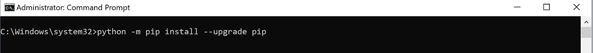
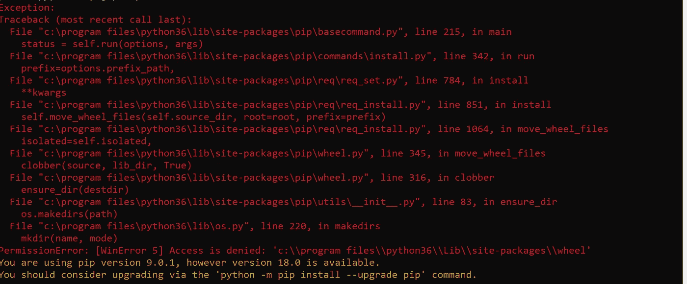

# 第 1 部分:安装 Python 3.6 和 Tensorflow

> 原文：<https://medium.datadriveninvestor.com/install-python-3-6-and-tensorflow-92eeff0ad4f5?source=collection_archive---------1----------------------->

在 windows 上安装 Tensorflow 的说明可以在[https://www.tensorflow.org/install/install_windows](https://www.tensorflow.org/install/install_windows)中找到。虽然我的电脑中有 GPU，但我会选择安装仅支持 CPU 的版本。

1.  在 https://www.python.org/downloads/release/python-362/[使用基于网络的 windows 安装程序选项安装 Python 3.6。](https://www.python.org/downloads/release/python-362/)
2.  为了安装 tensorflow，我使用如下所示的 pip:

Type the above command in Cmd window

在搜索栏(Window 10 版本)上键入 Cmd，然后右键单击，说以管理员身份运行。您应该会看到类似这样的内容:

Note Administrator: Command Prompt on top of the window

使用管理员权限运行 Cmd 有助于避免如下所示的错误:

希望这有助于安装 Python 和 Tensorflow。通常有从简单到复杂的问题；我搜索[栈溢出](https://stackoverflow.com/)寻找答案。如果你在那里找不到他们，那就给我留个条。