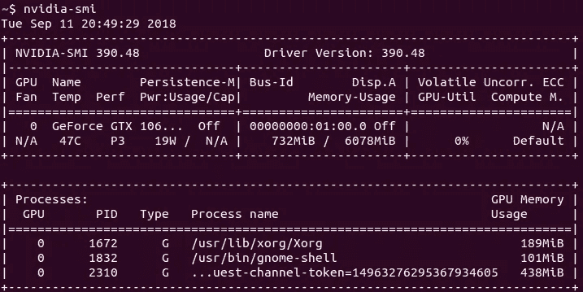

# 安装 Tensorflow-GPU 在 Ubuntu 18.04 / 19.04 do AI 上使用 anaconda 使用 Nvidia GPU！

> 原文：<https://medium.datadriveninvestor.com/install-tensorflow-gpu-to-use-nvidia-gpu-on-ubuntu-18-04-do-ai-71b0ce64ebc5?source=collection_archive---------0----------------------->

*** 2019 年 4 月 29 日:针对 Tensorflow 1.13 发布更新。
***[https://medium . com/@ ycheng . tw/Install-3-different-tensor flow-GPU-on-the-one-Ubuntu-machine-992190 a13a 42](https://medium.com/@ycheng.tw/install-3-different-tensorflow-gpu-on-the-one-ubuntu-machine-992190a13a42)在同一台机器上安装 tensorflow-gpu 1.12/1.13/2.x，

我就分享一下 GPU 和深度学习的背景。然后你怎么在 Ubuntu 18.04 LTS 上安装 Nvidia 驱动和带 GPU 加速后端的 Tensorflow。以下步骤也适用于 Ubuntu 19.04，只是做了一些调整。

如果只是想了解所有步骤，可以跳到“步骤总结”一节。

深度学习/机器学习是计算世界的一场大革命！与 10 年前相比，今天的软件在底层设计上并没有太大的变化。对我们来说肯定更漂亮，更快捷，更方便。然而，深度学习/机器学习正在以如此不同的方式改变世界！

我发现周围有那么多文档解释如何在 Ubuntu 上安装 Tensorflow-GPU。有好文章，我也从中学习。然而，这些似乎都没有足够广泛的覆盖面。这就是我想要解决的问题！

# 为什么选择 GPU？

GPU 是这场革命的关键组成部分之一，它可以没有。一些科学家可能会说，在这场人工智能革命中没有什么新东西。嗯，也许有一部分。有一些理论已经存在了 10 年，然而，由于缓慢的 CPU 和有限的数据，它们今天不会有用。

你可以安装不带 GPU 的 tensorflow 作为学习的起点，然而你会发现完成计算的时间太长，然后你想使用带 GPU 或其他硬件加速的机器。

当然，你可能会花钱在云服务器上使用 GPU，但你也可能希望在将它发送到云服务器之前，有自己的机器来进行概念验证或较小的计算。

Nvidia GPU 具有相当不错的性价比和相当低的入门价格等。这就是为什么你会找到很多关于它的信息。

# 为什么 Tensorflow！

谷歌是背后的公司。在此期间，它是做人工智能的人的首选。它有多个后端。除了为谷歌工作的人或者使用谷歌云服务器的人，Nvidia GPU 是使用最多的。

# 为什么是 Ubuntu！

我宁愿问，为什么不呢？Ubuntu 是公有云服务器上的首选。它有很好的台式机/笔记本电脑支持。你可以在市场上购买预装 Ubuntu 的认证机器。销售大量预装 Ubuntu 的公司之一是戴尔，戴尔也做出了很大贡献，以确保他们的计算机与 Ubuntu 兼容，如推动硬件供应商提供驱动程序等。

# 获得一台配备 Nvidia GPU 的机器

你可能会问我，如果你打算买一个 GPU 卡，然后插在 PC 上，该怎么选一个。我应该选择多大的内存？

IMHO，我建议你买一个内存更大的入门级 GPU 卡。为什么？并非所有类型的深度学习算法都可以在具有多个 GPU 卡的机器中有效并行。总会有一个计算/通信平衡的问题。要了解更多信息，您可以查看这篇文章[1]。

要了解您的 GPU 是否受支持，请检查:

[https://developer.nvidia.com/cuda-gpus](https://developer.nvidia.com/cuda-gpus)

好了，下面是背景:Tensorflow-GPU 使用英伟达的两个软件组件来访问英伟达 GPU。它们是 CUDA 工具包和 cuDNN。如果你的 GPU 支持 CUDA，那么我们将能够使用它来做 GPU 加速张量流。

你可以得到一台只有 Nvidia GPU 的台式机，但是，如果你得到一台笔记本电脑，通常你会得到一台所谓的“I+A”机器。I+A 机器是一种在机器上安装了英特尔 GPU 和英伟达 GPU 的设计。您可以通过配置您的系统来选择使用其中的一种。

# 在上面安装 Ubuntu 18.04 / 19.04！

最后，我们要在这上面下功夫了……如果你用的是 Ubuntu 预装机配 Nvidia GPU，可以跳过这部分。好吧，戴尔 18.04 版本的 Nvidia GPU 可能不会在今天开始发货，相信我，这不会花太长时间。

我想大多数阅读这篇文章的人已经知道如何安装 Ubuntu，但如果你不知道，请查看:【https://www.ubuntu.com/.】T2 步骤是

1.下载 Ubuntu 桌面 iso 镜像。今天是“Ubuntu-18 . 04 . 1-desktop-amd64 . iso”。Ubuntu 19.04 也可以。
2。要么刻录一张 CDROM，要么准备一个带有 ISO 文件的 u 盘。
3。用它启动你的机器，并完成安装。通常，你在这个阶段不会有麻烦。
4。重启你的机器！

有些人可能会有问题后，重新启动您的机器。如果重启后无法正常登录，我有一些提示可以帮助你。

# 安装专有的 Nvidia 驱动程序

如果您使用的是 19.04，只需打开一个终端，使用以下命令:

> sudo apt 更新
> sudo ubuntu 驱动程序自动安装
> sudo 重启

如果它运行良好，你会安装很多 deb 包，比如“nvidia-driver-418”等等。然后重启你的机器。如果它成功重启，打开终端并使用命令“nvidia-smi”。如果它像下面这样正确地显示了 Nvidia GPU 的状态，那么它已经正确安装了。

如果您已经完成了这一步，那么您已经完成了安装过程中最危险的部分。

但是如果它安装的 nvidia 驱动是 390(如果你用的是 18.04)，就需要手动安装更新版本的 nvidia 驱动。为什么？因为我们要用 cuda 10.x，它需要更新的 nvidia 驱动。

> sudo add-apt-repository PPA:graphics-drivers
> sudo apt-get 更新
> sudo apt-get 安装 nvidia-driver-418

你可以查看以下链接，了解 cuda 和 nvidia 驱动程序的映射。
[https://docs . NVIDIA . com/deploy/cuda-compatibility/index . html # binary-compatibility _ _ table-toolkit-driver](https://docs.nvidia.com/deploy/cuda-compatibility/index.html#binary-compatibility__table-toolkit-driver)

# 一些故障排除提示

可能有太多的情况需要处理。我只分享我经历中最常见的一个。

在 Intel GPU + Nvidia GPU 上(大多数情况下，当你使用带有 Nvidia GPU 的笔记本电脑时)，有时你就是无法在系统安装后登录，就像开机后系统冻结一样。如果你是 Linux 专家，我认为下面的步骤对你来说足够了，或者我们需要另一篇文章来做一步一步的指导。

1.  在 GRUB 中引导时，将“module_blacklist=nouveau”添加到 Linux 引导参数中。通常，你可以用这个登录系统。
2.  安装前一节提到的专有 Nvidia 驱动程序。通常，在此之后，您可以在重新启动后正常工作的系统。如果不是…好吧，你可能有一个特殊的硬件组合，需要更多的工作，使其工作。

# 确保 Nvidia 已启用

如果你从戴尔这样的供应商那里购买了预装 Ubuntu 的机器，Nvidia 驱动程序已经安装好了，但是默认情况下它是不打开的。

使用以下命令确保 Nvidia GPU 已启用。

> $ sudo prime-选择 nvidia
> $ sudo 重启

之后“nvidia-smi”会输出 GPU 状态。

# 我们现在就可以安装 Tensorflow！

安装 tensorflow 的方法有很多种。如果你是一个重度 docker 用户，你可能希望 docker 的方式:

[https://www . tensor flow . org/install/install _ Linux # installing docker](https://www.tensorflow.org/install/install_linux#InstallingDocker)

这相当简单。如果您有任何问题，请随时向我们提问。

除此之外，我认为最简单的方法是使用 Anaconda。如果你之前用过 Anaconda，一定要看完这篇文章，不然不行。为什么？在 tensorflow 网站上，Anaconda 似乎不太受推荐。

首先，您需要安装 Anaconda。去

[https://www.anaconda.com/download/#linux](https://www.anaconda.com/download/#linux)

并获得 Python 3.7 版本。我使用这个链接

[https://repo . anaconda . com/archive/anaconda 3-2019.03-Linux-x86 _ 64 . sh](https://repo.anaconda.com/archive/Anaconda3-2019.03-Linux-x86_64.sh)

就运行它，接受它改变你的~/。bashrc，以便将安装方向添加到您的路径中。

之前我们需要使用 python 3.6。Tensorflow 1.13 升级到 python 3.7。所以我们可以用新的。

这里是关键部分。使用以下命令安装 tensorflow-gpu 1.13:

> 康达安装\
> tensorflow-gpu==1.13.1

你可能想添加其他的包，比如 keras，scikit-learn，panda 或者 numpy。无论有没有版本都可以添加到命令行中。Conda 会让您在安装时检查操作。

之前，我们还需要指定像 cudatoolkit-10.0.130 和 cudnn-7.3.1 这样的包。目前，它们将作为依赖项自动安装。

# 验证安装

好吧，如果你按照上面的步骤，它的工作。然而，你想测试它。在 tensorflow 网站上，它建议您使用以下 python 代码:

> 将 tensorflow 作为 tf
> hello = tf.constant 导入(' hello，TensorFlow！')
> sess = tf。session()
> print(sess . run(hello))

有用！但是，如果您使用 CPU 进行计算，它就会运行。怎么知道自己用的是不是 GPU？尝试以下代码:

> 导入 tensorflow 为 tf
> print("tf version = "，tf。__version__)
> 带 TF . device('/GPU:0 '):
> a = TF . constant([1.0，2.0，3.0，4.0，5.0，6.0]，shape=[2，3]，name = ' a ')
> b = TF . constant([1.0，2.0，3.0，4.0，5.0，6.0]，shape=[3，2]，name='b')
> c = tf.matmul
> 
> 用 tf。session()as sess:
> print(sess . run(c))

最终的结果输出将是

> tf 版本= 1.13.1
> [[22。28.】
> 【49。64.]]

加上大量其他 tensorflow 消息，因为 tensorflow-GPU 正在进行内部初始化。

# 步骤总结

1.  安装 Ubuntu 18.04 / 19.04 桌面。
2.  在装有支持的 Nvidia 卡的机器上安装 Nvidia 驱动程序。

> $ sudo apt 更新
> $ sudo Ubuntu-驱动程序自动安装
> $ sudo 重新启动

如果它安装的是 nvidia-driver-390(如果你用的是 18.04)，我们就需要 418 这样的驱动版本。您可以通过以下命令进行安装

> sudo add-apt-repository PPA:graphics-drivers
> sudo apt-get 更新
> sudo apt-get 安装 nvidia-driver-418

3.您可能需要使用以下命令从英特尔 GPU 切换到 Nvidia GPU

> $ sudo prime-选择 nvidia
> $ sudo 重新启动

4.用 python 3.7 安装 Anaconda。

[**https://repo . anaconda . com/archive/anaconda 3-2019.03-Linux-x86 _ 64 . sh**](https://repo.anaconda.com/archive/Anaconda3-2019.03-Linux-x86_64.sh)

5.安装 tensorflow-gpu

> $ conda install \
> tensor flow-GPU = = 1 . 13 . 1

6.你完了。

# 结论

机器学习/深度学习的路上，要学的东西实在太多了。你需要有领域知识来了解你的数据。了解背后的数学原理，让你训练的模型发挥作用，等等。然而，设置一台计算机应该是相当容易的。希望这篇文章能给你一个快速准备 Ubuntu 的方法！

参考:

[1][http://timdettmers . com/2018/08/21/which-GPU-for-deep-learning/](http://timdettmers.com/2018/08/21/which-gpu-for-deep-learning/)

这篇文章的旧版本可供参考:

[https://medium . com/@ ycheng . tw/install-tensor flow-GPU-to-use-NVIDIA-GPU-using-anaconda-on-Ubuntu-18-04-18-10-do-ai-ce 4b 5 e 2 AE 61 b](https://medium.com/@ycheng.tw/install-tensorflow-gpu-to-use-nvidia-gpu-using-anaconda-on-ubuntu-18-04-18-10-do-ai-ce4b5e2ae61b)