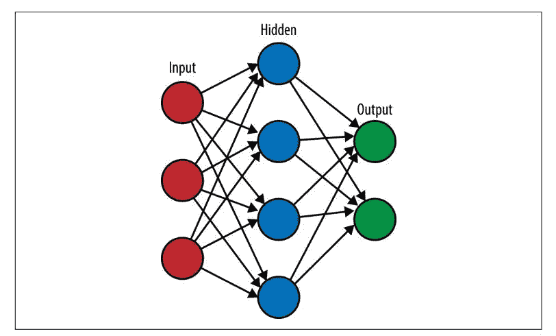
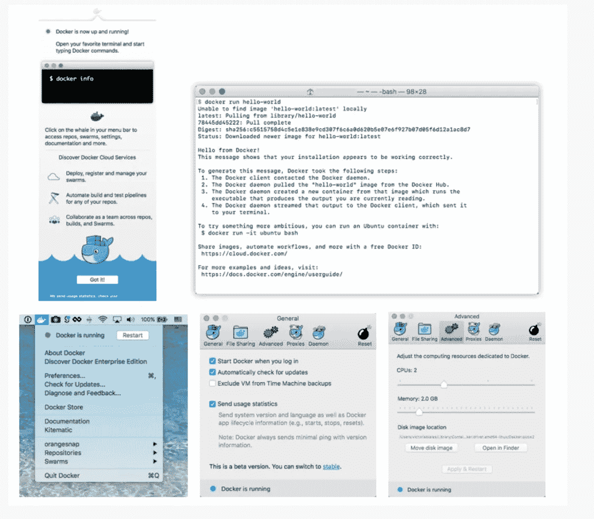

# macOS High Sierra 10.13.4 上 TensorFlow 的安装指南，适用于您的 DeepLearning w/ Java、C 和 Go

> 原文：<https://medium.datadriveninvestor.com/installation-guide-for-tensorflow-on-macos-high-sierra-10-13-4-df7286f7ba84?source=collection_archive---------0----------------------->

此安装特别关注 macOS High Sierra 版本 10.13.4。很可能该安装可以在 macOS High Sierra 的早期版本上运行。但是，本主题不考虑解决与以前版本相关的问题。在 macOS 上安装 TensorFlow 有几种选择。

*   码头工人
*   本地 Pip
*   虚拟 Python 环境
*   用 Anaconda 安装 TensorFlow
*   为 JDK 安装张量流
*   使用 TensorFlow C 库安装 TensorFlow for Go

**码头工人**

docker 社区版是在 macOS 上构建基于容器的应用程序的首选平台。Docker 社区版提供了一些更新渠道，如 Stable 和 Edge。Docker CE 支持内部部署和云平台。Docker CE edition 安装与 CentOS、Debian、Fedora、Ubuntu 和 Linux 平台上的 AWS 和 Azure 云平台兼容。在 mac 机器上安装 Docker 不会影响任何使用 Docker 机器创建的机器。新的 Docker for mac Hyperkit VM 创建的虚拟环境具有不早于 2010 年创建的 mac 硬件的最低硬件支持，并具有英特尔对无限制模式下内存管理虚拟化的硬件支持。可以在终端中使用 sysctl kern.hv_support 命令来验证硬件支持。Docker 支持 mac OS El Capitan 或更高版本的任何操作系统。但是，macOS High Sierra 解决了 macOS 早期版本遇到的大多数问题。建议安装 macOS High Sierra 版本 10.13.4，以尽量减少 docker 安装的问题。系统应该配备至少 4 GB 的内存。从 Docker 商店下载 macOS 的 Docker 社区版。这可能需要创建 docker ID 和密码作为 docker 存储的一部分。

图一。macOS 的 Docker 社区版。

Docker Community Edition for macOS 将 mac 上的应用程序与虚拟机管理程序框架、文件系统和网络结合在一起，形成一个完整的开发环境。Docker 平台还提供了用于运行命令行、compose 和 Docker 公证人命令行的开发工具，并通过 Docker 开发环境推送自动更新。一旦在 macOS 上启动了 docker 的下载，就可以运行一个样例 docker 运行 hello-world 来验证 Docker 安装的有效性。Docker 安装现在在一个 TensorFlow 二进制映像中包含了整个 TensorFlow 环境。可以使用以下命令启动 Docker 容器:

$**docker run-it*-p host port:container port*tensor flow image**

如果 TensorFlow 程序从 Shell 中运行， *-p hostPort:containerPort* 将是可选的。如果从 Jupyter 笔记本运行 TensorFlow 程序，hostPort 和 containerPort 可以设置为 8888。从 TensorBoard insider 容器中运行嵌入可视化需要将 localhost 设置为 6006。TensorFlow 二进制图像也可在 DockerHub 上获得。可以运行以下命令从 shell 启动 TensorFlow 程序。

$**docker run-it tensor flow/tensor flow bash**

以下命令开始设置 Docker 容器的 Jupyter 环境，以便从 Jupyter 笔记本运行 TensorFlow 程序。

$**docker run-it-p 8888:8888 tensor flow/tensor flow**

**原生画中画**

通过原生 Pip 的安装需要 Python 3 或。X+或 Python 2.7。如果 macOS 没有 Python 环境，则必须在尝试安装 TensorFlow 之前安装它。Pip 用于 Python 2.7，Pip3 用于 Python 3。x 版本。您可以通过以下命令识别 Pip 的系统版本。

$**pip-V**# for Python 2.7 $**pip 3-V**# for Python 3 . n

用最新版本更新 pip 总是一个好主意:

$**sudo easy _ install–升级 pip**$**sudo easy _ install–升级 six**

安装或升级成功完成后，可以根据系统环境使用以下命令安装 TensorFlow:

$ **pip 安装 tensor flow**# Python 2.7；CPU 支持$ **pip3 安装 tensor flow**# Python 3 . n；CPU 支持

清除语法后，可以在系统中运行一个简短的 TensorFlow 程序，以确保安装成功，并且系统已设置了 Tensorflow 开发环境。

**虚拟 Python 环境**

一旦 macOS 终端被启动，以下指令将有助于完成安装。选项三虚拟 Python 环境是首选。以下命令为 TensorFlow 设置 pip 和虚拟 Python 环境的安装。

$**sudo easy _ install pip**$**pip install–升级 virtualenv**

虚拟 Python 环境升级后，可以利用以下命令来创建虚拟 Python 环境。

$**virtualenv–system-site-packages***target directory*# for Python 2.7 $**virtualenv–system-site-packages-p Python 3***target directory*# for Python 3 . n

目标目录将位于虚拟 Python 环境树的顶部。默认情况下会是~/TensorFlow。但是，可以根据开发人员的选择将其更改为任何其他目录。

需要使用以下命令之一将目标目录激活为虚拟 python 环境:

$**CD*target directory*$**source。/bin/activate** #如果使用 bash、sh、ksh 或 zsh$ **源。/bin/activate.csh** #如果使用 csh 或 tcsh**

完成上述过程后，源命令的后缀将更改为目标目录，如下所示:

(*目标目录* )$

可以利用以下命令来安装 TensorFlow:

(*target directory*)$**pip 安装–升级 tensor flow**# for Python 2.7(*target directory*)$**pip 3 安装–升级 tensorflow** # for Python 3.n

一旦创建了环境，它甚至可以用来运行 Jupyter 笔记本电脑。

GPs-iMac:~ GP $ sudo easy _ install pip

密码:

正在搜索画中画

最佳匹配:pip 10.0.1

将 pip 10.0.1 添加到 easy-install.pth 文件

正在将 pip 脚本安装到/anaconda3/bin

将 pip3 脚本安装到/anaconda3/bin

将 pip3.6 脚本安装到/anaconda3/bin

使用/anaconda 3/lib/python 3.6/site-packages

正在处理 pip 的依赖关系

已完成处理 pip 的依赖关系

GPs-iMac:~ GP$ pip 安装–升级 virtualenv

收藏虚拟

正在下载[https://files . python hosted . org/packages/B6/30/96a 02 b 2287098 b 23 b 875 BC 8 C2 f 58071 c 35 D2 EFE 84 f 747 b 64d 523721 DC 2 b 5/virtualenv-16 . 0 . 0-py2 . py3-none-any . whl](https://files.pythonhosted.org/packages/b6/30/96a02b2287098b23b875bc8c2f58071c35d2efe84f747b64d523721dc2b5/virtualenv-16.0.0-py2.py3-none-any.whl)(1.9 MB)

100% |████████████████████████████████| 1.9 兆字节 5.4 兆字节/秒

安装收集的软件包:virtualenv

成功安装了**虚拟人** -16.0.0

GPs-iMac:~ GP $**virtualenv**–系统-站点-软件包-p python3

使用解释器/anaconda3/bin/python3 运行 virtualenv

你必须提供一个 DEST 目录

用法: **virtualenv.py** 【选项】DEST _ 目录

GPs-iMac:~ GP $**virtualenv**–系统-站点-软件包-p python3 tensorflow

用解释器/anaconda3/bin/python3 运行 **virtualenv**

使用基本前缀“/anaconda3”

/Users/GP/tensor flow/bin/python 3 中的新 python 可执行文件

同样在/Users/GP/tensor flow/bin/python 中创建可执行文件

安装工具、pip、车轮…完成。

GPs-iMac:~ GP$ cd 张量流

GPs-iMac:tensor flow GP $ source/bin/activate

-bash: /bin/activate:没有这样的文件或目录

GPs-iMac:tensorflow GP$ source。/bin/激活

(tensor flow)GPs-iMac:tensor flow GP $ easy _ install-U pip

正在搜索画中画

阅读[https://pypi.org/simple/pip/](https://pypi.org/simple/pip/)

正在下载[https://files . python hosted . org/packages/0f/74/ECD 13431 bcc 456 ed 390 b44c 8 a6 e 917 c 1820365 CBE cb6 a 8974 D1 CD 045 ab 4/pip-10 . 0 . 1-py2 . py3-none-any . whl # sha 256 = 717 cdffb 2833 be 8409433 a 93746744 b 59505 f](https://files.pythonhosted.org/packages/0f/74/ecd13431bcc456ed390b44c8a6e917c1820365cbebcb6a8974d1cd045ab4/pip-10.0.1-py2.py3-none-any.whl#sha256=717cdffb2833be8409433a93746744b59505f42146e8d37de6c62b430e25d6d7)

最佳匹配:pip 10.0.1

正在处理 pip-10 . 0 . 1-py2 . py3-none-any . whl

将 pip-10 . 0 . 1-py2 . py3-none-any . whl 安装到/Users/GP/tensor flow/lib/python 3.6/site-packages

将要求写入/Users/GP/tensor flow/lib/python 3.6/site-packages/pip-10 . 0 . 1-py 3.6 . EGG/EGG-INFO/requires . txt

将 pip 10.0.1 添加到 easy-install.pth 文件

将 pip 脚本安装到/Users/GP/tensorflow/bin

将 pip3 脚本安装到/Users/GP/tensorflow/bin

将 pip3.6 脚本安装到/Users/GP/tensorflow/bin

已安装的/Users/GP/tensor flow/lib/python 3.6/site-packages/pip-10 . 0 . 1-py 3.6 . egg

正在处理 pip 的依赖关系

已完成处理 pip 的依赖关系

(tensorflow)GPs-iMac:tensor flow GP＄pip 3 安装–升级 tensor flow

收集张量流

正在下载[https://files . python hosted . org/packages/03/ad/d 732 a5d 9d 50 bfcd 8 aeb 6 E4 a 266065 a 8868829388 E4 e 2b 529 ff 689 f1 fc 923/tensor flow-1 . 8 . 0-cp36-cp36m-ma cosx _ 10 _ 11 _ x86 _ 64 . whl](https://files.pythonhosted.org/packages/03/ad/d732a5d9d50bfcd8aeb6e4a266065a8868829388e4e2b529ff689f1fc923/tensorflow-1.8.0-cp36-cp36m-macosx_10_11_x86_64.whl)(46.5 MB)

100% |████████████████████████████████| 46.5 MB 426 kb/秒

收集张量板<1.9.0,> =1.8.0(来自 tensorflow)

正在下载[https://files . python hosted . org/packages/59/a6/0ae 6092 b 7542 fed ba 6 B2 a1 c 9 b 8 DCE af 278238 c 39484 F3 ba 03 b 03 f 07803 c/tensor board-1 . 8 . 0-py3-none-any . whl](https://files.pythonhosted.org/packages/59/a6/0ae6092b7542cfedba6b2a1c9b8dceaf278238c39484f3ba03b03f07803c/tensorboard-1.8.0-py3-none-any.whl)(3.1 MB)

100% |████████████████████████████████| 3.1 兆字节 4.5 兆字节/秒

收集 termcolor>=1.1.0(来自 tensorflow)

正在下载[https://files . python hosted . org/packages/8a/48/a 76 be 51647d 0 EB 9 F10 e 2 a 4511 BF 3 FFB 8 cc 1e 6b 14 e 9 e 4 fab 46173 aa 79 f 981/term color-1 . 1 . 0 . tar . gz](https://files.pythonhosted.org/packages/8a/48/a76be51647d0eb9f10e2a4511bf3ffb8cc1e6b14e9e4fab46173aa79f981/termcolor-1.1.0.tar.gz)

收集 gast>=0.2.0(来自 tensorflow)

正在下载[https://files . python hosted . org/packages/5c/78/ff 794 fcae 2 ce 8 aa 6323 e 789 D1 F8 B3 b 7765 f 601 e 7702726 f 430 e 814822 b 96/gast-0 . 2 . 0 . tar . gz](https://files.pythonhosted.org/packages/5c/78/ff794fcae2ce8aa6323e789d1f8b3b7765f601e7702726f430e814822b96/gast-0.2.0.tar.gz)

要求未升级，因为不是直接要求:车轮> =0.26 英寸。/lib/python3.6/site-packages(来自 tensorflow) (0.31.1)

收集 astor>=0.6.0(来自 tensorflow)

正在下载[https://files . python hosted . org/packages/B2/91/cc 9805 f1 ff 7b 49 f 620136 b 3a 7 ca 26 f 6 a1 be 2 ed 424606804 b 0 fbcf 499 f 712/Astor-0 . 6 . 2-py2 . py3-none-any . whl](https://files.pythonhosted.org/packages/b2/91/cc9805f1ff7b49f620136b3a7ca26f6a1be2ed424606804b0fbcf499f712/astor-0.6.2-py2.py3-none-any.whl)

收集 grpcio>=1.8.6(来自 tensorflow)

正在下载[https://files . python hosted . org/packages/68/57/da 122 CBF C1 b 7815381480 b 23044 fff 06 b 90 f 58 C1 be 9310 e 68 C2 D6 B1 d 623 c/grp CIO-1 . 12 . 1-cp36-cp36m-ma cosx _ 10 _ 7 _ Intel . whl](https://files.pythonhosted.org/packages/68/57/da122cbfc1b7815381480b23044fff06b90f58c1be9310e68c2d6b1d623c/grpcio-1.12.1-cp36-cp36m-macosx_10_7_intel.whl)(1.9 MB)

100% |████████████████████████████████| 1.9 兆字节 6.3 兆字节/秒

收集 absl-py>=0.1.6(来自 tensorflow)

正在下载[https://files . python hosted . org/packages/57/8d/6664518 F9 B6 ce d0 aa 41 cf 50 b 989740909261 d4c 212557400 c 48 E5 CDA 0804/absl-py-0 . 2 . 2 . tar . gz](https://files.pythonhosted.org/packages/57/8d/6664518f9b6ced0aa41cf50b989740909261d4c212557400c48e5cda0804/absl-py-0.2.2.tar.gz)(82kB)

100% |████████████████████████████████| 92kb 17.7 MB/秒

由于不直接需要，要求未升级:六个> = 1 . 10 . 0 in/anaconda 3/lib/python 3.6/site-packages(来自 tensorflow) (1.11.0)

收集 protobuf>=3.4.0(来自 tensorflow)

正在下载[https://files . python hosted . org/packages/6d/7e/51c 91 b 28 CB 8446 EBD 7231d 375 a 2025 BC a4 c 59d 15 DDC 0 cf 2d d 0867 b 400 CD 7/proto buf-3 . 6 . 0-cp36-cp36m-ma cosx _ 10 _ 6 _ Intel . ma cosx _ 10 _ 9 _ Intel . ma cosx _ 10 _ 9 _ x86 _ 64 . ma cosx _ 1](https://files.pythonhosted.org/packages/6d/7e/51c91b28cb8446ebd7231d375a2025bca4c59d15ddc0cf2dd0867b400cd7/protobuf-3.6.0-cp36-cp36m-macosx_10_6_intel.macosx_10_9_intel.macosx_10_9_x86_64.macosx_10_10_intel.macosx_10_10_x86_64.whl)

100% |████████████████████████████████| 1.2 兆字节 6.3 兆字节/秒

由于不直接需要，要求未升级:numpy > = 1 . 13 . 3 in/anaconda 3/lib/python 3.6/site-packages(来自 tensorflow) (1.14.0)

由于不直接需要，要求未升级:werkzeug > = 0 . 11 . 10 in/anaconda 3/lib/python 3.6/site-packages(来自 tensor board<1.9.0,>= 1 . 8 . 0-> tensor flow)(0 . 14 . 1)

收集漂白剂==1.5.0(来自 tensor board<1.9.0,>= 1 . 8 . 0-> tensor flow)

正在下载[https://files . python hosted . org/packages/33/70/86 C5 FEC 937 ea 4964184d 4d 6 C4 f 0 b 9551564 f 821 E1 c 3575907639036 d9 b 90/bleach-1 . 5 . 0-py2 . py3-none-any . whl](https://files.pythonhosted.org/packages/33/70/86c5fec937ea4964184d4d6c4f0b9551564f821e1c3575907639036d9b90/bleach-1.5.0-py2.py3-none-any.whl)

收集降价> =2.6.8(来自张量板<1.9.0,> =1.8.0->张量流)

正在下载[https://files . python hosted . org/packages/6d/7d/488 b 90 f 470 b 96531 a3 f 5788 cf 12a 93332 f 543 dbab 13 c 423 a5e 7 ce 96 a 0493/Markdown-2 . 6 . 11-py2 . py3-none-any . whl](https://files.pythonhosted.org/packages/6d/7d/488b90f470b96531a3f5788cf12a93332f543dbab13c423a5e7ce96a0493/Markdown-2.6.11-py2.py3-none-any.whl)(78kB)

100% |████████████████████████████████| 81kb 19.7 MB/秒

收集 html5lib==0.9999999(来自 tensor board<1.9.0,>= 1 . 8 . 0-> tensor flow)

正在下载[https://files . python hosted . org/packages/AE/AE/AE/BCB 60402 c 60932 b 32 dfaf 19 bb 53870 b 29 EDA 2c d 17551 ba 5639219 FB 5 EB F9/html 5 lib-0.9999999 . tar . gz](https://files.pythonhosted.org/packages/ae/ae/bcb60402c60932b32dfaf19bb53870b29eda2cd17551ba5639219fb5ebf9/html5lib-0.9999999.tar.gz)(889 kb)

100% |████████████████████████████████| 890 kb 13.0 MB/秒

要求未升级，因为不是直接要求的:setuptools 在。/lib/python3.6/site-packages(来自 proto buf > = 3 . 4 . 0-> tensor flow)(39 . 2 . 0)

为收集的包构建轮子:termcolor，gast，absl-py，html5lib

正在为 termcolor 运行 setup.py bdist _ wheel 完成

存储在目录:/Users/GP/Library/Caches/pip/wheels/7c/06/54/BC 84598 ba 1 daf 8 f 970247 f 550 b 175 aaaee 85 f 68 B4 b 0 C5 ab 2c 6 中

正在为 gast 运行 setup.py bdist _ wheel 完成

存储在目录:/Users/GP/Library/Caches/pip/wheels/9a/1f/0e/3c de 98113222 b 853 e 98 fc 0 A8 e 9924480 a3 e 25 f1 b 4008 ced B4 f 中

为 absl-py 运行 setup.py bdist _ wheel 完成

存储在目录:/Users/GP/Library/Caches/pip/wheels/A0/F8/e9/1933 dbb 3447 ea 6 ef 57062 FD 5461 CB 118 deb 8 C2 ed 074 e 8344 BF 中

正在为 html5lib 运行 setup.py bdist _ wheel 完成

存储在目录:/Users/GP/Library/Caches/pip/wheels/50/AE/F9/d2b 189788 efcf 61 D1 ee 0e 36045476735 c 838898 eef 1 CAD 6 e 29 中

成功构建 termcolor gast absl-py html5lib

安装收集的包:html5lib、漂白剂、protobuf、markdown、tensorboard、termcolor、gast、astor、grpcio、absl-py、tensorflow

找到现有安装:html5lib 1.0.1

不卸载/anaconda 3/lib/python 3.6/site-packages，外部环境/Users/GP/tensorflow 中的 html5lib

无法卸载“html5lib”。找不到要卸载的文件。

发现现有安装:漂白剂 2.1.2

不卸载/anaconda 3/lib/python 3.6/site-packages，外部环境/Users/GP/tensorflow 中的漂白剂

无法卸载“漂白剂”。找不到要卸载的文件。

成功安装 absl-py-0.2.2 astor-0.6.2 漂白剂-1 . 5 . 0 gast-0 . 2 . 0 grp CIO-1 . 12 . 1 html 5 lib-0 . 9999999 markdown-2 . 6 . 11 proto buf-3 . 6 . 0 tensor board-1 . 8 . 0 tensor flow-1 . 8 . 0 term color-1 . 1 . 0

(张量流)GPs-iMac:tensor flow GP $ conda install-c conda-forge tensor flow

求解环境:完成

== >警告:存在新版本的 conda。<==

current version: 4.4.10

latest version: 4.5.4

Please update conda by running

$ conda update -n base conda

## Package Plan ##

environment location: /anaconda3

added / updated specs:

– tensorflow

The following packages will be downloaded:

package | build

— — — — — — — — — | — — — — — –

mock-2.0.0 | py36_0 103 KB conda-forge

certifi-2018.1.18 | py36_0 143 KB conda-forge

libprotobuf-3.5.2 | 0 3.9 MB conda-forge

tensorflow-1.1.0 | py36_0 24.8 MB conda-forge

pbr-4.0.4 | py_0 61 KB conda-forge

protobuf-3.5.2 | py36_0 603 KB conda-forge

— — — — — — — — — — — — — — — — — — — —

Total: 29.7 MB

The following NEW packages will be INSTALLED:

libprotobuf: 3.5.2–0 conda-forge

mock: 2.0.0-py36_0 conda-forge

pbr: 4.0.4-py_0 conda-forge

protobuf: 3.5.2-py36_0 conda-forge

tensorflow: 1.1.0-py36_0 conda-forge

The following packages will be UPDATED:

certifi: 2018.1.18-py36_0 –> 2018.1.18-py36_0 康达锻造

继续吗？y

下载和解压缩软件包

模拟 2 . 0 . 0:# # # # # # # # # # # # # # # # # # # 100%

认证 2018 . 1 . 18:# # # # # # # # # # # # # # # # # # # # 100%

libprotobuf 3 . 5 . 2:# # # # # # # # # # # # # # # # # # # # 100%

tensor flow 1 . 1 . 0:# # # # # # # # # # # # # # # # # 100%

pbr 4 . 0 . 4:# # # # # # # # # # # # # # # # # # # # 100%

proto buf 3 . 5 . 2:# # # # # # # # # # # # # # # # # 100%

准备交易:完成

验证交易:完成

执行事务:完成

**用 Anaconda 安装 TensorFlow】**

虽然 Anaconda 安装得到了 Anaconda 和其他几个社区的支持，但它没有得到 Google 和 TensorFlow 组织的官方支持。安装 Anaconda 的问题需要通过联系 Anaconda 来解决。用于 macOS 的 Anaconda 环境可以从 Anaconda 网站下载。下载完成后，可以使用以下命令设置名为 TensorFlow 的 conda 环境:

$ **康达 create-n tensor flow pip python = 2.7 #或 python=3.3 等。**

conda 环境可以通过以下命令激活。

$ **源激活张量流**

可以利用以下命令在 conda 环境中安装 TensorFlow。

(*目标目录* ) **$ pip 安装–忽略–安装–升级** *TF_PYTHON_URL*

**带 JDK 的 Tensorflow 装置。**

TensorFlow 提供了与 Java 协同工作的 API。如果有 Apache Maven 的早期版本，对配置文件稍作修改就可以使用 TensorFlow JAVA APIs。

 <dependency><groupId>org . tensor flow</groupId>
<artifactId>tensor flow</artifactId>
<版本>1 . 8 . 0</版本>
</依赖关系></dependency>

如果系统上没有 Apache Maven 项目环境，就必须决定安装应该在 Linux 还是 macOS 上进行。

**围棋平台 TensorFlow 安装**

用于 Go 平台的 TensorFlow 安装依赖于 TensorFlow C 库。可以使用以下命令安装它。

TF_TYPE="cpu" #更改为" gpu "以获得 GPU 支持
TARGET _ DIRECTORY = '/usr/local '
curl-L \
" https://storage . Google APIs . com/tensor flow/libtensor flow/libtensor flow-$ { TF _ TYPE }-$(go env GOOS)-x86 _ 64–1 . 8 . 0 . tar . gz " |
sudo tar-C $ TARGET _ DIRECTORY-xz

一旦安装完成，带有 TensorFlow C 库文件的 Go 平台将被安装到/usr/local/lib。Go Get 命令将确保使用以下命令获取 Tensorflow 所需的所有 Go 包。

去找 github.com/tensorflow/tensorflow/tensorflow/go

一旦安装完成，就可以用一个样例 Go 程序进行测试。