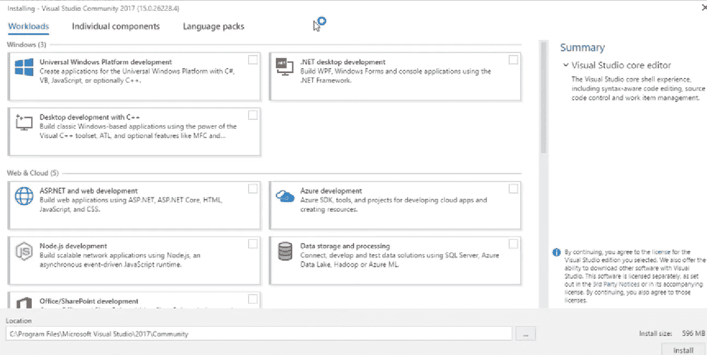
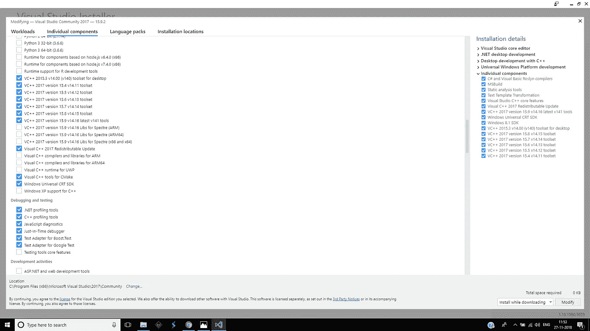
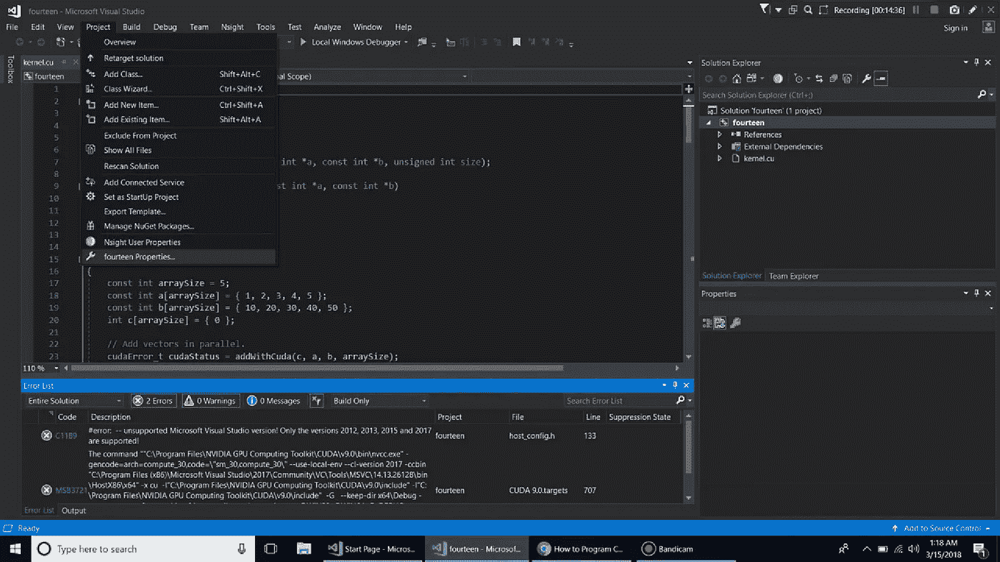
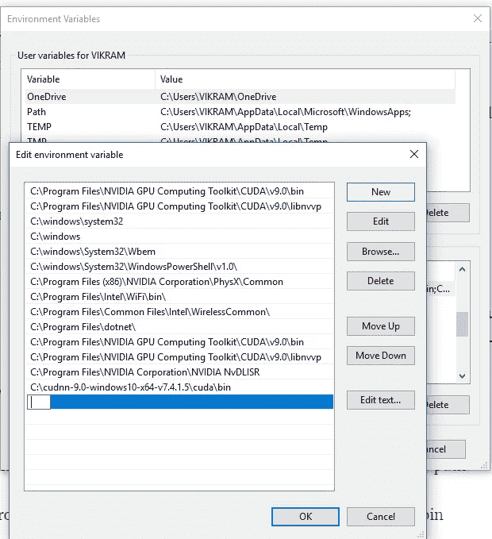

# 使用支持 CUDA 的 GPU 安装 pytorch 和 tensorflow

> 原文：<https://medium.datadriveninvestor.com/installing-pytorch-and-tensorflow-with-cuda-enabled-gpu-f747e6924779?source=collection_archive---------1----------------------->


近年来，你可能已经看到了 GPU 的威力。深度学习正在使用 GPU 在 CONVNETS 中获得复杂的计算，并在相当长的时间内完成序列建模。显卡制造商英伟达(Nvidia)创建了并行计算平台 CUDA。Nvidia 在深度学习方面也非常领先，在深度学习应用方面也非常先进。

## *只有 Nvidia GPUs 具有 CUDA 扩展，允许 GPU 支持 Tensorflow 和 PyTorch。(所以这篇帖子只针对 Nvidia GPU)*

今天我将展示如何在支持 CUDA 的 GPU 上安装 pytorch 或 tensorflow。我试图涵盖所有相关的主题。

我自己在下载和安装程序和驱动程序时遇到了一些困难。我想我应该写一个帖子。

**前提条件:如果你有以下要求的笔记本电脑，你可以下载 CUDA 软件。**

1.  **内存**:最少需要 16 gb 内存。你也可以使用 8gb 内存，但它有自己的复杂之处。
2.  GPU : CUDA 与 2006 年以来的几乎所有型号兼容，但至少需要 gtx 1050ti、1060 和更高版本。
3.  固态硬盘或硬盘:为了加快处理速度，需要至少 256gb 的固态硬盘。安装软件后，128gb 固态硬盘空间不足。

# **注意:我写这篇文章的时候牢记你已经安装了 anaconda 或任何其他平台(最好是 anaconda ),并且牢记你已经有了 nvidia 显卡(检查你是否有 nvidia 显卡——goto—**

# “设备管理器”->点击“显示适配器”->希望 Nvidia 芯片被列出”。

我们开始吧。

**第一步:检查显卡的兼容性。最新的环境名为“CUDA 工具包 9”，要求计算能力为 3 或更高**

您可以在下面检查计算能力和兼容性:

[](https://developer.nvidia.com/cuda-gpus) [## CUDA GPUs

### NVIDIA GPUs 支持全球数百万台台式机、笔记本电脑、工作站和超级计算机，加速了…

developer.nvidia.com](https://developer.nvidia.com/cuda-gpus) [](http://docs.nvidia.com/cuda/cuda-c-programming-guide/index.html#compute-capabilities) [## 编程指南::CUDA 工具包文档

### CUDA 模型和界面编程指南。

docs.nvidia.com](http://docs.nvidia.com/cuda/cuda-c-programming-guide/index.html#compute-capabilities) 

注:nvidia geforce gtx 1050ti 未在列表中列出，但它兼容并具有 6.1 的计算能力。

**第二步:下载 visual studio 17(社区)。当你点击下载时，一个可执行文件被下载并弹出一个窗口。**



This window pops up.

然后检查工作负载中的所有方框，即“使用 C++进行桌面开发”、“通用 Windows 平台开发”和”。NET 桌面开发”。然后单击安装。

然后，它需要一些时间，并重新启动您的计算机。

**第三步:然后完全关闭 visual studio，打开 visual studio installer，在 visual studio community 2017 下的 installed banner 部分点击修改。如下图所示**


然后转到工作负载旁边的单个组件，并转到编译器构建工具和运行时部分，然后选中以下框，如图所示，**从 VC++ v14.00 toolset for desktop 到 VC++2017 最新 v141 tools**



点击安装，它大约有 17gb，大约需要一个小时下载，一个小时安装，系统重启。

**第四步:成功安装 Visual studio 17 后，要下载安装 CUDA。**

 [## CUDA 工具包 9.0 下载

### 编辑描述

developer.nvidia.com](https://developer.nvidia.com/cuda-90-download-archive) 

选择安装程序类型 exe(本地)并按顺序下载下载列表，然后按顺序一个接一个地安装。

注:下载时，如果你对该软件没有任何概念，请选择 **express** 。下载 CUDA 的时候也要确保 VS 17 完全关闭。

**步骤 5:安装 CUDA 后，您现在应该检查 CUDA 是否正在运行。因此，打开 visual studio 17，并转到如下，**

点击左上角的“文件”→“新建”— ->“项目”。在左侧栏中，单击“NVIDIA”旁边的箭头，然后单击“CUDA 9.0”。点击中间的“CUDA 9.0 运行时”。您可以随意命名该项目。点击右下角的“确定”。Visual Studio 将开始创建项目。

**第 6 步:现在项目已经创建，你已经有了一个已经写好的默认程序。然后，如果您在 build 选项中单击 rebuild 按钮后重新构建项目，您可能会得到错误(可能)。如果出现这种错误，只需转到选项窗格中的“项目”按钮，然后单击您创建的项目的属性，就像这样，**



Here project name is fourteen

然后会弹出一个窗口，在这里您必须进行如下更改:

常规> >平台工具集，然后将 visual studio 17 v141 更改为 visual studio 15 v140，并单击确定。

然后运行代码，如果它运行没有错误，太好了！！。如果没有，尝试找到错误。

然后在 debug 按钮中点击 start 而不调试，如果它显示了输出，您就成功运行了 cuda 程序。

然后你就可以走了。

**步骤 7:现在你已经成功运行了一个 CUDA 程序，现在你必须给出 CUDA 的路径。用于设置您必须前往的路径— -**

右键单击我的电脑>>属性>>高级系统设置>>环境变量> >系统变量> >路径

找到路径后，转到这个，在 CUDA 文件夹中，复制路径。

C:\Program Files\NVIDIA GPU 计算工具包\CUDA\v9.0\bin

现在将路径粘贴到系统变量的路径中，即选择路径并点击编辑，在编辑中点击新建按钮并粘贴路径。像这样



Paste the path there.

现在回来，对“libnvvp”文件夹做同样的操作，如上所述。

**步骤 8:现在为您的笔记本电脑下载 nvidia 驱动程序。检查系统要求，并下载专门针对您的笔记本电脑的驱动程序。**

[](https://www.nvidia.com/Download/index.aspx) [## 下载驱动程序| NVIDIA

### 下载 NVIDIA 产品的驱动程序，包括 GeForce 显卡、nForce 主板、Quadro 工作站和…

www.nvidia.com](https://www.nvidia.com/Download/index.aspx) 

**第九步:现在下载 cudnn(深度神经网络库)。它是一个 zip 文件，解压它。将 cudnn 文件夹从下载文件中剪切到 c 盘并粘贴到那里(c 盘中的任何位置)。**

https://developer.nvidia.com/cudnn

现在，正如我们在上面给出路径位置一样，我们必须为 cudnn 文件夹做同样的事情。打开 cudnn 文件夹中的 bin 文件夹，并将路径位置复制到系统变量中。

系统变量>>路径>>编辑> >新建-然后将路径粘贴到那里。

**第十步:现在你可以安装 pytorch 或者 tensorflow 了。**

下载 pytorch:运行以下命令

```
conda install pytorch -c pytorch
pip3 install torchvision
```

通过运行任何代码来检查输出。

下载 tensorflow:首先你要为 tensorflow 创建 conda 环境

```
pip install tensorflow-gpu
```

现在你已经准备好了。现在你有了一个支持 CUDA 的 GPU，你将拥有更强的处理能力和更快的操作速度。

你可以看这个视频

现在你已经安装了 GPU 计算所需的所有东西，让我警告你不要训练庞大的数据集，这只会损坏你的计算机。采取所有必要的预防措施，因为 GPU 很快就会变热。所以编程时要小心。

就这些了，深度学习/机器学习快乐。