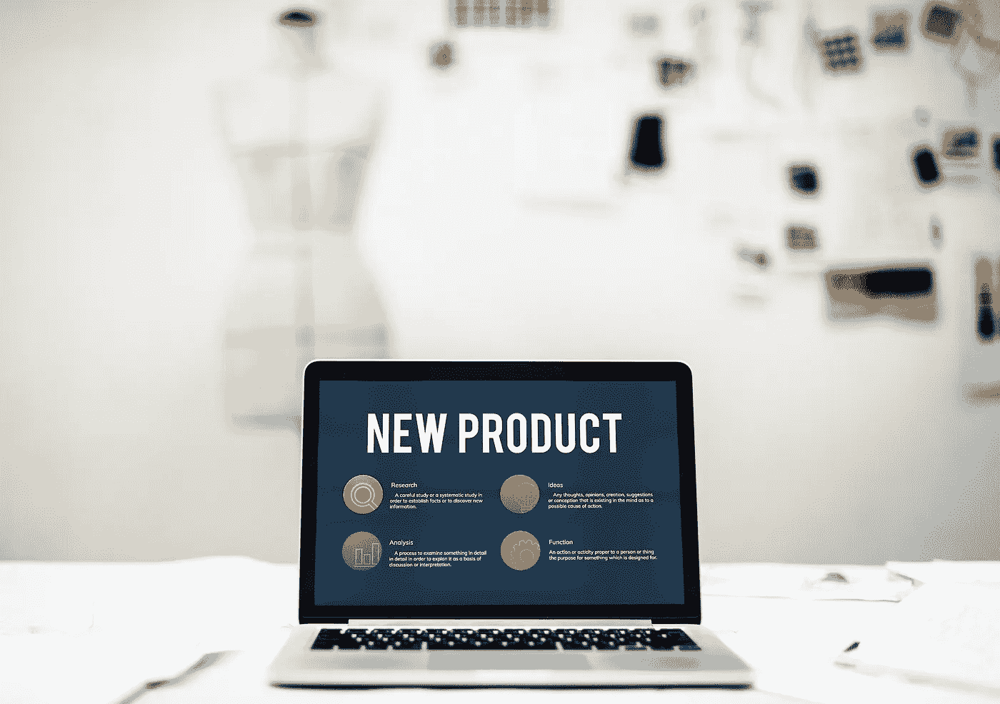

# 外包即时市场研究

> 原文：<https://medium.datadriveninvestor.com/instant-market-research-with-outsourcing-aa07ccc52f7e?source=collection_archive---------61----------------------->

Market Research. Instant. Fast

决定是否推进一个新想法需要时间、研究和金钱。

作为一名企业家或小企业，你如何处理什么上市，什么时候上市，以什么价格上市，可能意味着一个成功的新上市或破产的区别。

随着商业格局的快速发展，获取做出明智决策和制定成功营销战略所需的信息至关重要。

# 外包可以成为你秘密的市场研究武器。

花不到 100 美元，在不到一周的时间里，你就可以获得几乎任何市场上任何产品的即时市场调查。

这里有一个*确切地说*我是如何做到的例子…

几年前，我父亲为我的侄女们定制了木制厨房。它们坚固、建造精良、手工制作——你会在一家豪华儿童家具店看到出售的顶级厨房。我姐姐在她的社交媒体页面上发布了厨房的照片，评论和请求开始涌入。

我们不知道的是，我父亲的游戏厨房似乎有一个很小但利润丰厚的市场。

我的创业之轮开始转动，思考我们可以营销他的作品的所有方式，以及我们需要考虑的所有活动部分。

# 我雇了一个数据搜集员来做市场调查。

他们调出了所有可用的游戏厨房，包括网站链接、每个游戏厨房的图片，甚至价格和运费。三天之内，我就有了一份包含一千多个竞争对手的完整电子表格。

我可以看到我父亲的游戏厨房的价格应该是多少，预计运费是多少，甚至其他公司是如何营销他们的产品的。

为了更进一步…

# 我雇了一个 SEO 专家为市场拉关键词。

我想确保有足够高的搜索频率，以保证这个想法继续下去。

我的自由职业搜索引擎优化专家研究了人们正在搜索的关键词，哪些关键词的搜索频率最高，哪些竞争对手在搜索引擎查询中排名最高。

我花了不到 30 美元，就获得了前 50 个关键词的完整列表，以及它们被搜索的频率。

几乎不到一周，我就获得了分析市场所需的所有信息，并确认是否需要游戏厨房，以及如何以最佳方式销售——几乎是立即完成。

这只是一个例子，说明外包如何能让你获得市场情报，以确定新产品或服务的可行性。

有了 Survey Monkey 等一系列免费在线工具，你还可以以低至每小时 4 美元的价格雇佣一名虚拟助理，让他们在开放的社交媒体群中发布调查链接。这是一个很好的方式，让潜在客户对你的产品概念给予直接反馈，并深入了解他们在寻找什么或他们愿意支付什么。

你有一个新的想法，但是想在投入资源和时间之前看看有没有需求？然后，我将向您具体展示如何利用不到 100 美元的外包来完成这项工作。

# 免费资源

## [**点击此处下载我们的指南
每位企业家应该外包的 5 件大事**](https://entreholic.clickfunnels.com/top-5-guide)

或者

## [**点击此处
注册网上研讨会
+
下载指南:
每位企业家都应该外包的 5 件事指南**](http://www.onlinemeetingnow.com/register/?id=vsak2brz9n&utm_source=Medium&utm_campaign=growthweaponswebinar&utm_content=Blogmarketresearchoutsourcing)

*原载于 2018 年 10 月 30 日*[*bradstevenstraining.com*](http://bradstevenstraining.com/2018/10/30/instant-market-research-with-outsourcing/)*。*