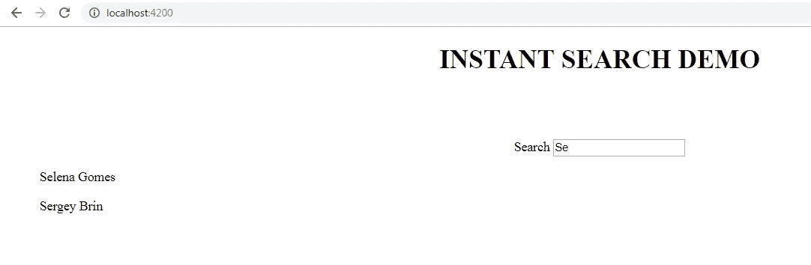
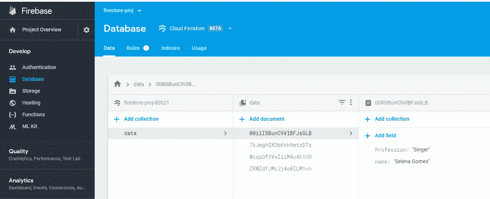
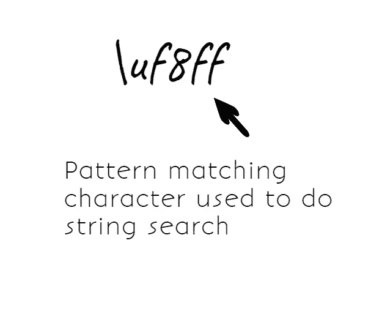
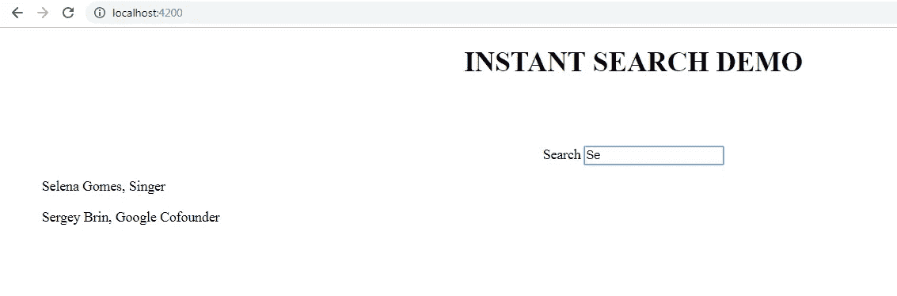
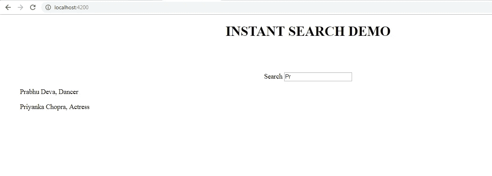

# 角度的即时搜索选项卡

> 原文：<https://medium.datadriveninvestor.com/instant-search-tab-in-angular-fe87d5864f0f?source=collection_archive---------11----------------------->

# 在这篇博文中，我们将学习使用 Cloud Firestore 的数据在 Angular 中进行即时搜索。因此，让我们首先假设我们实际上希望在浏览器上得到什么样的结果。

我们希望在浏览器上创建一个搜索选项卡，它有一个占位符，显示为**“按名称搜索”**。当我们输入一个字符时，我们希望应用程序根据存储在 Firestore 上的数据给出建议。它应该是这样的:

为此，让我们假设我们的 Firestore 数据库中有一些数据。要了解如何在 Firestore 数据库中添加数据，请参考我的文章 [**带棱角的 Firestore**](https://medium.com/datadriveninvestor/firestore-with-angular-but-firebase-c4050f1f6173)。我们在 Firestore 中的数据如下所示:

我们已经创建了四个包含不同人物详细信息的文档，每个文档都包含该人物的姓名和职业。

我们现在的任务是在浏览器上创建一个搜索选项卡。让我们这样做吧。

在这段代码中，我们为组件中定义为字符串的属性 **searchterm** 进行了双向数据绑定。此外，为了记录某处最近键入的值，我们在组件内部取一个变量。

我们的下一步是准备搜索框，根据我们输入的字符给出建议。为此，让我们添加一个显示这些建议的列表。现在，这个过程最重要的部分是从 RxJS 库中添加两个主题，即 startAt 和 endAt。

> **startAt = new Subject()；
> endAt = new Subject()；**

此外，我们将采用两个可观测量来作为可观测量。

> **startObs = this . startat . asobservable()；
> endObs = this . endat . asobservable()；**

现在，因为这个功能调用方法 search()，所以在它内部，我们提到，

> **search($ event){
> this . startat . next(q)；
> this . endat . next(q+" \ uf8ff ")；
> }**

我知道你可能想知道这个奇怪的角色是从哪里来的！我也有同样的反应。

在这里了解更多: [**模式匹配**](https://stackoverflow.com/questions/38618953/how-to-do-a-simple-search-in-string-in-firebase-database)

现在，在生命周期钩子 ngOnInit()中订阅 observables 的值。

> **ngOnInit(){
> observable . combinelatest(this . startobs，this.endObs)。subscribe((value)=>{
> this . fire query(value[0]，value[1])。subscribe((names)=>{ this . names = names；
> })
> })
> }**

到目前为止，我们的组件是这样的:

现在让我们更新模板，将结果显示在浏览器上。

现在使用这个列表，我们使用内插法显示数据，并放置一个结构指令 ***ngIf** ，如果字符长度小于 1，它将显示给定的语句。

让我们最后看看我们现在是否得到了想要的结果。

> 跑 **ng 发球**和 dd…

这是输出，这绝对是我们想要的改进版本。厉害！所以这是关于通过从 **Firestore** 检索数据，在 **Angular** 中创建一个**即时搜索标签**。